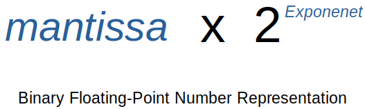
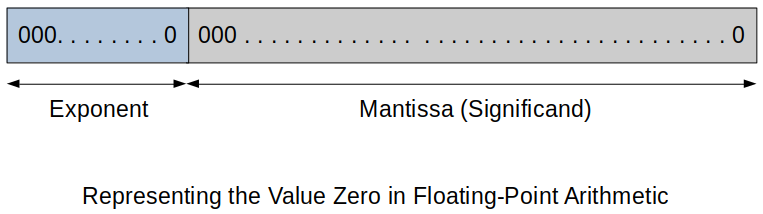
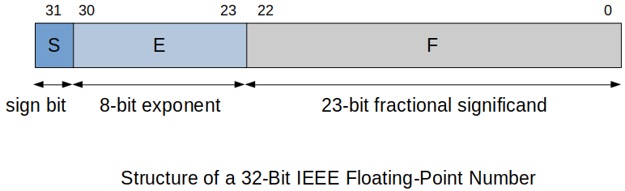

[Home](../../) | [Projects](../../projects) | [Notes](../) > <a href="./">Computer Architecture & Organization</a> > Floating-Point Numbers

# Floating-Point Numbers


## Floating-Point Notation

* A floating-point value is stored as two components:
  - A number
  - The location of the radix (In base 10 it is called the decimal) point within the number.
* Floating-point arithmetic lets you handle the very large and very small number found in scientific applications.


## Binary Floating-Point Number





* The term *mantissa* has been replaced by *significand* to indicate the number of significant bits in a floating-point number.
* Example:
  - $101010.111110_{(2)}$ can be represented by $1.01010111110 \times 2^5$
      - Significand:  $1.01010111110$
      - Exponenet: $5$ ($00000101$ in 8-bit binary arithmetic)
* Because a floating-point number is defined as the product of two values, a floating point expression is not unique;
    - e.g., $10.110 \times 2^4 = 1.011 \times 2^5$


## Normalization of Floating-Point Numbers

* An IEEE-754 floating-point significand is always normalized (unless it is equal to zero).
    - $1.000...0 \times 2^e ≤ \text{significand} ≤ 1.111...1 \times 2^e$
    - *Significand* always begins with a leading $1$.
* Normalization allows the highest available precision by using all significant bits.
    - e.g., $0.0000101$ has only three significant bits, whereas the normalized 8-bit significand $1.0100011$ has eight significant bits.
* Examples:
  - $0.110... \times 2^e$ would be normalized to $1.10... \times 2^{e-1}$
  - $10.1... \times 2^e$ would be normalized to $1.01... \times 2^{e+1}$


## Biased Exponents

* The **significand** of an IEEE format floating-point number is represented in *sign and magnitude* form.  (A sign-bit indicates positive or negative)
* The **exponent** is represented in a *biased* form, by adding a constant called a biase to the true exponent.
    - This is to make the range of the exponent nonnegative.
* Examples: 
  Suppose an 8-bit exponent is used and all exponents are biased by $127$.   
    - $1010.1111$ is normalized to $+1.01011111 \times 2^3$.  Here, true exponent is $+3$ and the biased exponent $3 + 127 = 130$ ($10000010$ in binary form) will be stored.





​       

## IEEE Floating-Point Numbers

* IEEE-754 floating-point in 32-bit uses the following format:

  ```plain
  S EEEEEEEE 1.MMMMMMMMMMMMMMMMMMMMMMM
  ```

    - S: **Sign** bit (1-bit)
    - E: 8-bit **biased exponent** (tells you where to put the binary point)
      - The stored exponent value $0$ (true: $-127$), and $255$ (true: $128$) are used to indicate special values, so the exponential range of this format is restricted to: 
        (For 32-bits)
          - Binary range: $2^{-126}$ to $2^{127}$ 
          - Decimal range: $10^{-45}$ to $10^{38}$ 
    - M: 23-bit **fractional significand**.
      - Leading $1$ and decimal point are not stored in memory because they do not change. (This is why this part is called the *fractional* significand.)





* IEEE-754 floating-point in 32-bit can represent 2^32^ = 4,294,967,296 different numbers. These include:

    - The number 0.0 
      - sign: 0, exponent: 0, mantissa: 0
    - ±∞
    - Very small denormalized numbers
    - Various other special conditions

* Overall, the standard allows approximately seven significant decimal digits and and approximate value range of 10^-45^ to 10^38^.

* IEEE-754 floating-point in 32-bit is still very limited to express the infinite number of real numbers in reality. For this reason, followings are defined as well.

    - For 64-bit
      - 16 significant decimal digits
      - Decimal range: 10^-300^ to 10^300^
    - For 128-bit
      - Decimal range: 10^-4900^ to 10^4900^ 
      - 34 decimal digits

  [!] Note: There is a 16-bit format which is extremely limited in both range and precision, but is useful for simple graphics applications.

### Example of Decimal to Binary Floating-Point Conversion

* Converting 253.75(10) to binary floating-point form.   

  ```plain
  Step 1. Convert 253 and 0.75 to hex first, then to binary.
  
          253 = FD (hex), 1111 1101 (binary)
          16 * 0.75 = 12.0, 0.C (hex), 0.1100 (binary)
          ∴ 253.75 (decimal) = FD.C (hex) = 1111 1101 . 1100 (binary)
  
  Step 2. Normalize.
  
          1.111 1101 1100 x 2^7
  
  Step 3. Get the exponent.
  
          7 + 127 = 134 = 1000 0110 (binary)
  
  Step 4. Put the parts together to form the floating-point format.
  
          S  EEEE EEEE  1.MMMMMMMMMMMMMMMMMMMMMMM
          0  1000 0110    11111011100000000000000   (Do not copy '1.')
  
  Step 5. Regroup this by 4's and convert into hex. (For easy grading!)
   
          0100 0011 0111 1101 1100 0000 0000 0000
          
          ∴ 437DC000 (hex)
  ```


### Example of Binary Floating-Point to Decimal Conversion

* Do the previous example in reverse order!

* Just don't forget:

  - The implied "1." in *mantissa*
  - The exponent is in *biased form*
