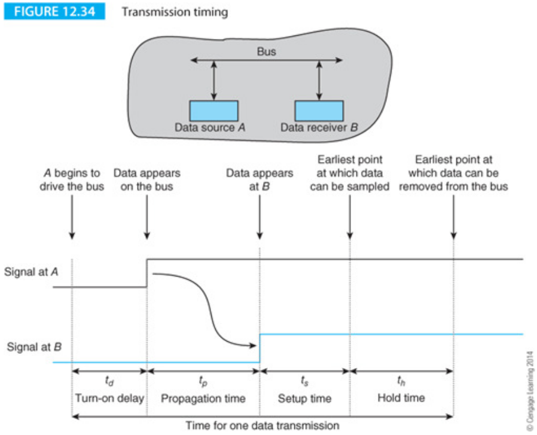

[Home](../../) | [Projects](../../projects) | [Notes](../) > <a href="./">Computer Architecture & Organization</a> > Input/Output

# Input/Output


## Introduction

* General Input/Output Requirements:
  - Select device (and determine status)
  - Initiate transfer
  - Transfer the information
  - Conclusion (free up the device for the next I/O)
* Data Transfer Units:
  - Bits per seconds (BPS) 
    - Number of bits ($$1$$'s and $$0$$'s) being tranferred in a second
    - Sometimes denoted as bPS to specify "bit"
  - Bytes per second 
    - Number of bytes being transferred in a second
    - BPS/8
  - Baud rate
    - This was a unit for modems and the unit originated with the telegraph and was set to be one morse dot per second. 
    - Now it refers to the number of times per second a signal in a communication channel varies, or makes changes between states.
    - A Baud MAY transmit more than one bit at a time. (Check your modem for more details.)


## Fundamental Principles of I/O


* Peripheral
  - External device connected to your computer system. 
    - The device is not directly connected to the CPU or main memory but to the dedicated I/O controller. 
    - The reason behind this is that we don't want the system bus to be affected by the peripherals where read/write (magnetizing) takes place.
  - e.g., Keyboard, Screen/CRT, Mouse, Graphics Card, RS-232, USB, Wireless network card, Hard drive, CD/DVD, etc.
* Memory-Mapped Peripherals
  - Memory-Mapped IO (MMIO) is the process of interacting with hardware devices by reading from and writing to predefined memory address.
  - Memory-Mapped Peripherals are when input/output devices are treated like memory locations (in main memory).
  - To send something out to an output devices uses the same instruction as a `STORE` and reading from an input device use the same instruction as a `LOAD`.
  - The most well-known memory mapped output device is the screen.
    - You can turn on and off an individual pixel in your console screen.


## Data Transfer

### Open-Loop

- Put the data on the bus then alert everyone that the data is there.
- The CPU provides the data to the peripheral interface (PI).
- The periferal interface then puts the data on the data bus.
- Asserts the $$\overline{\text{DAV}}$$ signal to alert the device there is data.
- The peripheral read the data then the PI resets $$\overline{\text{DAV}}$$ to let the peripheral know there is no new data.
    - $$\overline{\text{DAV}}$$ is active low.
    - When there's no new data, $$\overline{\text{DAV}}$$ will be set to $$1$$ (high).
    - When there's a new data available, $$\overline{\text{DAV}}$$ will be set to $$0$$ (low or ground).
- Open-Loop because there is no feedback that the data has actually be received.
- Cheap, slow, and CAN lose data


### Closed-Loop (or Handshaking)

- With a closed loop the I/O device reponses with a data acknolwedgement (ACK) when the data transfer has been completed. (Also referred to as a handshake.)
    - This $$\overline{\text{ACK}}$$ line is the only physical difference between the Open-Loop and Closed-Loop data transfer.
- Same type of signaling and data tranfer as in the Open-Loop data transfer but now there is a $$\overline{\text{ACK}}$$ from the peripheral to let the PI know the data has been received and it is ready for more data.
- CANNOT lose data
- But, there can be timeout conditions when there are problems with the peripheral. The PI can then generate an interrupt so that someone or something can take care of the problem.


### Data Buffering

- Data on the bus will only be on the bus during the duration of the clock cycle. Once it is over, the data is gone from the bus.
- D Flip-flops can be used to capture the data and hold it until the peripheral has taken care of it.
- As shown in (c) of the following figure, there can be multiple layers of latches. (One good example is the FIFO structure.)


* **The FIFO**

  The simplest FIFO structure is a register with an input port that receives the data and an output port. The data source provides the FIFO input and a strobe. Similarly, the reader provides a strobe when it wants data.

  

  

  

  > FULL $$-$$ No more data can be accepted.
  >
  > EMPTY $$-$$ No more data can be read.

  When data arrives at the input terminals, it ripples down the shift register until it arrives at the next free location.

  Here's another example that uses memory instead of a set of shift registers:

  

  

  

  This can be implemented with hardware and is not as complicated. Just need two pointers (stored in two registers); one for the write location and the other for the read location. There are some sync problems with this arrangement that will be discussed in the Operating Systems.


## I/O Strategy

### I/O Methods

* **Programmed I/O**

  - Simple and easy but slow

  - Very CPU intensive, very inefficient

  - e.g., The CPU keeps checking the I/O device until it is ready to transmit or receive the data.

    ```plain
    RETEAT
        Read peripheral status
    UNTIL ready
    Transfer data to/from peripheral
    ```

    This is called a **polling loop**.

* **Interrupt-Driven I/O**

  - Faster but more complex
  - Let the hardware do the work in waiting for a signal that may or may not even happen.
  - The interrupt is a CPU input that alerts the CPU an I/O request is being made.
  - CPUs, at the very least, handle hardware interrupts.
  - Some CPUs can generate hardware interrupts to another CPU or CPU like device.
  - Some CPUs can generate software interrupts which are then handled like any other hardware interrupts.
  - Interrupts can happen at any time but they are only detected during the **instruction fetch** phase.
      - See the *Interrupts and Exceptions* section in the following notes: <a href="./privileged-mode-and-exceptions">Privileged Mode and Exceptions</a>
  - **Polled I/O**
    - The CPU has to check each device to determine which one sent the interrupt. 
    - With a polled interrupt the CPU will then start checking each I/O device to see which one sent the interrupt. This polling is checked in priority order.
    - This can be accomplished via hardware or software.
  - **Vectored I/O**
    - With a vectored interrupt the address of the interrupting device is also provided with the interrupt. The CPU does not waste time polling the devices.
        - Device sends an interrupt
        - CPU generates an acknowledge (ACK) signal
        - The interupting device sends its address (vector) onto the data lines
        - The CPU reads the vector and determines the device
        - The CPU sends a second ACK addressed to the interrupting device which resets its interrupt FF.
    - The problem with this structure is that all other interrupting devices will respond to the first CPU ACK. Gets junk on the data lines.
    - A **daisy chain** structure is used to prevent the problem. Lower priority devices are prevented from responding to the ACK or from interrupting the CPU.
        - If the daisy chain structure is placed in the ACK path it is called **BACKWARD** daisy chain.
            - Any device may interrupt the CPU (still) so the CPU has to stop processing (maybe a higher priority interrupt) to handle the interrupt.
            - This is NOT a preferred method.
        - If the daisy chain structure is placed in the interrupt path it is called **FORWARD** daisy chain.
            - Lower priority devices are prevented from interrupting the CPU.

* **Direct Memory Access**

  - Most complex but can block the CPU from accessing memory
  - All I/O is handled directly by the CPU. Majority of data either goes directly into memory from the input device or is read from memory and sent directly to the output device. Why waste all the CPU time to do "trivial" processing of just moving data around? Let's just have a simple piece of hardware (DMA controller) that does that.
      - DMA controller has a **word count register** that keeps how many words of data it needs to transfer, an **address register** that points to the memory address whose data is to be transferred, and a **buffer** along with a little bit of control logic.
      - DMA is connected to the system bus and main memory and sits between the system bus and the deivce that it needs to access.
  - The CPU initializes the DMA controller and tells it to start the data transfer. The DMA transfers the data until complete.
      - While the *word count register* is not $$0$$, DAM will keep transferring the data.
  - While the DMA is transferring the data the CPU is prevented from accessing memory. This is called **cycle stealing**. Why does this happen?
      - To prevent those situations like CPU trying to write on to memory section where some data is being transferred from memory to an I/O device.
      - Data available in the device buffer may be lost if not transferred immediately.
      - CPU could access incorrect data if the DMA has not completed the transfer.
      - Note that CPU can still do other jobs that does not require memory access, and this is one of the advantages of using DMA.
  - **Channels** $$-$$ Special types of DMA
    - Channels are interfaced with several I/O devices.
      - Extensive error detection/correction, data formatting, and code conversions
      - Interrupt CPU under any error condition
    - Multiplexer channel
      - Connected to several medium to low speed devices
      - Data is tagged and placed in per-specified memory areas
      - Character multiplexer
        - Transfers a character at a time and moves on to the next device
      - Block multiplexer
        - Transfers a block at a time and moves on to the next device
    - Selector channel
      - Connected to high speed devices such as HDD, SDD
      - Stays connected until entire transfer is completed

### Data Links (between the CPU and I/O device)

* Simplex

  - Unidirectional 

    ```plain
    ----->
    ```

* Half-Duplex

  - Only one direction at a time 

    ```plain
    -----> or <-----
    ```

* Full-Duplex

  - Both directions at the same time 

    ```plain
    ----->
    <-----
    ```

  - c.f. Different frequencies will not interfere with each other.

  Each of the links can be serial (one write) or in parallel (several wires)

### Data Conversion

* Has to convert the physical media to a format that the CPU understands.


## Memory Mapped

* Memory and I/O devices are connected to the same bus. The device addresses become part of the memory. Normal `Load`s and `Store`s can be used to access I/O devices. Some of the memory is taken up by I/O devices. Hard to tell the difference between normal memory access and I/O operations. (Advantage)
* Accessing memory mapped devices can slow down overall memory access. (Disadvantage)


## The Bus


  > Bus Master $$-$$ Can take control of the system bus (e.g, CPU)
  >
  > Bus Slave $$-$$ Can only respond to a transaction initiated by a remote bus master

  > Bus master can designate activities to the slaves and bus slaves can go off and handle those activities (I/O). Bus master can also stop these slave devices from doing their jobs whenever it needs to take over control of the bus.

* Types of Bus:
  1. Logical bus
  2. System bus
  3. Peripheral bus
* The system bus is made up of the address, data and control paths from the CPU. Memory and memory-mapped I/O devices are connected to this bus. Such a bus has to be able to operate at the speed of the fastest device connected to it.
* The system bus demonstrates that a one size fits all approach does NOT apply to computer design because it would be hopelessly cost-ineffective to interface low-cost, low-speed peripherals connected to a high speed bus.


## Bus Structures and Topologies

* Simple example of a bus structure


* Can have two busses which can have different functionality, speed and protocols.


## The Structure of a Bus

### The Data Bus

* Width (Number of bits at one time)
* Speed frequency usually give in MHz or bits/second
* Latency (The time it takes from when the request is made until the data is
  provided)

### Bus Speed





### Address Bus

* Some systems have an explicit address bus that operates in parallel with the data bus. When the processor writes data to memory, an address is transmitted to the memory system at the same time the data is transmitted.

* Some systems combine address and dta buses together into a single *multiplexed* bus that carries both addresses and data (albeit alternately).

* In some cases the address and/or data transactions may take twice on the bus to transmit all the address/data.

  

  

  The efficiency of both non-multiplexed and multiplexed address buses can be improved by operating in a burst mode in which a sequence of data elements is transmitted to consecutive memory addresses.

  Burst-mode operation is used to support cache memory systems.

  Following figure illustrates the concept of burst mode addressing where an address is transmitted for location $$i$$ and data for location $$i$$, $$i+1$$, and $$i+3$$ are transmitted without a further address.

  

  


### The Control Bus

* The control bus regulates the flow of information on the bus. Following figure describes a simple $$2-$$line synchronous control bus that uses a data-direction signal and a data validation signal. The data direction signal is $$\overline{\text{R/W}}$$ and is high to indicate a CPU read operation and low to indicate a write operation.

  

  

  

  Some systems have separate read and write strobes rather than $$\overline{\text{R/W}}$$ signal. Individual $$\overline{\text{READ}}$$ and $$\overline{\text{WRITE}}$$ signals indicate three states: an active read state, an active write state, and a bus free state ($$\overline{\text{READ}}$$ and $$\overline{\text{WRITE}}$$ both negated). A $$\overline{\text{R/W}}$$ signal introduces ambiguity because when $$\overline{\text{R/W}}=0$$ the bus is always executing a write operation, whereas when $$\overline{\text{R/W}}=1$$ indicates a read operation or the bus is free.

  The active-low data valid signal, $$\overline{\text{DAV}}$$, is asserted by the bus master to indicate that a data transfer is taking place.
