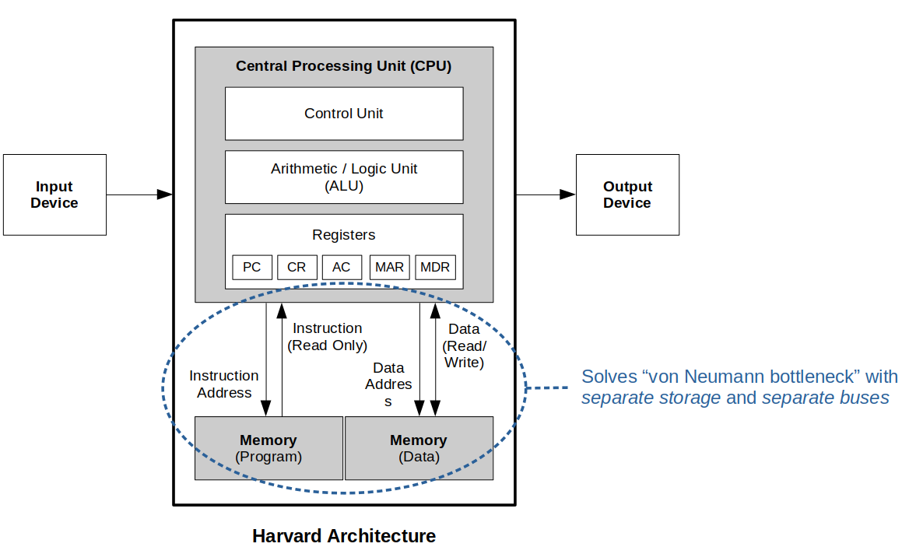

[Home](../../) | [Projects](../../projects) | [Notes](../) > <a href="./">Computer Architecture & Organization</a> > Introduction to Computer System Architecture

# Introduction to Computer System Architecture

## Computer System

* A **computer system** consists of:
  - CPU (Central Processing Unit)
    - Electronic circuitry that executes instructions comprising a computer program
    - Also called a *central processor*, *main processor* or just *processor*
  - Cache Memory
    - Special-purpose, high-speed memory that holds frequently used data
  - Main Store (Memory)
    - Memory holds the bulk of working data
  - Secondary Store
    - Disk drives or CD-ROMs that archive large quantities of data so cheaply
  - Input/Output Devices (Peripheral Devices)
    - Devices designed to read information into or out of the memory unit upon command from the CPU
  - Bus
    - Communication system that transfers data between components inside a computer, or between computers
        - Common connection point
        - A bunch of wires that have a protocol associated with it depending on the bus type
    - The expression covers all related hardware components (e.g., wire, optical fiber, etc.)
    - The term *bus* is shortened form of the Latin *omnibus*, and historically also called *data highway*.

## What is a Computer?

* In a broad sense, the term **computer** refers to any entity which could perform some type of calculation.

## Two Types of Digital Computer Architectures

### von Neumann Architecture

  - Named after *John Von Neumann*.
  - Has single storage system (memory) for storing *data* as well as
    *program(set of instructions)* to be executed.
  - Has only one *address bus* and *data bus* between processor and memory.
    - This is the cause of the "von Neumann bottleneck".
  - Processor needs two clock cycles to complete an instruction.  
    (Pipelining the instructions is not possible with this architecture.)
      - In the first clock cycle the processor gets the instruction from
        memory and decodes it.
      - In the next clock cycle the required data is taken from memory.
  - Slow

### Harvard Architecture

  - Named after the relay based old computer "*Harvard Mark I*".
  - Has two separate memories for storing *data* and *program(set of instructions)*.
      - This solves the "von Neumann bottleneck" of the *von Neumann
        architecture*.
  - Processor can complete an instruction in one cycle if appropriate pipelining strategies are implemented.
      - In the first stage of pipeline the instruction to be executed can be taken from program memory.
      - In the second stage of pipeline data is taken from the data memory using the decoded instruction or address.
      - Most of the modern computing architectures are based on *Harvard architecture*, but the number of stages in the pipeline varies from system to sytem.
  - Fast

## Factors That Affect Performance

* Algorithm
* Programming language, compiler
* Architecture of the application
* Processor and memory
* Input/Output
* Operating System

## Terminology

* **Algorithm**

  - A finite list of well-defined instructions that carries out an operation to solve a particular problem.

    e.g., Calculating a function or performing a given task

* **Program**

  - A set of computer instructions that implements an algorithm.
  - An instance of an algorithm expressed in a certain way and intended for solution on a certain machine.
  - May contain more information than is expressed by the algorithm, because the program has to set up an appropriate environment.

* **Pseudocode**

  - Falls between an *algorithm* and a *program*.
  - An algorithm expressed in *ad-hoc* programming-like language.
  - Purpose is to allow the writer to demonstrate an algorithm to reader without demanding that the reader know a specific high-level language in detail.
  - Since it does not have a specific syntax like any of the programming languages and thus cannot be executed on a computer.
