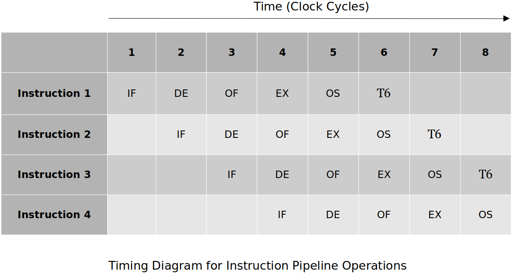

[Home](../../) | [Projects](../../projects) | [Notes](../) > <a href="./">Computer Architecture & Organization</a> > Introduction to Pipelining

# Introduction to Pipelining


## What is Pipelining?

* The basic concept of pipelining is to execute independent instructions in a continuous, orderly, and somewhat overlapped manner to improve the overall CPU performance.

* One of many techniques to improve the Instruction-Level Parallelism (ILP) in a processor.

* Analogy - Computer Assembly Line

  A simple example is the factory assembly line for a computer which takes 1 person 100  minutes to build one computer. Let’s divide the assembly process into 5 subtasks (A to E) which take exactly the same amount of time; 20 minutes. Once the pipeline is full, a computer is finished every cycle; 20 minutes. It still takes same amount of time to build; 100 minutes each.

  ```plain
    20m  20m  20m  20m  20m  20m  20m  20m  20m
  - ---- ---- ---- ---- ---- ---- ---- ---- ----
  1 A    B    C    D    E
  2      A    B    C    D    E
  3           A    B    C    D    E
  4                A    B    C    D    E
  ```

  > Pros: Faster, specialized steps
  >
  > Cons: More resources are needed (people, workstations, tools)

  The same principles apply to CPUs as well (with some additional complexity). By overlapping the stages and executing the instructions in parallel, it will look like one instruction completes execution once every clock-cycle. Of course the pipeline has to fill-up first.

  Pipelining came from RISC efforts but is now used by almost every modern processor; CISC adopted it. Yet another example of the blurring of the lines between RISC and CISC.

* ##### What is the effect on the hardware?    

  Redundant hardware will be necessary so it can be used by the different stages at  the same time. (e.g., The PC increment during the Instruction Fetch cannot use the ALU that is  used for the Execution stage. However it can be done by adding an **extra**  adder to the PC so it can increment itself without the help of ALU.)

* **What is the effect on the software?**    

  There are cases where an operand read can happen prior to or at the same time as the operand write. (Can get old data.) The assembler has to know about this and reorganize the code to make sure this does not happen.


## Various Pipelines

### Five-Stage Pipeline (Standard)





* A simplified ARM11 pipeline, standard pipeline or what we as computer science students are expected to know if asked about a pipeline.

  1. **IF (Instruction Fetch)**

     Read the instruction `add r0, r1, r2` from the system memory and increment the program counter.


  2. **ID (Instruction Decode)**

     Decode the instruction read from memory during the previous phase. The nature of the instruction decode phase is dependent on the complexity of the instruction set.

  3. **OF (Operand Fetch)**

     The operands specified by the instruction are read from resisters `r1` and `r2` in the register file and latched into flip-flops.

  4. **EX (Execute)**

     The operations specified by the instruction is carried out.

  5. **OS (Operand Store)**

     The result of the execution phase is written into the operand destination in main memory. This may be an on-chip register or a location in external memory. In this case the result is stored in register `r0`.

  Typically each of these stages take one clock-cycle to execute.

* Not all instructions require all 5 stages. (e.g., a `CMP` does not have the OS stage.)

### Another Five-Stage Pipeline

* In this case, Instruction Fetch (IF) also decodes the instruction.
  1. Instruction Fetch
  1. Operand Read
  1. Execute
  1. Memory
  1. Write Operand


* There may be separate pipelines for different instructions in a single system. (e.g., Floating point instructions may have their own pipeline which tends to be much longer.)

### Four-Stage Pipeline

* Stages
  1. Instruction Fetch
  1. Operand Read
  1. Execute
  1. Write Operand


* Shorter pipelines are easier to demonstrate the issues with pipelines. The issues get worst with longer (more) pipeline stages.


## Speedup Ratio

* The performance of a pipeline is expressed in terms of its **speedup ratio**.

  
  $$
  \begin{align}
  \text{Speedup Ratio} 
  &= \frac{\text{Time to execute instruction in non-pipeline method}}
  {\text{Time to execute instruction in pipeline method}} \\
  &= \frac{n\times i}{n+(i-1)}, \text{where $n$ is the number of pipeline stages, $i$ is  
  the number of instructions} \\
  &= \frac{n\times i}{i+(n-1)} \\
  &= \frac{n}{1+\frac{n-1}{i}}
  \text{ cycles}
  \end{align}
  $$
  

  With the pipeline, the first instruction (out of $i$ instructions to be executed) will take $n$ clock cycles, and the rest ($i−1$ instructions) will be executed every clock cycle.

  When $i=1$ (only one instruction to execute) − No speedup!

  When $i=∞$ − Speedup is $n$.

* Examples:

  * 20 instruction with 5 stages:

    $S=\frac{5×20}{20+4}=4.1667$ times faster than the system without the pipeline.

  * 100 instruction with 5 stages:

    $S=\frac{5×100}{100+4}=4.8077$ times faster than the system without the pipeline.

  * 10000 instruction with 5 stages:

    $S=\frac{5×10000}{10000+4}=4.998$ times faster than the system without the pipeline.

  Basically what these examples are trying to show is that once you get to the point of executing an infinite number of executions, your speedup is equal to the number of the stages in the pipeline.

* In theory, once the pipeline is full, a new operation is completed every clock cycle. But this cannot be achieved all the time due to:

  - Branches

  - Data dependencies
