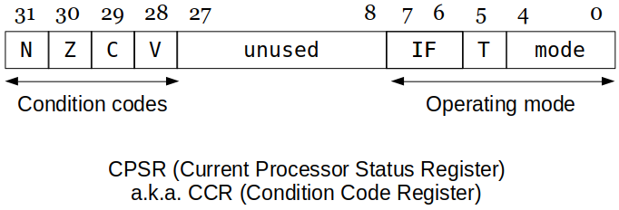

[Home](../../) | [Projects](../../projects) | [Notes](../) > <a href="./">Computer Architecture & Organization</a> > Introduction to the Stored Program Machine & ARM

# Introduction to the Stored Program Machine & ARM


## Introduction to the Stored Program Machine

* A microprocessor like the ARM has a **stored program architecture** which, Locates programs and data in the *same* memory.
  - Operates in a *fetch-execute* mode.
    - Instructions are read from memory, decoded, and executed sequentially.          
* Such a modern CPU consists of the following major hardware:
  - **Arithmetic and Logic Unit (ALU)**
    - Does unary, binary or ternary operations.
  - **Memory**
    - Registers, Random Access Memory (RAM), Read Only Memory (ROM), etc.
  - **Buses**
    - Allows the trasfer of information from various locations within the
      CPU, memory, I/O devices, etc.
  - **Control Unit**
    - Based on the instruction and addressing modes, sends signals to the
      registers, ALU, buses, memory, I/O devices to execute the
      instruction.
    - In general, the most sophisticated component of all.
      - Connected to the most of the important components inside the CPU.


### Registers

* Register have names rather than addresses.
  - ARM register: `r0`, `r1`, `r2`, ... , `r15`
  - Intel registers: `AX`, `BX`, `CX`, `DX`, `SP`, `BP`, `SI`
  - Freescale registers: `D0`, `D1`, ... , `D7` 
* Categories of registers
  - **General purpose registers**
    - Hold the temporary data while performing different operations.
    - Can be accessed/used by the programmers.
    - e.g., `r0` can be used by the programmer to store any data type or address.
    - e.g., Accumulator, BX, etc.
  - **Special purpose registers**
    - Hold the status of a program and are designated for special purpose.
    - Cannot be directly accessed by the programmers, but can be controlled by the programmers only by the execution of branch instruction.
    - e.g., Stack Pointer (SP), Program Counter (PC), Condition Code Register (CCR), etc.
  - **Invisible registers**
    - Needed by the CPU but cannot be direcly accessed or controlled by the programmer.
    - e.g., Instruction Register (IR), Memory Address Register(MAR), Memory Buffer Register (MBR), etc.


## ARM

### ARM Registers (Not the whole truth but good enough for now)

* **Program counter (PC)**
  - Contains the address of the next instruction to be fetched from memory.
* **Instruction Register (IR)**
  - Contains the current instruction being executed.
  - The instruction is decoded and the control signals are generated to
    execute the instruction.
* **Memory Address Register (MAR)**
  - Contains the address of the data that is being read from or writtne to
    memory.
* **Memory Buffer Register (MBR)**
  - Contains the data that is being read from or written to memory.
  - MAR and MBR works in conjunction with each other.
* **Condition Code Register (CCR)**
  - Contains bits that show the results of the ALU calculations.
  - In case of the ARM: `Z` (Zero), `N` (Negative), `C` (Carry), `V`
    (Overflow).
* **r0 ~ r15**
  - A set of 16 registers that store data.

### ARM Instruction Formats

* Some RISC machines (e.g., ARM, PowerPC, MIPS, etc.) are called **load-store** machines in that they have only two instructions to access memory; one to read from memory, and the other to write to memory.  All other instructions are ALU operations related which only occur between registers.

* Two categories of instructions in a load-store architecture

  - **Memory access**
    - Memory to Register: `LDR` (Load Register)
    - Register to Memory: `STR` (Store Register)
  - **ALU operations**
    - Register to Register: `operation <Reg destination>, <Reg source1>, <Reg source2>`

* Limiting operations only to registers greatly simplifies the hardware of the CPU but more instructions have to be written by the programmer to get the same effect.

* General format of the assembly instructions for the ARM

  ```plain
  <label>: <instruction> <operand1>, <operand2>, <operand3>
  ```

  Example: A three-operand instruction.

  ```plain
  LDR r0, 1234      (Takes the contents of memory location 1234 and loads the
                     value into r0)
  [R0]←[1234]       (RTL notation)
  
  STR r1, 3456      (Takes the contents of r1 and stores the value into memory
                     location 3456)
  [3456] ← [r1]     (RTL notation)
  
  ADD r1, r2, r3    (Takes the contens of r2 and r3, adds them together and
                     stores the results into r1. r2 and r3 remain unchanged)
  
  [r1] ← [r2]+[r3]  (RTL notation)
  ```

  > First two instructions (`LDR..., STR...`) are **direct addressing** modes; The effective address is contained in the instruction register. (ARM does not support direct addressing mode but almost every other processor does.)
  >
  > Again, since ARM does not support direct addressing, operands have to be preloaded into the registers for the operations to be performed.
  >
  > Control signals from the control unit to execute the instruction:

  ```plain
  Bus P ← [r2]; 
  Bus Q ← [r3]; 
  [r1] ← ADD(P, Q);
  ```

### Structure of a Hypothetical Stored Program Machine


* **Address bus** is share by:
  - The Program Counter (PC)
  - Memory Address Registers (MAR)
  - The Operands part of the Instruction Register (IR)
* **Data bus** is shared by:
  - The Operands part of the IR
  - The ALU
* Once something goes out to the bus then nothing else can be put on the same bus until the next **time slot**. The next time slot or clock pulse will clear the current control signals.
* Notes about the diagram
  - The control unit has connections to every component of the CPU. For simplicity these connections are NOT shown on this diagram.
  - Address bus (red arrows) is all the buses connected to the MAR and PC.
  - Data bus (blue arrows) is all the buses connected to the MBR, registers and ALU.
  - Each register has a *read from* bus and an *out to* bus signals.
    - IR has both out to data bus and out to address bus.
  - A memory read looks like: `[MBR] ← [[MAR]]`
  - A memory write looks like: `[[MAR]] ← [MBR]`
  - `Q`<sub>`[MBR]`</sub> - `[MBR]` is invoked when the contents of the MBR are used. Otherwise, `Q` will be one of the registers.
  - `f(P, Qx)` is the function that controls the ALU. Examples:
      - `ADD(P, Q)` - Adds the values of what is on bus `P` and `Q` and puts the results out on the ALU output bus.
      - `Xfer(P)` - Trnsfers the contents of bus `P` to ALU output bus.
      - `SUB(P, Q`<sub>`literal`</sub>`)` - Subtracts the value of literal part of the IR from what is on bus `P`.

### Instruction Fetch

* All stored program machines have to go through the exact same instruction fetch process.

  **ARM instruction fetch** process using the register notation:

  ```plain
  FETCH
  -----
  [MAR] ← [PC]      : Get ready to fetch the next instruction from memory.
  [PC]  ← [PC] + 4  : Point to the next instruction; 4 is word size. (Good time
                      to do this since reading from memory takes relatively 
                      long time.
  [MBR] ← [[MAR]]   : Read the instruction from memory and store results.
  [IR]  ← [MBR]     : Transfer the instruction to the instruction register
                      and start the decode process.
  
  LDR (This is a 'direct addressing' example. ARM does not support this mode.)
  ---
  [MAR] ← [IR(address part)] : Copy the operand address from IR to MAR.
  [MAR] ← [[MBR]]   : Read the data from memory and store results.
  [rX]  ← [MBR]     : Move the data (operand) to rX through the data bus.
                      Because of the way the control unit works with the IR, a
                      register rX do not need to be specified.
  ```

  

## Literals

* Note for this section that the ARM does support literal addressing and does NOT support direct addressing. The syntax given here for direct addressing is for illustration purposes only and cannot be used in your ARM assmbly
  programs. Other processors do support direct addressing and that is why direct addressing is being discussed in this section.

* **Direct Addressing Mode**

  - Address field in the instruction contains the effective address of the operand and no intermediate memory access is required.

  - Example

    ```plain
    LDR r1, 1234      : Get the data from memory location 1234 and take those
                        contents and put them into r1.
    [r1] ← [1234]     : RTL notation.
    ```

* **Literal Addressing**

  - Instead of the instruction pointing to the location of the data, the instruction contains the data. (No effective address but the data is part of the instruction.)

  - With literal addressing a `#` is used to mark the addressing mode as literal.

  - Example

    ```plain
    LDR r1, #200      : Load 200 into r1. (This does not work on ARM assembly
                        since LDR and STR require access to a memory location.
                        Must use the MOV instruction.
    MOV r1, #200      : This is the correct syntax for the ARM assembly.
    ```

  - Literal addressing saves a memory access so they run faster.

  - Literal addressing can be used in other instructions:

    ```plain
    ADD r0, r2, #50   : Add contents of r2 and the literal 50 and store the
                        reult into r0.
    ```

* Size of a literal

  - Since the data is part of the instruction, there has to be a limit on the size of the literal.

  - In the case of the ARM it is a 12-bit unsigned integer. (The real truth will be covered in the later section.)

      - `2`<sup>`12`</sup> `= 4096` is the limit.

        ```plain
        LDR r2, #-20  : Not allowed.
        LDR r8, #5000 : Not allowed.
        ```

      - If you want to subtract with literal addressing you have to use the subtract instruction.

        ```plain
        SUB r2, r3 #34
        ```

  - In some assemblers, if the literal is not valid (too big) it will automatically define a memory location for you and assign the value to that location.

      - The instruction is also changed from literal addressing (`MOV`) to direct (`LDR`).

* The literal has to be the last operand of the assembly instruction.

  ```plain
  SUB r1, #56, r2       : Not allowed. The assembler will give error message.
  ```

* Details on LDR

  ```plain
  MOV r1, #200
  ```

  Control signals (2 ways):

      1. `IR` operand field(`11-0`), literal, out to data bus, instruct `r1` to read that value in.
      2. Or, `IR` operand field(`11-0`), literal, out to data bus, `ALU` reads in the value through `Q`<sub>`literal`</sub>, instruct the `ALU` to transfer `Q`<sub>`literal`</sub> out to the data bus (`Xfer(Q`<sub>`literal`</sub>`)`), instruct `r1` to read that value in.

  [!] Note: Follow these two paths on the diagram.

* Details on ADD

  ```plain
  ADD r0, r2, #50
  ```

  Control signals:  

  `IR` operand field(`11-0`), literal, out to data bus, contents of `r2` out to data bus, `ALU` reads in those two values through `Q`<sub>`literal`</sub> and `P`, respectively, instruct the `ALU` to add those two values, put the result to `r0`.

### Some Instructions (Step Through the Flow)

* For this example assume the addressing mode is direct addressing. Make sure to understand exactly how the information is passed through and around the CPU.  It is also important to know how these **control signals** change based on different addressing modes.

  ```plain
  LDR r0, address   : Takes the contents of memory location at address and
                      copies it to r0.
                      This is direct addressing which the ARM does not support.
  
                      [MAR] ← [Operand field of IR; address] IR out to data bus
                      [MBR] ← [[MAR]] (Read memory)
                      [R0] ← [MBR] (Or, to make use of ALU, use Xfer(Qmbr))
  
  STR r0, address   : Takes the contents of r0 and copies the value to memory
                      location address. 
                      This is direct addressing which the ARM does not support.
  
                      [MAR] ← [Operand field of IR; address] IR out to data bus
                      [MBR] ← [R0] (Or, to make use of ALU, use Xfer(P))
                      [[MAR]] ← [MBR] (write to memory)
  
  ADD r0, r1, r2    : r0 ← r1 + r2 (r1 and r2 remain unchanged.)
  
                      Bus P ← [R1] 
                      Bus Qmbr ← [R2]
                      [R0] ← ADD(P, Qmbr)
  
                      [!] Note: Bus choices for r1 and r2 can be changed.
  
  SUB r0, r1, r2    : r0 ← r1 - r2 (r1 and r2 remain unchanged.)
  
                      Bus P ← [R1] 
                      Bus Qmbr ← [R2]
                      [R0] ← SUB(P, Qmbr)
  
                      [!] Note: Bus choices for r1 and r2 can be changed.
  
  BPL target        : Branch on positive to location target. 
                      If the result of the previous operation was positive or 
                      zero then go to location target and start program 
                      execution there.
                      If the result was negative then the next instruction
                      after the BPL will be executed.
  
                      If CCR (Z and not N) 
                      then [PC] ← [IR 23-0] out to address bus
  
                      [!] Note: When it comes to branching, more portion of the
                      IR gets involved (i.e., bit 0-23)
  
  BEQ target        : Branch equal. 
                      If the result of the previous operation was zero then go 
                      to location target and start program execution there.
                      If the result was not zero then the next instruction after
                      the BEQ will be executed.
  
                      If CCR Z then [PC] ← [IR 23-0] IR out to address bus
  
                      [!] Note: When it comes to branching, more portion of the
                      IR gets involved (i.e., bit 0-23)
  
  B target          : Unconditional branch.
                      Go to location target and start program execution there.
  
                      [PC] ← [Operand field of IR; address] IR out to address bus
  ```


### Hardware Considerations

* Since the data is contained in the instruction, there has to be hardware which can put that part of the instruction register (`IR`) onto the bus so it can be transferred around the processor and used for calculation.

  The `IR` decoder has to recognize the addressing mode then have the hardware to only put that constant on the bus to do the operations.

  Note the 32-bit instruction or 32-bit data from memory is much larger than the number of bits for the literal addressing. The high order bits have to be set to `0`.


## Flow Control

* **Flow control** is the ability to do comparisons and alter the execution sequence based on the results.
    - It is one of the most important characteristics of a computer.

### Conditional Behavior

* Based on a calculation or the value of a register branch or do not branch to a certain location. 

* The `S` at the end of the instruction sets the flags in the Condition Code Register (`CCR`).

    - `S` is optional. If not used, `CCR` flags will not be set.

* Example

  ```plain
  SUBS r5, r5, #1       : Decrement the loop counter.
  BEQ  onZero           : When the counter hits zero exit the loop.
  
  if notZero, then ADD r1, r2, r3
  if onZero, then  SUB r1, r2, r3
  
  [!] Note: onZero is the Branch Target Address (BTA). In this case it is much
  like an immediate addressing mode in that the BTA is part of the instruction.
  ```

### Hardware Consideration

* It starts with `ALU`. Have to have a way to determine and keep the results of the last `ALU` operations. The results go into the `CCR`.

  Based on the contents of the `CCR` make, or do not make the jump. If the condition is not met we do not have to do anything. (By default the next instruction is executed.) 

  If the branch has to be made, the `PC` has to be updated to the location stored in the instruction.

  ```plain
  If CCR(Zero)=1 then [PC] ← [IR 23-0] IR out to address bus
  ```

  Following is how an `if... then` looks like in hardware:


### Status Information





* **Condition flags (bits)**   

  - `N`: Negative
  - `Z`: Zero
  - `C`: Carry or borrow
  - `V`: Overflow

  Each of these come from the results of the ALU. They are provided as inputs to the Control Unit.

* For the ARM, an "`S`" needs to be added to the end of the instruction to get the CCR updated.

  e.g.,

  ```plain
  ADDS ...
  
  SUBS ...
  ```

  Or, just use `CMP` (Compare) or `TST` (Test) instruction which forces the CCR update as well.

* CISC processors (e.g., Intel IA32) update status flags after each operation.

* RISC processors, (e.g., ARM) require the programmer to determine when the status flags are updated.

### Condition Flags Setting

* When the ALU performs an operation, it stores status or condition information in the CCR. The processor records whether the result is:

    - Negative in two's complement terms (`N`), `MSB = 1`
    - Zero (`Z`), `all bits = 0`
    - Generated a carry (`C`), carry out from the full-adder (directly connected to `C` flag of CCR)
    - Arithmetic overflow (`V`)
      - `Positive + Positive = Negative`
        `Negative + Negative = Positive`
      - `Positive(Negative) + Negative(Positive)` never produces overflow!

   Not all instructions change these bits of the CCR.

* Binary Examples Using 8-bit Word

  ```plain
    0011 0011       51
   +0100 0010      +66
   ----------      ---
    0111 0101      117 (correct)
  
    N=0, Z=0, C=0, V=0
  
  
    1111 1111       -1
   +0000 0001      + 1
   ----------      ---
   10000 0000        0 (correct)
  
    N=0, Z=1, C=1, V=0
    Zero, Carry
  
  
    0101 1100       92
   +0100 0001      +65
   ----------      ---
    1001 1101      -99 (incorrect)
  
    N=1, Z=0, C=0, V=1
    Negative, Overflow(P+P=N)
  
  
    1101 1100      -36
   +1100 0001      -63
   ----------      ---
   11001 1101      -99 (correct)
  
    N=1, Z=0, C=1, V=0
    Negative, Carry
  
  
    0000 0000       0000 0000                                       0
   -0001 0000      +1111 0000 (two's complement of -0001 0000)    -16 
   ----------      ----------                                     ---
                    1111 0000                                     -16 (correct)
     
    N=1, Z=0, C=0, V=0
  ```

* Hardware implementation of condition flags
  - `N`: `MSB` value
  - `Z`: 32 input NOR gate
  - `C`: Carry out from full-adder directly connected to the `C` flag
  - `V`: `a(n-1)b(n-1)s(n-1)' + a(n-1)'b(n-1)'s(n-1)` meaning, `V` flag is set when `P+P=N` or `N+N=P`   


* Comments about overflows
  - In C, it keeps on going like nothing ever happened.
  - In C++, it has the ability to detect and throw an overflow exception. You as a programmer still have to handle it.
  - In Java, it does not automatically throw an error or overflow exception.
  - In Assembly, no way! You as as programmer have to check the overflow bit and do all that code yourself.
