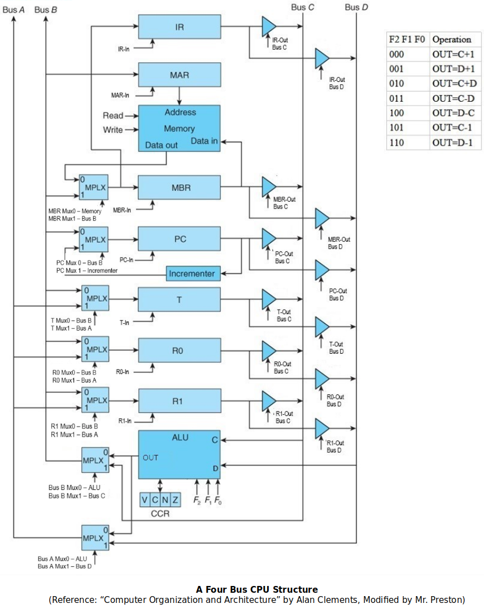

[Home](../../) | [Projects](../../projects) | [Notes](../) > <a href="./">Computer Architecture & Organization</a> > Microarchitecture

# Microarchitecture


## Hardware & Software Layers


* **Application Level**

  At this level, the computer appears to be a device that performs a function. (e.g., a computer running a GPS mapping package appears just like a satnav device.)

* **High-Level Language Level**

  At this level, the computer appears to be *machine independent* and executes a high-level language. All computers executing the same language are identical (in principal) and differ only in terms of performance.

* **Low-Level Language Level**

  At this level, the computer is *architecture dependent* and the machine code executed will run only on one particular class of computer. (e.g., Intel IA32 code on Core i7)

* **Microarchitecture Level** 

  This level represents the physical organization of the computer in terms of registers, functional units, and buses. The microarchitecture may be unique to a particular instance of a microprocessor (i.e., two microprocessors share the same low-level language but different microarchitectures). Normally, this level is not accessible by the end user. Hoiwever, modern programmable logic does allow users to modify the microarchitecture of processors constructed from programmable logic.

* **Gate Level**

  Below the microarchitecture lie the individual gates that determine the ultimate speed of the processor. (e.g., AND gates, OR gates, flip-flops, etc.)

* **Device Physics Level**

  The lowest level and is determined by the electronic properties of the material used to fabricate the gates. (e.g., Transistors, atoms, etc.)


## The Microprogram

### The Generic Digital Processor

Not used anymore, antiquated but good to understand how control signals work.

Generally, CPUs are made of registers, buses, ALUs and Control Units. (Technically speaking, a CPU could work without registers in it but then it will have to continuously access memory which will dramatically degrade its speed.)


* **FETCH** (Takes 3 minor clock cycles)

  ```plain
  T0: PC-Out Bus B, ALU F(000), MAR-in Bus A, Read
  ```

  > Get ready to fetch the next instruction from memory. Note that the **Read** happens at the same time! At this minor clock cycles, all these control signals are turned one at the same time.

  ```plain
  T1: PC-Out Bus B, ALU F(010), PC-in Bus A
  ```

  > Update the PC so it points to the next instruction (in this particular architecture, update PC by 1). The reason why this is a good time for PC update is that beccause the memory read operations of T0  takes time. By default, the next instruction to be executed is assumed to be the one that’s stored in the next sequential memory. When this minor clock cycle begins, all the control signals that were turned on during T0 are turned off.
  >
  > By the time T1 is done, the instruction read from the memory will have been stored in MBR.

  ```plain
  T2: MBR-Out Bus B (or MBR-Out Bus C), ALU F(000) (or ALU F(000)), IR-in Bus A {Decode}
  ```

  > Transfer the instruction to the IR and start decode process. 
  >
  > By the time T2 is done, CPU will be ready to execute.

  Fetch is called a **major clock cycle**, and T0~T2 are called **minor clock cycles**.

  Control signals such as `PC-Out Bus B`, `ALU F(010)`, or `Read` come from the **Control Unit**.

* **ADD** (Takes 1 minor clock cycle)

  Since there are only two general purpose registers (i.e., `r0` and `r1`), one has to be overwritten at the end of the operation. 
   (Whichever register that is listed first in the `ADD` instruction will be overwritten.)	

  ```assembly
  add r1, r0
  ```

  ```plain
  T0: R0-Out Bus B, R1-Out Bus C, ALU A=B+C, R1-In Bus A
  ```

  > In the case of addition, it doesn’t matter whether which bus (between Bus B and Bus C as long as they are different) `r0` and `r1` get sent out to because addition is commutative. However, be careful when you do `SUB`.

* **BEQ** (Takes 1 minor clock cycle) 

  The memory address to branch to is in the IR. (In terms of assembly code, the `label` is the address, and it is part of the instruction.)

  ```assembly
  beq T
  ```

  ```plain
  (if Z bit in CCR is set) IR(address part)-Out Bus B, ALU A=B, PC-In Bus A
  ```

* **STR** (Takes 2 minior clock cycles)

  The memory address `r0`’s data is to be stored into is in the IR.

  ```assembly
  str m, r0
  ```

  ```plain
  T0: IR(address part)-Out Bus B, ALU A=B, MAR-In Bus A 
  ```

  > Done with the address

  ```plain
  T1: R0-Out Bus B, ALU A=B, MBR-In Bus A, Write
  ```

  > Done with the data
  >
  > Not all, but a lot of RISC machines’ instructions take 1 clock cycle.


### A Two-Bus CPU Structure


* **FETCH** (Takes 3 minor clock cycles)

  ```plain
  T0:PC-Out Bus B, Bus A Mux1 - Bus B, MAR-In Bus A, Read
  ```

  ```plain
  T1: PC Mux1 - Incrementer, PC-In
  ```

  >  Thanks to the dedicated incrementer, incrementing PC became much simpler; ALU does not have to be involved any more.

  ```plain
  T2: MBR Mux0 - Memory, IR-In 
  ```

  > Transfer the instruction to the IR and start decode process.
  >
  > Thanks to MBR Mux and the additional piece of wire that directly connects the output of MBR Mux to IR, the instruction found from the memory can be directly moved to IR instead of going through MBR.

* **ADD** (Takes 1 minor clock cycle)

  Since there are only two general purpose registers (i.e., `r0` and `r1`), one has to be overwritten at the end of the operation. 
   (Whichever register that is listed first in the `ADD` instruction will be overwritten.)	

  ```assembly
  add r1, r0
  ```

  ```plain
  T0: R0-Out Bus B, (R1 directly goes to ALU input C) ALU A=B+C, R1-In Bus A
  ```


### A Four-Bus CPU Structure

Overall, added more flexibility in how we transfer stuff.





* **FETCH** (Takes 3 minor clock cycles)

  ```plain
  T0: PC-Out Bus C, Bus B Mux1 - Bus C, MAR-In, Read
  ```

  ```plain
  T1: PC Mux1 - Incrementer, PC-In
  ```

  ```plain
  T2: MBR Mux0 - Memory, IR-In 
  ```

  > Transfer the instruction to the IR and start decode process.

  Fetch process is still similar to that of a *Two-Bus CPU Structure*’s. (Still 3-word long)


## Generating the Microoperations

### Hardwired Control Unit

* The **Hardwired Control Unit** uses basic gates to activate the control signals for ALU and the registers to execute the instructions. Once burned onto the hardware, cannot be changed!

* Has always been faster than *Microcode Control Unit* and therefore used in many modern architectures.

* **Inputs:**

  * Phase (Fectch, Execute)

    * Clock Cycle (T0 , T1, T2, T3)        

      - 4 clock cyles are enough for the most of the operations

      - If not enough? Just assume more


    * Instruction        
    
      - Opcode


  * Addressing Mode


* **Outputs:**

  - ALU Operations

  - Memory Read/Write

  - In/Out, From/To Bus

  - CCR Flag Updates


### Microcode Control Unit

* For the **Microcode Control Unit** these gates have been replaced by:

  - μPC −  A register that contains the next microinstruction to execute

  - μMemory −  A section in the CPU where the microinstructions are stored

  - μMAR / μIR − Current microinstruction that is being executed (both registers serve the same purpose)


#### 1. Horizontal Microcode

- Each bit of the microcode controls (corresponds to) a specific control signal. (e.g., In the following figure, if R~a0~ bit is set, it means “Register r0 out to bus A”. 
- The microinstruction has to be as long as the number of control signals. This makes for very long microinstruction and hence a large Microprogram ROM. Also, why would you need to be able to turn on multiple bits when more than two data loaded on one bus is not meaningful! (Plus, shorting multiple output buses is a BAD idea!)


#### 2. Vertical Microcode

- Instead of each bit controlling one signal a group of bits is used that then go into a decoder to turn on the right signal. This system prevents bad or unnecessary things (e.g., conflics) that were allowed  to happen in the *Horizontal Microcode* from happening.
- Be careful with the groups because the decoder only has one signal active at a time.
- This may be more complex, a bit slowewr than *Horizontal Microcode*, but it makes the microcode word much shorter.


* Microcode Control Units were popular in the 1980’s for several reasons:    

  - Easy to fix problems with the microcode by reburning the microROM.


  - Completely change the instruction set by just redoing the microcode.


  - Fell out of favor because:        

    - Tools to design and test the microprocessor got a lot better. So, higher probability the CPUs would work the first time after manufacture.
    - Speed of the processors increased to the point that reading from the microROM would slow down the processor.

    [!] Note: Intel still uses microcode instead of hardwired one but the usage is  restricted to *cache* management. (Cache management algorithm is complicated and  if any issue is found on the hardwired component, everything has to be thrown away  whereas if done in microcode, it can be fixed at the software level.)