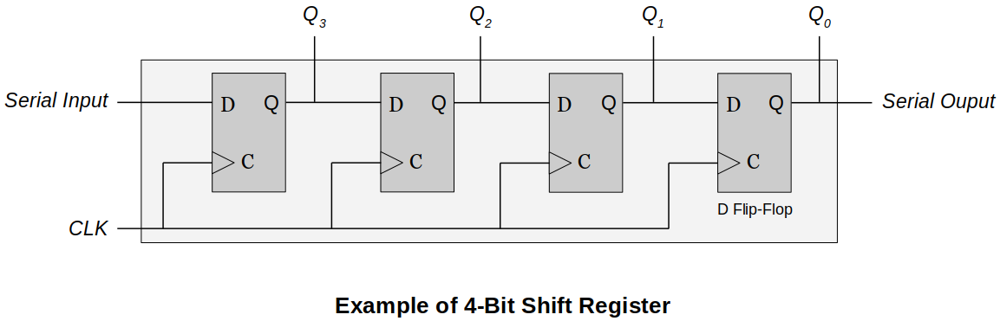
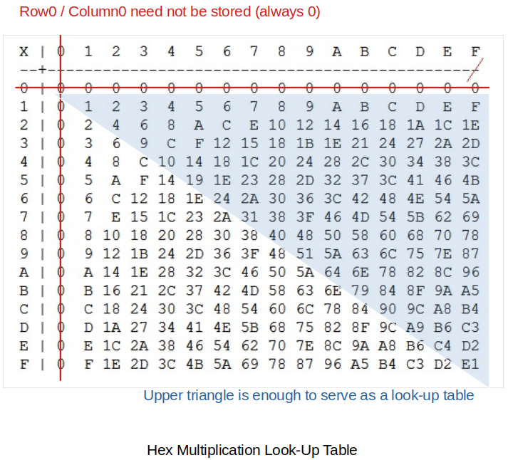
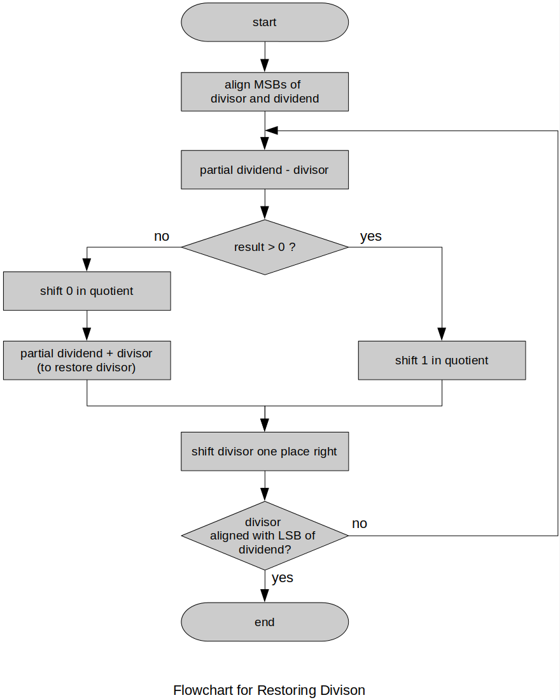

[Home](../../) | [Projects](../../projects) | [Notes](../) > <a href="./">Computer Architecture & Organization</a> > Multiplication & Division

# Multiplication & Division


## Shifting Operation

* **Shifting** in general means moving the bits stored in a register one or more positions to the right or left.





* **Arithmetic shift**
  - Arithmetic Shift Left (Multiplication)
    - Each bit is shifted towards left, MSB is discarded and LSB becomes 0. (Similar to logical shift)
        - In this example, the operation has overflowed. Meaning, the result of the multiplication is larger than the largest possible value.
  - Arithmetic Shift Right (Division)
    - Each bit is shifted towards right, LSB is discarded and MSB is preserved.


## Unsigned Binary Multiplication - Partial Products

* Humans do all the multiplication first, then add up those numbers to get the final product. 

    - Human's multiplication example:

      ```plain
         0010  Multiplicand (2 in base-10)
       x 0011  Multiplier (3 in base-10)
       ------ 
         0010  Partial product
        0010   Partial product
       0000    Partial product
      0000     Partial product
      -------
      0000110  Final result
      ```

* Computers do it a little differently by using the **Paritial Product Algorithm**.

    - Here, the multiplication of two $n$-bit numbers needs to have a $2n$ bits to store the result. 

        - ∵ The result can be as big as $2n$ bits. (Make sure that your partial product register has enough room to store the information.)

    - Computer's partial product algorithm for multiplication: 

      ```plain
      Step a.   Set a counter to n.
      Step b.   Clear the 2n-bit partial product register.
      Step c.   If the right most bit of the multiplier is one, add the multiplicand to the 
      		  n most-sificant bits of the partial product.
      Step d.   Shift the partial product one place to the right.
      Step e.   Shift the multiplier one place to the right (the rightmost bit is lost.)
      Step f.   Decrement the counter and repeat from step c until the count is 0 after n cycles. 
      		  The product is in the partial product register.
      ```

    - Example:

      ```plain
      Multiplicand = 0010 (2 in base-10)
      Multiplier = 0011 (3 in base-10)
      +-------------------------------------------------------------+
      | Cycle |   Step    | Counter |  Multiplier | Partial Product | 
      +-------------------------------------------------------------+
      |       |   a, b    |    4    |    0011     |    0000 0000    |
      | 1     |   c       |    4    |    0011     |    0010 0000    |
      | 1     |   d, e    |    4    |    0001     |    0001 0000    |
      | 1     |   f       |    3    |    0001     |    0001 0000    |
      +-------------------------------------------------------------+
      | 2     |   c       |    3    |    0001     |    0011 0000    |
      | 2     |   d, e    |    3    |    0000     |    0001 1000    |
      | 2     |   f       |    2    |    0000     |    0001 1000    |
      +-------------------------------------------------------------+
      | 3     |   c       |    2    |    0000     |    0001 1000    |
      | 3     |   d, e    |    2    |    0000     |    0000 1100    |
      | 3     |   f       |    1    |    0000     |    0000 1100    |
      +-------------------------------------------------------------+
      | 4     |   c       |    1    |    0000     |    0000 1100    |
      | 4     |   d, e    |    1    |    0000     |    0000 0110    | Final result
      +-------------------------------------------------------------+
      ```

      > With negative number this complicates the algorithm. Skip negative number multiplication and Booth's Algorithm.


## High Speed Multiplication

* Practical computers accelerate multiplication in various ways as multiplication by shifting and adding is relatively slow.

    - Partial Product Algorithm can cause many iterations which can drastically decrease the speed of the operation as the register size gets bigger.

* Faster multiplications:

  - Use *shift* and *add* in a different way. 

    - Can only be used when you know the multiplier at coding.

      ```plain
      x10 can be done by,
      
      1. Shift left             (original value x 2)
      2. Shift left             (now becomes, original value x 4)
      3. Add original value     (now becomes, original value x 5)
      4. Shift left             (now becomes, original value x 10)
      ```

  - Use a *look-up table* like an array.

    - Can be used when you do NOT know the numbers at coding.   
    - Define the table in memory (ROM) and use the input numbers to look up the result. (It is fast because only one memory reference is required.)
    - Trading memory for speed!
      - Faster than the Partial Product Algorithm but memory to store this table is required.
      - No need to store the whole 256 bytes shown in the following example. Only 120 bytes need to be stored. Think!





* Using smaller *look-up tables* with larger operands.

  - Split the binary number in half and do the mutiplication so that it can be carried out only by using smaller look-up tables.

  - Example: Multiplication of two 16-bit binary numbers

    ```plain
    A = A(upper)*256 + A(lower)           or A1*256 + A0 
    B = B(upper)*256 + B(lower)           or B1*256 + B0 
    
    A * B = (A1*256 + A0)(B1*256 + B0)
          = 65536*A1*B1 + 256*A1*B0 + 256*A0*B1 + A0*B0
    
    Since multplying by 2 can easily be done with shifting,
    65536 = 2^16 (16 left shifts)
    256   = 2^8 (8 left shifts)
    
    The split parts' range would be 00 to FF(255). 
    The array size would be 256*256 = 65536 with each element being 32 bits.
    (This array can be further downsized due to its symmetricity, etc.)
    ```

  - This technique can be used for any number of bits.

    - If you use a smaller table (i.e., `16 x 16`) and larger numbers (i.e., 32-bits) then the numbers have to e broken into 4-bits each.

      ```plain
      A = A7A6A5A4A3A2A1A0
      
      A = (2^28 * A7) + (2^24 * A6) + ... + (2^8 * A2) + (2^4 * A1) + A0
      ```

    - Smaller table, but more look-ups, partial products to keep track of and shifts.


## Division

* **Division** can be performed by repeated subtraction.

  - The loop stops when the result is less than the divisor.

  - The ARM does not have a division instruction at the assembly level. You have to write that yourself.

      - Division is not supported by the CPU (32-bit architecture) we are using for this course, but might be supported in the future generation CPUs.
      - The easiest algorithm is just do repeated subtraction until you get `0` or a negative number for a remainder.

  - Example:

    ```plain
    Dividend - Divisor    Quotient    Remainder
    ------------------    --------    ---------
    20                    0           0
    20-3 = 17             1           17
    17-3 = 14             2           14
    14-3 = 11             3           11
    11-3 =  8             4           8
     8-3 =  5             5           5
     5-3 =  2             6           2         <----- Stop here!
    ```

    > This algorithm can get really slow when dividing a large number by a small number.

  - Hardware can be used to implement the better division algorithms.

### Restoring Division

* **Restoring division** is basically the traditional pencil and paper algorithm we use to perform division. The only difference is that we, as humans, compare the *divisor* with the *partial dividend* mentally whereas computers must perform a subtraction and test the sign of the result.
    - If `result > 0`, a `1` is shifted into a *quotient*.
    - Else, a `0` is shifted into a *quotient* and the *divisor* is added back to the *partial dividend* to restore it to its previous value.
* Restoring Division Algorithm
  1. Align the *divisor* with the MSB of the *dividend*.
  2. Subtract the *divisor* from the *partial dividend*.
  3. If the resulting *partial dividend* is negative, place a `0` in the *quotient* and add back the *divisor* to restore the *partial dividend*.
  4. If the resulting *partial dividend* is positive, place a `1` in the *quotient*.
  5. Perform a test to determine end of division. If the *divisor* is aligned so that its LSB corresponds to the LSB of the *partial dividend*, stop. The final partial product is the remainder. Otherwise, continue with **step 6**.
  6. Shift the *divisor* one place right. Repeat from **step 2**.





* Example: Dividing `01100111`<sub>`(2)`</sub> by `1001`<sub>`(2)`</sub>

  ```plain
  Step Description                           Partial Dividend Divisor  Quotient
  ---- ------------------------------------- ---------------- -------- --------
       (Initial)                                     01100111 00001001 00000000
  1    Align                                         01100111 01001000 00000000
  2    Subtract divisor from partial diviend         00011111 01001000 00000000
  4    Result positive, shift 1 in quotient          00011111 01001000 00000001
  5    Test for end
  6    Shift divisor one place right                 00011111 00100100 00000001
  2    Subtract divisor from partial diviend        -00000101 00100100 00000001 
  3    Restore divisor, shift 0 in quotient          00011111 00100100 00000010
  5    Test for end
  6    Shift divisor one place right                 00011111 00010010 00000010
  2    Subtract divisor from partial diviend         00001101 00010010 00000010
  4    Result positive, shift 1 in quotient          00001101 00010010 00000101
  5    Test for end
  6    Shift divisor one place right                 00001101 00001001 00000101
  2    Subtract divisor from partial diviend         00000100 00001001 00000101
  4    Result positive, shift 1 in quotient          00000100 00001001 00001011
  5    Test for end
  ```
