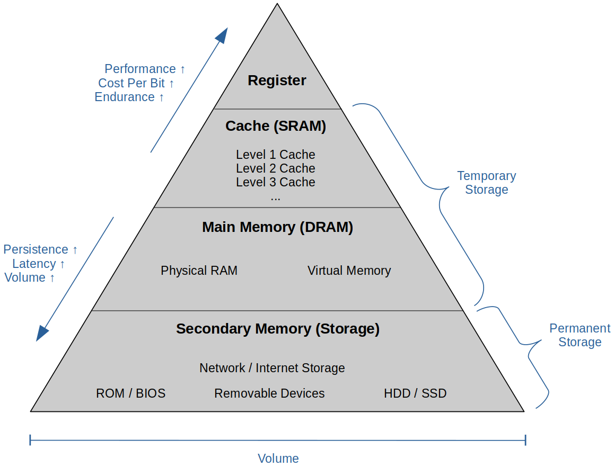

[Home](../../) | [Projects](../../projects) | [Notes](../) > <a href="./">Computer Architecture & Organization</a> > Overview of the Computer System

# Overview of the Computer System

## Memory Overview

* **Memory** is a device or system that is used to store information (instructions, data elements).
* Memory is regarded as a large array of elements accessed via an address.
* Two important aspects of memory:
  - **Size** (i.e., storage capacity) determines the amount of data a program can store.
  - **Speed** (access time) determines how fast a program can process data.
* In the development of modern computers, *processor speed* has outpaced the rate of increase in *memory speed*.
    - The term *memory wall* means that the memory performance ultimately limits processor performance.
* **Memory map** is a structure of data (which usually resides in memory itself) that shows the location of information within the memory. The term *memory map* can have different meanings in different contexts.
    - Usually shows addresses and information (instructions or data elements) stored in them.
    - Think of it as a list, table or array of stored values.

## Memory Hierarchy

* Micro-coded machines have **Micro Memory** inside their CPUs.
* **Virtual Memory** is an area of a computer system's secondary memory storage space (i.e., hard disk drive or solid state drive) which acts as if it were a part of the system's RAM or main memory. The operating system steps in to make it look like RAM.

## Register

* A **register** is a memory element that holds a single unit or *word* of data.
* A register is specified in terms of the number of bits it holds, which is typically *8*, *16*, *32*, or *64*.
* There is no fundamental difference between a register and a word in memory. The practical difference is that registers are located within the CPU and can be accessed more rapidly than external memory.

## Cache

* A **cache** is a hardware or software component that stores data so that future requests for that data can be served fatster.
    - The data stored in a cache might be the result of an earlier computation or a copy of data stored elsewhere.
* A *cache hit* occurs when the requested data can be found in a cache, while a *cache miss* occurs when it cannot.
    - Cache hits are served by reading data from the cache, which is faster than recomputing a result or reading from a slower data store; thus more requests that can be served from the cache, the faster the system performs.
* There is *on chip* and *off chip* cache and up to three levels of cache.

## Main Memory

* **Main memory** is the immediate access memory which is composed of *volatile* semiconductor memory called *dynamic random access memory* (DRAM).
* Data is lost when the power is removed.

## Random Access Memory (RAM)   

* A form of computer memory that can be read and changed in any order, typically used to store working data and machine code.
* A random access memory device allows data items to be read or written in almost the same amount of time irrespective of the physical location of data inside the memory. 
* **Static Random Access Memory (SRAM)**
  - A type of RAM that uses latching circuitry (flip-flop) to store each bit.
    - 4 to 6 transistors make a flip-flop to store one bit.
  - As long as power is supplied, the state of the SRAM will not change.
  - It is volatile memory meaning data is lost when power is removed.
  - Faster and more expensive than DRAM.
  - Used for **cache**, internal **registers** of a CPU, etc.
* **Dynamic Random Access Memory (DRAM)**
  - A type of RAM that stores each bit of data in memory cell, usually consisting of a tiny capacitor and a transistor.
      - Transistor-capacitor pair make up a *cell* or one bit.
  - Memory refresh is required even when the power is supplied since the electric charge on the capacitors gradually leaks away.
      - Data have to be rewritten periodically to be retained.
  - Has a destructive read.
    - When you read a cell you get what WAS stored there. It have to be rewritten to be retained in memory.
  - Used for **main memory** in modern computers, **graphics memory** (the main memory of graphic cards), etc.
* **Synchronous Dynamic Random Access Memory (SDRAM)**
  - DRAM with the addition of a synchronous interface (coordinated by an externally supplied clock signal) with the system bus.
  - The clock is used to drive an internal finite state machine that pipelines incoming commands.
  - The data storage area is divided into several equally sized but independent sections called *banks*, allowing the device to operate on a memory access command in each back simultaneously and speed up access in an interleaved fashion.
      - This allows higher data access rates than asynchronous DRAMs.
      - This technology has been extended into *Double Data Rate* (DDR) SDRAM. e.g., DDR, DDR2, DDR3, DDR4 and DDR5.

## Read Only Memory (ROM)

* A type of non-volatile memory used in computers.
* Data stored in ROM cannot be electronically modified after the manufacture of the memory device.
    - Thus useful for storing software that is rarely changed during the life of the sysetm, a.k.a. firmware.
* Applications
  - Program Array Logic
  - Field Programmable Gate Array
  - Programmable ROM (PROM)
  - Erasable ROM (EROM)
  - Electrically Erasable PROM (EEPROM)

## Bus

* The **bus** is set of wires that link together two or more functional parts of a computer and allows the exchange of data.

    - e.g., The bus between the CPU and its graphics card.

* Buses also link computers to external peripherals.

  - e.g., The USB bus that connects a printer to a computer. 

* Advantage of using a common bus to connect all units together:

  

  

  

    - A *complete graph structure* connecting all units requires $k(n) = n(n - 1)/2$ for $n$ units, whereas a *common bus structure* connecting all units requires only one new connection to the main bus from the new unit being added.
    - With a bus each register just need to write to the bus and read from the bus.

* Most systems have multiple interconnected buses.

  - Multiple buses permit *parallel operations*.
  - Multiple buses make it possible for a system to have entirely different characteristics and operating speeds.
      - e.g, A vehicle has multiple CAN buses such as C-CAN, B-CAN, D-CAN, and M-CAN each of which is dedicated to a specific functionality.

  

  

* **Bus width**

  - The width of a bus is defined as the number of parallel data paths.

    e.g., A 64-bit bus can carry 64 bits (8 bytes) of information at a time.

  - The width can also be used to indicate the total number of wires (connections) that make up a bus.

    e.g., A bus may have 50 information paths of which 32 carry data (the rest may be paths for control signals or even power lines).

* **Bandwidth**

  - The bandwidth of a bus is a measure of the rate at which information can be transported across the bus.
  - Expressed in either *bytes/second* or *bits/second*.
  - Increasing the width of a bus while keeping the data rate constant increases the bandwidth.

* **Latency**

  - Latency is the waiting period between a data transfer request and the actual transmission.
  - Typically, a bus' latency includes the time taken to arbitrate for the bus before transmission can take place.
      - *Arbitration* is the process whereby two or more devices compete for a resource (in this case the bus).
      - Some systems have a special unit called an *arbiter* that selects which of the competitors is allowed to go first, while all the other contenders wait their turn.

## Standard vs. Protocol

* **Standard**

  - An agreed way of designing a system, specifying it, or categorizing any other aspect.

    e.g., Power sockets and plugs must conform to agreed standards in order to allow us to take electrical equipment from one place to another.

* **Protocol**

  - A protocol governs the sequence of events that take place when two parties communicate. (Similar to *standard* but covers a narrower domain.)

    e.g., When a computer sends data to a memory, the write protocol defines the sequence of signals (address, write command, and the data to be stored) together with the minimum and maximum duration of signals.
