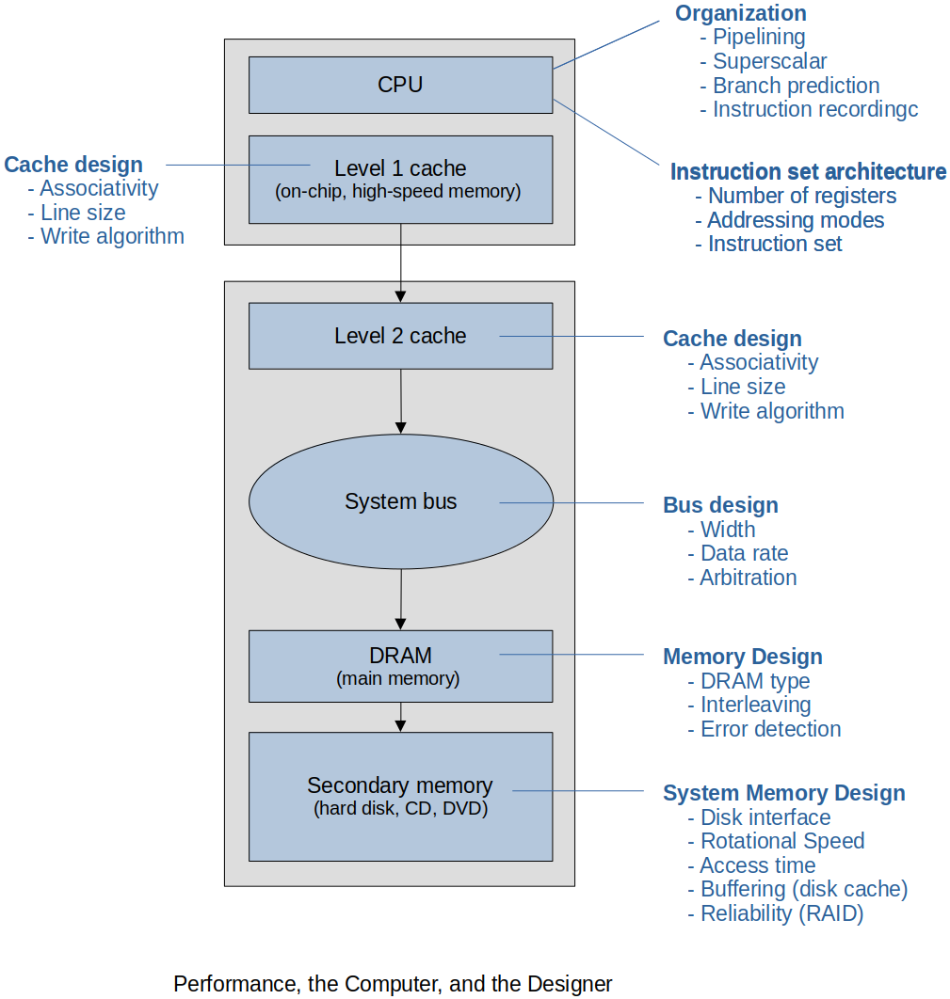
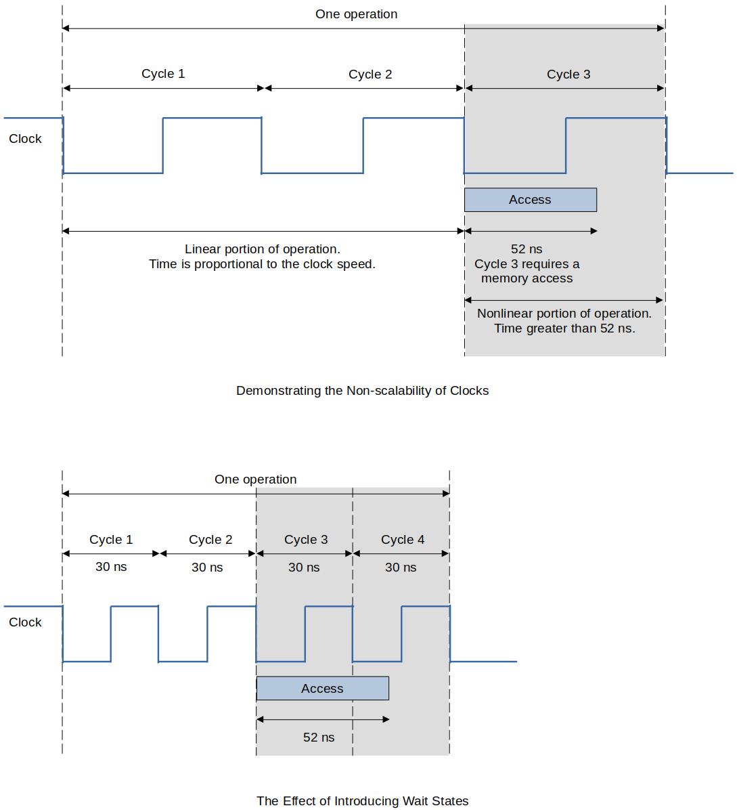
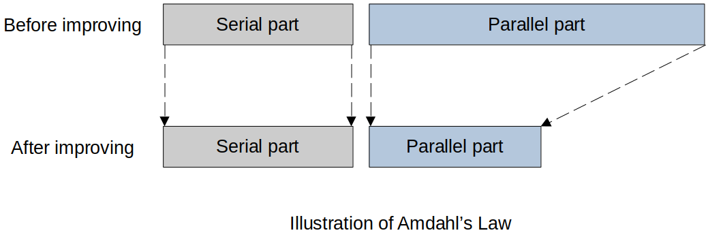

[Home](../../) | [Projects](../../projects) | [Notes](../) > <a href="./">Computer Architecture & Organization</a> > Performance

# Performance


## Meaning and Metrics of Performance

* **Clock Rate** can tell you something but not much.
* Vendors have manipulated the measures to make their CPU look better.
  - Digital Equipment Corporation (DEC) had made modification to their compiler that would look for code that was a benchmark algorithm and then switch out the compiler code with an optimized assembly code.
* The complexities of the CPUs makes it difficult to compare.
* So far (the last 50+ years), just wait a while and there will be a faster process.
* Have more issues with poorly written, inefficient code than with slow CPUs.
* What is important to a CPU has changed over the years.
  - It was the Clock Rate, then the word size, then changed to performance speed for certain applications.
  - Now, power consumption is one of the more important measures.
* Remember! It's not just the speed of your CPU that determines the user-level performance. 
    - User experience is the result of the combination of all the components' performances.
* Also, even in the same system, the measurements can vary depending on where the performance was measured.
    - e.g., L1 cache, system bus (also varies within the system bus depending on where they are connected), DRAM(main memory), secondary memory, etc.
* Be skeptical about the CPU measurements. At the end of the day, they are just numbers!


## Progress and Computer Technology

### Moore's Law

* Moore's Law is a term used to refer to the observation made by Gordon Moore in 1965 that the number of transistors in a dense integrated circuit (IC) doubles about every two years.
* There's no precise formulation of Moore's Law. 
* The term "Moore's Law" was coined by Carver Meade in 1970.
* Over time, Moore's Law has also come to imply a doubling in the performance of digital systems every 18-24 months.
* It has been true for the past 55 years. Right now it is slightly less.

### Semiconductor Progress

* Processing power has increased with the number of transistors. (Direct relationship)

### Memory Progress

* The density of memory has grown along with the CPU, but the speed has not kept up with
  the CPU.
* There's little point in making processors faster and faster if the data they need cannot
  be read from memory or moved from place to place via buses sufficiently rapidly.
* Progress is not uniform and bottlenecks are developing because some technologies (such
  as hard disk transfer times) are lagging behind processor technologies.
* Processor manufacturers improve CPU organization in order to help overcome deficiencies
  elsewhere.
* Hard disk drives have also improved storage and cost per bit has gone down, but their
  speed has not kept up with the CPU.


## The Performance of a Computer

* Just because you have a fast CPU does not mean that your computer performance is good. Think about the following combinations:

  ```plian
  Good                          But
  ============================  ================================     
  CPU                           Slow main memory
  CPU, memory                   Slow hard drive
  CPU, memory, HD               Poor compiler
  CPU, memory, HD, Compiler     Poor OS or application
  All                           Poor programming practices :(
  ```

* There are multiple factors that affect computer performance, some of which are shown in the following figure.





* Today, power consumption is one of the major factors related to CPUs.
  - e.g., Power turning into heat.
  - e.g., Server farms and blade computer rooms can run OK at $$90$$ degrees but can easily get over $$140$$. (This may be okay for the hardware but way too hot for people working in there.


## Computer Metrics

* How do you determine if your computer metrics are good?
  - **Linearity**
    - Linear is better than exponential because it is easier to compare.
  - **Reliability**
    - Is one computer really faster than another one?
    - e.g., If the metrics says $$A$$ is faster than $$B$$, is $$A$$ really faster?
  - **Repeatability**
    - Same input, same computer and the same environment always yield the same
      results no matter how many times it is repeated or who measures it.
  - **Ease of measurement**
    - It shouldn't take days or months to make the measurement or need expensive
      equipment.
  - **Consistency**
    - Precisely defined and can apply across different systems.
  - **Independence**
    - Does not favor one manufacturer.


## Terminology

### Efficiency

* The efficiency of a computer is an indication of the fraction of time that it is doing "useful" work.

  
  $$
  \begin{align}
  Efficiency = \frac{\text{total time executing useful work}}{\text{total time}} 
  = \frac{\text{optimal time}}{\text{actual time}}
  \end{align}
  $$

  

  For example, if a computer takes:

  $$20$$s to perform a computational task and, $$5$$s is taken waiting for a disk that has been idle to spin up to speed, then the efficiency is:

  
  $$
  \begin{align}
  Efficiency = \frac{20s}{(20s + 5s)} 
  = \frac{20}{25}
  = 0.8 \ (80\%)
  \end{align}
  $$
  
* This is not easy to determine, however, because you can argue what is useful or not.

### Throughput

* Amount of work it performs per unit time.

  - e.g., Bus $$-$$ $$\text{Megabits $/$ Second} = \text{Megabytes $/$ Second $/$ 8}$$
  - e.g., CPU $$-$$ $$\text{Instructions $/$ Second}$$
    - $$4$$ BIPS (Billion Instructions Per Second)

* Example: 
  $$1GHz$$ quad core (4 instructions in parallel). Each instruction takes $$1$$, $$2$$, or $$4$$ clock cycles. What is the throughput of this CPU?

  $$\to 10^9 \times 4$$ or $$4E9$$ $$\text{Instructions $/$ Second}$$

### Latency

* Time from when a request is made to when the request starts operation.
* Examples
  - Disk I/O and having to wait for the platter to turn under the read/write head.
  - DDR memory having to load the address twice then wait for the data to arrive.

### Relative Performance

* The relative performance of computers $$A$$ and $$B$$ is the inverse of their execution times:

  
  $$
  \begin{align}
  Performance_{\text{AtoB}}
  = \frac{Performance_A}{Performance_B}
  = \frac{ExecutionTime_B}{ExecutionTime_A}
  \end{align}
  $$
  
* If a system $$A$$ executes a program in $$105$$s and system $$B$$ executes the same program in $$125$$s, we can calculate the relative performance as $$125/105 = 1.190$$.

  $$\to$$ $$A$$ is faster than $$B$$ so the performance number has to be greater than $$1$$.

  $$\to$$ $$A$$ is $$19\%$$ faster than $$B$$.    

### Time and Rate

* Time required to execute a task.
  - e.g., How long it takes to add two 32-bit integers? $$\to$$ 20 nanoseconds.
* Rate at which tasks are executed. 
  - e.g., $$3$$ million floating-point operations per second or $$3$$ MFLOPS.

### Clock Rate

* Don't be fooled by the CPU clock rate when comparing the performances of computers!
* There is no doubt in how to measure clock speed and no argument in the results. Put an oscilloscope on the clock and directly measure the frequency of the clock. But, this does not make it a good measure of what is important to the computer user.
* First, you need to know which clock you are they are talking about:
  1. CPU $$-$$ Parts of the CPU may run under different clock
  2. Bus $$-$$ Within the CPU? Or the one for the motherboard?
  3. Memory
* Mobile processors can change the clock on the run depending on the power available.   

### Overclocking

* Doubling the clock speed will not double the performance of your CPU. Some functions of the CPU will always require a certain amount of time and cannot be sped up.
    - e.g., Gate delays, signal stabilization, etc. (See the following figure.)





* You can overclock your CPU. But, you cannot change the laws of Physics.
  - Overclock means the clock is sped up beyond its designed clock speed.
  - You will get some improvements because most CPUs are overdesigned to ensure they support the published clock speed.
  - Push it too far and the CPU will become unstable.
* **Design margin**
  - It is difficult to alter a clock speed while the CPU is running. A register-to-register operation can happen very fast compared to a memory-to-memory operation which is much slower. Instead of changing the clock speed while the CPU is running, designers introduce wait-states.
* The clock period is governed by:
  - device physics
  - the ability to dissipate heat
  - the chip's logic design
* Signal propagation
  - Time it takes for the signal to get across the CPU. Only ways to improve by making the distance between connections shorter or changing the properties of the semiconductor.
* More speed means more energy (watts) more energy means more heat, more heat means more colling and decreasing the life of the electronics.


## The Clock and the Consumer

* Clock rate is simple but wrong. For most consumers, it will not make a significant difference in their experience. 
* The power dissipation limit has been reached (for the moment). At some point someone will figure out a way to push beyond the current limit, but at the very least it is on the back burner. The current world record is over 5-years old which in CPU terms is
  several lifetimes.


## MIPS

* **MIPS** stands for "Millions of Instructions Per Second".

* Slightly better than clock speed as a measurement but still have problems.

  - Different instructions take different clock cycles but manufacturers can intentionally take a faster executing instruction such as `shift` to make their products look faster.

* Another problem $$-$$ A Load/Store machine vs. Memory-Register machine

  ```plain
  Computer A (LOAD/STORE)           Computer B (Memory-Register)
  ================================  ============================
  LDR r1, [r0]      @ load x        LDR r1, [r0]    @ load x
  LDR r2, [4, r0]   @ load y        ADD r1, [4, r0] @ x + y
  ADD r2, r1, r2    @ x + y         MUL r1, #4      @ 4(x + y)
  ADD r2, r1, r2    @ 2(x + y)      STR r1, [8, r0] @ store z
  ADD r2, r2, r1    @ 4(x + y)
  STR r2, [8, r0]   @ store z
  ```

  > Both do the exact same thing. 
  >
  > $$A$$ usually executes instructions faster but requires more instructions. Therefore which is going to complete this faster is in question.

* The failure of the MIPS metric is inevitable because instruction throughput takes no account of *how much work* each instruction actually performs.

### Instruction Cycles and MIPS (Summary)

* MIPS is flawed!
* CPU execution time depends on:
  - The number of instructions
  - Clock cycles per instruction
  - Speed of the clock
* Compilers can really affect the CPU performance.
* Limits on how fast the clock can run.
* Limits on how close the CPU components can be put to each other
* Some instructions cannot run in one clock cycle.


## MFLOPS

* **MFLOPS** stands for Millions of Floating-Point Operations Per Second. (Not instructions!)
* On the surface it would seem that MFLOPS would have the same problems as MIPS but No!
* MFLOPS is most useful in comparing computers used in scientific applications when numerical calculations dominate the computation.
* The nature of the program and its data has a profound influence on the MFLOPS rating.
* When comparing two computers,
  - one system might yield better results for calculations involving sparse matrices.
  - one system might yield better results for calculations involving full matrices.
* MFLOPS is also not a uniform and reliable measurement but if you had to use the floating-points MFLOPS is a good measurement.


## Amdahl's Law

* Amdahl's law describes the performance increase you get when a program is run in a system where some of the operations can take place in parallel.
* Derivation of the formula is not necessary but know the most popular formula.
* **Amdahl's law**
  - Appears to place a limit on the maximum performance increase that can be achieved by optimizing a computer's subsystems.
  - Tells you what performance increase you get for greater parallelism.
  - Is applicable to any system where you are interested in the effect of local improvements on the system globally.
  - Highlights the effects of *bottlenecks* in a system.
* The diagram demonstrates that the serial (irreducible) part of the process remains the same while the parallel (reducible or improvable) part of the system is reduced.
* Ultimately, system performance is dominated by the serial part of the system and the motto of the computer designer has become *make the common case fast".





* Formula

  $$
  \begin{align}
  S = \frac{1}{f_s + \frac{1 - f_s}{p}} = \frac{p}{pf_s + 1 - f_s}
  \end{align}
  $$

  where, 

  $$S$$ $$-$$ The speed-up ratio for the system ($$\frac{\text{speed without parallelization}}{\text{speed with parallelization}}$$) 

  $$p$$ $$-$$ The number of processors being used

  $$f_s$$ $$-$$ Fraction of the process that can run on only one processor.

    - $$1$$ $$-$$ No parallelism is possible
    - $$0$$ $$-$$ Perfect parallelism 

  [!] Note: $$f_s$$ closer to zero, the faster the speed-up.

* Effect of Amdahl's Law

  ```plain
  Processors    Speed-up Ratio fs = 0.2     Speed-up Ratio fx = 0.1
  ============  ==========================  =======================
  1             1                           1
  2             1.667                       1.818
  3             2.143                       2.500
  4             2.500                       3.077
  5             2.778                       3.571
  10            3.571                       5.263
  100           4.808                       9.174
  ∞             5.000                       10.00
  ```

  > $$f_s = 0.2$$ means, $$80\%$$ can be done parallelly, $$20\%$$ serially.

* Additional formula for Amdahl's law:

  
  $$
  \begin{align}
  S = \frac{1}{1 - \text{Fraction}_{enhanced} +
  \frac{\text{Fraction}_{enhanced}}{\text{Speedup}_{enhanced}}}
  \end{align}
  $$


### Examples of the Use of Amdahl's Law

* The normal instuction mix in terms of time is

  - $$70\%$$ floating-point
  - $$30\%$$ integer and other instructions

* The engineers say that they can increase the speed of the floating point unit by a factor of $$3$$.

  $$\text{Fraction}_{enhanced} = 0.7$$

  $$\text{Speedup}_{enhanced} = 3$$

  $$S = 1/[1-0.7 + (0.7/3)] = 1.875$$


## Benchmarks

* CPU/Computer Benchmarks are:

  1. A computer program
  2. A set of computer programs (suite)
  3. OR other operations

  used to asses the performance of a CPU, computer or computer system.

* Benchmarks typically focus on one aspect of the performance of the computer.

  1. Integer calculations
  2. Floating point
  3. Input/Output
  4. Database
  5. Graphics -Video processing
  6. Parallel processing

* Compilers and Operating System may have more of an impact on performance than the CPU design.

* No project that I've ever been around has someone selected a CPU or computer based on a Benchmark or a set of Benchmarks

* This is more of a marketing tool or a tool used by CPU designers to try and improve their processors.

* With embedded systems it is expensive to upgrade the processor. There is typically a requirement that delivered system will only use $$50\%$$ of the CPU and main memory.
  That way there is room for expansion without having to upgrade the processor. Even measuring this presents its own problems. Measuring the CPU or the cores on the CPU. For example, all 4 cores running a max of $$50\%$$ each or two at $$100\%$$ each and the
  other two at $$0\%$$ each.

* Benchmark performance is not the only measurement of the CPU or computer. Size, power, consumption, heat, ruggedness (shock, vibrations, G's), working temperature, radiation shielding.

* The vendor will provide their benchmarks that show the best numbers for them under ideal conditions. Your performance will always be worst.


## SPEC

* **SPEC** stands for "Standard Performance Evaluation Corporation".
* American non-profit corporation that aims to "produce, establish, maintain and endorse a standardized set of performance benchmarks" for computers.
* SPEC was founded in 1988.
* SPEC benchmarks are widely used to evaluate the performance of computer systems; the test results are published on the SPEC website.
* SPEC evolved into an umbrella organization encompassing four divrse groups;
  1. Graphics and Workstation Performance Group (GWPG),
  2. High Performance Group (HPG),
  3. Open Systems Group (OSG)
  4. Research Group (RG)
