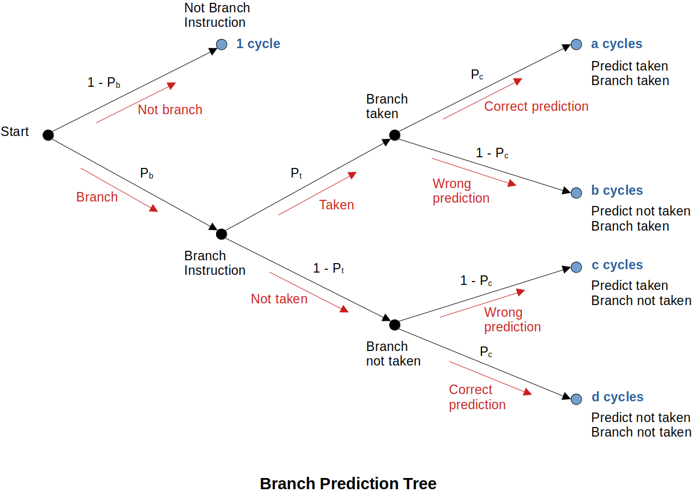
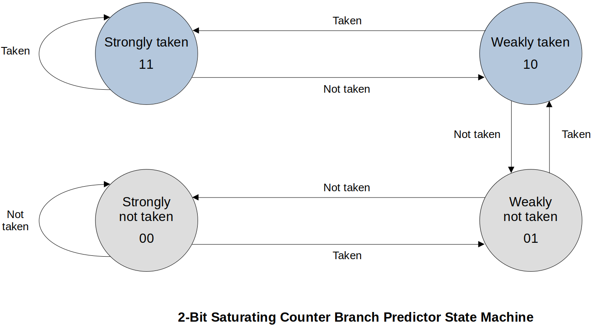
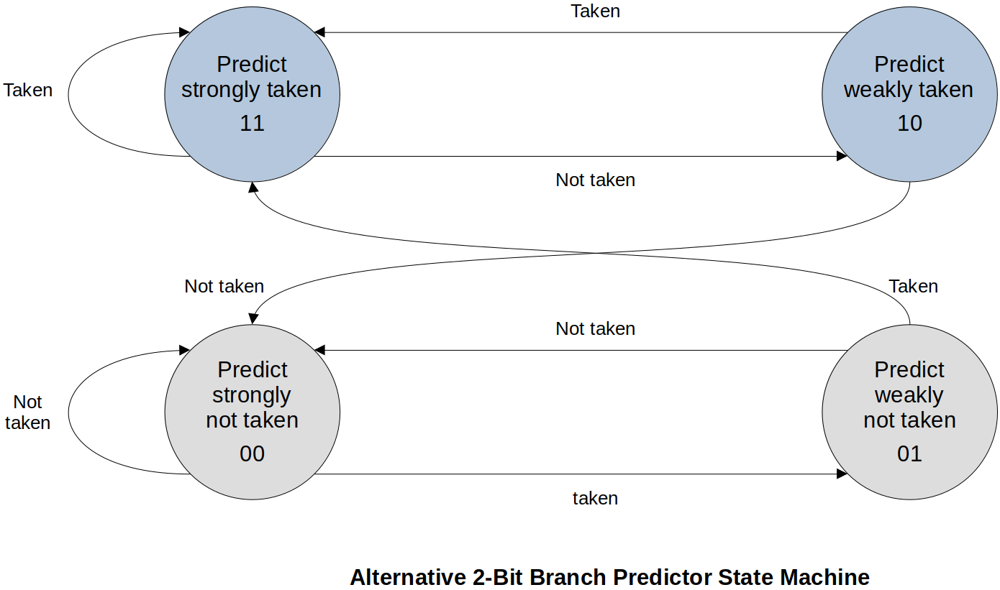
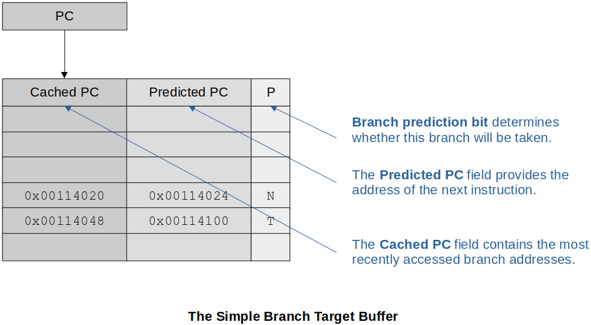
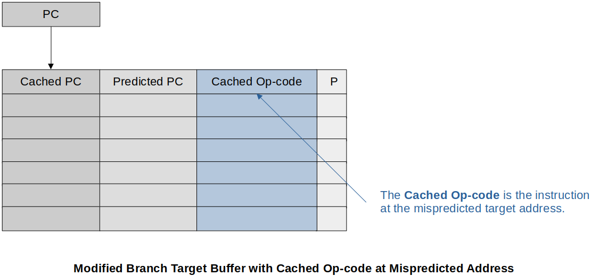
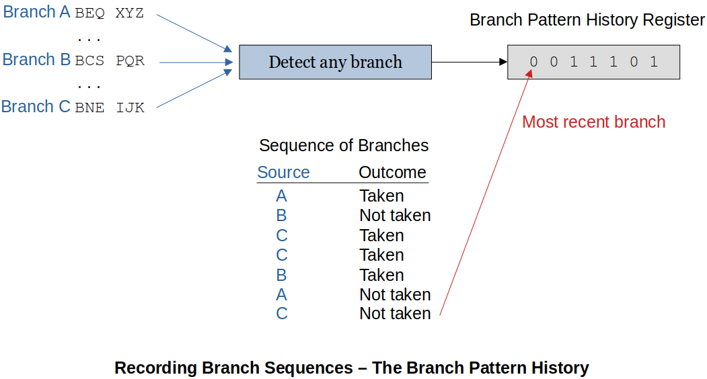
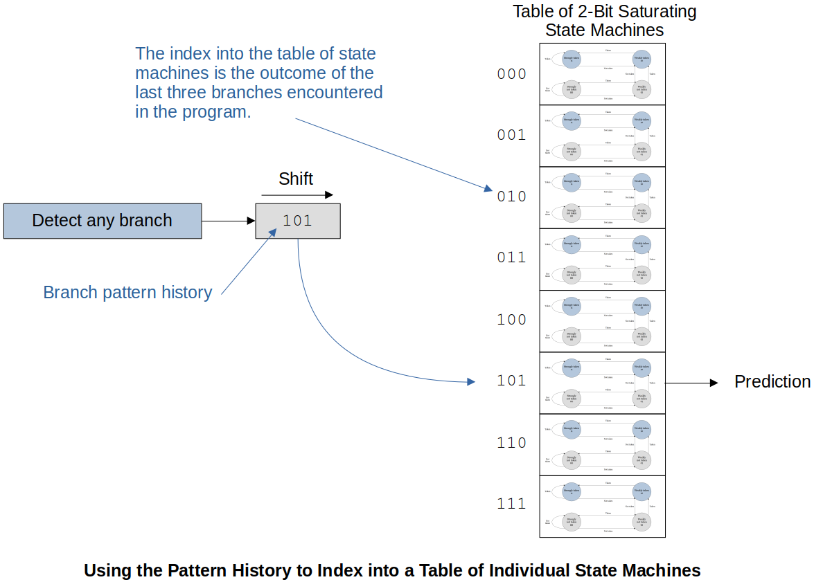

[Home](../../) | [Projects](../../projects) | [Notes](../) > <a href="./">Computer Architecture & Organization</a> > Pipeline & Branches

# Pipeline & Branches


## Branches

* Branches kill the effectiveness of pipelines. It is important to understand how branches impact pipelines and what can be done to mitigate the impact.

* Since the pipeline doesn't know what's going to happen when it encounters a branch, it can either:

  1. Pause fetch and wait

     Nice thing about this is that no bad decision has been made! It just waits till the decision is made. But, at the same time, there will always be the **lost cycles**.


  2. Take a guess

     If guessed right there will be no performance degrade (Good!). But, if guessed wrong **bubble** (or **hole**) will be introduced into the pipeline.

  Either way there are some potential issues. It’s the designers’ choice!

* High-level language constructs that causes branches:

  * Conditional statements (e.g., `if-selse`, `switch-case` statements) - Conditional branches

  * Loops (e.g., `for`, `do-while`, `while` loops) - Conditional branches

  * Subroutine or function calls and returns - Unconditional branches in most cases


* Grohoski Study:

  * $1/3$ of all branches are unconditional.

  * $1/3$ are conditional loop-closing branches. 
    
    e.g., `for` loop (Terminate a loop construct and is taken for the first $n-1$ times of an $n$-times loop.)

  * $1/3$ are other conditional branches.


## Branch Penalty

* A branch instruction, when taken, loads the processor’s PC with a new non-sequential value, and the pipeline has to be refilled with instructions following the branch target address. The **cost** (i.e., the **additional number of clock cycles**) of executing an operation that causes a non-sequential flow of control is known as the **branch penalty**.        

  * **Stall** the pipeline by introducing **bubbles**

  * If not stalled and prediction was incorrect, the pipeline has to be **flushed**.


## Branch Direction

* Many studies have shown that the frequency of taken branches ranges from 57% to 99%; average around 80%. This suggests that more emphasis should be placed on the processing of branches that are taken rather than those that are not (unless, of course, not taking a branch incurs an excessive penalty).


## The Effect of a Branch on the Pipeline

* Branches reduce the efficiency of a pipelined architecture by introducing **bubbles** or **pipeline stalls**. 

* Terms:

  - **Squashed** or **flushed**

    Wrong instructions that are already in the pipeline that have to be removed (flushed) from the pipeline or not executed (stalled) because they are not the correct execution path.


  - **Start-up latency**

    The time it takes a pipeline to fill back up after a branch is executed.


  - **Mis-fetch penalty**

    Guessed the wrong next instruction. Have to squash or flush the pipeline.


* The effect of a branch on the pipeline depends on several factors. One important factor is whether the branch instruction is conditional or unconditional:

  * Conditional branch (more problematic)

    A condition has to be evaluated and a fetch instruction from the branch target address cannot begin until the end of the execute phase.


  * Unconditional branch 

    With an absolute address, the processor can begin fetching the instruction at the target address as early as the following decode phase. In this case, only one cycle is lost.

    


## The Cost of Branches

* If we are going to reduce the effect of branch instructions on the performance of pipelined processors, we need a *metric* or *figure of merit* that describes the performance of the system.

* **Probabilistic Model**

  Assumptions:

  1. Each non-branch instruction is executed in 1 cycle.
  1. The probability that a given instruction is a branch is $p_b$.
  1. The probability that a branch instruction will be taken is $p_t$,
  1. If a branch is taken, the *additional* penalty is $b$ cycles.
  1. If a branch is not taken, there is no penalty and only 1 cycle is required.

  The effective probability of a branch $p_e = p_b⋅p_t$.

  The efficiency of a RISC processor, $E$, can be defined as

  
  $$
  \begin{align}
    E &= \frac{\text{Average cycles per instruction WITHOUT branch instructions}}
    {\text{Average cycles per instruction with branch instructions}} \times 100\% \\
    &= \frac{1}{1+p_e\cdot b}
    \end{align}
  $$
  

  If you have a lot of branch instructions and they are taken a lot, the efficiency of the pipeline really goes down.

  > Although having more stages in a pipeline helps improve efficiency theoretically, branching is really, really bad for pipelines and the more stages you have the worse it gets.


## Branch Prediction

* The branch prediction takes an educated guess if the branch will or will not be taken. Since unconditional branches are always going to be taken, our interest is the conditional branches.

* Branches are BAD for the pipeline. Branch prediction helps give a number representation on how bad it is.

* Two approaches to implementing branch prediction:

  * Static branch prediction

  * Dynamic branch prediction


### Static Branch Prediction

* Static branch prediction assumes a branch is always taken or never taken. Since the scientific observation shows that branches have a greater than 50% chance of being taken, the simplest static branch prediction mechanism is to fetch the next instruction from the branch target address as soon as the branch instruction is detected. (e.g., Execute `then` part rather than `else` part in `if then ... else` statement.)

* Some assemblers allow the programmer to hint if a branch will be taken.

* Since all of this happens prior to running the code, it is **static** and **the results at runtime will never change**.

* **Branch Prediction Tree**

  Assumption:

  1. $p_b$ - The probability that an instruction will be a branch (Can be measured from either static or a dynamic instruction counts)

  2. $p_t$ - The probability that the branch instruction will be taken

  3. $p_c$ - The probability that a branch prediction is correct

     

  

  

  At the end of the day, branch prediction is just taking a guess. If it is not better than a coin-flip 50% chance then you just might as well flip a coin.

### Dynamic Branch Prediction (Speculative Execution)

* Dynamic branch prediction techniques operate at **runtime** using the past behavior of the program to predict its future behavior. It is basically a speculative execution based on the branch history. 

* There are many ways of implementing a runtime branch prediction mechanisms.  

#### 1. 2-Bit Saturating Counter Branch Predictor State Diagram

* This requires two flip-flops to implement. The state machine is keeping track of the recent history of branches.

* If you are in “Strongly taken” state, your guess is that the branch will be taken. If that guess was right stay in “Strongly taken”, otherwise transition to “Weakly taken”.

* If you are in “Weakly **not** taken” state, your guess is that the branch will **NOT**  be taken. If that guess was right, transition to “Strongly not taken” state, otherwise transition to “Weakly taken”.





* Given the type of state machine and starting state, and “Taken” or “Not taken”, determine the next state and if the guess was “Correct” or “Wrong”.

  ```plain
  Taken or Not taken      : T or N
  State                   : ST WT WN SN
  Outcome Correct or wrong: C W
  ```

* State machine analysis:

  ```plain
  Actual      T   T   N   T   T   T   T   N   N   N   N   N   T   N   N   N   T
  State   ST  ST  ST  WT  ST  ST  ST  ST  WT  WN  SN  SN  SN  WN  SN  SN  SN
  Guess   T   T   T   T   T   T   T   T   T   N   N   N   N   N   N   N   N
  Outcome C   C   W   C   C   C   C   W   W   C   C   C   W   C   C   C   W
  ```

  19 correct and 7 wrong, so 19/(19+7)=0.7308 or 73.1%.
  If guess was correct, still need 1 clock cycle to move on. If guess was wrong, 3 extra clock cycles (branch penalty) to get back on the right track. (Total 4 clock cycles to complete “incorrect guess”)

  What does this address? 
   → 19∗1 + 7∗4 = 47 cycles to execute these instructions. Perfect prediction would be 26 cycles to execute. Meaning, (47−26)/26=0.8077 or 81% longer than it could have been.

  Compared to the coin-filp? 
   → 13∗1 + 13∗4 = 65 cycles to execute or (65−26)/26 = 1.5 or 150% longer. 
   ∴ Overall NOT BAD!

#### 2. Alternative 2-Bit Branch Predictor State Diagram





## Branch Target Buffer (BTB)

* Branch Target Buffer (or Branch Target Cache) is a special-purpose associative memory (or hardeware table) that helps reduce the branch penalty. There are various designs for these BTBs.

* Information in the BTB typically includes:    

  - Address of the branch instruction        
    - At the Fetch/Decode phase, the branch will be detected, and the address where the branch instruction was fetched from (PC) is going to be added onto the BTB  if it wasn’t there already. (Keeps the address of the branch instruction)
    
    - Predicted outcome of the branch (take or not take)        
      - Prediction may be more than just a single bit
      - Instead of the one state machine that controls the whole CPU, now we are looking at a specific instruction whether the branch is taken or not taken.
    
    - Past history        
      - What has happened in the past
    
- Branch target address (Where to branch?)
  
- Copy of the insturction at the branch targete address


### The Simple Branch Target Buffer

* It includes:

  * The **Cached PC** field that ontains the most recently accessed branch addresses

  * The **Predicted PC** field that provides the address of the next instruction

  * The **Branch Prediction** field that determines whether this branch will be taken (One bit on the guess)





* The current PC is compared to the list in BTB (associative memory).

  1. If the current instruction is in the Cached PC (it means it is a conditional branch) and prediction is to take the branch, then the current PC is overwritten by the Predicted PC.

     a. If this is correct, then there is no penalty (no delay). 

     b. If not a correct guess, then there is a penalty (delay) and the branch prediction bit is updated. 

     Either case, time to fetch the next instruction is saved since it’s already in the table.


  2. If the current instruction is NOT present in the Cached PC, it adds it and the predicted PC as well as if it was taken or not taken.

### Modified  Branch Target Buffer with Cached Op-code at Mispredicted Address

* It includes the following additional information:

  * The instruction for the predicted branch (No need to get it from main memory so saves time)

  * The instruction for the mispredicted branch (Reduces the penalty if the wrong prediction is made)





## Two-Level Branch Prediction

* Branch Pattern History (BPH) keeps track of interactions between multiple branches. This is because the previous branches affect the current branch. So, now, we are keeping track of all the branches.

  ```plain
  /* example of previous branch affecting the current branch */
  IF x < 50 then y = y + 4;
  IF y = 7 then z = 2;
  ```

* Example 1:

  The following diagram shows how a Branch Pattern History (BPH) keeps track of the branch history.

  

  

  

  Recording branch history is one thing, using it for something useful is another.

* Example 2:

  The following example uses an 8-element table which gives access to the 8 different 2-bit saturating state machines.

  

  

  

  This only predicts the branches. It does NOT keep track of where these branches were taken. (Predicting the branch from the last three branch history)

  A better approach is to expand the 8-element table to 8∗4 = 32 history table where 3-bits are from the PC which gives the row of the history table. The history table is used to select one of the four history tables.
