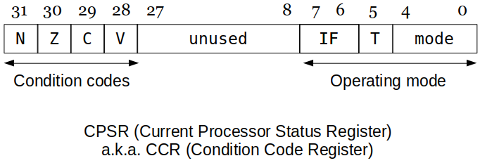
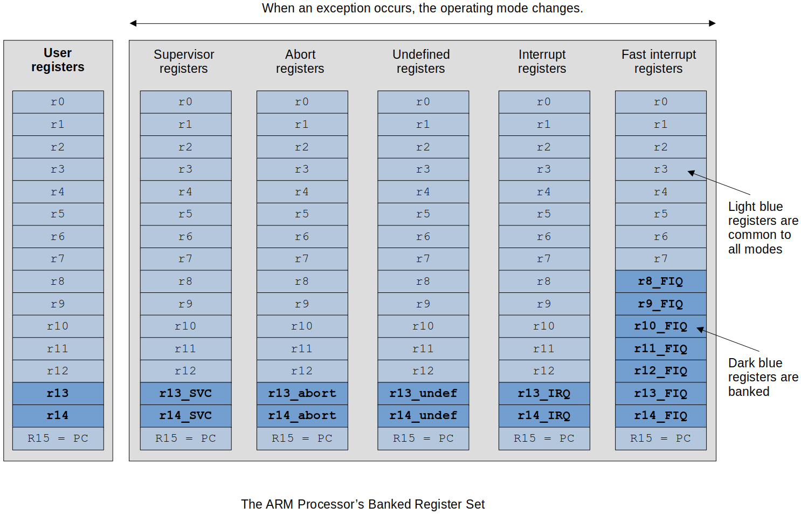

[Home](../../) | [Projects](../../projects) | [Notes](../) > <a href="./">Computer Architecture & Organization</a> > Privileged Mode and Exceptions

# Privileged Mode and Exceptions


## Interrupts and Exceptions

* **Interrupts** and **exceptions** work about the same way as follows:

  1. Interrupts or exception is raised.
  2. During the instruction Fetch the interrupt or exception is checked and processing is started.
      - Once the Execution starts, it cannot be interrupted. (atomic operation)
  3. Once the interrupt or exception process is complete, execution resumes right where it left off.

  Here's what happens during the **Fetch** without interrupt:

  ```plain
  1. [MAR] ← [PC]                       PC out to Memory Address Register to get ready to
                                        fetch the next instruction to be executed.
  
  2. [PC] ← [PC] + 4                    While fetching the instruction, increment PC by 4
                                        so PC points to the next instruction.
  
  3. [MBR] ← [[MAR]]                    Read the instruction from memory and store results
                                        into MBR.
  
  4. [IR] ← [MBR]                       Transfer the instruction to the instruction
                                        register and start decode process.
  ```

  Now, here's how the code will look like during the **Fetch** when interrupt is considered:

  ```plain
  ----------------------------------------------------------------------------------------
  IF INT = 1    THEN [[SP]] ← [PC]      If INT is asserted save the PC out to stack.
                     -------------
                     [MAR] ← [SP]       이 주소에다가
                     [MBR] ← [PC]       PC를
                     write              write!
  ELSE [MAR] ← [PC]                     ELSE Get ready to fetch the next instruction.
  ----------------------------------------------------------------------------------------
  IF INT = 1    THEN [SP] ← [SP] + 4    If INT is asserted, update the SP to the next
                                        free location.
  
  ELSE [PC] ← [PC] + 4                  ELSE Point to the next instruction.
  ----------------------------------------------------------------------------------------
  IF INT = 1    [PC] ← [INT Handler Starting Address]
                                        If INT is asserted, have the PC jump to the
                                        address of the interrupt handler.
  
  ELSE [MBR] ← [[MAR]]                  ELSE Read the instruction from memory and store
                                        results into MBR.
  ----------------------------------------------------------------------------------------
  IF INT = 1    THEN STATE ← FETCH      If INT is asserted, start the fetch process
                                        again.
  
  ELSE [IR] ← [MBR]                     ELSE Transfer the instruction to the instruction
       (Continue with Instruction       register and start decode process.
        Decode and Execute)
  ----------------------------------------------------------------------------------------
  
  [!] Note: Interrupt (INT) is essentially a piece of wire coming into the CPU.
  [!] Note: Once the INT is asserted it must stay on during the entire fetch cycle. That
  is the way a latch is used to capture and hold the interrupt signal. (Otherwise, INT
  line will fluctuate between `0` and `1` depending on the occurring interrupts.)
  ```

* Interrupts can happen any time, but not checked until Fetch.

* Followings are guaranteed so that interrupts are handled without any problems.

  ```plain
  INT Handler Starting Address: (entering the 'critical section')
  
  @ Disable all interrupts 
  @ Push all resigers (including CPSR a.k.a. CCR) onto the stack
  @ Enable interrupts (optional depending on the interrupt priority)
  @ - This is possible because the previous context have all been saved!
  @ - But unless you need to take care of multiple interrupts, you can disable all
  @   interrupts until the current one is completely handled.
  @ Start all the interrupt processing
  @
  @
  @ End of the interrupt processing
  @ Disable all interrupts
  @ - Because we don't want the register restoring process to be interrupted by other
  @   interrupts.
  @ Pop all registers off the stack
  @ Return back to the program where the interrupt has happened
  ```


## Current Program Status Register (See the "mode")





* [31-28] Condition Codes

  ```plain
  N         : Negative or less than flag
  Z         : Zero flag
  C         : Carry or borrow or extended flag
  V         : Overflow flag
  ```

* [27- 9] Reserved

* [ 8- 0] System Control Bits

  ```plain
  IF        : Enables or disables IRQ or FIQ interrupts
  T         : Thumb mode
  Mode      :
    M[4:0]  Mode                        ARM - Visible State Registers
    ------  --------------------------  --------------------------------------------
    b10000  User                        r0-r14, PC, CPSR
            (Normal user mode)
    ------  --------------------------  --------------------------------------------
    b10001  FIQ                         r0-r7, r8_fiq-r14_fiq, PC CPSR, SPSR_fiq
            (Fast Interrupt Request) 
    ------  --------------------------  --------------------------------------------
    b10010  IRQ                         r0-r12, r13_irq, r14_irq, PC CPSR, SPSR_irq
            (Interrupt Request)
    ------  --------------------------  --------------------------------------------
    b10011  Supervisor                  r0-r12, r13_svc, r14_svc, PC CPSR, SPSR_svc
            (Software Interrupt
             processing (SVC))
    ------  --------------------------  --------------------------------------------
    b10111  Abort                       r0-r12, r13_abt, r14_abt, PC, CPSR, SPSR_abt
            (Processing memory
             faults)
    ------  --------------------------  --------------------------------------------
    b11011  Undefined                   r0-r12, r13_und, r14_und, PC, CPSR, SPSR_und
            (Undefined instruction
             processing)
    ------  --------------------------  --------------------------------------------
    b11111  System                      r0-r14, PC, CPSR
            (Operating System)
    ------  --------------------------  --------------------------------------------
  ```

  [!] Note: So far, we have discussed only these 17 (including `CPSR`) registers that are visible to us in the **user mode**. In reality, however, ARM has total 32 registers (excluding `CPSR`) and the rest become visible as you switch to the different modes.

    - (16 user mode registers) + (2 + 2 + 2 + 2 + 8 banked registers) = 32 registers

  [!] Note: ARM designers decided to maintain another set of registers to make context switching more efficient by reducing the push/pop of all the registers to/from the stack.

  Instead of having to push and pop all 16 registers every time there is an interrupt or mode change. 

    - e.g., In SVC mode, it's got its own playground (`r13_SVC`, `r14_SVC`) to handle its interrupt without messing other registers.     
      $$\therefore$$ No need to store all 16 registers when entering this Interrupt Service Routine (ISR).
    - This helps interrupts handled much faster since there's no need to push things onto the stack which is located in the main memory. (Access to main memory is orders of magnitude SLOWER.)

  In the OS there are unique registers that are only available in that specific mode.





## Specific ARM Exception Handling Sequence

1. The operating mode is changed to the mode corresponding to the exception.
   - e.g., An interrupt request would select `IRQ` mode.
2. The address of the instruction following the point at which the exception occurred is copied into register `r14 (lr)`.
    - In other words, the exception is treated as a type of subroutine call and the return address is preserved in the link register.
3. The current value of the `CPSR` is saved in the `SPSR` of the new mode.
   - e.g., If the exception is an interrupt request, `CPSR` gets saved in `SPSR_irq`.
   - It is necessary to save the current processor status because an exception must not be allowed to modify the processor status.
4. Interrupt requests are disabled by setting bit `7` of the `CPSR`.
   - If the current exception is a fast interrupt request, further `FIQ` exceptions are disabled by setting bit 6 of the `CPSR`.
5. Each location in the exception table contains an instruction that is executed first in the exception handling routine.
    - This instruction is normally a branch operation (for example `B myHandler`)
    - This would load the program counter with the address of the corresponding current exception handler.

* Following table defines the memory locations accessed by the ARM processor's exceptions.   

  Each memory location contains the first instruction of the appropriate exception handlers; this implies that this table should be in read-only memory.

  ```plain
  Exception                                         Mode        Vector Address
  ================================================  ==========  ==============
  Reset                                             SVC         0x00000000
  Undefined instruction                             UND         0x00000004
  Software interrupt (SWI)                          SVC         0x00000008
  Prefetch abort (instruction fetch memory fault)   Abort       0x0000000C
  Data abort (data access memory fault)             Abort       0x00000010
  IRQ (normal interrupt)                            IRQ         0x00000018
  FIQ (fast interrupt)                              FIQ         0x0000001C
  ```


## Returning From an Exception

* After the exception has been dealt with by a suitable handler, it is necessary to return to the point at which the exception was called (if the exception was fatal, a return is no longer possible.

* In order to return from an exception, the information that defines the pre-exception mode must be restored;

    - `PC` $$-$$ We only have 1 `PC`, so it has got to be restored
    - `CPSR` $$-$$ Must be changed back to the "User mode"
      - There are 2 `CPSR`s in ARM. When entering the ISR, `CPSR` gets copied into the auxiliary `CPSR`, and when returning back to the user mode, `CPSR` gets overwritten by the contents of the auxiliary `CPSR`.
      - This takes two instructions to do! (see the following issue)

* Returning from an exception is not as trivial a matter as it might seem. If you restore the `PC` first, you are still in the exception-handling mode since the `CPSR` hasn't been restored back to the user mode yet. On the other hand, if you restore the `CPSR`
  first, you are no longer within the exception-handling routine and there is no way in which you can restore the `PC` and stuff.

* You can't use a *normal* sequence of operations to return from an exception because it involves a change of operating mode.    
  So, the ARM peope tweaked an existing instruction a little bit to create a special instruction that can restore both `PC` and `CPSR` at the same time:

  2 exception return mechanisms are provided to solve this issue in one instruction.

    - Mechanism 1 $$-$$ The return address has been stored in the banked `r14`.
    - Mechanism 2 $$-$$ The return address has been pushed onto the stack.

  Moreover, the return mechanism depends on the type of exception being handled.

  If you are returning from an exception where the return address is in the `link register`, you can execute instructions described in the following table:

  ```plain
  ARM Return from Exception Operations
  
  Exception type                                Instruction to return to user mode
  ============================================  ==========================================
  SWI, undefined instruction                    MOVS pc, r14
                                                   - --
                                                     as long as the PC is listed first it 
                                                     knows
                                                     1) PC has to be restored AND
                                                     2) CPSR mode has to be restored back
                                                        to user mode
  IRQ, FIQ                                      SUBS pc, r14, #4
  Data abort to repeat the faulted instruction  SUBS pc, r14, #8
  ```

  `MOVS` and `SUBS` are special versions of the normal instructions used when the destination register is the `PC`. You have to modify the value of the `PC` when returning from an `IRQ`, `FIQ`, or a `data abort`.

    - In the case of `IRQ`, the `PC` has to be wound back by $$4$$.
      - This is because of the pipelining. By the time the interrupt was checked and the `PC` was saved onto the stack, the `PC` has already been updated once. (more to come later) 
    - In the case of `FIQ`, the `PC` has to be wound back by $$8$$ in order to repeat the instruction that was faulted.
        - Again because of the pipelining. `PC` already updated to the next next instruction was saved onto the stack.

  If the exception handler has copied the return address onto the *stack*, you have to use a different mechanism.

  Under normal circumstances, you would return from a subroutine with a stacked `PC` by means of an instruction such as

  ```plain
  LDMFD r13!, {r0-r4, PC}   @ or POP {r0-r4, PC}
                            @ r0-r4 is the list of registers to be restored.
  ```

  If you wish to pop the saved registers and restore the `CPSR` at the same time, you have to use the special version of this instruction:

  ```plain
  LDMFD r13!, {r0-r4, PC}^  @ restore r0 through r4
                            @ return and restore CPSR
  @ or
  POP {r0-r4, PC}^          @ this needs to be verified on the Raspberry Pi
  ```

  The `^` symbol after the register list indicates that the `CPSR` is to be restored at the same time the `PC` is restored.

  > The program counter was not modified at the point at which it was restored. You have to modify the `PC` before you stack it!
