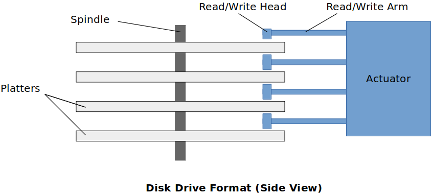

[Home](../../) | [Projects](../../projects) | [Notes](../) > <a href="./">Computer Architecture & Organization</a> > Secondary Storage

# Secondary Storage

## Disk Drive

### Disk Drive Format (Side View)

Read/Write Head is electro-magnetic. This is how the read/write head reads/writes from/to the platter.

### Disk Drive Format (Diagonal View)

* **Sector**
  * The smallest unit of data that can be read from or written to the (magnetic or optical) disk
* **Cluster**
  * A group of sectors within a disk and is the grouping by which disk files are organized
  * Most files fill many cluster of disk space

* **Track**
  * The path followed by the read/write head
  * Tracks are concentric circles
* **Cylinder**
  * All tracks that are currently accessed

All the platters (disks) are running at the same rate (angular velocity).

Edge of the platter runs faster than anywhere towards the center.

Compared to the running speed of platters, read/write arm movement is significantly slow. So it will be more efficient when the read/write head can do its job with minimum number of movements to the different cylinder.

Due to all the physical components, disk drives are vulnerable to shock and dirts.