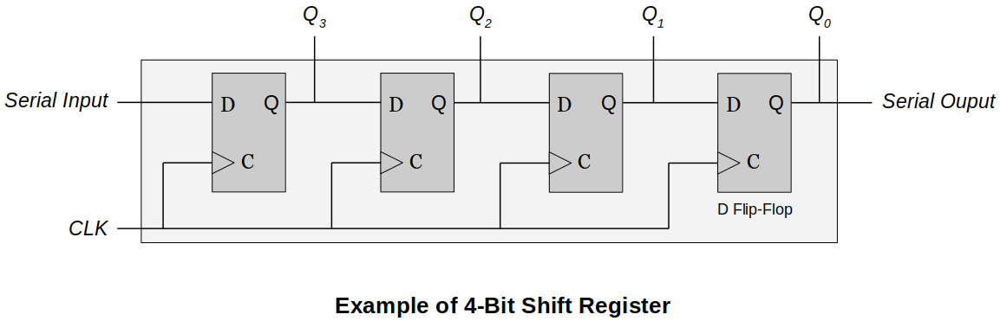
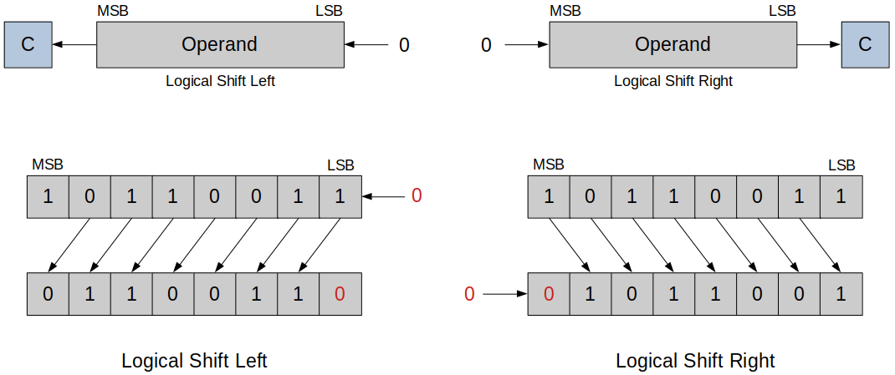

[Home](../../) | [Projects](../../projects) | [Notes](../) > <a href="./">Computer Architecture & Organization</a> > Sequential Circuits

# Sequential Circuits

## Combinational Circuits vs. Sequential Circuits

* **Combinational circuits** 
  - Outputs determined ONLY by its *input(s)*.
* **Sequential circuits**
  - Outputs determined by its *input(s)* and its *previous state*.
  - Basically a combinational circuit combined with a memory element. Memory element could be:
      - *Latches* - clock (X), therefore *asynchronous*
      - *Flip-flops* - clock (O), therefore *synchronous*

## SR Latch (NOR)

* An **SR latch** (Set/Reset) is an asynchronous device.
* Relies only on the state of the S and R inputs.
* Following is an SR latch created with two NOR gates that have a cross-feedback loop.    
    - Can also be made from NAND gates, but the inputs are swapped and negated.

## Clocked SR Flip-Flop (AND-NOR)

* An **SR flip-flop** is a synchronous device.
* Following SR filp-flop is built from a pair of AND gates added to a basic SR latch made from NOR gates.
* Analysis
  - When (clock) signal stays `0`, the flip-flop maintains the previous state. (∵ Two AND gates are disabled.)
  - When C stays `1`, the filp-flop behaves like the standard SR latch.

## D (Data) Flip-Flop

* Why can't we just tell it what we want to store and not worry about S and R values? (So, we have D flop-flop!)
* Analysis
  - The **D flip-flop** captures the value of the D-input at a definite portion of the clock cycle (such as the rising edge of the clock). That captured value becomes the Q-output.
  - At other times, the output-Q maintains the previous value.

## Registers

* A **register** is a group of flip-flops which share a common clock.
  - An $n$-bit register is made from $n$ flip-flops. (Capable of storing $n$-bits of information.) 
  - May have additional logic to allow for other functions.

### 4-Bit Register with Parallel Load

* When `Load = 1`
  - The lower of the each AND gate pair will be enabled, and the upper AND gates will be disabled.
  - The values `I0 ~ I3` will then be stored into the flip-flops at a definite portion of the clock cycle (such as the rising edge of the clock.)
* When `Load = 0`
  - The upper of the each AND gate pair will be enabled, and the lower AND gates will be disabled.
  - The values stored in each D filp-flop will remain unchanged due to the feedback loop.

### 4-Bit Register with Parallel Load (Improved Design with Fewer Gates)

* How you can keep the D flip-flops from changing the values when you don't want them to change with fewer gates?
    - Introduce an AND gate into the clock path!

### Shift Registers

* A **shift register** moves the bits stored in it one or more positions to the right or left.
    - Moving to the right divides the binary number by 2.
    - Moving to the left multiplies the binary number by 2.

* In the following example, four clock cycle will be required to completely load a 4-bit data. 
* **Logical shift**
  - Logical Shift Left 
    - Each bit is shifted towards left, MSB is discarded and LSB becomes 0.
  - Logical Shift Right 
    - Each bit is shifted towards right, LSB is discarded and MSB becomes 0.

* **Arithmetic shift**
  - Arithmetic Shift Left 
    - Each bit is shifted towards left, MSB is discarded and LSB becomes 0. (Similar to logical shift)
        - In this example, the operation has overflowed. Meaning, the result of the multiplication is larger than the largest possible value.
  - Arithmetic Shift Right 
    - Each bit is shifted towards right, LSB is discarded and MSB is preserved.

* **Circular shift**
  - The bit that would be lost is moved into the register.

## Applications of Shift Registers

### Serial Transfer from One Register to Another

* Following example demonstrates a serial transfer of a 4-bit data from one register to another.
    - It will take exactly four clock cycles for the contents stored in *A* to be completely transferred to *B*.
    - When shift control is high, at each clock pulse, one bit at a time is copied from *A* to *B*.
    - The feedback formed by *SOA* and *SIA* helps *A* retain its value after the completion of the data transfer.
* This circuit is easy to build and cheap, but not fast.

### Serial Adder

* Following example demonstrates `A = A + B` operation where the sum of `A` and `B` gets stored into `A`. (`A`'s original value is overwritten.)
    - D flip-flop holds the carry of the previous sum and when an appropriate clock cycle hits this carry will be transferred into the full adder to be added with new `x` and `y`.

* One problem with this circuit is that `B` won't retain its value after the operation, which is far from how modern computer systems handle this.
    - Some improvements can be made to make this circuit more functional.
      - Make *Shift Register B* a circular shift register so that it retains its original value after the operation.
      - Add another register so that the circuit performs `C = A + B`.
