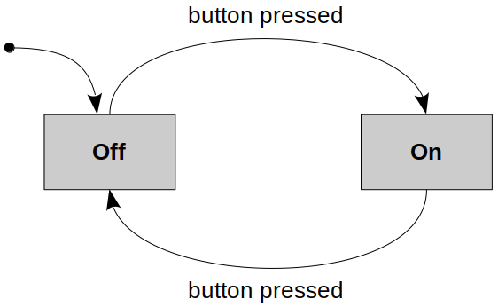
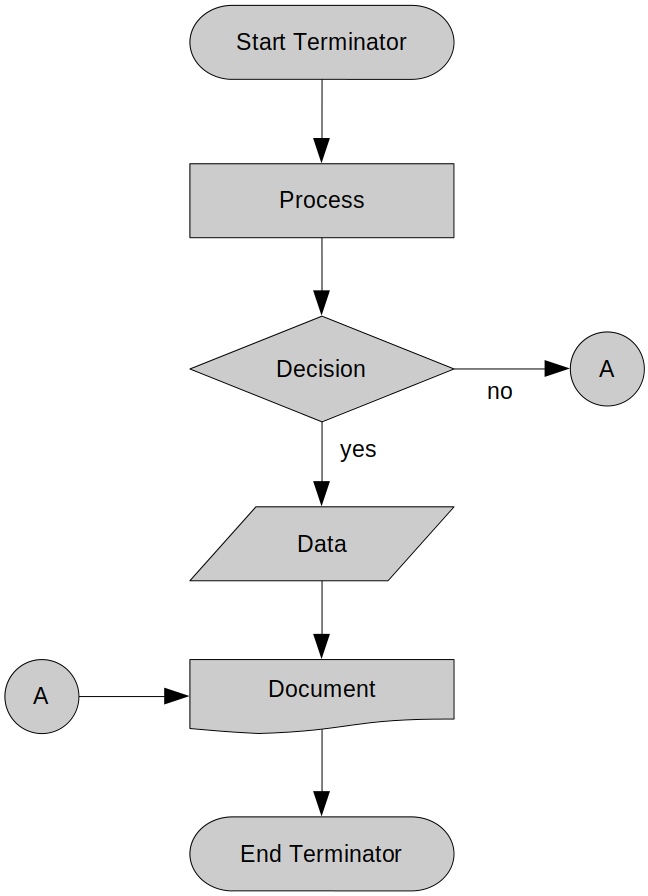

[Home](../../) | [Projects](../../projects) | [Notes](../) > <a href="./">Computer Architecture & Organization</a> > State Machine & Flow Chart

# State Machine & Flow Chart

## State Machine

* A **state machine** is a behavior model. It consists of a finite number of states and is therefore also called finite-state machine (FSM).
  * Based on the current state and a given input the machine performs state transitions and produces outputs.
  * At any instant, a system may be in one of several possible states.
  * In a digital world, a change from one state to another occurs when an *event* (such as a clock pulse) takes place.

* Example:

  

## Flow Chart

* A **flow chart** is a type of diagram that represents a work-flow or process.

* Different flow chart symbols have different meanings. The most common flow char symbols are:
    - **Terminator**: An oval flow chart shape indicating the start or end of the process.
    - **Process**: A rectangular flow chart shape indicating a normal process flow step.
    - **Decision**: A diamond flow chart shape indication a branch in the process flow.
    - **Connector**: A small, labeled, circular flow chart shape used to indicate a jump in the process flow. (Shown as the circle with the letter "A", in the diagram aobve.)
    - **Data**: A parallelogram that indicates data input or output (I/O) for a process.
    - **Document**: Used to indicate a document or report.
