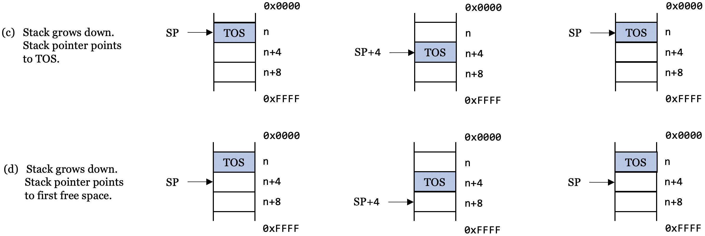

[Home](../../) | [Projects](../../projects) | [Notes](../) > <a href="./">Computer Architecture & Organization</a> > Cache Memory

# Cache Memory


## Passing Arguments to a Function

* In higher level languages, there are a couple of concepts in regards to passing arguments to a function, returning values from a function. (e.g., Pass by value, pass by reference) However, at assembly language level (low level), there's no such concepts. The programmer has to keep track of the parameters that are passed between the routines.

* Passing of arguments can be done several different ways in assembly:

  - Just have **global variables** defined in the data section and the subroutine has direct access to them.
  - The data is put in specific **registers** in the calling routine and the subroutine knows which registers contain what it needs to work on.
      - e.g., With the `printf` `r0` contains the address of the string and `r1` `r2`, `r3` contain any data that may be printed with proper format specifiers such as `%d`, `%c`, etc.
  - The data is pushed onto the **stack** by the calling routine and the subroutine knows what order they are pushed so they can pop and do the operations.

* Returning data can be done in the same way:

  - Using **global variables**
  - Using **registers**
  - Using **stack**

* Pick a method and stick with it.

  - Or adopt the C convention with using registers `r0` - `r3` to pass to the function and return values via `r0`.

  - In C, only the first 4 arguments are passed via registers, and anything beyond that are passed via the stack. Passing arguments via registers is the fastest way. Using stack is much slower process since it involves memory access.

    ```plain
    func(w, x, y, z, a, b, c)
         ----------  -------
      via registers  via stack
    ```

  - To make the code run faster, make sure to define all functions to have 4 or less parameters.

      - One solution is passing *structures* instead of individual variables but passing structures still fall under the 4-parameter-rule.


## Subroutine Call and Return 

* Non-ARM, CISC Example:
  Typically, **stack** is used to keep track of the important information associated with the subroutine call and return. (Push the return address (PC) onto the stack before entering the subroutine, pop the return address from the stack and store it back to PC to return to where it was.

  ```plain
  Situation: The instruction BSR Proc_A calls subroutine Proc_A.
  
  The processor saves the address of the next instruction to be executed in a safe place,
  and loads the program counter with the address of the first instruction in the
  subroutine.
  
  At the end of the subroutine, a return from subroutine instruction (RTS) causes the
  processor to return to the point immediately following the subroutine call.
  
  CISC processors typically use a stack to support calls to and returns from subroutines.
  ```

  Code:

  ```plain
  BSR   Proc_A  @ saves the address of the next instruction to be executed (PC) in the 
                @ stack (this is what 'bl' in ARM assembly does)
  ...
  
  Proc_A        
  
  ...
  
  RTS           @ end of the subroutine; return (restores the PC from the stack)^
  ```

* RISC proessors do not go that far with their support. In some cases, they offer none.
  - In ARM, there is the `BL` instruction which is used for the call to the subroutine. However, there is no return from subroutine instruction for the ARM. Therefore, calling `BL` again inside the subroutine will overwrite the link register (LR) which holds the previous return address. Problem!!!

### ARM Support for Subroutines

* ARM processors do not provide a fully automatic subroutine call/return mechanism like CISC processors do.

* ARM's branch with link instruction, `BL`, automatically saves the return address in register `r14` which is also called the link register.

* The branch with link instruction behaves like the corresponding branch instruction but also copies the return address (i.e., address of the next instruction to be executed following a return) into the link register `r14`.

  ```plain
  BL Sub_A      @ Branch to "Sub_A" with link
                @ Save return address in r14
                @ RTL: [r14] ← [PC]
  ```

  > Here, the ARM executes a branch to the target address specified by the label Sub_A. It also copies the program counter held in register `r15` into the link register `r14` to preserve the return address.
  >
  > At the end of the subroutine, it returns by transferring the return address in `r14` to the program counter:

  ```plain
  MOV pc, lr    @ MOV r15, r14
  ```

* To evaluate `if x > 0 then x = 16x+1, else x = 32x` several times in a program (assuming that. `x` is in `r0`; meaning passing the value of `x` via `r0`):

  ```plain
  Func1:
    CMP     r0, #0          @ Test for x > 0
    MOVGT   r0, r0, LSL #4  @ If x > 0 then x = 16x
    ADDGT   r0, r0, #1      @ If x > 0 then x = 16x + 1
    MOVLT   r0, r0, LSL $5  @ Else if x < 0 then x = 32x
    MOV     pc, lr          @ Return by restoring saved PC
  
    @ Application of the subroutine
    LDR     r0, [r4]        @ Get P
    BL      Func1           @ P = (if P > 0 then 16P + 1 else 32P) ; first call
                            @   BL automatically does [lr] ← [PC] here
    STR     r0, [r4]        @ Save P
  
    LDR     r0, [r5, #20]   @ Get Q
    BL      Func1           @ Q = (if Q > 0 then 16Q + 1 else 32Q) ; second call
                            @   BL automatically does [lr] ← [PC] here
    STR     r0, [r5, #20]   @ Save P
  ```

  > Imagine how the code would have looked like if ARM did not support the subroutine call.
  >
  > If there is another BL call in a subroutine, then the linked register `r14` will be overwritten. Will show the fix later.

### Conditional Subroutine Calls

* The branch with link can be conditionally executed:

  ```plain
  CMP   r9, r4
  BLLT  ABC         @ Branch to ABC if [r9] < [r4]
  ```

  > If there is another BL call in a subroutine, then the linked register `r14` will be overwritten. Will show the fix later.


## Subroutines and the Stack

* The stack is a last in first out (LIFO) data structure.

* The queue is a first in first out (FIFO) data structure.

* Inside a CPU is the **stack** and the **queue** that are implemented with *shift registers*. However, these are limited in size.

* Stacks in microprocessors are implemented by using a stack pointer to point to the top of the stack in main memory.

* Possible stack structures:
  
  
  
  
  
  
  > `TOS` stands for "top of stack" (the element at the top of the stack). By convention, up refers to the top of the page and lower address. This can be confusing.
  >
  > These diagrams assume byte-addressed memory and that each element on the stack is 32 bits (4 bytes).
  >
  > Just know that the stak can be implemented in different ways. When programming, don't worry about it and just use `PUSH/POP`.
  
* An important application of the stack is to save return addresses after a subroutine call.
  
    - CISC processors maintain the stack automatically.
    - RISC processors force the programmer to maintain the stack.
      - If there are nested subroutine calls, it is the programmer's responsibility to make sure that each subroutine's return address (the value stored in the linked register `r14`) is pushed onto the stack. Otherwise, a subroutine's return address will be overwritten by the subsequent subroutine's return address.

### Leaf Routines

* A leaf routine does not call another routine. It is at the end of the tree. If you call a leaf routine with `BL`, the return address is saved in the linked register `r14`. A return to the calling point is made with:
  
  ```plain
  MOV pc, lr        @ Not necessary to use stack since there is no more sutroutine.
  ```
  
* If the routine is not a leaf routine, you cannot call another routine without first saving the link register. 
  
  ```plain
    BL  XYZ           @ Call a simple leaf routine
    ...
    BL  XYZ1          @ Call a routine that calls a nested routine
    ...
  
  XYZ:
    @ Code (This is the leaf routine)
    ...
    MOV pc, lr        @ Copy link register into PC and return
  
  XYZ1:
    PUSH {r0-r4, lr}  @ Save working registers and link register
                      @ r0-r4 may be parameters of a routine
    ...
    BL  XYZ           @ Call XYZ; Overwrites the old link register
    ...
    POP {r0-r4, pc}   @ Restore registers and force a return
  ```
  
  > Subroutine `XYZ` is a leaf subroutine that does not call a nested subroutine and, therefore, we don't have to worry about the link register, and we can return by executing `MOV pc, lr`.
  >
  > Subroutine `XYZ1` contains a call to a nested subroutine and we have to save the link register in order to return from `XYZ1`.
  >
  > The simplest way of saving the link register is to push it on the stack. In this case we use a 'store multiple registers' instruction and also save registers `r0` to `r4`.
  >
  > When returning from `XYZ1`, we restore the registers and load the saved `r14` (the return address in the link register) into the program counter.


## Laod and Store Multiple Registers to / from Stack

* When subroutines use the same registers you are using there will be a problem. The ARM has two instructions which makes saving and restoring registers very quick and easy.
  ```plain
  LDMcdum   reg!, mreg      @ cd: condition code, um: update mode
  STMcdum   reg!, mreg
  
  @ IA increment starting from reg
  @ IB increment starting from reg + 4
  @ DA decrement starting from reg
  @ DB decrement starting from reg - 4
  ```
  
    The important thing is to be consistent in how you use it and DO NOT mix them up.
  
  ```plain
  @ Following can be used to copy data stored in multiple locations in memory to somewhere
  else.
  STMDB sp!, {r0-r5}    @ Stack pointer (sp) contains the starting address
  LDMIA sp!, {r0-r5}
  ```
  
  The GNU assembler does allow for pseudo-instructions for `push` and `pop` so you do not have to remember which update mode to use.
  
  ```plain
  PUSH {r1, r2, r3}
  POP  {r1, r2, r3}
  @ Both allow for cd (conditional execution)
  ```
  
  On the Raspberry Pi this is the simplest thing to use. More examples:
  
  ```plain
  PUSH {r0, r4-r7}
  PUSH {r2, lr}
  POP  {r0, r10, pc}
  ```

* In programs, the `PUSH` and `POP` should always match.

  ```plain
  PUSH {r0-r3, r10}
  ...
  POP  {r0-r3, r10}
  ```
