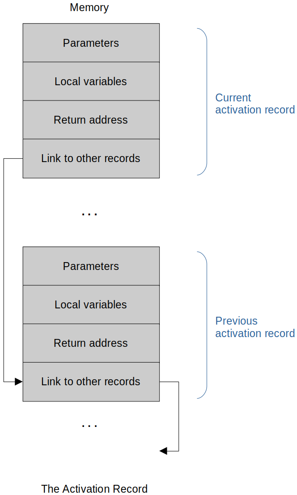
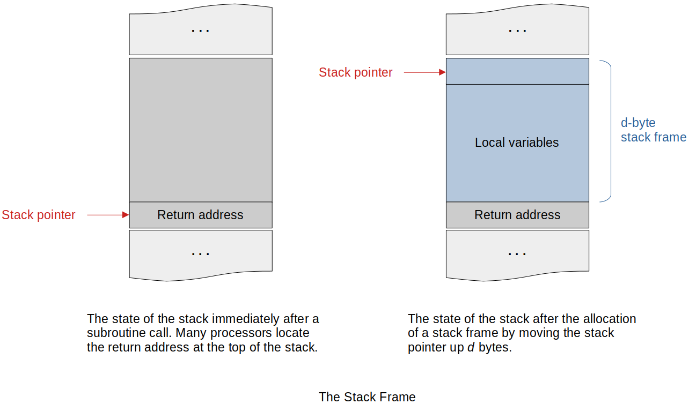
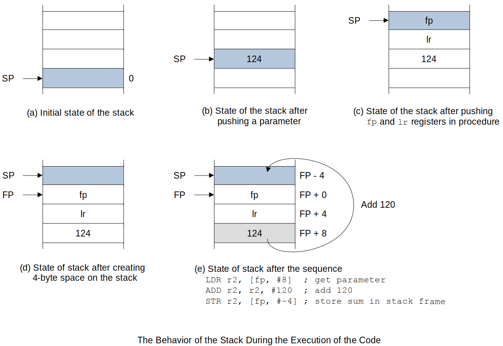

[Home](../../) | [Projects](../../projects) | [Notes](../) > <a href="./">Computer Architecture & Organization</a> > The Stack & Data Storage

# The Stack & Data Storage


## The Stack & Data Storage

These are **High Order Language (HOL)** constructions that are discussed in the programming class and the *Programming Languages* course. The CPU hardware, ISA and OS needs to support these constructs.

> Assembly programmers are not directly related.

* **Binding**

  Binding is an association of a variable name with a storage location. This can be a register or main memory location. Binding can happen as soon as compile-time and as late as run-time. Other times binding can happen - link time, program load time, any various times during the code execution.

    - **Static allocation** is when binding happens at compile-time. 
      e.g., In C/C++

      ```plain
      const double pi = 3.14159;
      const double sqrroot2 = 1.4142;
      ```

      These variables do NOT change. The compiler can allocate and initialize a memory location.

    - **Dynamic allocation** is when binding happens at run-time.
      e.g., In C/C++

      ```plain
      ptr = (int*)malloc(100 * sizeof(int));
      ```

      Compiler does not know how much memory to allocate or what values it will take on. It has to defer to the OS to do this ar run-time.

* **Scope**

  Scope defines the range of the variable's visibility or accessibility within a program. In assembly, you have access to all registers, everything you have defined in the `.data` section at all times so the concept of scope doesn't apply.

  ```c
  int main(int argc, char *argv[])
  {
      {
          int x = 20, y = 30;
          {
              printf("x = %d, y = %d\n", x, y);
              {
                  int y = 40;
  
                  x++;
                  y++;
  
                  printf("x = %d, y = %d\n", x, y);
              }
  
              printf("x = %d, y = %d\n", x, y);
          }
      }
  
      return 0;
  }
  ```

  ```text
  x = 20, y = 30
  x = 21, y = 41
  x = 21, y = 30
  ```

* **Lifetime**

  As programs run variables will come into existence, be used for a while and go away. The memory can be reallocated to new variables as the program executes. "*Memory leaks*" happen when memory that is no longer required is not released properly. Too many memory leaks leads to not having enough memory to run the program efficiently. The CPU and OS has to assume you need that memory and manages it that way.

  COBOL and FORTRAN requires only static allocations and bindings happen at compile-time. Because of this these programming languages do not allow recursion. Programmers can work around this but have to keep track of all that stuff themselves.

### What Does All This Mean To The Hardware?

* Needs to support a stack
  - Can be just a stack pointer (SP) register or a specialized piece of hardware.
  - Also need to have instructions to handle the stack (`push` and `pop`).
* Addressing modes need to support pointer-type addressing.

### Activation Record

* **Activation Record** - used for languages that uses dynamic data storage - is a data structure that contains all the information necessary to execute a procedure (function). This allocation is done at runtime. 

  > This has to do with HOL. This is not applicable when it comes to the ARM assembly programming since you know where everything is.

* Activation record is also called a **frame**.

  - In *Operating Systems* this is "like" the *Process Control Block*.

* Activation record contains:

  - Parameters (passed values)
  - Local variables
  - Return address
  - Link to other records





* Required memory allocation (storage) is done at runtime.
* When the procedure (function) is no longer needed, the memory is freed-up for the next activation record.
* This is happening on **virtual memory** which is a pure software.   
  - But, the hardware needs to support the implementation of the construct to make this more efficient.
* **Stack Pointer**
  - Always points to the top of the stack and is not affected when activation records are created or freed.
* **Frame Pointer**
  - Specific to a created frame (activation record) and point to the address of the base of the current stack frame.
  - This imples that any memory references within the activation record are all offsets to the frame pointer.
  - ARM resiger `r11` is used for the Frame Poiner. (Can also put `fp` instead and the assembler will know that it is `r11`)

### The Stack Frame and Local Variables

* Procedures (functions) have to have a **local workspace** to store the passed arguments or local variables to do its job.

    - It is allocated to the precedure (function) when it runs and freed-up (returned back to the OS for later use) when it stops running.
    - "Local" means that the workspace is private to the procedure and is never accessed by the calling program or by other functions.

* If a procedure is to be made **reentrant** (multiple invocations can run safely concurrently) or used **recursively** (the function calls itself), its local variables must be bound up not only with the procedure itself, but with the occasion of its use.

    - If there is no issue while jumping to the interrupt handler and coming back to where it was, we refer to that procedure as "reentrant".
    - In general, recursion is avoided in embedded systems since it uses a lot of memories to create stack frames.

* Two concepts associated with dynamic storage techniques:

  - **Stack Frame**

    Temporary storage allocated at the top of the current stack. The stack frame generally includes the following components:

      - Argument variables passed onto the stack (any arguments that were not passed by the registers?)
      - Local variables (in High Order Languages)
      - Saved copies of any registers modified by the subprogram that need to be restored (e.g., `$s0`-`$s8` in `MAL`).
      - The return address

    Since the stack frame for a given subprogram has a fixed size, we can reduce the number of instructions required to push and pop it by only updating the stack pointer once. Instead of individual pushes and pops, we can use offset addressing.

  - **Frame Pointer**

    Points to the bottom of the stack frame or the old Stack Pointer before the allocation for the new stack frame. This allows the Stack Pointer and Frame Pointer to operate independent of each other so that changing one does not change the other.

    The stack pointer will change when a subprogram does a push or pop operation. Many subprograms do this during calculations for convenience, or to implement algorithms that use a stack. 

    When this happens, the offset addresses representing local automatic variables such as 4(`$sp`) are no longer valid. The offsets are computed by the compiler, and hard-coded as offset-mode operands in the instructions, so they cannot be easily changed while the program is running.

    One way to alleviate this problem is by using the *frame pointer*. The frame pointer is another register that we set to the address of the stack frame when a subprogram begins executing. If the code refers to local variables as offsets from the frame pointer instead of offsets from the stack pointer, then the program can use the stack pointer without complicating access to auto variables. We would then refer to something in the stack frame as offset (`$fp`) instead of offset (`$sp`).

* *Register Indirect Addressing with Offset* can be used to access the local variables in the Stack Frame.

* **d-byte stack** is used for the procedure's local variables.





* Because the stack grows towards the low end of memory, the stack pointer is decremented to create a stack frame.

    - e.g., Reserving `100` bytes of memory is achieved by:

      ```plain
      SUB r13, r13, #100    @ move the stack pointer up 100 bytes
      ```

      Before a return from subroutine is made, the stack-frame is collapsed by restoring the stack pointer with

      ```plain
      ADD r13, r13, #100
      ```

* In general, operations on the stack are *balanced*; that is, if you put something on the stack frame you have to remove it.

    - IF this does not happen your program more than likely will break.

* Consider the following simple example of a procedure.

  ```plain
  Proc:
      SUB r13, r13, #16     @ move the stack pointer up 16 bytes 
      ...
      STR r1, [r13, #8]     @ store something in the frame 8 bytes below TOS
      ...
      ADD r13, r13, #16     @ adios stack frame
      MOV pc, r14           @ exit subroutine, restore the PC to return
  ```

* Temporary variables on a stack frame can be accessed using the stack pointer.

* CISCs maintain a hardware SP that is automatically adjuted when a `BSR` or `RTS` is executed.

* RISC (e.g., ARM) uses a register `r13` (they have plenty) as the programmer maintained stack pointer by convention.

* The stack pointer always points to the top of the stack for the ARM (the last item pushed on the stack or the next item to be popped off the stack.

* The frame pointer points to the base of the current stack frame.

* The stack pointer may change during the execution of the procedure, but the frame
  pointer will not change.

    - Data in the stack frame may be accessed with respect to either the stack pointer or the frame pointer.
    - By convention, `r11` is used as a frame pointer in ARM environements and `A6` in 68K environments.

### Example of an ARM Processor Stack Frame

* An example ARM code that shows how to setup and manage the Stack Frame.

  ```plain
  AREA TestProg, Code, READONLY
      ENTRY     ; This is the calling environement
                ; subroutine code is not shown in this example
                ; dummy values are used in tracing the code
  
  Main  ADR     sp, Stack       ; set up r13 as the stack pointer
        MOV     r0, #124        ; set up a dummy parameter in r0
        MOV     fp, #123        ; set up dummy frame pointer
        STR     r0, [sp, #-4]   ; retrieve the data
  Loop  B       Loop            ; wait here (endless loop)
  Sub   STMFD   sp!, {fp, lr}   ; push frame-pointer and link-register
        MOV     fp, sp          ; frame pointer at the bottom of the frmae
        SUB     sp, sp, #4      ; create the stack frame (one word)
        LDR     r2, [fp, #8]    ; get the pushed parameter (effective addr = fp + offset)
        ADD     r2, r2, #120    ; do a dummy operation on the parameter
        STR     r2, [fp, #-4]   ; store it in the stack frame
        ADD     sp, sp, #4      ; clean up the stack frame
        LDMFD   sp!, {fp, pc}   ; restore frame pointer and return
  
        DCD     0x0000          ; clear memory
        DCD     0x0000          ; clear memory
        DCD     0x0000          ; clear memory
        DCD     0x0000          ; clear memory
  Stack DCD     0x0000          ; start of the stack
  
  END
  ```

  On the Raspberry Pi, use `PUSH` and `POP` instead of `STMFD` or `LDMFD` instructions. (Load/Store multiple registers)



