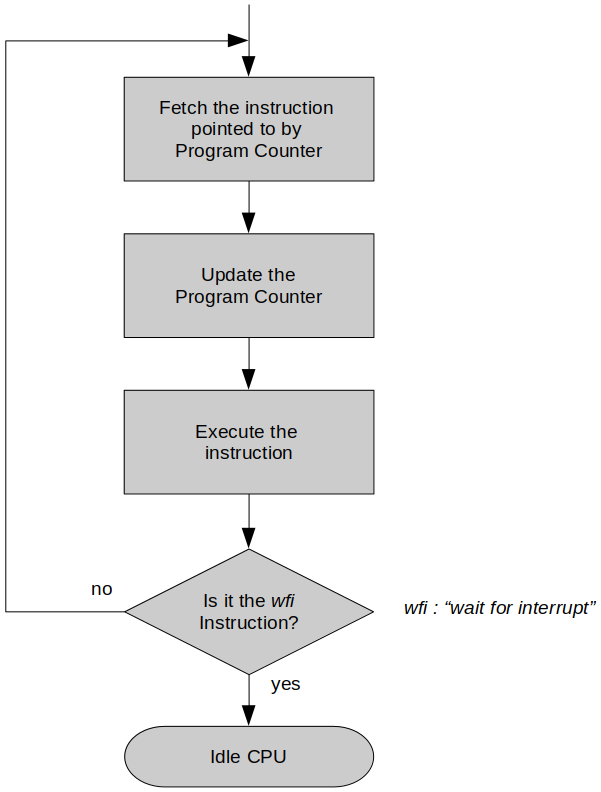

[Home](../../) | [Projects](../../projects) | [Notes](../) > <a href="./">Computer Architecture & Organization</a> > The Stored Program Computer

# The Stored Program Computer

## Stored Program Computer

* A **stored program computer** is a computer that stores instructions in its memory to enable it to perform a variety of tasks in sequence or intermittently.
    - Previous computers had their program instructions determined by the wiring of the machine or by holes on punched tape.
* The idea was introduced in the late 1940's by *John von Neumann*, who proposed that a program be electronically stored in binary-number format in a memory device so that instructions could be modified by the computer as determined by intermediate computational results.

## Program Execution Cycle

* Program execution sequence:

  1. A sequence of instructions is stored in memory.
  2. The memory address where the first instruction is located is copied to the program counter.
  3. The CPU sends the address in the program counter to memory via the address bus.
  4. Memory responds by sending a copy of the state of the bits at that memory location on the data bus, which the CPU then copies into its instruction register.
  5. The instruction pointer is automatically incremented to contain the address of the next instruction in memory.
  6. The CPU executes the instruction in the instruction register.
  7. Go to Step 3.

  [!] Note: Steps 3, 4 and 5 are called an *instruction fetch*. Steps 3 - 7 make up a cycle, the *instruction execution cycle*.

## RTL (Register Transfer Language) Notation

* **RTL** is not a computer language; it is a *notation* used to define computer operations.

* Distinguish between a memory *location* and its *contents*!  

  - Square brackets [ ] are used to indicate the *contents* of a memory location.   

    e.g., `[10] = Max_Run` 
    :Memory location `10` contains the value of `Max_Run`.   

  - Backward arrow symbol (←) and assignment symbol (=) indicate a *data transfer*.

    e.g., `[10] ← [10] + 1` (or `[10] = [10] + 1`) 
    :Take the contents of memory location `10`, add `1` to it and store the result back to memory location `10`.

## Effective (Absolute or Real) Address

* The memory location that is being accessed.

## Terminology Recap

* **Constant**
  - A value that does not change during the execution of a program. (`2` and `π` in `c = 2πr` are constants.)
* **Variable**
  - A value that can change during the execution of a program. (`c` and `r` in `c = 2πr` are variables.)
* **Symbolic Name**
  - Name of variable or constant that makes it easier for programmers to remember and to understand. (`π` is the symbolic name for the irrational number `3.1415926`.)
  - When a program is compiled into machine code, symbolic names are replaced by actual values.
* **Address**
  - Information in a computer is stored in memory locations and each location has a unique address.
  - To make it easier for to remember the actual address locations in memory, we give addresses symbolic names.
* **Pointer**
  - A variable whose value is an address.
