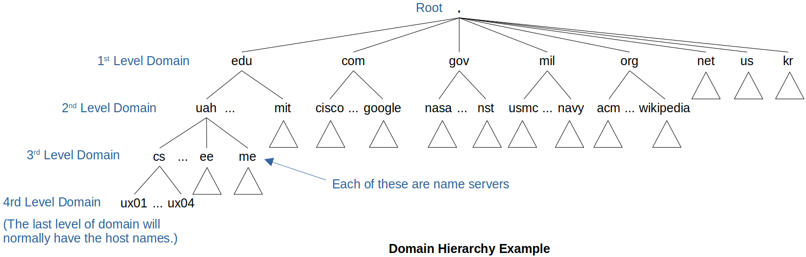
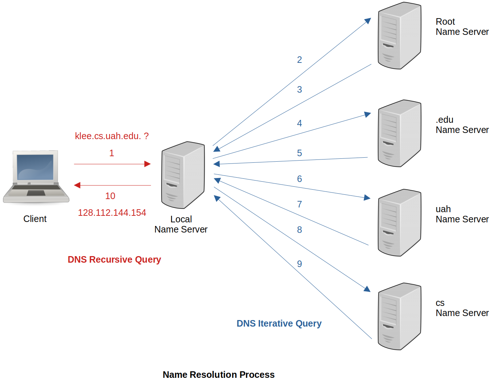

[Home](../../) | [Projects](../../projects) | [Notes](../) > <a href="./">Computer Networks</a> > Application Layer - Domain Name System (DNS)

# Application Layer - Domain Name System (DNS)


## Introduction to DNS

* The Domain Name System (DNS) is the **hierarchical** and **distributed** (or **decentralized**) naming system.

  It is a group of name servers that resolves the **domain names** into **IP addresses**.    

  - It is NOT a single server or single system or a single computer.
  - It follows the client/server model        

* When a host wants to access `www.google.com`, it first looks up the local cache and sees if the corresponding IP address is there. 

  * If so, `www.google.com` will be resolved into the IP address and put into the IP packet so it can find its way to the `google` server correctly.
  * If not, the host queries the DNS server which can resolve the internet name into IP address. When the host gets the IP address from the DNS server, it updates that information to the local cache for the future use. It then uses that IP address to access the `google` server correctly.

   Without DNS, the host cannot access to the destination without knowing the destination’s IP address.

* Then why do we use the **domain name** (e.g., `www.google.com`) instead of **IP address** (e.g., `8.8.8.8`)? 

  * Domain name - meaningful strings easier for humans to remember (human friendly)
  * IP address - random sequence of numbers (router friendly)


* Fully Qualified Domain Name (FQDN)

  ```plain
  myhost  .  example.com  .
  ------     -----------  -
  host       parent       (trailing dot) 
  name       domain       root server
  	       name
  ```

  > The root server will be visited first in this example.


## Domain Hierarchy Partitioned into Zones





* The 1^st^ Level Domain is also referred to as the **Top Level Domain**.

* Example of FQDN:

  ```plain
  cs . uah . edu .
  --   ---   --- ^
   |    |     |  root server
   |    |     |
   |    |    1st level name server
   |    |
   |   2nd level name server
   |
  3rd level name server
  ```

  

## Name Server

* Each name server implements the zone information as a collection of resource records.

* A resource record is a **name-to-value binding** (i.e., “host name” to “IP addresss” binding).

* A resource record is a 5−tuple representation: `<Name, Value, Type, Class, TTL>`

  Example (`TTL` field ignored)

  ```plain
  1. <edu, a4.nstld.com, NS, IN>
                         --
                         name server
  
  2. <a3.nstld.com, 192.5.8.42, A, IN>
                                -
                           (IP) address
  
  3. <ux01.cs.uah.edu, 128.111.143.187, A, IN>
                                           --
                                           Internet
  ```


## Name Resolution

- Not all clients know about the **root servers**. A lot of servers are involved when in comes to DNS, and the main or top server in the DNS hierarchy is the root server.

- DNS resolver is necessary for name resolution and it will be in the DNS client.

  - DNS client is a client machine configured to send name resolution queries to a DNS server.
  - DNS resolver will contact the root DNS server in order to get the IP address that is mapped to the name.

- Resolving a name actually involves a client querying the local DNS server. We can have a DNS server in a local area network (LAN) and this helps alleviate traffic over the Internet because the name resolution can be done within the LAN.

- Two types of DNS query technique:    

  - **DNS Recursive Query**

    Query beweeen the client and the local DNS server

  - **DNS Iterative Query**

    Query beweeen the local DNS server and other name servers





* First, the client checks the **local DNS cache**. If the name and the corresponding IP address are not there, it checks the **hosts file** which contains the mappings of IP addresses to host names. If still not there, it moves on with the following name resolution process:

  1. The client queries the *local DNS server*. If it is not there,

  2. The *local DNS server* queries the *root server*. (But, the *root server* does not know the complete detail.)

     “Hey, do you know the IP address of `klee.cs.uah.edu.`?”

  3. The *root server* gives referral to the *local DNS server* to query the *.edu server*.

     “No, I do not. But, I know the IP address of *.edu server* and it is 192.4.5.32."

  4. The *local DNS server* queries the *.edu server*. (But, the *.edu server* still does not know the complete detail.)

     “Hey, do you know the IP address of `klee.cs.uah.edu.`?”

  5. The *.edu server* gives referral to the *local DNS server* to query the *uah server*.

     “No, I do not. But, I know the IP address of *uah server* and it is 128.112.129.15."

  6. The *local DNS server* queries the *uah server*. (But, the *uah server* still does not know the complete detail)

     “Hey, do you know the IP address of `klee.cs.uah.edu.`?”

  7. The *uah server* gives referral to the *local DNS server* to query the *cs  server*.

     “No, I do not. But, I know the IP address of *cs server* and it is 128.112.134.10."

  8. The *local DNS server* queries the *cs server*. (But, the *cs server* still does not know the complete detail.)

     “Hey, do you know the IP address of `klee.cs.uah.edu.`?”

  9. Now, the *cs server* will be aware of the *klee server* which is actually located in its local area network.

     “Yes, I do! 128.112.144.154 is its IP address.”

  10. The *local DNS server* will store this information in its **local DNS cache** and forward it to the client.

      Once this is done, if any other clients want to reach `klee.cs.uah.edu.` the name can be resolved by the *local DNS server*. Need not go through the DNS Iterative Query again!)

  Finally, when the client receives the IP address from the *local DNS server*, it updates its own local cache for future reference.

* To test before/after of this name resolution process in Windows OS, use `ipconfig/displaydns` command in the command window. This command will show you the entries that are stored in the **local DNS cache**.

* To check the **hosts file** on Windows OS, go to `C:\Windows\System32\drivers\etc\` and open `hosts` file. You can manually add the entries in that file by following the instruction written in that file.


## Problems

* **Problem 1** 
  Identify the correct order in which the following actions take place in an interaction between a web browser and a web server.

  1. The web browser requests a web page using HTTP.
  2. The web browser establishes a TCP connection with the web server.
  3. The web server sends the requested web page using HTTP.
  4. The web browser resolves the domain name using DNS.

  $\to$ 4, 2, 1, 3

* **Problem 2** 
  If a server has no clue about where to find the address for a hostname then ___.

  1. server asks to the root server
  2. server asks to its adjacent server
  3. request is not processed
  4. none of the mentioned

  $\to$ 1

* **Problem 3** 
  The Protocol Data Unit (PDU) for the application layer in the Internet stack is ___.

  1. Segment
  2. Datagram
  3. Message
  4. Frame

  $\to$ 3