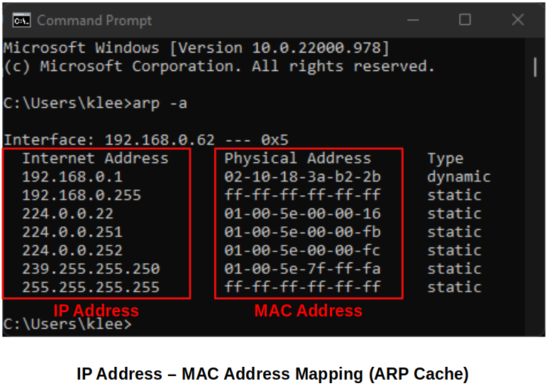
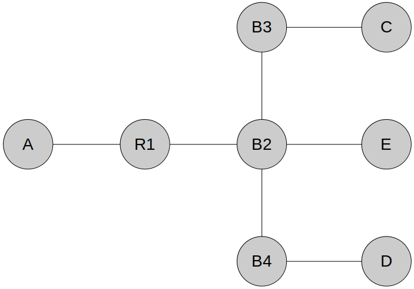

[Home](../../) | [Projects](../../projects) | [Notes](../) > <a href="./">Computer Networks</a> > Data Link Layer - Address Resolution Protocol (ARP)

# Data Link Layer - Address Resolution Protocol (ARP)

## Introduction to ARP

* ARP is a protocol used to find out the hardware (MAC) address of a  device from an IP address. It is used when a device wants to communicate with some other device on a local network (for example on an Ethernet  network that requires physical addresses to be known before sending  packets). 

  

## Two Basic Functions of ARP

* **Mapping IPv4 addresses to MAC addresses**

  Note that this is NOT a logical conversion! There is no logical relationship between an IP address and a MAC address. IP address is something that is manually given by the network administrator or dynamically assigned by the DHCP server whereas the MAC address is given by the Network Interface Card manufacturer at its birth.

* **Maintaining a table of mappings**

  All operating systems maintain ARP caches that are checked before  sending an ARP request message. Each time a host needs to send a packet  to another host on the LAN, it first checks its ARP cache for the  correct IP address and matching MAC address. The addresses will stay in  the cache for a couple of minutes. You can display ARP entries in  Windows by using the `arp -a` command:

## Address Resolution Process    

Let's say Host A wants to communicate with Host B.

1. Host A looks up its ARP table to find the MAC address of Host B.
2. If not found, Host A broadcasts an **ARP Request** with the destination IP address set to Host B's IP, and the destination MAC address set to FF:FF:FF:FF:FF:FF (Ethernet **broadcast**).
3. Switch will forward the frame out to all interfaces except the incoming interface. (Flooding)
4. All hosts on the LAN will receive the broadcast but, only Host B will **ARP Reply** with its MAC address (Ethernet **unicast**).
5. Host A will store the Host B's IP-MAC address pair in its ARP table and communication will take place.

When a device in a LAN boots up the first ARP it sends out will most likely to be to obtain the MAC address of the default gateway. This is because most of the cases the device will try to send out or receive things to or from the Internet.

## ARP Example

* **Problem:**

  Given all devices have just powered on. Describe how two-way communication between host C and host D is established. Assume using IP address (No DNS) and host C is initiating the communication. Make sure to describe all the protocols and techniques that host, bridge and routers will use.

  Hosts: A, C, D, E

  Bridges: B2, B3, B4

  Routers: R1

  

  **Solution:**

  1. C - ARP Request D (Broadcast)

     C - [ DA_D | SA_C | DAIP_D | SAIP_C ]

     B3 Flood B2

     B2 Flood R1, E, B4

     B4 Flood D

     $\therefore$ B3, B2, B4 learn location of C

  2. D - ARP Response C (Unicast)

     D - [ DA_C | SA_D | DAIP_C | SAIP_D ]

     B4 $\to$ B2

     B2 $\to$ B3

     B2 $\to$ C

     $\therefore$ B4, B2, B3 learn location of D

  Now, we have the bidirectional communication.
