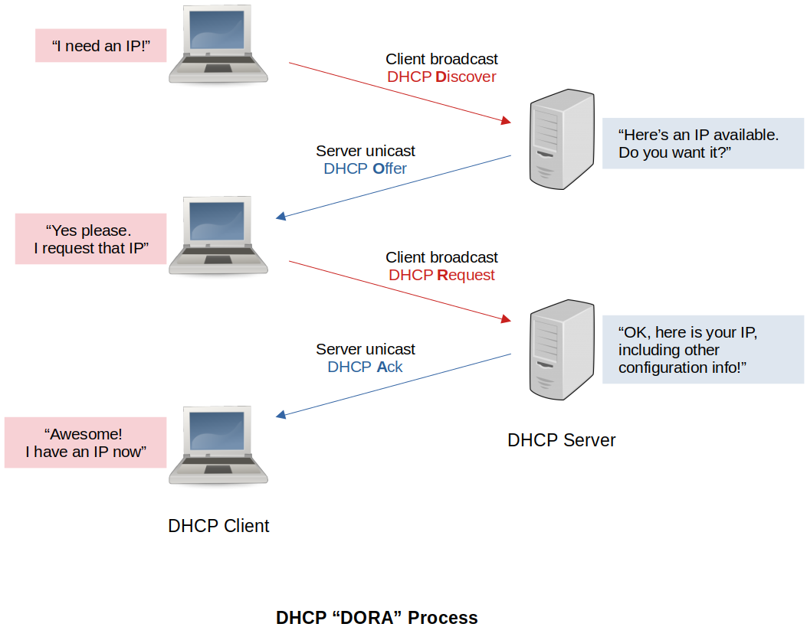

[Home](../../) | [Projects](../../projects) | [Notes](../) > <a href="./">Computer Networks</a> > Network Layer - Dynamic Host Configuration Protocol (DHCP)

# Network Layer - Dynamic Host Configuration Protocol (DHCP)

## Introduction to DHCP

* Unlike the MAC addresses which are configured into the network adapter by the manufacturer, IP addresses need to be reconfigurable since it must both maintain unique on a given internetwork and reflect the structure of the internetwork.

* Most operating systems provide a way to manually configure the IP information for the host but, manually configuring the IP information (i.e., static IP address) has some problems:

  - A lot of work to configure all the hosts in a large network
  - Configuration process is error-prone

* DHCP server solves these problems by automatically providing the hosts with the basic configuration information that are necessary for them to start sending packets.

  e.g., IP address, subnet mask, DNS server information, IP address of the default gateway

* There is at least one DHCP server for an administrative domain.

* DHCP server maintains a pool of available IP addresses. So, when requested by a host, DHCP allows the host to obtain an IP address dynamically.

* DHCP leases the IP information to the host for a set period. It is expected that a host can be assigned a different IP address when the current lease ends.

* Nowadays, routers also have DHCP servers in them.

## Components of DHCP

- **DHCP server**

  DHCP servers manage a pool of IP addresses and assign them to clients,  along with other network parameters such as subnet mask and default  gateway.

- **DHCP client**

  It is an Internet host that receives IP addresses and other network parameters from a DHCP server.

- **DHCP relay agent**

  DHCP relay agents are hosts or routers that forward requests and replies between the client and the server.

- **IP address pool**

  IP address pool is a collection of organised IP addresses used in the  efficient allocation of IP addresses to requesting clients within a  specific network.

- **Subnet mask**

  A subnet mask logically subdivides the IP address into two parts, where the first part identifies the host and the second part identifies the  network to which it belongs.

- **Lease time**

  This is the amount of time a client can use an IP address assigned by the DHCP server.

## DHCP DORA Process

1. **DHCP Discover**

   A DHCP client sends out a DHCP Discover message to find a DHCP server on the network that can allocate a unique IP address. This message  contains an identifier, also known as a media control address (MAC),  that uniquely identifies the client. It also includes other parameters,  such as subnet mask, domain name and DNS. This is a broadcast message  that reaches all the nodes in a network.

   Here, the client is not aware of the server's IP address, so the  destination IP is 255.255.255.255. Since the client does not have an IP  address yet, its source IP is 0.0.0.0. The source MAC address is the MAC address of the DHCP client and the destination MAC address is  FF:FF:FF:FF:FF:FF, which is the broadcast message of the network.

2. **DHCP Offer**

   The DHCP server  receives the message sent by the DHCP client. After receiving this  message, the DHCP server replies to the DHCP client with a DHCP Offer  message. The intent of this message is to lease an IP address to the  client. The message contains an IP address the client can use, along  with its lease time and network configuration parameters.

   Here, the destination IP address is 255.255.255.255 since the client does not have an IP address yet. The source MAC address is the MAC address of  the DHCP server and the destination MAC address is the MAC address of  the DHCP client.

3. **DHCP Request**

   The DHCP client  sends a DHCP Request message after receiving the DHCP Offer message from the server. Since there are multiple DHCP servers sending offer  messages to the client, the DHCP client selects the one that reaches it  first. After this, the client sends out a broadcast message to confirm  that it accepts the IP address assigned by the DHCP server. This  eliminates the need for other DHCP servers in the network.

   If the message contains a server identifier option, it means that the  client is requesting for a new IP address. In any other case, the  message is a request for an extension of a lease. The default IP lease  duration is eight days. Here, the source IP address is 0.0.0.0 as the  DHCP server has not yet assigned an IP address to the client. The  destination IP address is 255.255.255.255. The source MAC address is the MAC address of the DHCP client and the destination MAC address is the  MAC address of the DHCP server.

4. **DHCP Acknowledge**

   the DHCP server  sends a DHCP Acknowledge message to the client after receiving the DHCP  Request message. In the message, it sends the IP address and other  network configurations essential for the client. Below are some  scenarios:

   - DHCP negative acknowledgement: The DHCP server sends a negative acknowledgement message if the request from a client is invalid or if the IP address pool is empty.
   - DHCP decline: The DHCP client sends this message if the offered configuration  parameters are invalid or different from what the client requires.
   - DHCP release: A DHCP client sends this message to the DHCP server to release the IP address.
   - DHCP inform: If the client already has a manual IP address assigned, then it can  request the DHCP server to allocate other network parameters.

   After assigning the IP address to a client, the server registers this IP  along with the lease time. It does not provide this IP address to any  other client. The source IP address is the IP address of the DHCP  server. The destination IP address is 255.255.255.255 since it is a  broadcast message in the network layer. Here, the source MAC address is  the MAC address of the DHCP server and the destination MAC address is  the MAC address of the DHCP client.

## Pros & Cons of DHCP

* **Pros:**

  * DHCP automatically allocates IP addresses to requesting clients, which reduces the need for manual configuration.
  * Implementing DHCP does not incur additional costs.
  * DHCP ensures that there is no duplication or invalid IP addresses, reducing configuration errors.
  * It is easier to manage IP addresses from a central location.
  * DHCP auto-configures the network settings when assigning IP addresses to various devices.

* **Cons:**

  * **Security issue**

    DHCP automation may result in the introduction of unauthorised servers  that can allocate IP addresses to requesting clients. If a user connects to this network, it may cause a violation of user privacy and network  security.

  * **Failures or downtime**

    With a single DHCP server, an issue or downtime in it can cause a system-wide problem. This  results in a loss of all network connections until the central server is back.

  * **Tracking Internet activity**

    Since devices may have two or more IP addresses over time, it may be difficult to track malicious activity.

  * **Authentication issue**

    The DHCP client and server are unaware of each other's identities when exchanging information, which may result in cyber-attacks.