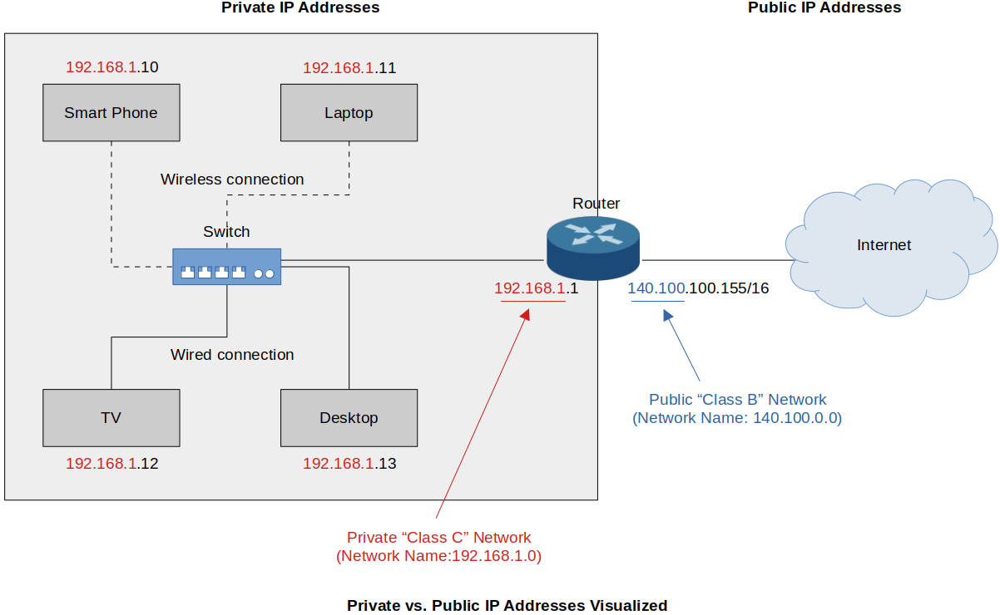

[Home](../../) | [Projects](../../projects) | [Notes](../) > <a href="./">Computer Networks</a> > Network Layer - IPv4 Address - Public vs. Private IP Addresses

# Network Layer - IPv4 Address - Public vs. Private IP Addresses


## Public IP Addresses

- Original design of Internet (Class A ~ Class E)
- “Registered” public IP addresses
- Assigned by an ISP to a business or home
- Must be globally unique        
  - Web servers
  - DNS servers
  - Routers
- By the Early 1990s, the world was running out of public IP addresses.
- Can be used or routed on a public network
- Private IP addresses & Network Address Translation (NAT) were born!


## Private IP Addresses

* “Unregistered” addresses − Anybody can use for free!

* Subset of each public IP address classes (Class A ~ Class C)

* Designed to be used ONLY within the organizations’ private internal networks

* Can be used over and over again

* Cannot be used or routed on a public network        

  ISP set up the routers so that they do not forward the routes for anything that comes from the private IP addresses. (Because they are not meant to be used on a public network.)

* Utilizes NAT to “Speak” to public networks i.e., the Internet!        

  NAT allows us to have private IP addresses on our internal network and a single or multiple different public IP addresses on our routers (or network devices) so that the private IP addresses can be mapped to public IP addresses and make the private IP addresses able to talk to the Internet.

  Typically, within a home environment, or a small office environment with a SOHO device, NAT is enabled and configured by default, and majority of us are using a *Class C* 192.168 private network that utilizes Network Address Translation (NAT), specifically, Port Address Translation (PAT), that allows us to gain access to the Internet with either one or maybe a handful of public IP addresses. And within our internal network, we can use as many private IP addresses as we need.

* Private IP Address Ranges

  ```plain
  Class IP Address Range		Network ID(s) (CIDR Notation)       Number of Addresses  
  ===== ===================== ==================================  =======================
  A     10.0.0.0              10.0.0.0/8                          16,777,216 IP Addresses
        ~ 10.255.255.255      → 1 Private Class A Network         Per Network ID
  ----- --------------------- ----------------------------------  -----------------------
  B     172.16.0.0            172.16.0.0 ~ 172.31.0.0/16          65,534 IP Addresses
        ~ 172.31.255.255      → 16 Private Class B Network        Per Network ID
  ----- --------------------- ----------------------------------  -----------------------
  C     192.168.0.0           192.168.0.0 ~ 192.168.255.0/24      254 IP Addresses
        ~ 192.168.255.255     → 256 Private Class C Network       Per Network ID
  ----- --------------------- ----------------------------------  -----------------------
  ```

  As the public IP addresses were running out, network designers defined (on to their original design) specific ranges of addresses in Class A, Class B and Class C to  be utilized only as private IP addresses.

  Class A private addresses are not used as much since it has too many IP addresses.

  Class C is most widely used and this is the reason why we often see 192.168.0 network when we configure anything on our internal network at home. (or 192.168.1 or something very similar to it)

* Advantage of introducing the private IP addresses:

  You can be using 192.168.0.0 network within your home, and everybody else on your street could be using that same exact private IP address as well on their internal network. But so long as we are all using some form of network address translation  (e.g., NAT), it is going to take this internal address and convert it to a public  address. So, that allows us to have multiple devices using private IP addresses  with only ONE public IP address unlike the old days where each single device would have to have a public address.

  This solves a lot of issues with running out of IP addresses, specifically public IP addresses.

  However, the implementation of private IP addresses and the implementation of network address translation were designed to be a short-term fix. But, still, thanks to these two implementation, IPv4 is still commonly used.

* Dual Stack Configuration    

  In your systems at home, you may see an IPv6 addresses along with IPv4 addresses. This means that your system is configured to use either. So, it can communicate with devices that are only utilizing IPv6 and vice versa devices that are only using IPv4.


## Private vs. Public IP Addresses Visualized





* We are utilizing NAT device (SOHO Device) which translates private IP address into a public IP address. We use private IP addresses within our internal network, and once they get to our NAT device, it is going to utilize the public IP address of the router (140.100.100.155) for all of our communication out to the Internet. Everybody on the Internet only sees the public IP address.

  The NAT device does all the work to make sure that any communications, any packets, any frames, any segments that come into our network, go to the appropriate system.

* The IP address we see by running `ipconfig /all` command is the private IP address. To check your public IP address, use the web service.