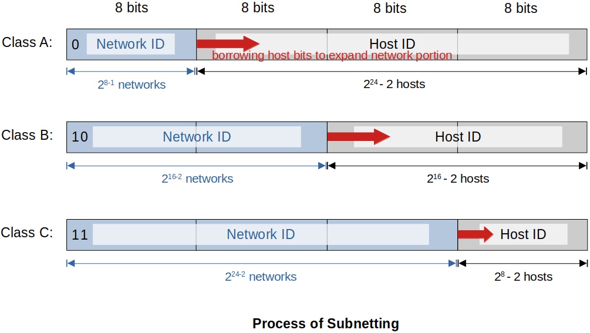

[Home](../../) | [Projects](../../projects) | [Notes](../) > <a href="./">Computer Networks</a> > Network Layer - IPv4 Address - Subnetting

# Network Layer - IPv4 Address - Subnetting


## Why Subnet?

- Using default Class A, Class B, and Class C subnets (called Classful IP Addressing) is inefficient.    

  - Wastes unused IP Addresses (Public IP Addresses)
  - Looking at the business use cases, you’re going to have a need for an amount of IP addresses well over a Class C, but far below a Class A or a Class B. So, that’s where subnetting comes into play.

- Allows you to create multiple logical networks that exist within a single Class A, B, or C network.    

  Breaks up larger networks into multiple smaller sub-networks, which are called subnets (When we make a network smaller, we have more efficient routing.)

- Allows for more efficient routing via router summarization.

- Increased network security!    

  With subnetting, we can have people that are cleared to work on the top secret data on the top secret subnet, people that are cleared to work on the secret data on the secret network, and people that don’t have the clearance for either of those that work with unclassified data on the unclassified subnet.


## Fixed Length Subnetting

- Fixed-length subnetting is also known as a fixed-length subnet mask (FLSM).    
  - Every single subnet will be the same length.
- There is also variable-length subnetting (VLSM), which is beyond our scope.


## Class C Subnetting Example

- **Problem**
  You’re the network administrator for the Computer Science department at a university. You’re setting up four new lecture halls that must have their own 60-person wireless network. You’ve been assigned the 200.15.178.0 Class C Network by the university, that supports 254 hosts per network by default. How do you break up this one Class C network into 4 smaller networks that support 60 host IP addresses per network?

  **Solution**
   Break the assigned network into 4 subnets of the same-length.

  ```plain
  200.15.178.0 
  Class C Network
  254 Hosts
  
  Subnet 1            Subnet 2            Subnet 3            Subnet 4
  (Lecture Hall 1)    (Lecture Hall 2)    (Lecture Hall 3)    (Lecture Hall 4)
  ==================  ==================  ==================  =================
  200.15.178.0/26     200.15.178.64/26    200.15.178.128/26   200.15.178.192/26    
  62 Hosts            62 Hosts            62 Hosts            62 Hosts
  ```


## Process of Subnetting





* We borrow host bits to create more sub-networks (subnets) from a Class A, B, or C network.

  When you borrow hosts bits:    

  - You create additional sub-networks, i.e., subnets

  - You also decrease the amount of host IP addresses available to use

* $n$ bit we borrow is equal to $2n$ subnets:    

  - Borrow 1 host bit = 2^1^ = 2 subnets

  - Borrow 1 host bit = 2^2^ = 4 subnets

  - Borrow 1 host bit = 2^3^ = 8 subnets

  - Borrow 1 host bit = 2^4^ = 16 subnets

    ...


## Subnetting Questions

To create a subnet, you need to answer the following questions first:    

1. How many subnets are needed?
2. How many hosts do you need per subnet?

### Class C Possible Subnets

* Class C Possible Subnets

  ```plain
  Binary (N.N.N.H)  Decimal          CIDR    # Subnets (2^x)  Block Size (2^y)  # Hosts (2^y - 2)
  ================  ===============  ======  ==============   ================  =================
  N.N.N.00000000    255.255.255.0    /24     2^0 = 1          2^8 = 256         2^8 - 2 = 254
  N.N.N.10000000    255.255.255.128  /25     2^1 = 2          2^7 = 128         2^7 - 2 = 126
  N.N.N.11000000    255.255.255.192  /26     2^2 = 4          2^6 = 64          2^6 - 2 = 62 
  N.N.N.11100000    255.255.255.224  /27     2^3 = 8          2^5 = 32          2^5 - 2 = 30 
  N.N.N.11110000    255.255.255.240  /28     2^4 = 16         2^4 = 16          2^4 - 2 = 14 
  N.N.N.11111000    255.255.255.248  /29     2^5 = 32         2^3 = 8           2^3 - 2 = 6  
  N.N.N.11111100    255.255.255.252  /30     2^6 = 64         2^2 = 4           2^2 - 2 = 2  
        ------  
        This is as far as we can take it with a Class C.
        For a subnet to be meaningful, you need minimum two IP addresses because a network
        is composed in a simplest form, two devices connected together.
  ```

* Number of Subnets = 2^x^, where x= number of host bits borrowed to create subnets.

* Block Size = 2^y^, where y= number of remaining host bits left that are used for the subnet IP addresses.

* Host per Subnet = 2^y^ - 2

  There are two addresses per network (or subnet) that we CANNOT use to assign to hosts on the network:        

  - **Network Address** - The address used to uniquely identify the network (or  subnet).            

    Very first address of the network (or subnet)

  - **Broadcast Address** - Address reserved for broadcast communication on the network.            

    Very last address of the network (or subnet)

### Problems

* **Problem 1**
  If you need at minimum 5 subnets and each subnet supporting at minimum 15 IP addresses per subnet, how would you subnet a Class C network.

  **Solution**
  Must borrow from the host bits at least 3 bits. However, if we borrow more than 3 bits, the number of hosts of each subnet will be smaller than 15.
  ∴ The number bits to be borrowed is 3.

* **Problem 2**

  Given `10.10.0.1/26`, what is the network, broadcast addresses and how may hosts in each subnet?

  **Solution**

  ```plain
  subnet mask	: 255.255.255.192 (11111111.11111111.11111111.11000000)
  network     : 10.10.0.0
  broadcast   : 10.10.0.63 (last octet: 00111111)
  # of hosts  : 2^6 - 2 = 62
  # of subnet : 2^(26 - 24) = 4
  ```

* **Problem 3**

  Given `192.168.0.25/20`, what is the network, broadcast addresses and how may hosts in each subnet?

  **Solution**

  ```plain
  subnet mask	: 255.255.240.0 (11111111.11111111.11110000.00000000) 
  network     : 192.168.0.0
  broadcast   : 192.168.15.255 (last two octets: 00001111.11111111)
  # of hosts  : 2^12 - 2 = 4094
  # of subnet : 2^(20 - 16) = 16
                         --
                         original network subnet (classful)
  ```

* **Problem 4**

  Given `146.229.232.100/20`, what is the network, broadcast addresses and how may hosts in each subnet?

  ```plain
  given IP	: 146.229.(11101000).100
  subnet mask	: 255.255.240.0 (11111111.11111111.11110000.00000000)
  network     : 146.229.224.0
  broadcast   : 146.229.239.255 (last two octets: 11101111.11111111)
  # of hosts  : 2^12 - 2 = 4094
  # of subnet : 2^(20 - 16) = 16
  ```

* **Problem 5**

  Give the subnet mask in both dotted decimal notation and CIDR notation for a network that can support 8192 hosts.

  ```plain
  8192 = 2^13 (hosts) -> 19 network bits, 13 host bits
  
  subnet mask	: 11111111.11111111.11100000.00000000
  			  255.255.224.0 (dotted notation)
  			  /19			(CIDR notation)
  ```

