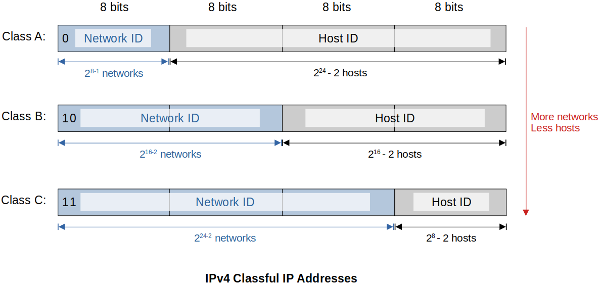
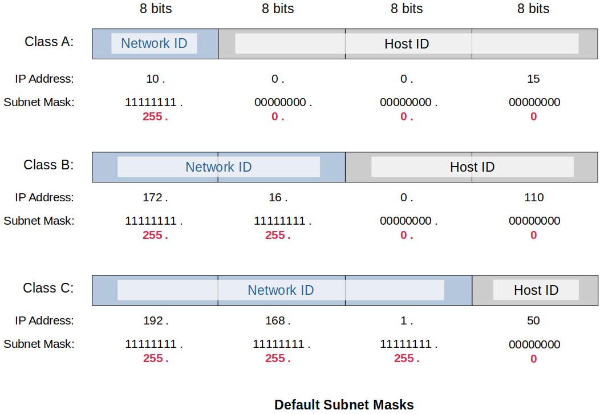

[Home](../../) | [Projects](../../projects) | [Notes](../) > <a href="./">Computer Networks</a> > Network Layer - IPv4 Address

# Network Layer - IPv4 Address


## IP Address

- An IP Address is a logical address used in order to uniquely identify a device on an IP network. Manually or dynamically (DHCP) assigned by us so that they operate on the Network Layer.
- Network Layer Address
- Two versions of IP address:
  - IP version 4 (IPv4)
  - IP version 6 (IPv6)


## IPv4 Address

* A 32-bit long identifier divided into a **Network ID (Network Prefix, Network Address)** and a **Host ID (Host Number, Host Address)** with the help of a subnet mask.

  * Network address uniquely identifies each network
  * Host address uniquely identifies each machine on a network

  IP Address = Network Address + Host Address

* IP addresses are written in a so-called **Dotted Decimal Notation**.

  The 32 binary bits are broken into four **octets**. (1 octet = 8 bits = 1 byte)

  Each octet is converted to decimal and separated by a period (dot).

  ```plain
    192   .   168  .   1    .  131
  11000000.10101000.00000001.10000011
  ```


## IPv4 Classful IP Addresses (Old Way)





* Leading bits are fixed. So, the number of leading bits affect the number of available networks.

* Hosts Per Network = $2^h - 2$, where $h$ is the number of host bits available. (Subtract two because each network includes a **network address** and **broadcast address** that are not available for use by network end devices.)

* IPv4 Address Classes (Simplified)

  ```plain
  Class     Network Bits    Host Bits   Address Range
  ========  ==============  ==========  =============================
  A         8               24          1.0.0.0 - 126.255.255.255
  B         16              16          128.0.0.0 - 191.255.255.255
  C         24              8           192.0.0.0 - 223.255.255.255
  ```

  The network address 127 is reserved for **loopback** (127.0.0.0 ~ 127.255.255.255). See *The Loopback Address* section below.

* IPv4 Address Classes (Detailed)

  ```plain
  Class     Leading         Network     Remaining   Number of   Host Per    Default
            Bits            Bits        Bits        Networks    Network     Subnet Mask
  ========  ==============  ==========  ==========  ==========  ==========  =============
  Class A   0 (1-126)       8           24          2^7         2^24        255.0.0.0
  --------  --------------  ----------  ----------  ----------  ----------  -------------
  Class B   10 (128-191)    16          16          2^14        2^16        255.255.0.0
  --------  --------------  ----------  ----------  ----------  ----------  -------------
  Class C   110 (192-223)   24          8           2^21        2^8         255.255.255.0
  --------  --------------  ----------  ----------  ----------  ----------  -------------
  Class D   1110 (224-239)  Not         Not         Not         Not         Not
                            Defined     Defined     Defined     Defined     Defined
  --------  --------------  ----------  ----------  ----------  ----------  -------------
  Class E   1111 (240-255)  Not         Not         Not         Not         Not
                            Defined     Defined     Defined     Defined     Defined
  --------  --------------  ----------  ----------  ----------  ----------  -------------
  ```

  Notice that the number of networks of Class A, B and C are NOT 2^8^, 2^16^ and 2^24^, respectively. This is due to the fixed leading bits in those classes.

  Class D and Class E are not used. But, know that they exist!

  **Leading bits** are fixed bits (cannot be changed) and are part of the network address.

* Problems with Classful IP Addresses

  1. Too few network addresses for large network $\to$ Class A and Class B addresses are gone

  2. Two-layer hierarchy is not appropriate for large networks with Class A and Class B addresses
  3. Inflexible. Assume a company requires 2,000 addresses $\to$ Class A and B addresses are overekill, Class C address is insufficient (requires 8 Class C addresses)
  4. Exploding routing tables $\to$ Routing on the backbone Internet needs to have an entry for each network address. In 1933, the size of the routing tables started to outgrow the capacity of routers.

  **CIDR** notation solves the issues the classful IP address system has!


## Classless Inter-Domain Routing (CIDR)

* Goal is to restructure IP address assignments to increase efficiency and hierarchical routing aggregation to minimize routing table entries.

  Key concept is that the length of the network ID (prefix) in the IP addresses is kept arbitrary. 

  As a consequence, routers need to advertise the IP address with the length of the prefix.

* CIDR notation of a network address:

  ```plain
  192.0.2.0/18
  ```

  > "18" says that the first 18 bits are the network part of the address (and the rest 14 bits are available for specific host addresses)

  The network part is called the **prefix**.

* Assume that a site requires a network address with 1000 addresses. With CIDR, the network is assigned a continuous block of 1024 addresses with a 22-bit long network ID (prefix).


## Subnet Masks

- The Subnet Mask tells you which portion of the IP address identifies the network and which portion ideitifies the host.
- Below are default Class A, Class B, and Class C subnet masks:





* Examples: What class are the following IP Address?    

  - IP Address: 9.10.40.15 (Subnet Mask: 255.0.0.0) $\to$ Class A

  - IP Address: 135.240.110.100 (Subnet Mask: 255.255.0.0) $\to$ Class B
  - IP Address: 196.200.10.5 (Subnet Mask: 255.255.255.0) $\to$ Class C

* You can’t tell the class of the IP address just by looking at the IP address itself because subnetted address are non-classifiable. Always check the subnet mask along with the IP address!

* Network address = IP address & Subnet mask

  ```plain
  	IP address	: 10.168.1.6/17 
    & Subnet mask	: 255.255.128.0 (11111111.11111111.10000000.00000000)
    ------------------------------
    	Network addr: 10.168.0.0
  ```


## Loopback Address

- 127.0.0.0 to 127.255.255.255 is reserved for **loopback**, i.e., host’s own address, also known as the **localhost** address. 
- 127.0.0.1 is typically configured as the default loopback address on operating systems.

* Used for diagnostics purposes to check that TCP/IP is correctly installed on a host’s operating system.

  When a process creates a packet destined to the loopback address, the operating sytem loops it back to itself without it ever interfacing with the NIC or network cables.

  Data sent on the loopback is forwarded by the operating system to a virtual network interface within the operating system.

* If you can successfully ping 127.0.0.1 or any IP within the loopback range, then TCP/IP on your computer is properly working.

  ```plain
  ping 127.0.0.1    // explicitly requests test in IPv4
  
  ping localhost    // when executed on Dual Stack Configured machine the address will
                    // appear (::1) meaning the loopback in IPv6
  
  ping loopback     // windows only
  ```

  