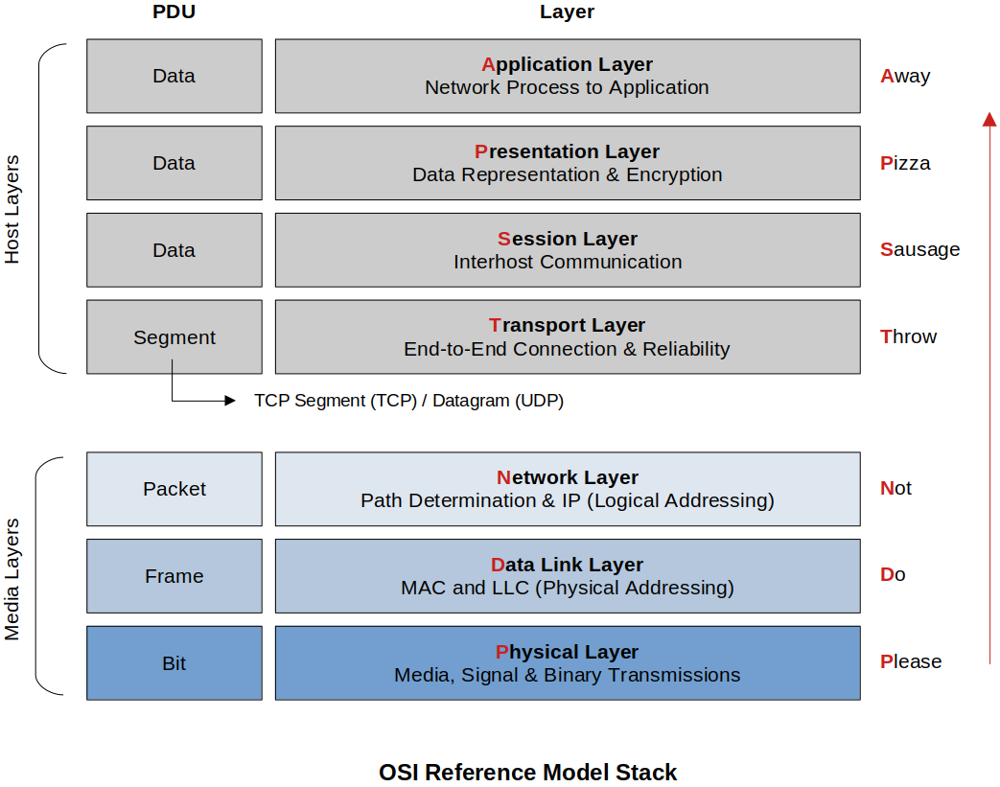
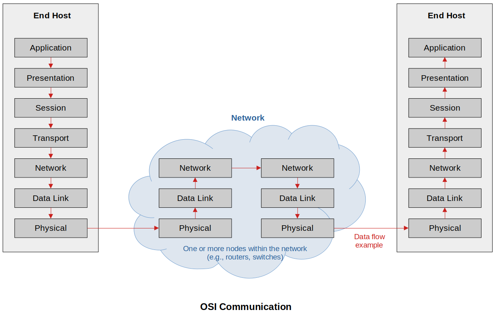

[Home](../../) | [Projects](../../projects) | [Notes](../) > <a href="./">Computer Networks</a> > OSI Reference Model

# OSI Reference Model

## Open Systems Interconnection (OSI) Reference Model

* A **conceptual** framework showing us how data moves throughout a network and how networks operate.
* It is only a **reference model** (a very good teaching model), so don't get wrapped up in the details. It is not implemented in the real world. TCP/IP model is!

## OSI Reference Model Stack

* The OSI model breaks down the complex task of computer-to-computer communication into 7 layers.

  * **User Layers (Host Layers)**

    Handled by the host computer and performs application-specific functions, such as data formatting, encryption, and connection management.

  * **Lower Layers (Media Layers)**

    Provide network-specific functions, such as routing, addressing, and flow control.

  

* The lower three layers are implemented on all network nodes.

  The higher four layers typically run only on end-hosts and NOT on the intermediate switches and routers.

* In networking, a **protocol data unit (PDU)** is the basic unit of exchange between entities that communicate using a specified networking protocol.

### Description of Layers

* **Application Layer**

  Standardize common type of exchanges

  High-level protocols such as for resource sharing or remote file access, e.g., HTTP

* **Presentation Layer**

  Concerned about the format of data exchanged between peers

  Translates data between a networking service and an application; including character encoding, data compression and encryption/decryption

* **Session Layer**

  Provides a name space that is used to tie together the potentially different transport streams that are part of a single application

  Manages communication sessions, i.e., continuous exchange of information in the form of multiple back-and-forth transmissions between two nodes

* **Transport Layer**

  Implements a process-to-process channel

  Unit of data exchanges in this layer is called a **message** (or **segment (TCP)**, **datagram (UDP)**)

* **Network Layer**

  Handles routing among nodes within a packet-switched network

  Unit of data exchange between nodes in this layer is called a **packet**

* **Data Link Layer**

  Collects a stream of bits into a larger aggregate called a **frame**

  Network adapter along with device driver in OS implement the protocol in this layer

  Frames are actually delivered to hosts

* **Physical Layer**

  Handles the transmission or raw **bits** over a communication link

## OSI Communication

