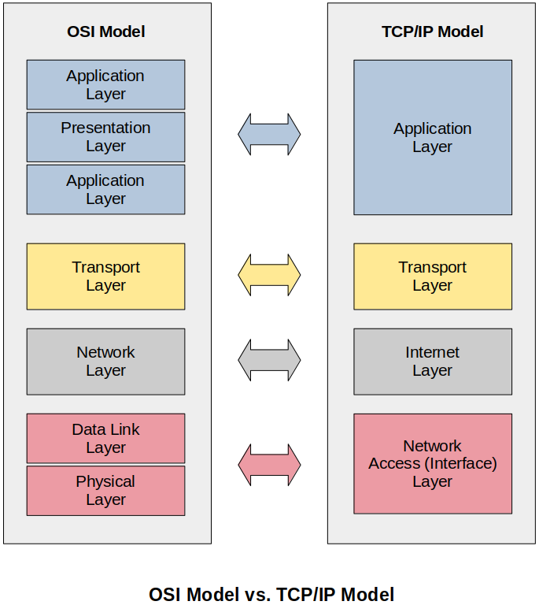

[Home](../../) | [Projects](../../projects) | [Notes](../) > <a href="./">Computer Networks</a> > TCP/IP Model

# TCP/IP Model

## TCP/IP Protocol Suite

* The TCP/IP suite is the most commonly used protocol suite in the networking world.

* It is essentially the protocol suite in which the Internet was built.

* It is the **standard** for computer networking today. 

  There were other protocol suites that have come and gone over time, such as AppleTalk, IPX/SPX, and NetBEUI, but TCP/IP still remains today in use.

* It is based on a **4-layer model** that is similar to the OSI reference model.

  At different layers, there are different protocols.

## OSI Model vs. TCP/IP Model

