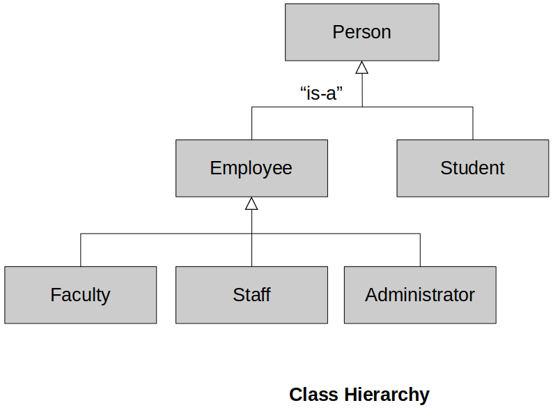
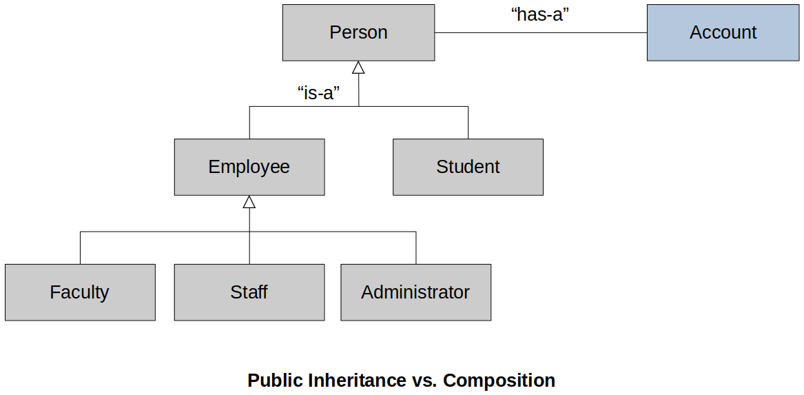
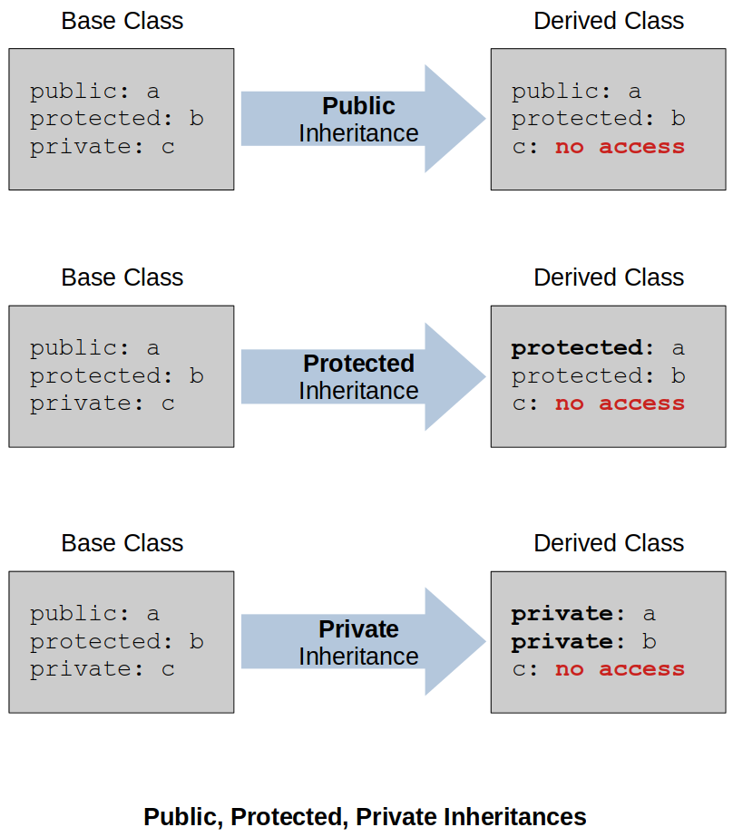
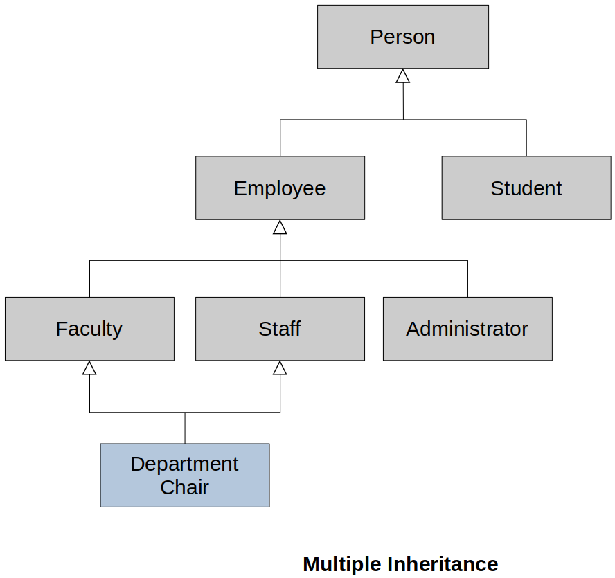

[Home](../../) | [Projects](../../projects) | [Notes](../) > <a href="./">C++ Programming</a> > Inheritance

# Inheritance


## Overview

* What is inheritance? Why is it useful? $\to$ Re-usability!
* Terminology and notation
* Inheritance vs. Composition
* Deriving classes from existing classes
  * Types of inheritance

* `protected` members and class access
* Constructors and destructors
  * Passing arguments to base class constructors
  * Order of constructor and destructors calls

* Redefining base class methods
* Class hierarchies
* Multiple inheritance


## What is Inheritance and Why is it Used?

* Inheritance allows for creating new classes that modify the behavior of their parent classes.

* Provides a method for creating new classes from existing classes

* The new class contains the data and behaviors of the existing class

* Allows for reuse of existing classes

* Allows us to focus on the common attributes among a set of classes

* Allows new classes to modify behaviors or existing classes to make it unique without actually modifying the original class
  * This is important since the existing class has already been tested and it's probably being reused by other applications. So, we really don't want to modify it at all.


### Examples of Related Classes

* Player, Enemy, Level Boss, Hero, Super Player, etc.
  - These classes might share some attributes such as *health*, *position*, etc.
  - Maybe all other classes are some specializations of the Player class.
* Account, Savings Account, Checking Account, Trust Account, etc.
  - Classes for banking system
  - Withdraw, deposit functionalities are common in these classes.
* Shape, Line, Oval, Circle, Square, etc.
  - Classes for graphic design system
* Person, Employee, Student, Faculty, Staff, Administrator, etc.
  - Classes for the university personnel system

### Case Study: Accounts

* Account
  * **balance**, **deposit**, **withdraw**, ...
* Savings Account
  - **balance**, **deposit**, **withdraw**, interest rate, ...
* Checking Account
  - **balance**, **deposit**, **withdraw**, minimum balance, per check fee...
* Trust Account
  - **balance**, **deposit**, **withdraw**, interest rate...

Without inheritance (Code duplication)

```cpp
class Account {
    // balance, deposit, withdraw, . . .
};

class Savings_Account {
    // balance, deposit, withdraw, interest rate, . . .
};

class Checking_Account {
    // balance, deposit, withdraw, minimum balance, per check fee, . . .
};

class Trust_Account {
    // balance, deposit, withdraw, interest rate, . . .
};
```

> Here, each class is independent of each other.

With inheritance (Code reuse!)

```cpp
class Account {
    // balance, deposit, withdraw, . . .
};

class Savings_Account : public Account {
    // interest rate, specialized withdraw, . . .
    // -------------  --------------------
    // simply "add"   "modify" the behavior of the parent class's attributes
    // to the         to meet its requirement
    // inherited
    // attributes of
    // Account class
};

class Checking_Account : public Account {
    // minimum balance, per check, fee, specialized withdraw, . . .
};

class Trust_Account : public Account {
    // interest rate, specialized withdraw, . . .
};
```

> Here, these classes are now interrelated. `Savings_Account`, `Checking_Account`, `Trust_Account` classes depend on the `Account` class, and there is an inheritance hierarchy.


## Terminology

* Inheritance
  * Process of creating new classes from existing classes
  * Reuse mechanism
  
* Single inheritance
  * A new class is created from another 'single' class
  
* Multiple inheritance
  * A new class is created from two (or more) other classes

* Base class (parent class, super class)
  * The class being extended or inherited from
  
    (The following is the UML Class Diagram.)


* Derived class (child class, sub class)
  * The class being created from the base class
  * Will inherit attributes and operations from base class
* "Is-A" relationship
  * Public inheritance
  * Derived classes are sub-types of their base classes
  * Can use a derived class object wherever we use a base class object
  * e.g., A savigns account "Is-A" account
* Generalization
  * Combining similar classes into a single, more general class based on common attributes
  * The more general class is more abstract, and therefore can be potentially be reused more easily.
* Specialization
  * Creating new classes from existing classes proving more specialized attributes or operations
* Inheritance or Class Hierarchies
  * Organization of our inheritance relationships so that our code can be more effectively reused
  * When we design our program, we use both generalization and specialization to make the code more organized and reusable
  * C++ does not have singly-rooted hierarchy. 
    - Java does! The `Object` class is the root class.

### Examples

* Class hierarchy example 1

  Classes:

    - A (root class)
    - B is derived from A
      - B is an A
      - B is not a C - There is no inheritance relationship directly between B and C.
    - C is derived from A
    - D is derived from C
    - E is derived from D
      - E is also a C since inheritance is **transitive**
      - E is also an A


* Class hierarchy example 2

  Classes:

    - Person (root class) - The most general/abstract class in this class hierarchy.
    - Employee is derived from Person
    - Student is derived from Person
      - Student is a person - Student class inherits the attributes and operations of the Person class.
      - Student is NOT an Employee
    - Faculty is derived from Employee
    - Staff is derived from Employee
      - Staff is an Employee, and in fact, is also a Person
    - Administrator is derived from Employee

    [!] Note: Notice that the relationships are NOT bi-directional! A Person is not necessarily an Employee because it could be a student.





## Public Inheritance ("Is - A") vs. Composition ("Has - A")

* Both allow reuse of existing classes.
* Composition is a common design pattern for reuse, and you'll see it used much more frequently than inheritance. But, we can use both inheritance and composition together to create powerful frameworks that allow us to reuse existing code.

### Public Inheritance

- "is-a" relationship between derived and base classes
  - Employee "is-a" Person
  - Checking Account "is-a" Account
  - Circle "is-a" Shape
- Derived classes automatically inherit all of the base classes' attributes and operations.
- Not all relationship can be described in terms of inheritance.

### Composition

- "has-a" relationship
  - Person "has a" Account (But a Person is not an Account)
  - Player "has-a" Special Attack
  - Circle "has-a" Location

- Using a combination of inhertiance and composition, we can express complex relationships between classes and leverage code reuse.
    - When we model class data members, we're using composition.
      - Many times the instance variables are primitive types, so we don't include them in class diagrams, but the concept is the same.

### Example





  - We will use the term **composition** to simply mean it has a relationship, and we won't be concerned about whether the Account object can logically exist without being associated with a Person object.
  - Does a Student object also have an account? $$\to$$ Yes! Because a Student is a Person.
  - What a bout a Faculty member? $$\to$$ Yes! Because a Faculty member is a Person.


## When to Choose Inheritance over Composition?

* If the "is-a" relationship dosn't make sense, then don't use public inheritance.
* Other times it's not so clear. A rule of thumb when using inheritance is to step back, look at your design and be sure that the inheritance is appropriate.
    - If you can model a relationship with composition, then you should consider doing that first since inheritance adds more complexity to your design.
    - In this case, an inheritance relationship between student and account simply doesn't make sense, so we use composition.


## Composition Shown in a Class

* Person Class

  ```cpp
  class Person
  {
  private:
      std::string name;     // "has-a" name
      Account account;      // "has-a" account
  };  
  ```

  > Composition is a common design pattern for reuse and you'll see it used much more frequently than inheritance. But we can use both inheritance and composition together to create powerful frameworks that allow us to reuse existing code.


## Types of Inheritance in C++

* `public`
  - Most common
  - Establishes "**is-a**" relationship between Derived and Base classes
* `private` and `protected` (beyond our scope)
  - Establishes "derived class **has-a** base class" relationship
  - "Is implemented in terms of" relationship
  - Different from composition


## Deriving Classes from Existing Classes

* C++ Derivation Syntax

  ```cpp
  class Base
  {
      // Base class members . . .
  };
  
  class Derived: <access_specifier> Base
  {
      // Derived class members . . .
  };
  ```

  > Note: `<access_specifier>` can be: `public`, `private`, or `protected` (if not provided, `private` inheritance by default)

  ```cpp
  class Account
  {
      // Account class members . . .
  };
  
  class Savings_Account: public Account
  {
      // Savings_Account class members . . .
  };
  ```

  > Savings_Account "is-a" Account.
  >
  > Now, a Savings_Account inherits everything in the account class, and it's free to implement its own specialized behaviors based on the behavior it inherited from account.

* C++ Creating Objects

  ```cpp
  Account account{};
  Account *p_account = new Account();
  
  account.deposit(1000.0);
  p_account->withdraw(200.0);
  
  delete p_account;
  ```

  ```cpp
  Savings_Account sav_account{};
  Savings_Account *p_sav_account = new Savings_Account();
  
  sav_account.deposit(1000.0);
  p_sav_account->withdraw(200.0);
  
  delete p_sav_account;
  ```


## `Protected` Members & Class Access

* The `protected` class member modifier

  ```cpp
  class Base
  {
  protected:
      // Protected Base class members . . .
  };
  ```

  > * Accessible from the `Base` class itself
  > * Accessible from classes derived from `Base`
  > * Not accessible directly from objects of either the `Base` class or of the derived class (`protected` class members act like `private` members unless there is inheritance involved.)





## Constructors & Destructors

### Constructors

* A derived class inherits from its base class.

* The base part of the derived class MUST be initialized BEFORE the derived class initialized.
  * This makes sense since the derived class might use base class information during its own initialization.

* When a derived object is created, constructors are invoked in the following order:

  1. Base class constructor executes

  2. Derived class constructor executes

### Destructors

* Class destructors are invoked in the reverse order as constructors
* The derived part of the derived class MUST be destroyed BEFORE the base class destructor is invoked
* When a derived object is destroyed, destructors are invoked in the following order:
  1. Derived class destructor executes
  2. Base class destructor executes
  3. Each destructor should free resources allocated in it's own constructors

### Note

* A derived class does NOT inherit
  * Base class constructors
  * Base class destructor
  * Base class overloaded assignment operators
  * Base class friend functions
  
* However, we can invoke the base class constructors, destructors, and overloaded assignment operators from the derived classes. C++11 allows explicit inheritance of base 'non-special' constructors with:

  * `using Base::Base;` anywhere in the derived class declaration

  * Lots of rules involved, often better to define constructors yourself.

    Lots of rules include:

    * Default copy and move constructors are not included.
    * Each inherited constructor has the same access specifier as its corresponding base class constructor.
    * If you provide an overloaded constructor in the derived class, then the base class overloaded constructor is not inherited.
    * A base class' constructor default arguments are not inherited.
    * And many more ...

  * The `using` statement can be useful and save a bit of typing, but it is often preferred not to use this feature and write out the constructors necessary in the derived classes and invoke the base class constructors as needed. It isn't that much more typing and it's very clear to programmers that come after you to modify your code exactly what you're doing

* Passing arguments to base class constructors (See the example below!)
  * The base part of a derived class must be initialized first
  * How can we control exactly which base class constructor is used during initialization?
  * We can invoke whichever base class constructor we wish in the initialization list of the derived class.
  * If you don't explicitly invoke the base overloaded constructor, then the no-args constructor will be invoked automatically since remember since the base part must be initialized anyways.

### Example

* Constructors, destructors and class initialization

  ```cpp
  class Base
  {
  public:
      Base() { cout << "Base constructor" << endl; }
      ~Base() { cout << "Base destructor" << endl; }
  };
  
  class Derived : public Base
  {
  public:
      Derived() { cout << "Derived constructor" << endl; }
      ~Derived() { cout << "Derived destructor" << endl; }
  };
  ```

  ```cpp
  {
  	Base base;			// Base constructor
  }						// Base destructor
  
  {
  	Derived derived;	// Base constructor
  						// Derived constructor
  }						// Derived destructor
  						// Base destructor
  ```

* Passing arguments to base class constructors

  ```cpp
  class Base
  {
  public:
      Base();
      Base(int);
      . . . 
  };
  
  Derived::Derived(int x)
      : Base(x), {/* optional initializers for Derived */}
  { 
  	// code
  };
  ```

  ```cpp
  class Base
  {
      int value;
  public:
      Base() : value{0}
      { cout << "Base no-args constructor" << endl; }
      Base(int x) : value{x}
      { cout << "int Base constructor" << endl; }
  };
  
  class Derived : public Base
  {
      int doubled_value;
  public:
      Derived() : Base{}, doubled_value{0}
      { cout << "Derived no-args constructor" << endl; }
      Derived(int x) : Base{x}, doubled_value{x * 2}
      { cout << "int Derived constructor" << endl; }
  };
  ```

  > Notice that we could have implemented the overloaded constructors as delegating constructors. But, here I wanted to keep the display messages clear so that we would follow the calls.
  
  ```cpp
  Base base;				// Base no-args constructor
  
  Base base{100};			// int Base constructor
  Derived derived;		// Base no-args constructor
  						// Derived no-args constructor
  
  Derived derived{100};	// int Base constructor
  						// int Derived constructor
  ```
  
  > As you can see from this example, you have complete control as to which base class constructors to invoke from your derived class constructors.


## Copy/Move Constructors and Operator `=` with Derived Classes

* Copy/move constructors and overloaded operator `=` (i.e., copy assignment operator):
  * Not automtically inherited from the base class
  * You may not need to provide your own
    * Compiler-provided versions may be just fine
  * We can explicitly invoke the base class versions from the derived class
* Often you do not need to provide you own
* If you **DO NOT** define them in the derived class, then the compiler will create them automatically and call the base class' version.
* If you **DO** provide the derived versions, then YOU must invoke the base versions explicitly yourself.
* Be careful with raw pointers
  * Especially if base and derived each have raw pointers
  * Provide them with deep copy semantics

### Example

* Copy constructor

  Can invoke base copy constructor explicitly (Derived object `other` will be sliced)

  ```cpp
  Derived::Derived(const Derived &other)
      : Base(other), { /* Derived initialization list */ }
  {
      // code
  }
  ```

  > Since `Derive` "is-a" `Base`, we can pass in a `Drive` to a method that expects a `Base`.
  >
  > In this case, the compiler uses "slicing" and slices out the base part of the derived object. Slicing sometimes cause issues, but in this case, it's fine since what we want to do is copy the base part of the derived object.

  The following example shows slicing in action:

  ```cpp
  class Base
  {
      int value;
  public:
      // Same constructors as previous example
      
      Base(const Base &other) : value{other.value}
      { cout << "Base copy constructor" << endl; }
  };
  ```

  ```cpp
  class Derived : public Base
  {
      int doubled_value;
  public:
  	// Same constructors as previous example
  
      Derived(const Derived &other)
          : Base(other), doubled_value{other.doubled_value}
      { cout << "Derived copy constructor" << endl; }
  };
  ```

  > In this case, we're explicitly copying the base part of `other` by invoking the base class copy constructor in the derived copy constructor's initialization list. 
  >
  > Notice that we pass the `other` object, which will be **sliced** to yield its base part. Once the base part is copied, we can take care of copying double value and then display a message to the console. The move constructor works the same way!

* Operator `=` (Overloaded copy assignment operator)

  ```cpp
  class Base
  {
      int value;
  public:
      // Same constructors as previous example
      
      Base &operator=(const Base &rhs)
      {
          if (this != &rhs)
              value = rhs.value;	// assign
          
          return *this;
      }
  };
  ```

  ```cpp
  class Derived : public Base
  {
      int doubled_value;
  public:
  	// Same constructors as previous example
  
      Derived &operator=(const Base &rhs)
      {
          if (this != &rhs)
          {
              Base::operator=(rhs);				// Assign Base part
              doubled_value = rhs.doubled_value;	// Assign Derived part
          }
          
          return *this;
      }    
  };
  ```


## Using and Redefining Base Class Methods

* Derived class can directly invoke base class methods
* Derived class can **override** or **redefine** base class methods
* Very powerful in the context of polymorphism
* In order to redefine or override a method, you simply provide a method in the derived class with the "same name and signature" as a method in the base class.

### Static Binding of Method Calls

* Binding of which method to use is done at compiler time
  * By default, C++ does **static binding** of method calls.
    * Meaning that the compiler determines which methods are called based on what it sees at compile time.
    * Static binding is very efficient and that's why it's the default in C++.
  * Derived class objects will use `Derived::deposit`.
  * But, we can explicitly invoke `Base::deposit` from `Derived::deposit`.
  * OK, but limited - much more powerful approach is **dynamic binding** (i.e., binding that takes place at run-time).

### Example

* Using and redefining base class methods

  ```cpp
  class Account
  {
  public:
      void deposit(double amount) { balance += amount; }
  };
   
  class Savings_Account : public Account
  {
  public:
      // Redefine base class method
      void deposit(double amount) 
      {
          amount += some_interest;
          Account::deposit(amount);	// Invoke base class method
          							// Must prefix the method call with the 'Account' class so the compiler knows that 
          							// we're calling the deposit method in the 'Account' class!
      }
  }
  ```

  > It's important that we don't try to do the actual deposit in the savings account method. Instead, let the `Account` class do what it knows how to do. If the base functionality for `deposit()` ever changes, it won't affect our `Savings_Acount` deposit method since all it's doing is delegating this to the account class.

* Static binding of method calls

  ```cpp
  Base b;
  b.deposit(1000.0);			// Base::deposit (because 'b' is a 'Base' class object)
  
  Derived d;
  d.deposit(1000.0);			// Derived::deposit (because 'd' is a 'Derived' class object)
  
  Base *ptr = new Derived();
  ptr->deposit(1000.0);		// (Valid since 'Derived' is a 'Base') Base::deposit ???
  ```

  > L7, L8: Due to the type of `ptr`, `ptr->deposit()` is statically bound to `Base::deposit` at compile time. So, the compiler will call the `Base::deposit` method because it sees that pointer is a pointer to a `Base` class. However, in this case, it would make much more sense for the compiler to call the `Derived::deposit` since we have created a `Derived` object. 
  >
  > $\to$ This can be achieved by **dynamic binding**!


## Multiple Inheritance

* A derived class inherits from two or more base classes at the same time.
* The base classes may belong to unrelated class hierarchies.
* Note:
  * Beyond the scope of this course
  * Some compelling use-cases, but in many cases design can be refactored so that the multiple inheritance an be avoided which results in a better design
  * Can be very complex any many developers don't fully understand it, therefore it can be easily misused.

### Example





* C++ syntax

  ```cpp
  class Department_Chair : public Faculty, public Administrator
  {
      . . .
  };
  ```
  
  > `Department_Chair` is a `Faculty` and is a `Administrator`.

