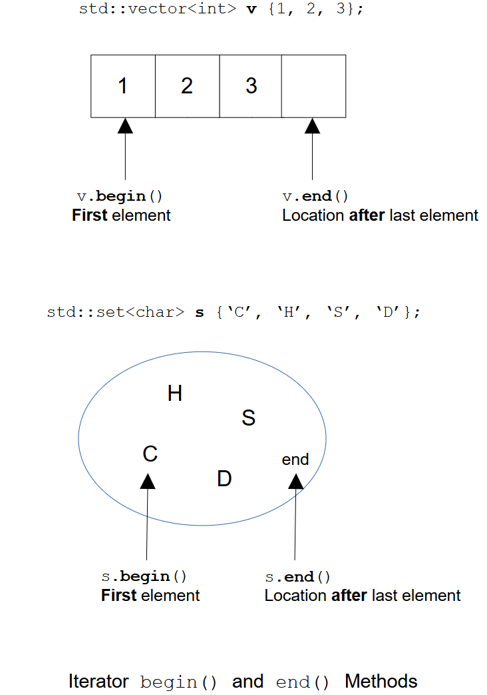

[Home](../../) | [Projects](../../projects) | [Notes](../) > <a href="./">C++ Programming</a> > Introduction to STL Iterators

# Introduction to STL Iterators


## Iterators

* **Iterators** allow you to abstract any container as a sequence of elements, without needing to know how the container is implemented under the hood.
* They are implemented as **template classes** and behave like pointers by design—you can use operators like `*` (dereference), `++`/`--` (increment/decrement), etc.
* **Most container classes** support traversal using iterators.
  - **Exceptions** include container adapters such as `std::stack` and `std::queue`, which do not provide iterator access.

### Declaring Iterators

* Iterators must be declared based on the container type they will iterate over.

  ```cpp
  container_type::iterator_type iterator_name;
  ```

  ```cpp
  std::vector<int>::iterator it1; // Can only be used to iterate over 'vector<int>'
  std::list<std::string>iterator it2;
  std::map<std::string, std::string>::iterator it3;
  std::set<char>::iterator it4;
  ```

### `begin()` and `end()` Methods

* Note that the `end()` does not point to the last element but the one **PAST** the last element and is not dereferenceable. (Accessing `*end()` is undefined behavior.)





### Initializing Iterators

* To initialize iterators:

  ```cpp
  std::vector<int> v {1, 2, 3};
  std::vector<int>::itrator it = v.begin();
  ```

  or let the compiler deduce the type by using `auto` keyword:

  ```cpp
  auto it = v.begin();
  ```

  > More readable, writable and easier to debug.

  If the vector is empty, `v.begin()` will return `v.end()`. 

### Iterator Operations

* The following table sumarizes the most commonly used iterator operations.

  It is assumed that `it` is an iterator, and `i` is an integer.

  | Function                                             | Description                                          | Type of Iterator |
  | ---------------------------------------------------- | ---------------------------------------------------- | ---------------- |
  | `++it`                                               | Pre-increment                                        | All              |
  | `it++`                                               | Post-increment                                       | All              |
  | `it = it1`                                           | Assignment<br />(LHS and RHS types must be the same) | All              |
  | `*it`                                                | Dereference                                          | Input and output |
  | `it->`                                               | Arrow operator                                       | Input and output |
  | `it == it1`                                          | Comparison for equality                              | Input            |
  | `it != it1`                                          | Comparison for inequality                            | Input            |
  | `--it`                                               | Pre-decrement                                        | Bidirectional    |
  | `it--`                                               | Post-decrement                                       | Bidirectional    |
  | `it + i`, `it += i`<br />`it - i`, `it -= i`         | Increment and decrement                              | Random access    |
  | `it < it1`, `it <= it1`<br />`it > it1`, `it >= it1` | Comparison                                           | Random access    |

* Using iterators - `std::vector`

  ```cpp
  std::vector<int> v {1, 2, 3};
  std::vector<int>::iterator it = v.begin();
  while (it != v.end())
  {
      std::cout << *it << " ";
      ++it;
  }
  ```

  ```plain
  1 2 3
  ```

  Can also use `for` loop instead of `while` loop:

  ```cpp 
  for (auto it = v.begin(); it != b.end(); it++)
  {
      std::cout << *it << " ";
  }
  ```

  > This is how the range-based `for` loop works.

* Using iterators - `std::set`

  ```cpp
  std::set<char> s {'C', 'H', 'S', 'D'};
  auto it = s.begin();
  while (it != s.end())
  {
      std::cout << *it << " " << std::endl;
  }
  ```

  ```plain
  C H S D
  ```

  > The same pattern as with the `std::vector`.

### Reverse Iterators

* Reverse iterators works in reverse direction. The last element is the first and the first is the last. (`++` moves backward, `--` moves forward.)

  ```cpp
  std::vector<int> v {1, 2, 3};
  std::vector<int>::reverse_iterator rit = v.begin();	// Points to the last element
  while (rit != v.end())
  {
      std::cout << *it << " ";
      ++it; // Here ++ moves backward
  }
  ```

  ```plain
  3 2 1
  ```

### Other Iterators

* `begin()` and `end()` - `iterator`
* `cbegin()` and `cend()` - `const_iterator`
* `rbegin()` and `rend()` - `reverse_iterator`
* `crbegin()` and `crend()` -  `const_reverse_iterator`


## Project: Various Usages of Iterators

```cpp
#include <iostream>
#include <vector>
#include <set>
#include <map>
#include <list>

// Display any vector of integers using range-based for loop
void print(const std::vector<int> &v)
{
    std::cout << "[ ";
    for (auto const &n : v)
    {
        std::cout << n << " ";
    }
    std::cout << "]" << std::endl;
}

void test1(void)
{
    std::cout << "\nTEST1" << std::endl;
    
    std::vector<int> v{1, 2, 3, 4, 5};
    auto it = v.begin();	// Points to 1
    std::cout << *it << std::endl;
    
    it++;                   // Points to 2
    std::cout << *it << std::endl;
    
    it += 2;				// Points to 4
    std::cout << *it << std::endl;
    
	it -= 2;				// Points to 2
    std::cout << *it << std::endl;
    
    it = v.end() - 1;		// Points to 5
    std::cout << *it << std::endl;
    
}

// Display all vector elements using an iterator.
void test2(void)
{
    std::cout << "\nTEST2" << std::endl;

    std::vector<int> v{1, 2, 3, 4, 5};

    std::vector<int>::iterator it = v.begin();

    while (it != v.end())
    {
        std::cout << *it << std::endl;
        it++;
    }

    // Change all vector elements to 0.
    it = v.begin();
    while (it != v.end())
    {
        *it = 0;
        it++;
    }

    print(v);
}

// Using a const iterator.
void test3(void)
{
    std::cout << "\nTEST3" << std::endl;

    std::vector<int> v{1, 2, 3, 4, 5};
    std::vector<int>::const_iterator cit = v.begin();
    // auto cit = v.cbegin();

    while (cit != v.end())
    {
        std::cout << *cit << std::endl;
        cit++;
    }

    // Compiler error upon an attempt to change elements
    cit = v.begin();
    while (cit != v.end())
    {
        // *cit = 0;    // Compiler error - read only!
        cit++;
    }
}

// More iterators.
void test4(void)
{
    // Using a reverse iterator over a vector.
    std::vector<int> v{1, 2, 3, 4};
    auto rit = v.rbegin();  // Starts at 4.
    while (rit != v.rend())
    {
        std::cout << *rit << std::endl;
        rit++;
    }

    // Const reverse iterator over a list (implemented as doubly-linked list).
    std::list<std::string> l{"Kyungjae", "Sunny", "Yena"};
    auto crit = l.crbegin();    // Points to Yena.
    std::cout << *crit << std::endl;
    crit++;                     // Points to Sunny.
    std::cout << *crit << std::endl;

    // Iterator over a map.
    std::map<std::string, std::string> m{
        {"Kyungjae", "C++"},
        {"Sunny", "Python"},
        {"Yena", "Assembly"}
    };
    auto it = m.begin();    // Iterator over map of <string, string> pairs.
    while (it != m.end())
    {
        std::cout << it->first << ":" << it->second << std::endl;
        it++;
    }
}

// Iterator over a subset of a container
void test5(void)
{
    std::cout << "\nTEST5" << std::endl;
    
    std::vector<int> v{1, 2, 3, 4, 5, 6, 7, 8, 9, 10};
    auto s = v.begin() + 2; // Start
    auto e = v.end() - 3;   // End
    while (s != e)
    {
        std::cout << *s << std::endl;
        s++;
    }
}

int main(int argc, char *argv[])
{
    test1();
    test3();
    test3();
    test4();
    test5();
    return 0;
}
```

```plain

TEST1
1
2
4
2
5

TEST3
1
2
3
4
5

TEST3
1
2
3
4
5
4
3
2
1
Yena
Sunny
Kyungjae:C++
Sunny:Python
Yena:Assembly

TEST5
3
4
5
6
7
```

