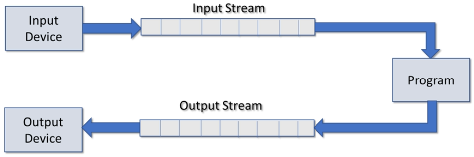

[Home](../../) | [Projects](../../projects) | [Notes](../) > <a href="./">C++ Programming</a> > I/O & Streams

# I/O & Streams


## Overview

* Streams and I/O
* Stream manipulators
* Reading and writing to a text file
* Using string streams


## Files, Streams and I/O





* C++ uses streams as an interface between the program, and input/output devices.
* Independent of the actual device
* Sequence of bytes
* Input stream provides data to the program
* Output stream receives data from the program

### Common Header Files

| Header File | Description                                                  |
| ----------- | ------------------------------------------------------------ |
| `iostream`  | Provides definitions for formatted input and output from/to streams |
| `fstream`   | Provides definitions for formatted input and output from/to FILE streams |
| `iomanip`   | Provides definitions for manipulators used to format stream I/O |

### Commonly Used Stream Classes

| Class          | Description                                                  |
| -------------- | ------------------------------------------------------------ |
| `ios`          | Provides basic support for formatted and unformatted I/O operations<br />(Base class for most other classes) |
| `ifstream`     | Provides for high-level input operations on file based streams |
| `ofstream`     | Provides for high-level output operations on file based streams |
| `fstream`      | Provides for high-level I/O operations on file based streams<br />(Derived from `ofstream` and `ifstream`) |
| `stringstream` | Provides for high-level I/O operations on memory based strings<br />(Derived from `istringstream` and `ostringstream`) |

### Global Stream Objects

* Global objects - Initialized before main executes
* Best practice is to use `cerr` for error messages and `clog` for log messages.

| Object | Description                                                  |
| ------ | ------------------------------------------------------------ |
| `cin`  | Standard input stream - by default 'connected' to the standard input device (i.e., keyboard).<br />Instance of `istream`. |
| `cout` | Standard output stream - by default 'connected' to the standard input device (i.e., console).<br />Instance of `ostream`. |
| `cerr` | Standard error stream - by default 'connected' to the standard error device (i.e., console).<br />Instance of `ostream (unbuffered)`. |
| `clog` | Standard error stream - by default 'connected' to the standard log device (i.e., console).<br />Instance of `ostream (unbuffered)`. |


## Stream Manipulators

* Streams have useful member functions to control formatting.

* Can be used on input and output streams

* The time of the effect on the stream varies

* Can be used as member functions or as a manipulator

  ```cpp
  std::cout.width(10);		// Member function
  std::cout << std::setw(10);	// Manipulator
  ```

  > Here, we'll focus on 'manipulator' usage.

* Common Stream Manipulators

  * Boolean
    * `boolalpha`, `noboolalpha`
  * Integer
    * `dec`, `hex`, `oct`, `showbase`, `noshowbase`, `showpos`, `noshowpos`, `uppercase`, `nouppercase`
  * Floating point
    * `fixed`, `scientific`, `setprecision`, `showpoint`, `noshowpoint`, `showpos`, `noshowpos`
  * Field width, justification and fill
    * `setw`, `left`, `right`, `internal`, `setfill`

  * Others
    * `endl`, `flush`, `skipws`, `noskipws`, `ws`

### Boolean

* Used to format boolean types

* Default when displaying boolean values is 1 or 0

* Sometimes the string true or false are more appropriate

* Formatting boolean types

  ```cpp
  std::cout << (10 == 10) << std::endl;		// 1
  std::cout << (10 == 20) << std::endl;		// 0
  ```

  ```cpp
  std::cout << std::noboolalpha;		// 1 or 0
  std::cout << std::boolalpha;		// true or fase
  ```

  > All further boolean output will be affected.

* Method version

  ```cpp
  std::cout.setf(std::ios::boolalpha);
  std::cout.setf(std::ios::noboolalpha);
  ```

* Reset to default

  ```cpp
  std::cout << std::resetiosflags(std::ios::boolalpha);
  ```

### Integer

* Default when displaying integer value is:

  * `dec` (base 10)
  * `noshowbase` - prefix used to show hexadecimal or octal
  * `nouppercase` - when displaying a prefix and hex values it will be lower case
  * `noshowpos` - no `+` is displayed for positive numbers

* These manipulators affect all further output to the stream.

* Setting base

  ```cpp
  int num{255};
  
  std::cout << std::dec << num << std::endl;		// 255
  std::cout << std::hex << num << std::endl;		// ff
  std::cout << std::oct << num << std::endl;		// 377
  ```

* Showing the base

  ```cpp
  int num{255};
  
  std::cout << std::showbase;						// std::noshowbase
  std::cout << std::dec << num << std::endl;		// 255
  std::cout << std::hex << num << std::endl;		// 0xff ('0x' prefix for hexadecimal)
  std::cout << std::oct << num << std::endl;		// 0377 ('0' prefix for octal)
  ```

  Displaying hex in uppercase

  ```cpp
  int num{255};
  
  std::cout << std::showbase << std::uppercase;	// std::nouppercase
  std::cout << std::hex << num << std::endl;		// 0XFF (note capitalized 'XFF')
  ```

* Displaying the positive sign

  ```cpp
  int num1{255};
  int num2{-255};
  
  std::cout << num1 << std::endl;		// 255
  std::cout << num2 << std::endl;		// -255
  
  std::cout << std::showpos;			// std::noshowpos
  
  std::cout << num1 << std::endl;		// +255
  std::cout << num2 << std::endl;		// -255
  ```

* Setting and resetting integer types

  Set using `setf`

  ```cpp
  std::cout.setf(std::ios::showbase);
  std::cout.setf(std::ios::uppercase);
  std::cout.setf(std::ios::showpos);
  ```

  Reset to defaults

  ```cpp
  std::cout << std::resetiosflags(std::ios::basefield);
  std::cout << std::resetiosflags(std::ios::showbase);
  std::cout << std::resetiosflags(std::ios::showpos);
  std::cout << std::resetiosflags(std::ios::uppercase);
  ```

### Floating Point

* Default when displaying floating point value is:

  * `setprecision` - number of digits displayed (6)
  * `fixed` - not fixed to a specific number of digits after the decimal point
  * `noshowpoint` - trailing zeros that are not displayed
  * `nouppercase` - when displaying in scientific notation
  * `noshowpos` - no `+` is displayed for positive numbers

* These manipulators affect all further output to the stream.

* Precision

  ```cpp
  double num{1234.5678};
  std::cout << num << std::endl;		// 1234.57	(Notice precision is 6 and rounding)
  ```

  ```cpp
  double num{123456789.987654321};
  std::cout << num << std::endl;		// 1.23457e+008 (Notice precision is 6)
  ```

  ```cpp
  double num{123456789.987654321};
  std::cout << std::setprecision(9);
  std::cout << num << std::endl;		// 123456790 (Note that rounding occurs)
  ```

* Fixed

  ```cpp
  double num{123456789.987654321};
  std::cout << std::fixed;
  std::cout << num << std::endl;		// 123456789.987654 (Precision 6 from the decimal)
  ```

  ```cpp
  double num{123456789.987654321};
  std::cout << std::setprecision(3) << std::fixed;
  std::cout << num << std::endl;		// 123456789.988 (Precision 3 from the decimal)
  ```

  > Note that rounding occurs.

* Scientific

  ```cpp
  double num{123456789.987654321};
  std::cout << std::setprecision(3) << std::scientific;
  std::cout << num << std::endl;		// 1.23e+008 (Precision 3)
  ```

  Scientific uppercase

  ```cpp
  double num{123456789.987654321};
  std::cout << std::setprecision(3) << std::scientific << std::uppercase;
  std::cout << num << std::endl;		// 1.23E+008 (Note the capital 'E')
  ```

* Displaying the positive sign

  ```cpp
  double num{123456789.987654321};
  std::cout << std::setprecision(3) << std::fixed << std::showpos;
  std::cout << num << std::endl;		// +123456789.988 (Note the leading '+')
  ```

* Trailing zeros

  ```cpp
  double num{12.34};
  std::cout << num << std::endl;		// 12.34	(Note no trailing zeros - default)
  std::cout << std::showpoint;
  std::cout << std::endl;				// 12.3400 (Note trailing zeros up to precision)
  
  ```

* Returning to general settings

  `unsetf`

  ```cpp
  std::cout.unsetf(std::ios::scientific | std::ios::fixed);
  ```

  or

  ```cpp
  std::cout << std::resetiosflags(std::ios::floatfield);
  ```

  Refer to the docs for other set/reset flags!

### Field Width, Align and Fill

* Default when displaying floating point value is:
  * `setw` - not set by default
  * `left` - when no field width, `right` - when using field width
  * `setfill` - not set by default (blank space is used by default)
* Some of these manipulators affect only the next data element put on the stream.

* Defaults

  ```cpp
  double num{1234.5678};
  std::string hello{"Hello"};
  std::cout << num << hello << std::endl;	// 1234.57Hello
  std::cout << num << std::endl;			// 1234.57
  std::cout << hello << std::endl;		// Hello
  ```

* Field width (`setw`)

  ```cpp
  double num{1234.5678};
  std::string hello{"Hello"};
  
  std::cout << std::setw(10) << num << hello << std::endl;
  // ---1234.57Hello ('-' represents space)
  ```

  ```cpp
  double num{1234.5678};
  std::string hello{"Hello"};
  
  std::cout << std::setw(10) << num 
      	  << std::setw(10) << hello
      	  << std::setw(10) << hello << std::endl;	
  // ---1234.57-----Hello-----Hello ('-' represents space)
  ```

  ```cpp
  double num{1234.5678};
  std::string hello{"Hello"};
  
  std::cout << std::setw(10)
      	  << std::left
      	  << num			// Only affects num!
      	  << hello << std::endl;	
  // 1234.57---Hello ('-' represents space)
  ```

  ```cpp
  double num{1234.5678};
  std::string hello{"Hello"};
  
  std::cout << std::setw(10) << num 
      	  << std::setw(10) << std::right << hello
      	  << std::setw(15) << std::right << hello
      	  << std::endl;	
  // ---1234.57-----Hello----------Hello ('-' represents space)
  ```

* Filling fixed width (`setfill`)

  ```cpp
  double num{1234.5678};
  std::string hello{"Hello"};
  
  std::cout << std::setfill('*');
  std::cout << std::setw(10)
  		  << num
      	  << hello << std::endl;	
  // ***1234.57Hello
  ```

  

## Reading from a Text File

### Input Files (`fstream` and `ifstream`)

* `fstream` and `ifstream` are commonly used for input files
  1. `#include <fstream>`
  2. Declare an `fstream` or `ifstream` object
  3. Connect it to a file on your file system (opens it for reading)
  4. Read data from the file via the stream
  5. Close the stream

* Opening a file for reading with `fstream`

  ```cpp
  std::fstream in_file{"../myfile.txt", std::ios::in};
  ```

  Opening for reading in binary mode

  ```cpp
  std::fstream in_file{"../myfile.txt", std::ios::in | std::ios::binary};
  ```

* Opening a file for reading with `ifstream`

  ```cpp
  std::ifstream in_file{"../myfile.txt", std::ios::in};
  std::ifstream in_file{"../myfile.txt"};
  ```

  Open for reading in binary mode

  ```cpp
  std::ifstream in_file{"../myfile.txt", std::ios::binary};
  ```

* Opening a file for reading with `open()`

  ```cpp
  std::ifstream in_file;
  std::string filename;
  std::cin >> filename;	// Get the file name
  
  in_file.open(filename);
  // Or
  in_file.open(filename, std::ios::binary);
  ```

* Check if file opened successfully (`is_open()`)

  ```cpp
  if (in_file.is_open())	// Or simply 'if (in_file)' to test the stream object
  {
      // Read from it
  }
  else
  {
      // File could not be opened
      // Does it exist?
      // Should the program terminate?
  }
  ```

* Closing a file

  Always close any open files to flush out any unwritten data!

  ```cpp
  in_file.close();
  ```

* Reading from files using `>>`

  * We can use the extraction operator for formatted read the same way we used it with `cin`.

  ```cpp
  int num{};
  double total{};
  std::string name{};
  
  in_file >> num;				// num <- 100
  in_file >> total >> name;	// total <- 176.64, name <- "Jack"
  ```

  Where the contents of `in_file` is

  ```plain
  100
  176.64
  Jack
  ```

* Reading from files using `getline()`

  We can use `getline()` to read the file one line at a time.

  ```cpp
  std::string line{};
  std::getline(in_file, line);	// line <- "This is a line"
  ```

  Where the contents of `in_file` is

  ```plain
  This is a line
  ```

* Reading a text file one line at a time

  ```cpp
  // Open file
  std::ifstream in_file{"../myfile.txt"};
  std::string line{};
  
  // Check if the file is open
  if (!in_file)
  {
      std::cerr << "File open error" << std::endl;
      return 1;	// Exit the program (main)
  }
  
  while (!in_file.eof()) 	// While not at the end
  {
      std::getline(in_file, line);	// Read a line
      std::cout << line << std::endl;		// Display the line
  }
  
  // Close the file
  in_file.close();
  ```

  The `while` loop in the example above can be re-written as

  ```cpp
  while (std::getline(int_file, line)) 	// While not at the end read a line
      std::cout << line << std::endl;
  ```

* Reading text file one character at a time (`get()`)

  ```cpp
  // Open file
  std::ifstream in_file{"../myfile.txt"};
  char c;
  
  // Check if the file is open
  if (!in_file)
  {
      std::cerr << "File open error" << std::endl;
      return 1;	// Exit the program (main)
  }
  
  while (!in_file.get(c)) 	// While not at the end read a character
  {
      std::cout << c;			// Display the character
  }
  
  // Close the file
  in_file.close();
  ```

  

## Writing to a Text File

### Output Files (`fstream` and `ofstream`)

* `fstream` and `ofstream` are commonly used for output files

  1. `#include <fstream>`
  2. Declare an `fstream` or `ofstream` object
  3. Connect it to a file on your file system (opens it for writing)
  4. Write data to the file via the stream
  5. Close the stream

* Note

  * Output files will be created if they don't exist.
  * Output files will be overwritten (truncated) by default.
  * Can be opened so that new writes append.
  * Can be open in text or binary modes.

* Opening a file for writing with `fstream`

  ```cpp
  std::fstream out_file{"../myfile.txt", std::ios::out};
  ```

  Opening for writing in binary mode

  ```cpp
  std::fstream out_file{"../myfile.txt", std::ios::out | std::ios::binary};
  ```

* Opening a file for writing with `ofstream`

  ```cpp
  std::ofstream out_file{"../myfile.txt", std::ios::out};
  std::ofstream out_file{"../myfile.txt"};
  ```

  Open for writing in binary mode

  ```cpp
  std::ofstream out_file{"../myfile.txt", std::ios::binary};
  ```

* Different actions upon opening a file for writing

  ```cpp
  // Truncate (discard contents) when opening
  std::ofstream out_file{"../myfile.txt", std::ios::trunc};
  // Append on each write
  std::ofstream out_file{"../myfile.txt", std::ios::app};
  // Seek to end of stream when opening
  std::ofstream out_file{"../myfile.txt", std::ios::ate};
  ```

* Opening a file for writing with `open()`

  ```cpp
  std::ofstream out_file;
  std::string filename;
  std::cin >> filename;	// Get the file name
  
  out_file.open(filename);
  // Or
  out_file.open(filename, std::ios::binary);
  ```

* Check if file opened successfully (`is_open()`)

  ```cpp
  if (out_file.is_open())	// Or simply 'if (out_file)' to test the stream object
  {
      // Write to it
  }
  else
  {
      // File could not be opened or created
      // Does it exist?
      // Should the program terminate?
  }
  ```

* Closing a file

  Always close any open files to flush out any unwritten data!

  ```cpp
  out_file.close();
  ```

* Writing to files using `<<`

  * We can use the insertion operator for formatted write the same way we used it with `cout`.

  ```cpp
  int num{100};
  double total{176.64};
  std::string name{"Jack"};
  
  out_file << num << "\n"
      	 << total << "\n"
      	 << name << std::endl;
  ```

  The contents of `in_file` will be

  ```plain
  100
  176.64
  Jack
  ```

* Copying a text file one line at a time

  ```cpp
  // Open files
  std::ifstream in_file{"../myfile.txt"};
  std::ofstream out_file{"../copy.txt"};
  
  // Check if the input file is open
  if (!in_file)
  {
      std::cerr << "File open error" << std::endl;
      return 1;	// Exit the program (main)
  }
  
  // Check if the output file is open
  if (!out_file)
  {
      std::cerr << "File create error" << std::endl;
      return 1;	// Exit the program (main)
  }
  
  std::string line{};
  
  while (std::getline(int_file, line)) 	// While not at the end read a line
      out_file << line << std::endl;		// Write a line to the output file
  
  // Close the files
  in_file.close();
  out_file.close();
  ```

* Copying a text file one character at a time (`get()`/`put()`)

  ```cpp
  // Open files
  std::ifstream in_file{"../myfile.txt"};
  std::ofstream out_file{"../copy.txt"};
  
  // Check if the input file is open
  if (!in_file)
  {
      std::cerr << "File open error" << std::endl;
      return 1;	// Exit the program (main)
  }
  
  // Check if the output file is open
  if (!out_file)
  {
      std::cerr << "File create error" << std::endl;
      return 1;	// Exit the program (main)
  }
  
  char c;
  
  while (!in_file.get(c)) 	// While not at the end read a character
  {
      out_file.put(c);		// Write the character to the file
  }
  
  // Close the files
  in_file.close();
  out_file.close();
  ```

  

## Using String Streams

* Allow us to read or write from strings in memory much as we would read/write to files
* Very powerful
* Very useful for data validation
* Using string streams 
  1. `#include <sstream>`
  2. Declare an `stringstream`, `istringstream`, or `ostringstream` object
  3. Connect it to a `std::string`
  4. Read/write data from/to the string stream using formatted I/O

* Reading from a `stringstream`

  ```cpp
  #include <sstream>
  
  int num{};
  double total{};
  std::string name{};
  std::string info{"Moe 100 1234.5"};
  
  std::istringstream iss{info};
  iss >> name >> num >> total;
  ```

* Writing to a `stringstream`

  ```cpp
  #include <sstream>
  
  int num{100};
  double total{1234.5};
  std::string name{"Moe"};
  
  std::ostringstream oss{};
  oss << name << " " << num << " " << total;
  std::cout << oss.str() << std::endl;
  ```

* Validating input with `stringstream`

  ```cpp
  int value{};
  std::string input{};
  
  std::cout << "Enter an integer: ";
  std::cin >> input;
  
  std::stringstream ss{input};
  if (ss >> value)
      std::cout << "An integer was entered";
  else
      std::cout << "An integer was NOT entered";
  ```
