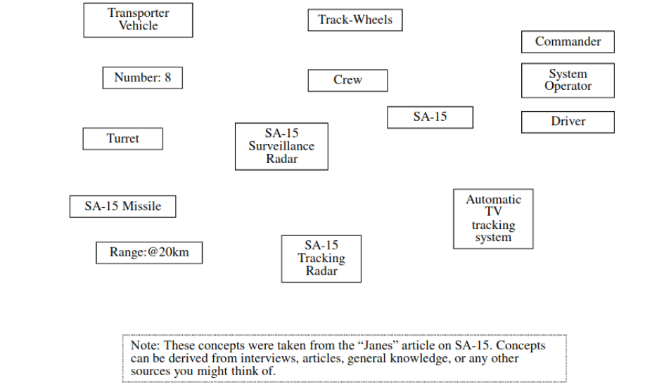
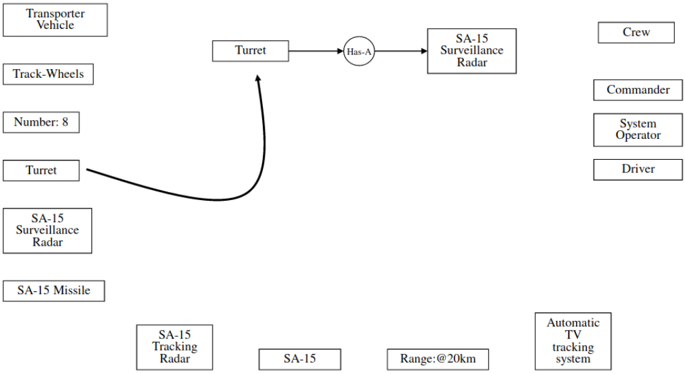
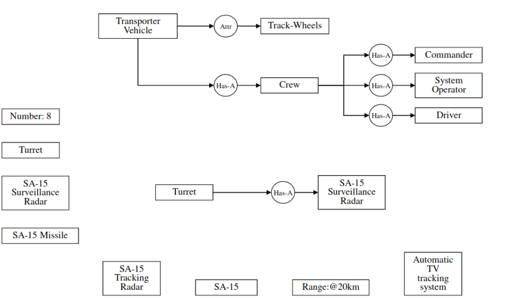
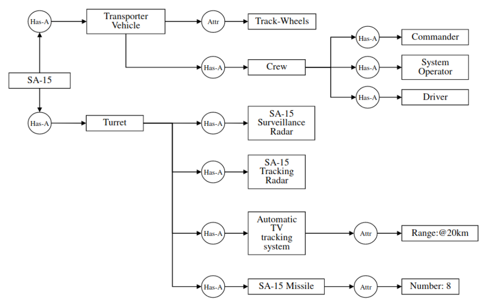
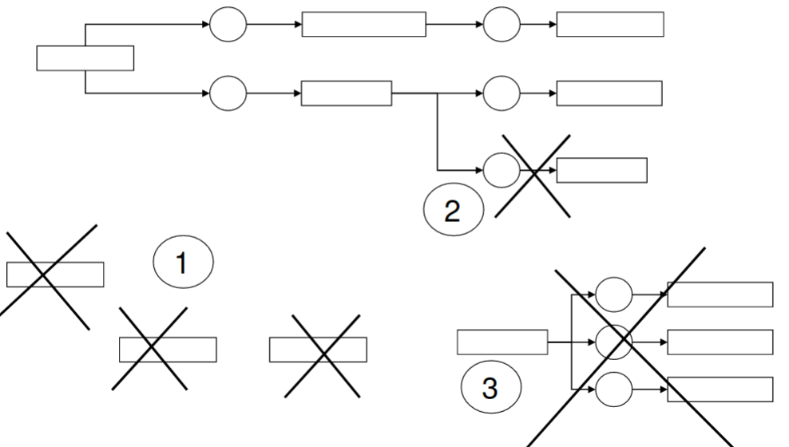
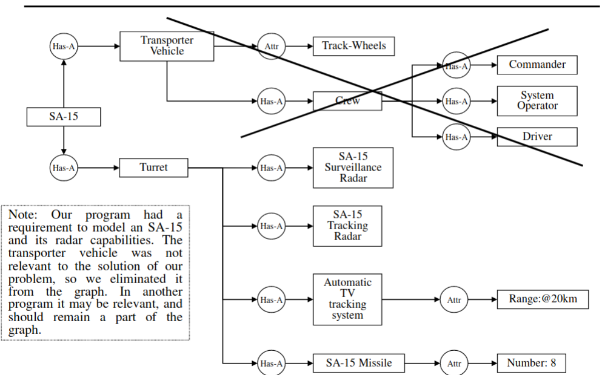
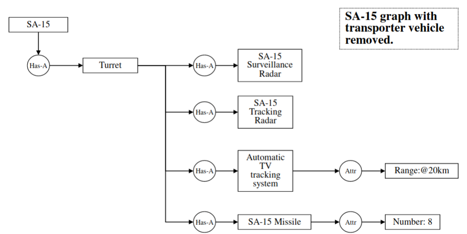

[Home](../../) | [Projects](../../projects) | [Notes](../) > <a href="./">C++ Programming</a> > Object-Oriented Design

# Object-Oriented Design

## Object-Oriented Design Concept

Object-Oriented Design provides a way to **elicit** and **format** human "KNOWLEDGE" in a way that a computer can process.

Accurate, complete, and a surprisingly high level of complexity in knowledge can be represented by using only **2 components**:
  1. Attributes
  2. Behavior

In addition, there are **3 basic relationships** in the design process:
1. Has-A (Composition relationship)
2. Is-A (Inheritance relationship)
3. Uses (Interaction relationship)

As you develop an OOD remember:
- OOD's are effective as a knowledge engineering and acquisition method in a situation where you have little or no understanding of the problem or environment you are working with.
- OOD's help in manifesting elements which contribute to the solution to the problem. They suppress elements which either confuse the understanding or contribute nothing to attaining a solution to the problem
- OOD's help in communicating understanding of a problem to others in a graphical and easy to understand format.
- OOD's are structured so a computer can use the knowledge.

## Object-Oriented Design Process (4 Basic Steps)

At the conclusion of this procedure you will have an OOD which is a **correct** and **complete** representation of the knowledge required to solve the problem. Furthermore, when defined in Object-Oriented Programming (OOP) class definitions the OOD will be in a format which a computer can use.

### 1. Generate

This step is a brainstorming session in which **concepts** are developed. Anything and everything is considered or used without constraint.

### 2. Relate

Now develop the relationships between concepts. The set of concepts are only limited by what you can think of. You may use relations beyond the OOD three to clarify a design.

**Process 1:**

**Process 2:**

**Process 3:**

### 3. Eliminate

Eliminate the following:
1. Concepts which have no relationship to other concepts
2. Concepts or sub-graphs which contribute nothing to the solution of the problem,
even though they are a valid part of the knowledge.
3. Sub-graph islands, which are sub-graphs which you can't fit into the main
conceptual graph using a relation.

**Concept:**

**Process:**

**Result:**

### 4. Iterate

The resulting graph will be incomplete, or incorrect. At this point, go through steps $$1-3$$ again and
  1. Find missing information
  2. Elaborate on concepts which require sub-graphs to fully represent
  3. Correct misunderstandings of the problem and errors in the knowledge representation

## References

Rheinfurth, K. (2022, November 8). Object-Oriented Design [Presentation]. University of Alabama in Huntsville, Huntsville, AL, United States.