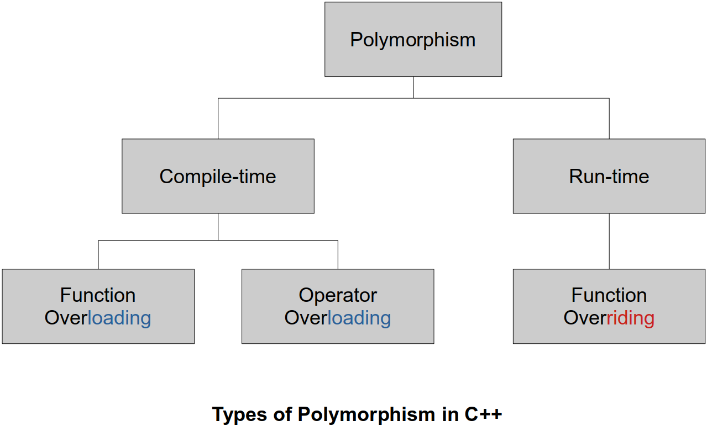
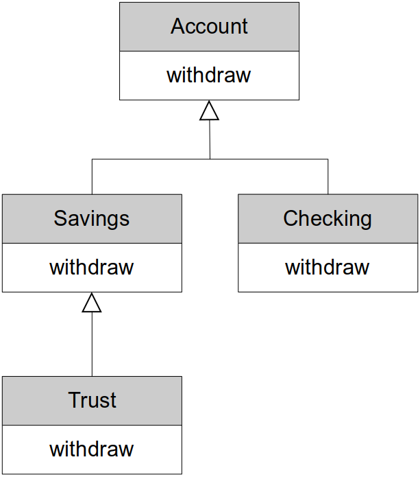
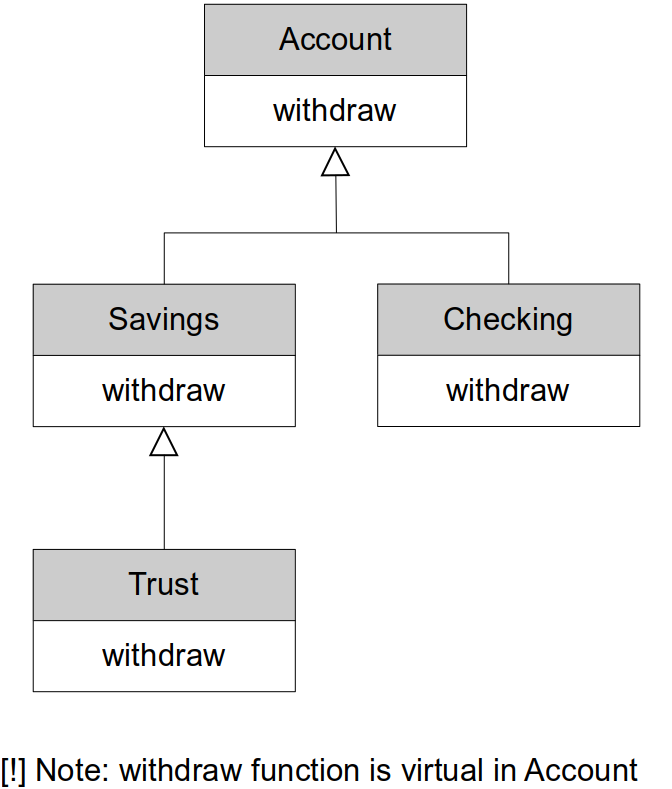
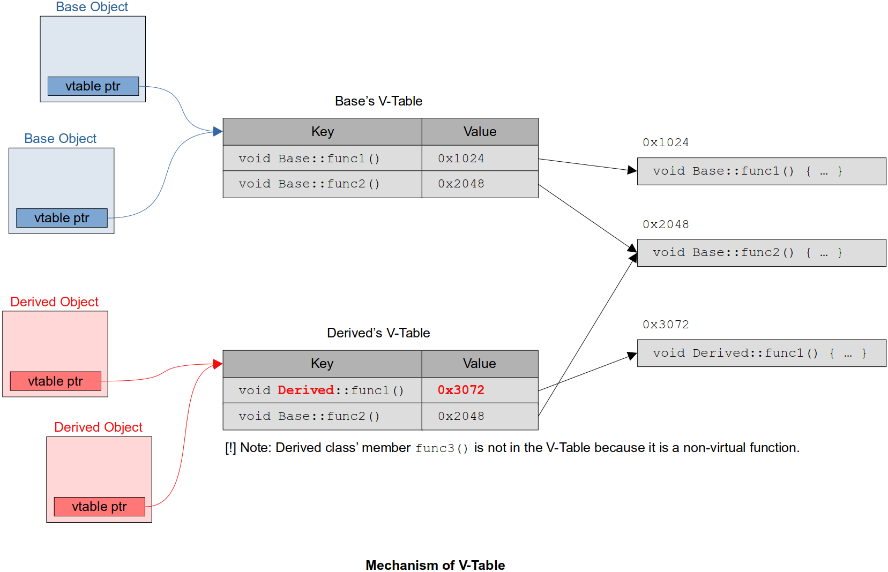

[Home](../../) | [Projects](../../projects) | [Notes](../) > <a href="./">C++ Programming</a> > Polymorphism

# Polymorphism


## Overview

* What is polymorphism?
* Using base class pointers
  * Takes class hierarchies to a new level and enables us to think more abstractly and not have to worry about details 
* Static vs. dynamic binding of function calls (pros vs. cons)
* Virtual functions
  * To achieve polymorphic functions (i.e., functions that are bound at run-time)
* Virtual destructors
* The `override` and `final` specifiers
* Using base class references
  * To achieve dynamic polymorphism.
* Pure virtual functions and abstract classes
  * Why we would want to use them as is and in interfaces.
* Abstract classes as interfaces


## What is Polymorphism?

* Polymorphism is fundamental part of Object-Oriented Programming, and it allows us to think more abstractly when we write programs.
    * We can think deposit or print or draw, instead of thinking in specific versions of deposit, print and draw.
    * e.g., I can simply think 'deposit a $1000 to this account' not having to worry about what kind of account it is. I'll be sure that the correct `deposit()` function will be called depending on what type of account I have. And this is all determined at run-time.

* **Polymorphism**
    - **Compile-time polymorphism** / early binding / static binding
        - Binding happens at compile time
        - e.g., Function overloading, operator overloading
    - **Run-time polymorphism** / late binding / dynamic binding
        - Binding happens at run-time
        - Requires:
          - Inheritance
          - Base class pointer or base class reference
          - Virtual functions
* Run-time polymorphism
    - Being able to assign different meanings to the same function at run-time
    - Although static binding helps fast execution of the program, sometimes we want things to be decided when program is running.
    - In C++ we can achieve this behavior by using base class pointers or references and declaring our functions as virtual functions.
* Allows us to program more abstractly
    - Think general vs. specific
    - Let C++ figure out which function to call at run-time
* Not the default in C++, run-time polymorphism is achieved via
    - Inheritance
    - Base class pointers or references
    - Virtual functions


## Types of Polymorphism in C++





## Static Binding vs. Dynamic Binding

### Example 1

* **A non-polymorphic example - static binding**
  
  
  
  
  
  
  
  ```cpp
  // Assume that each type of account has its own 'withdraw()' function
  
  Account a;
  a.withdraw(1000);     // calls Account::withdraw()
  
  Savings s;
  s.withdraw(1000);     // calls Savings::withdraw()
  
  Checking c;
  c.withdraw(1000);     // calls Checking::withdraw()
  
  Trust t;
  d.withdraw(1000);     // calls Trust::withdraw()
  
  Account *p = new Trust();
  p->withdraw(1000);    // calls Account::withdraw() 
                        // but, we want the Trust object on the heap uses its own version
                        // of withdraw (Trust::withdraw())
  ```
  > For the functions that are not delared as `virtual`, the compiler will, by default, perform **static binding** at compile time. At compile time, the compiler does not know what type of object the pointer `p` will be pointing to at run-time. All it knows at compile time is that `p` points to an `Account` type object. So, the compiler will go ahead and bind `Account`'s `withdraw()` function when it sees `p->withdraw(1000);`. 
  
  Let's see the following example:
  ```cpp
  void display_account(const Account &acc)
  {
      acc.display();    // regardless of what object was passed in this will always use 
                        // Account::display() because of the way the parameter acc was
                        // declared
  }
  
  Account a;
  display_account(a);
  
  Savings s;
  display_account(s);
  
  Checking c;
  display_account(c);
  
  Trust t;
  display_account(t);
  ```
  > Whatever the object passed into the function `display_account()` is, the function will display only the `Account` part of the passed object. 
  >
  > There is a way for C++ to ask the `Account` object being passed in what kind of account they are, and then depending on that, we can have `if...else` statements that call the appropriate display methods. That's a bad coding practice, and it also makes us program less abstractly since then we have to figure out what kind of object we have and then call its functions.
  >
  > $\to$ This is where the **run-time polymorphism** comes into play!
  
* **A polymorphic example - dynamic binding**
  
  Using `virtual` functions allow us to use run-time polymorphism when using base class pointers or references.
  
  
  
  
  
  
  
  
  
  ```cpp
  // Assume that each type of account has its own 'withdraw()' function
  
  Account a;
  a.withdraw(1000);     // calls Account::withdraw()
  
  Savings s;
  s.withdraw(1000);     // calls Savings::withdraw()
  
  Checking c;
  c.withdraw(1000);     // calls Checking::withdraw()
  
  Trust t;
  d.withdraw(1000);     // calls Trust::withdraw()
  
  Account *p = new Trust();
  p->withdraw(1000);    // calls Trust::withdraw() 
                                 -----
  ```
  > The idea of using `virtual` functions tells the compiler not to bind it at compile-time, but instead, defer the binding to run-time. And at run-time, a check will occur to see exactly what `p` is pointing to and then that object's function will be called.
  
  ```cpp
  void display_account(const Account &acc)
  {
      acc.display();    // will now always call the display function depending on the
                        // passed object's type at RUN-TIME!
  }
  
  Account a;
  display_account(a);
  
  Savings s;
  display_account(s);
  
  Checking c;
  display_account(c);
  
  Trust t;
  display_account(t);
  ```
  > The binding of `acc.display()` will take place at run-time and call the `display()` function based on the type of object being passed in.
  
* This is very powerful!!!

  I can now write functions, methods, and data structures that use pointers and references to base class objects, and I know that the correct functions will be called at run-time.

### Example 2

* **A non-polymorphic example - static binding**    
  Following example addresses the limitation of static binding and the necessity for dynamic binding.
  
  ```cpp
  #include <iostream>
  #include <memory>   // smart pointer
  
  class Base
  {
  public:
      void say_hello() const
      {
          std::cout << "Hello, I'm a Base class object" << std::endl;
      }
  };
  
  class Derived: public Base
  {
  public:
      void say_hello() const
      {
          std::cout << "Hello, I'm a Derived class object" << std::endl;
      }
  };
  
  void greetings(const Base &obj)     // this parameter can take
  {                                   // 1) Base class object
      std::cout << "Greetings: ";     // 2) any object of Base class' derived class
      obj.say_hello();                // because derived class 'is-a' base class
  
      // whatever type of object is passed in, since say_hello() function is not virtual,
      // the compiler has no choice but to recognize obj as Base class object and therefore
      // obj.say_hello() will always call Base::say_hello()
  }
  
  int main(int argc, char *argv[])
  {
      Base b;
      b.say_hello();  // compiler will see that this is not a virtual function (i.e., no
                      // dynamic polymorphism associated with it), and it knows that it
                      // needs to bind this statically (compiler only knows at compile-time
                      // that b is the type of Base so it is going to bind Base class'
                      // say_hello() function to this statement)
      Derived d;
      d.say_hello();  // similarly, the compiler will statically bind Derived class'
                      // say_hello() function to this statement
  
      // problem occurs when using the base class pointer or reference
  
      greetings(b);   // Greetings: Hi, I'm a Base class object
      greetings(d);   // Greetings: Hi, I'm a Base class object
  
      Base *ptr = new Derived();  // ptr can hold address of any Base object and Derived
                                  // 'is-a' Base object (so this is perfectly legal)
  
      ptr->say_hello();   // but here, since say_hello() is not virtual, the compiler has to
                          // bind it statically and since ptr is of type Base*,
                          // Base::say_hello() will be bound to this statement
  
      // smart pointer is no exception
      std::unique_ptr<Base> ptr1 = std::make_unique<Derived>();
      ptr1->say_hello();  // Hi, I'm a Base class object
  
      delete ptr;
  
      return 0;
  }
  ```
  ```text
  Hello, I'm a Base class object
  Hello, I'm a Derived class object
  Greetings: Hello, I'm a Base class object
  Greetings: Hello, I'm a Base class object
  Hello, I'm a Base class object
  Hello, I'm a Base class object
  ```


## Using a Base Class Pointer

* Let's assume that the following example uses the **dynamic polymorphism**:
  
  
  
  
  
  
  
  
  ```cpp
  Account *p1 = new Account();
  Account *p2 = new Savings();
  Account *p3 = new Checking();
  Account *p4 = new Trust();
  
  p1->withdraw(1000);   // Account::withdraw()
  p2->withdraw(1000);   // Savings::withdraw()
  p3->withdraw(1000);   // Checking::withdraw()
  p4->withdraw(1000);   // Trust::withdraw()
  
  // delete pointers
  ```
  > Now, we can call the `withdraw()` function using the base class pointers and C++ will figure out which function to bind at run-time based on the type of the object being pointed to by each pointer.
  
  Using this feature, above code can be rewritten more concisely as follows:
  ```cpp
  Account *p1 = new Account();
  Account *p2 = new Savings();
  Account *p3 = new Checking();
  Account *p4 = new Trust();
  
  Account *array[] = {p1, p2, p3, p4};
  
  for (auto i = 0; i < 4; ++i)
      array[i]->withdraw(1000);
  
  // delete pointers
  ```
  > This example shows what "**Programming more abstractly or generally**" means! Here, you are simply thinking 'call the `withdraw()` function for each account in the array.' That's it!  No more details required! $\to$ Programming more abstractly!
  
  Similarly, this code can be rewritten using `vector` and range based `for` loop as follows:
  ```cpp
  Account *p1 = new Account();
  Account *p2 = new Savings();
  Account *p3 = new Checking();
  Account *p4 = new Trust();
  
  vector<Account*> accounts {p1, p2, p3, p4};
  
  for (auto acc_ptr : accounts)
      acc_ptr->withdraw(1000);
  
  // delete pointers
  ```
  Think about what would happen if we added another class to our account hierarchy, say a `Bond` account. None of the code that we have that works with account objects needs to be changed. Since a bond account is an account, it will automatically work with our existing code.
  
  [!] Note: Be careful when you're using raw pointers and collections such as vectors. It is better to use smart pointers in this type of examples.


## `virtual` Functions

* `virtual` functions in a base class MUST be "defined" unless they are declared using the `pure` specifier.

* Redefined functions are bound statically
    - When we derive a class from base class, we can redefine the base class' functions behaviors in the derived class. This creates a specialized version of the function specific to the derived class.
    - If we don't use the `virtual` keyword with these functions, then they're statically bound at compile-time.
    
* Overridden functions are bound dynamically.
    - We do this by declaring the function to be `virtual`.
    
* `virtual` functions are overridden functions.

    * Allows us to think abstractly by treating all objects in the hierarchy as objects of the base class.
    * Once we declare a function as virtual, then that function is virtual all the way down the class hierarchy from this point forward.

* Declaring `virtual` functions in the **base class**:
    - Declare the function you want to override as virtual in the base class
    - Virtual functions are virtual all the way down the hierarchy from this point
    - Dynamic polymorphism only via the base class pointer or reference 
      ```cpp
      // base class
      class Account 
      {
      public:
          virtual void withdraw(double amount) { /* code */ };
          . . .
      };
      ```
      > This makes `withdraw()` a `virtual` function which means it can be overridden in derived classes and will be bound dynamically at run-time when we use a base class pointer or reference.

* Declaring `virtual` functions in the **derived class**:
    - Override the function in the derived classes
    - Function signature and return type must match EXACTLY
        - If does not match, the compiler will regard it as redefinition and statically bind it.
    - Once declared as a virtual function, the `virtual` keyword is no longer required but is best practice to specify it down the class hierarchy.
    - If you don't provide an overridden version it is inherited from it's base class
      ```cpp
      // derived class
      class Checking : public Account
      {
      public:
          virtual void withdraw(double amount) { /* code */ };
          . . .
      };
      ```

* Remember! `virtual` functions are **dynamically** bound ONLY when they are called via a base class pointer or reference.  Otherwise, they are **statically** bound.

* Whenever you have `virtual` functions, you need to have `virtual` destructors.


## `virtual` Destructors

* Problems can happen when we destroy polymorphic objects.

    * e.g., Deleting a polymorphic object that doesn't have a virtual destructor could lead to unexpected behavior.

* If a derived class is destroyed by deleting its storage via the base class pointer and the class does not have a `virtual` destructor, then the behavior is undefined by the C++ standard.

    * If this is the case, only the destructor of the pointer type class (i.e., base class) will be called and it is possible that the derived class' specific operations will not go through the proper termination process (e.g., writing buffers out, closing files, deleting pointers to the dynamically allocated memory space, etc.) which could potentially lead to a serious situation such as memory leak.
* Derived objects must be destroyed in the correct order starting at the correct
* If a class has a `virtual` functions, ALWAYS provide a public `virtual` destructor. If base class destructor is `virtual` then all derived destructors are also `virtual`.   (No need to provide the `virtual` keyword again, but it's best practice to do so.)
  ```cpp
  // base class
  class Account
  {
  public:
      virtual void withdraw(double amount) { /* code */ };
      virtual ~Account();   // simple solution for the potentially serious situation
      . . .
  };
  
  // derived class
  class Checking : public Account
  {
  public:
      virtual void withdraw(double amount) { /* code */ };
      virtual ~Checking();  // simple solution for the potentially serious situation
      . . .
  };
  ```
  If none of these class had `virtual` destructor
  ```cpp
  Account *p = new Checking();
  
  delete p;     // this will call the destructor of Account class ONLY! leaving behind 
                // some of the Checking object's attributes not taken care of
  ```
* Rule is simple!
    - If you've got a class and it's got a `virtual` function, give it a `virtual `destructor as well.
    - FYI, there's no such thing as a `virtual` constructor and it doesn't even makes sense at all.


## The `override` Specifier

* We can override base class virtual functions.
* The function signature and return type must be EXACTLY the same.
    - If they are different then we have redefinition NOT overriding.
    - This small mistake is really difficult to spot. So, be careful!
* Redefinition is statically bound.
* Overriding is dynamically bound.
* C++11 provides the `override` specifier to have the compiler ensure overriding.
    - You can add this specifier to the functions you're writing in your derived class, and the C++ compiler will ensure that you're indeed overriding and not redefining.
    - This is a simple addition to the language but a very useful one.

* Example:

  ```cpp
  class Base
  {
  public:
      virtual void say_hello const
      {
          std::cout << "Hello - I'm a Base class object" << std::endl;
      }
      virtual ~Base() {}
  };
  
  class Derived : public Base
  {
  public:
      virtual void say_hello()
      {
          // Notice I forgot the const - NOT OVERRIDING!
          std::cout << "Hello - I'm a Derived class object" << std::endl;
      }
      virtual ~Derived();
  };
  ```

  > L14: Since the function signatures are not exactly the same, the C++ compiler considers this function redefinition and NOT overriding. It will compiler just fine since this is perfectly legal.

  ```cpp
  Base *p1 = new Base();
  p1->say_hello();		// "Hello - I'm a Base class object" (Bound dynamically)
  
  Base *p2 = new Derived();
  p2->say_hello();		// "Hello - I'm a Base class object" (Bound statically to base class' method)
  ```

  > Not what we expected!
  >
  > `say_hello()` function signatures are different, so `Derived` redefines `say_hello` instead of overriding it!

  We can easily prevent this error by using the C++11 `override` specifier.

  ```cpp
  class Base
  {
  public:
      virtual void say_hello const
      {
          std::cout << "Hello - I'm a Base class object" << std::endl;
      }
      virtual ~Base() {}
  };
  
  class Derived : public Base
  {
  public:
      virtual void say_hello() override	// Produces compiler error (Error: marked override but does not override)
      {
          std::cout << "Hello - I'm a Derived class object" << std::endl;
      }
      virtual ~Derived();
  };
  ```

  > L14: Now with the `oeverride` keyword, the compiler will generate an error that will help us fix the hard-to-spot issue.


## `final` Specifier

* C++11 provides the `final` specifier which can be used in two contexts.

  * When used at the class level, it prevents a class from being derived from or subclassed.
    * In some cases, this is done for better compiler optimization.
    * Other times, it may be done to ensure that objects are copied safely without slicing.
    * This is done for better compiler optimization.
  * When used at the method level, it prevents virtual method from being overridden in derived classes.
    * This can also be done for better compiler optimization.

* Example - `final` keyword used at the class level

  ```cpp
  class My_Class final				// My_Class cannot be derived from
  {
      ...
  };
  
  class Derived final : public Base	// Derived cannot be derived from
  {
      ...
  };
  ```

  > If you try to derive a class from these classes, the compiler will generate a compiler error.

* Example - `final` keyword used at the method level

  ```cpp
  class A
  {
  public:
      virtual void do_something();
  };
  
  class B : public A
  {
      virtual void do_something() final;	// prevent further overriding
  };
  
  class C: public B
  {
  	virtual void do_something();		// COMPILER ERROR - Can't override  
  };
  ```

  


## Using Base Class Reference

* We can also use base class references and have polymorphic function calls as we could by using the base class pointers.

* Useful when we pass objects to functions that expect a base class reference

* Example of using references to achieve dynamic binding of `virtual` functions:
  
  
  
  
  
  
  
  
  ```cpp
  Account a;
  Account &ref = a;
  ref.withdraw(1000);   // Account::withdraw()
  
  Trust t;
  Account &ref1 = t;
  ref1.withdraw(1000);  // Trust::withdraw() <--- dynamic bound!
  ```
  Also,
  ```cpp
  void do_withdraw(Account &account, double amount)
  {
      account.withdraw(amount); // since withdraw() is a virtual function, it is bound dynamically
  }
  
  Account a;
  do_withdraw(a, 1000); // Account::withdraw()
  
  Trust t;
  do_withdraw(t, 1000); // Trust::withdraw()
  ```


## Abstract Classes and Pure `virtual` Functions

* Abstract class
    - Cannot instantiate objects
    - These classes are used as base classes in inheritance hierarchies
    - Often referred to as **Abstract Base Class**
    - Too generic to create objects from
        - e.g., `Shape`, `Employee`, `Account`, `Player`, etc.
    - Serves as parent to derived classes that may have objects
    - Contains at least one **pure virtual function**
* Concrete class
    - Used to instantiate objects from
    - All their member functions must be "defined"
        - e.g., `Checking Account`, `Savings Account` in an account hierarchy
        - e.g., `Faculty`, `Staff` in an employee hierarchy
        - e.g., `Enemy`, `Level Boss` in a player hierarchy

  [!] Note: If there is an intermediary class that inherits the base class but does not implement (define) the pure virtual function(s) that it inherited, then that intermediary class is also **abstract base class**.

### Pure Virtual Function

* Used to make a class abstract
* Specified with `=0` in its declaration
  ```cpp
  virtual void function() = 0;  // pure virtual function
  ```
* Typically do not provide implementations since it's really up to the derived concrete classes to define this behavior  (But, it is possible to give them an implementation)

  * This is very useful when it doesn't make sense for a base class to have an implementation, but it does make sense in concrete classes.	
* Derived classes MUST override the pure virtual functions in the base class in order for it to be a concrete class.
* If the derived class does not override then the derived class is also abstract 
* Used when it doesn't make sense for a base class to have an implementation  (But, concrete classes must implement it)
  ```cpp
  virtual void draw() = 0;      // in the Shape class
  ```
  The concept of a shape is too general or too abstract to have shape objects in our system. So, we can define the `draw()` function as a pure virtual function in the shape class, and that not only makes it an abstract class, but it also forces all derived classes to implement the draw function if they want to be concrete classes.

  Same thing can be said about the `Player` class:
  ```cpp
  virtual void defend() = 0;    // in the Player class
  ```
* Examples

  Following `Shape` class has pure virtual functions so it is *abstract class* and therefore cannot directly instantiate objects.
  ```cpp
  class Shape       // abstract class
  {
  private:
      // attributes common to all shapes
  public:
      virtual void draw() = 0;      // pure virtual function 
      virtual void rotate() = 0;    // pure virtual function 
      virtual ~Shape();
      . . .
  };
  
  . . .
  
  Shape shape;              // Compiler ERROR: Can't instantiate an abstract class
  Shape *p = new Shape();   // Compiler ERROR: Can't instantiate an abstract class
  ```
  Following `Open_Shape` class is still an abstract class because it does not override the virtual functions declared in its base (`Shape`) class.
  ```cpp
  class Open_Shape : public Shape   // abstract class
  {
  public:
      virtual ~Open_Shape() {}
  };
  ```
  Following `Circle` class has no pure virtual functions so it is *concrete class* and therefore can instantiate objects.  (All virtual functions of the base class are overridden.)

  ```cpp
  class Circle : public Shape   // concrete class
  {
  private:
      // attributes common to all shapes
  public:
      virtual void draw() override      // override keyword is not mandatory here
      {
          // code to draw a circle
      }
      virtual void rotate() override    // override keyword is not mandatory here
      {
          // code to rotate a circle
      }
      virtual ~Circle();
      . . .
  };
  
  . . .
  
  Shape *p = new Circle();  // OK
  p->draw();                // OK
  p->rotate();              // OK
  ```
* The real power of the pure virtual functions is to really force all the derived concrete classes to implement those functions.


## Abstract Classes as Interfaces

* An **interface class** in C++ is a class that has only pure virtual functions. 
    - These functions provide a general set of services that users of the class can use.
    - In order for them to be useful, these pure virtual functions must be declared as public.
    - Any class that wants to be a concrete class and support the interface provided by the interface class can override the pure virtual functions and implement these services as needed.
    - Remember, every service must be implemented, and C++ will strictly enforce type information. So, when overriding the function, prototypes must match exactly.
    
* Unlike Java and C#, C++ does not provide a specific keyword or way to create an interface as part of the c++ core language. Therefore, in C++ we use **abstract classes with pure virtual functions** to achieve the concept of an interface.
  
* Example 1

  Suppose we want to be able to provide `Printable` support for any object we wish without knowing it's implementation at compile time.
  ```cpp
  std::cout << any_object << std::endl;
  ```
  Then, `any_object` must conform to the `Printable` interface.
  ```cpp
  class Printable 
  {
      friend ostream& operator<<(ostream&, const Printable &obj);
          // this friend function will allow us to print any type of object that conforms
          // to this interface
  public:
      virtual void print(ostream &os) const = 0;
      virtual ~Printable() {};
      . . .
  };
  
  // overloaded operator function
  // - this would dynamically bind to the print() function of whatever object type was
  //   passed in since we know that that object is printable and we have a reference to
  //   it
  ostream& operator<<(ostream &os, const Printable &obj)
  {
      obj.print(os);
      return os;
  }
  
  class Any_Class : public Printable
  {
  public:
      // must override Printable::print()
      virtual void print(ostream &os) override
      {
          os << "Hi from Any_Class";
      }
      . . .
  };
  ```
  [!] Note: Here the overloaded operator function is not a member function of `Print` class, and therefore will not be inherited down to the class hierarchy.
  
  Now, `Any_Class` is printable. Let's create `Any_Class` objects and print them:
  ```cpp
  Any_Class *p = new Any_Class();
  cout << *p << endl;
  
  void function1(Any_Class &obj)
  {
      cout << obj << endl;
  }
  
  void function2(Printable &obj)
  {
      cout << obj << endl;
  }
  
  function1(*p);    // "Hi from Any_Class"
  function2(*p);    // "Hi from Any_Class"
  ```
  
* Example 2

  Here, we have a `Shape` class that only has pure virtual functions. So, it's an **abstract class**, and it can also be used as an **interface class**.
  ```cpp
  class I_Shape
  {
  public:
      virtual void draw() = 0;
      virtual void rotate() = 0;
      virtual ~Shape() {};
      . . .
  };
  ```
  Sometimes you'll see classes that are intended to be used as interface classes names with a capital "`I_`" preceding the class name.
  
  A concrete class `Circle` can be written as:
  ```cpp
  class Circle : public I_Shape
  {
  public:
      virtual void draw() override { /* code */ };
      virtual void rotate() override { /* code */ };
      virtual ~Circle();
      . . .
  };
  ```
  So, we can now use pointers to `I_Shape` obejcts to use dynamic polymorphism.
  ```cpp
  vector<I_Shape*> shapes;
  
  I_Shape *p1 = new Circle();
  I_Shape *p2 = new Line();
  I_Shape *p3 = new Square();
  
  for (auto const &shape : shapes)
  {
      shape->rotate();
      shape->draw();
  }    
    
  // delete pointers
  ```
* Example 3 (Comprehensive)
  ```cpp
  #include <iostream>
  
  class I_Printable
  {
      friend std::ostream& operator<<(std::ostream &os, const I_Printable &obj);
  public:
      virtual void print(std::ostream &os) const = 0;
  };
  
  // all the classes we are going to define in this example are I_Printable's derived
  // class so by using the base class reference 'obj' we will be able to use dynamic
  // polymorphism to match the appropirate one
  std::ostream& operator<<(std::ostream &os, const I_Printable &obj)
  {
      obj.print(os);
      return os;
  }
  
  class Account : public I_Printable
  {
  public:
      virtual void withdraw(double amount)
      {
          std::cout << "Account::withdraw()" << std::endl;
      }
      virtual void print(std::ostream &os) const override
      {
          os << "Account display";
      }
      virtual ~Account() {}
  };
  
  class Checking : public Account
  {
  public:
      virtual void withdraw(double amount)
      {
          std::cout << "Checking::withdraw()" << std::endl;
      }
      virtual void print(std::ostream &os) const override
      {
          os << "Checking display";
      }
      virtual ~Checking() {}
  };
  
  class Savings : public Account
  {
  public:
      virtual void withdraw(double amount)
      {
          std::cout << "Savings::withdraw()" << std::endl;
      }
      virtual void print(std::ostream &os) const override
      {
          os << "Savings display";
      }
      virtual ~Savings() {}
  };
  
  class Trust : public Account
  {
  public:
      virtual void withdraw(double amount)
      {
          std::cout << "Trust::withdraw()" << std::endl;
      }
      virtual void print(std::ostream &os) const override
      {
          os << "Trust display";
      }
      virtual ~Trust() {}
  };
  
  class Dog : public I_Printable
  {
  public:
      virtual void print(std::ostream &os) const override
      {
          os << "Woof woof";
      }
      virtual ~Dog() {}
  };
  
  // this function will take any derived class objects of I_Printable 
  // (e.g., Account objects, Savings objects, Dog objects, etc.)
  void print(const I_Printable &obj)
  {
      std::cout << obj << std::endl;
  }
  
  int main(int argc, char *argv[])
  {
      // static binding
  
      Account a;
      std::cout << a << std::endl;      // Account display
  
      Checking c;
      std::cout << c << std::endl;      // Checking display
  
      Savings s;
      std::cout << s << std::endl;      // Savings display
  
      Trust t;
      std::cout << t << std::endl;      // Trust display
  
      Dog d;
      std::cout << d << std::endl;      // Woof woof
      
      // dynamic binding
  
  	Account *p1 = new Account();
  	std::cout << *p1 << std::endl;    // Account display
  
  	Account *p2 = new Checking();
  	std::cout << *p2 << std::endl;    // Checking display
  
      Dog *p3 = new Dog();
  	std::cout << *p3 << std::endl;    // Woof woof
  
  	print(*p3);   // Woof woof
  
      return 0;
    }
  ```
  
  ```plain
  Account display
  Checking display
  Savings display
  Trust display
  Woof woof
  Account display
  Checking display
  Woof woof
  Woof woof
  ```
  
  


## V-Table (Virtual Table)

* Example
  ```cpp
  #include <iostream>
  
  class Base
  {
  public:
      virtual void func1() { std::cout << "func1()" << std::endl; }
      virtual void func2() { std::cout << "func2()" << std::endl; }
  };
  
  class Derived : public Base
  {
  public:
      virtual void func1() { std::cout << "Derived::func1" << std::endl; }
      void         func3() { std::cout << "func3" << std::endl; }
  };
  
  int main(int argc, char *argv[])
  {
      Base *p1 = new Base();
      p1->func1();
  
      Base *p2 = new Derived();
      p2->func1();
  }
  ```
  ```text
  func1()
  Derived::func1
  ```





## Advantages Polymorphism Has Over Normal Inheritance

* Polymorphism helps make your code simpler, more scalable, more general, etc.
    - Gives you ability to access to all the derived classes and their features through the base class pointer or reference.
* If you did not have polymorphism, and you have a container that contains the derived classes you to do something with:
    - You would go through the iterator and grab every object out of the iterator, then you would have to ask the object "what are you?" and then you would down cast that to the pointer of that object and then execute that behavior of that class object.
        - `siwtch-case` statement would be a good construct to use to implement this
          behavior without polymorphism
* With polymorphism, just by accessing the derived objects through the *base class pointer or reference* you will be able to execute those objects' specific behaviors.


## References

Mitropoulos, F. (2022). *Beginning C++ Programming - From Beginner to Beyond* [Video file]. Retrieved from  https://www.udemy.com/course/beginning-c-plus-plus-programming/