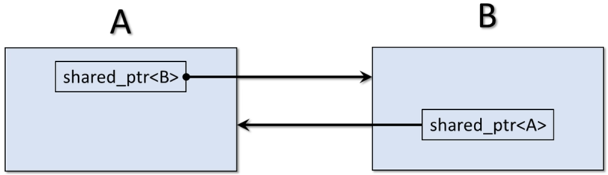
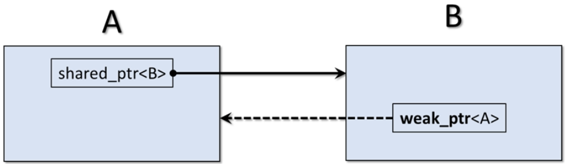

[Home](../../) | [Projects](../../projects) | [Notes](../) > <a href="./">C++ Programming</a> > Smart Pointers

# Smart Pointers


## Overview

* Issues with raw pointers
* What are smart pointers?
* Concept of ownership and RAII (Resource Acquisition is Initialization)
* C++ smart pointers:
  * `unique_ptr`
    * Used for exclusive ownership of dynamically allocated memory. When ownership is clear, it's easy to determine who is responsible for deleting the pointer—or rather, C++ takes care of it.
  * `shared_ptr`
    * Allows multiple owners to share access to the same heap-allocated object. The memory is automatically deallocated when the last `shared_ptr` referencing it is destroyed.
  * `weak_ptr`
    * Used in conjunction with `shared_ptr` to avoid cyclic references and dangling pointers. It does not contribute to the reference count.
* Custom deleters - C++ allows specifying a custom function to be called when deleting an object, enabling precise control over how resources are cleaned up.
* Ultimately, we want to write code that contains no explicit `new` or `delete` statements, allowing C++ to handle all memory management. If C++ can automatically clean up heap memory when a pointer is no longer needed, we can avoid memory leaks and eliminate the need to manually track the lifetime of pointers.


## Issues with Raw Pointers

* Raw pointers in C++ provide absolute flexibility with memory management:
  * Allocation
  * Deallocation
  * Lifetime management
* With this flexibility, however, comes complexity. We must explicitly allocate and deallocate storage for heap-dynamic variables and manage their lifetimes. Failing to do so can lead to several common issues:
  * Uninitialized (wild) pointers
    * These pointers may point to arbitrary memory locations. Attempting to store data at such locations can lead to unpredictable behavior or potentially catastrophic results.
  * Memory leaks
    * Occur when heap-allocated storage is not properly deallocated, leading to a gradual loss of available memory.
  * Dangling pointers
    * These are pointers that refer to memory that has already been deallocated. Using such invalid memory can cause undefined behavior and is often difficult to diagnose and fix.
  * Lack of exception safety
    * Even when memory management is done correctly, an exception might be thrown before the cleanup code executes, resulting in leaked memory.
  
  Most defects in programs written in languages that use raw pointers are related to improper pointer management. Smart pointers can help prevent these errors.
* Ownership
  * Who owns the pointer?
  * When should a pointer be deleted?


## What is Smart Pointer? (Ownership & RAII)

* Smart pointers are objects. They are implemented as C++ template classes, which can be instantiated.
* Can only point to heap-allocated memory and automatically call delete when no longer needed.
* Adhere to RAII principles
* C++ smart pointers:
  * `unique_ptr`
  * `shared_ptr`
  * `weak_ptr`
  * `auto_ptr` - Deprecated. Will NOT be discussing this one!
* `#include <memory>`
* Defined by class templates
  * Wrapper class that contain and manage a raw pointer. (The actual implementation of the smart pointers is compiler-dependent.)
  * Once created, they can be used in much the same way as raw pointers.
  * Overloaded operators:
    * Dereference (`*`)
    * Member selection (`->`)
    * Pointer arithmetic not supported (`++`, `--`, etc.)
  * Can have custom deleters to explicitly define the exact behavior you want when the pointer is about to be destroyed.

* A simple example of smart pointers

  ```cpp
  {
      std::smart_pointer<Some_Class> ptr = . . .
          
      ptr->method();
      cout << (*ptr) << endl;
  }
  // ptr will be destroyed automatically when no longer needed
  ```
  
  > Smart pointers help make your code easier to read and write, and maintain with less errors.

### RAII - Resource Acquisition Is Initialization

* RAII is a common idiom or design pattern in software design, based on object lifetime.
* RAII objects are typically allocated on the stack.
* **Resource Acquisition** refers to actions like opening a file, allocating memory, or acquiring a lock.
* **Is Initialization** means the resource is acquired in the constructor during object initialization.
* Resource release happens in the destructor. (e.g., closing a file, deallocating memory, or releasing a lock.)
* Smart pointers are examples of RAII classes because they manage memory resources following this pattern.


## C++ Smart Pointers

### Unique Pointers (`unique_ptr`)

* A `unique_ptr` provides **exclusive ownership** of a heap-allocated object, ensuring that only one pointer can manage the resource at any given time. The object is automatically deallocated when the `unique_ptr` goes out of scope.

* `unique_ptr<T>`
  
  * Points to an object of type `T` on the heap.
  * It is unique - there can only be one `unique_ptr<T>` pointing to the object on the heap.
  * Owns what it points to. (Strong ownership)
  * **Cannot** be copied or assigned. The copy constructor and copy assignment operator are deleted, so any attempt to copy or assign will result in a compilation error.
  * **Can** be moved, making them ideal for use in Standard Template Library (STL) containers such as `std::vector`.
  * Unique ownership ensures that when the smart pointer goes out of scope, the managed object is automatically deallocated from the heap.
  
* Creating, initializing and using:

  ```cpp
  {
      std::unique_ptr<int> p1{new int{100}};
      std::cout << *p1 << std::endl;		// 100
      *p1 = 200;
      std::cout << *p1 << std::endl;		// 200
  }
  // p1 gets deleted automatically
  ```

* Some other useful methods:

  ```cpp
  {
      std::unique_ptr<int> p1{new int{100}};
      std::cout << p1.get() << std::endl;		// 0x564388
      p1.reset();		// p1 is now nullptr
      
      if (p1)			// pointer initialization check (null pointer check)
          std::cout << *p1 << std::endl;		// Won't execute
  }
  // p1 gets deleted automatically
  ```

  > L4: `reset()` method sets the pointer to `nullptr` and the memory it points to will be released.

* User defined classes:

  ```cpp
  {
      std::unique_ptr<Account> p1{new Account{"Jack"}};
      std::cout << *p1 << std::endl;		// Display account
      
      p1->deposit(1000);
      p1->withdraw(500);
  }
  // p1 gets deleted automatically
  ```

  > L2: `Account` is used as the template argument in the `unique_ptr` declaration. This means that `p1` will manage a dynamically allocated `Account` object. The object is created in the initializer list.
  >
  > Once a `unique_ptr` is instantiated, it can be used just like a raw pointer.

* Vectors and move:

  ```cpp
  {
      std::vector<std::unique_ptr<int>> v;
      std::unique_ptr<int> ptr{new int{100}};
      v.push_back(ptr);	// Error - copy not allowed
      v.push_back(std::move(ptr));
  }
  // p1 gets deleted automatically
  ```

  > `unique_ptr`s cannot be copied or assigned.

* `make_unique` (C++14) - A better way to initialize `unique_ptr`s:

  The `make_unique()` function returns a `unique_ptr` of the specified type and allows us to pass initialization values to the constructor of the managed object. It is the recommended way to create `unique_ptr`s, offering improved safety and clarity while avoiding manual use of `new`.
  
  ```cpp
  {
      std::unique_ptr<int> p1 = make_unique<int>(100);
      std::unique_ptr<Account> p2 = make_unique<Account>("Jack", 4000);
      auto p3 = make_unique<Player>("Hero", 100, 100);
  }
  // p1 gets deleted automatically
  ```
  
  > L2: Declare `p1` as a `unique_ptr` to an `int`, and use `make_unique` to initialize the pointer, and then create the managed object all in one step. (Notice that the `new` keyword is not used here.)

### Shared pointers (`shared_ptr`)

* A `shared_ptr` provides **shared ownership** of a heap-allocated object, meaning multiple `shared_ptr` instances can manage the same resource, and the object is automatically deallocated when the last `shared_ptr` goes out of scope.

* `shared_ptr<T>`

  * Points to an object of type `T` on the heap.
  * It is not unique - there can be many `shared_ptr`s pointing to the same object on the heap.
  * Establishes a shared ownership relationship.
  * **Can** be assigned and copied.
  * **Can** be moved (move semantics are supported for efficiency).
  * Unlike `unique_ptr`, `shared_ptr` does not support managing arrays by default.
  * When the use count reaches zero, the managed heap object is automatically destroyed. 
    * Reference counting is straightforward but introduces some overhead. However, in most cases, this overhead is negligible compared to the benefits of having the system automatically manage shared objects.

* Creating, initializing and using:

  ```cpp
  {
      std::shared_ptr<int> p1{new int{100}};
      std::cout << *p1 << std::endl;		// 100
      *p1 = 200;
      std::cout << *p1 << std::endl;		// 200
  }
  // p1 gets deleted automatically
  ```

* Some other useful methods:

  ```cpp
  }
      // use_count - the number of shared_ptr objects managing the heap object
      std::shared_ptr<int> p1 {new int{100}};
      std::cout << p1.use_count() << std::endl;	// 1
  
      std::shared_ptr<int> p2{p1};				// Shared ownership
      std::cout << p1.use_count() << std::endl;	// 2
  
      p1.reset();	// Decrement the use_count by 1; p1 is nulled out
      std::cout << p1.use_count() << std::endl;	// 0
      std::cout << p2.use_count() << std::endl;	// 1
  }
  // p1, p2 get deleted automatically
  ```

  > L9: Calling `reset()` on a `unique_ptr` destroys the managed heap object and sets the pointer to `nullptr`. In contrast, calling `reset()` on a `shared_ptr` decreases the reference count by one and sets the pointer (e.g., `p1`) to `nullptr`.

* User defined classes:

  ```cpp
  {
      std::shared_ptr<Account> p1{new Account{"Jack"}};
      std::cout << *p1 << std::endl;	// Display account
      
      p1->deposit(1000);
      p1->withdraw(500);
  }
  // p1 gets deleted automatically
  ```

  > L2: The `shared_ptr` `p1` manages an `Account` object on the heap, which is being created in `p1`'s initializer list.

* Vectors and move:

  ```cpp
  {
      std::vector<std::shared_ptr<int>> v;
      std::shared_ptr<int> ptr{new int{100}};
      v.push_back(ptr);	// OK - copy IS allowed
      std::cout << ptr.use_count() << std::endl;	// 2
  }
  // ptr gets deleted automatically
  ```

  > L4: This is not allowed with `unique_ptr` because they do not support copying.
  >
  > L5: The use count is 2 because the integer on the heap is being referenced both by the pointer and by the `shared_ptr` stored in the vector.

* `make_shared()` (C++11):

  The `make_shared()` function returns a `shared_ptr` of the specified type and allows us to pass initialization values to the constructor of the managed object. It is the preferred way to create `shared_ptr`s due to its efficiency and safety.
  
  ```cpp
  {
      std::shared_ptr<int> p1 = std::make_shared<int>(100);	// use_count: 1
      std::shared_ptr<int> p2{p1};	// use_count: 2
      std::shared_ptr<int> p3;
      p3 = p1;	// use_count: 3
  }
  // p1, p2, p3 get deleted automatically
  ```
  
  > L2: Not only do we avoid using the `new` keyword, but the compiler also generates more efficient code. When using `make_shared()`, the compiler creates a single memory allocation that contains the reference count, the raw pointer, the managed heap object, and any other necessary metadata. This unified allocation improves performance by reducing the number of memory allocations and increases cache locality.
  >
  > L3: `p2` is created using its copy constructor to initialize it to `p1`. 
  >
  > L4: `p3` is initialized as empty, meaning it doesn’t point to any object on the heap and is set to `nullptr`. This ensures that smart pointers are never uninitialized or wild, reducing the risk of undefined behavior due to dangling or invalid pointers.
  >
  > All 3 pointers point to the SAME object on the heap!
  >
  > When the use_count becomes 0 the heap object is deallocated
  

### Weak Pointers (`weak_ptr`)

* A `weak_ptr` provides a **non-owning (weak)** reference to a heap-allocated shared object managed by a `shared_ptr`, allowing access without affecting the object's lifetime or reference count.

* `weak_ptr<T>`
  * Points to an object of type `T` on the heap.
  * Does not participate in ownership, so it does not affect the reference count of the managed object.  (Does **not** increment or decrement the reference count.)
  * Always created from a `shared_ptr`.
  * Commonly used to:
    * Break strong reference cycles that could otherwise prevent objects from being deallocated.
    * Temporarily reference another object, such as when using an iterator to traverse a list of nodes without taking ownership.

* Problem with Circular or cyclic References

  Consider a situation where objects A and B refer to each other using `shared_ptr`. This mutual strong ownership (i.e., A keeps B alive, and B keeps A alive) prevents their reference counts from ever reaching zero, leading to a memory leak.

  

  

  

  The solution is to make one of the pointers non-owning, or a `weak_ptr`, which allows the heap-allocated object to be properly deallocated when no `shared_ptr` instances remain.

  


## Custom Deleters

* Sometimes, destroying a smart pointer requires more than just deleting the object on the heap. Although these cases are rare and specialized, C++ smart pointers allow you to provide custom deleters when needed.
* The custom deleter is called when the smart pointer is destroyed.
* If you use custom deleters, you cannot use `make_shared()` or `make_unique()` to create your smart pointer objects, because these functions don’t support specifying a custom deleter. (The idea is that if you need a specialized way to delete your objects, you’ll also need a specialized way to create them.)
* There are several ways to provide custom deleters, including:
  - Functions
  - Lambdas
  - Others (e.g., function objects or functors)

### Providing Custom Deleters through Functions

You can write a custom deleter function that will be called automatically when the smart pointer is destroyed. This function receives a raw pointer to the managed object that the smart pointer owns. Inside this function, perform whatever steps are necessary to properly release your resources.

```cpp
void my_deleter(Some_Class *raw_pointer)
{
    // Your custom deleter code
    delete raw_pointer;
}

share_ptr<Some_Class> ptr{new Some_class{}, my_deleter};
```

> L7: The second argument of the initializer list is the name of the custom deleter function.

```cpp
void my_deleter(Test *ptr)
{
    cout << "In my custom deleter" << endl;
    delete ptr;
}

share_ptr<Test> ptr{new Test{}, my_deleter};
```

> L1: `ptr` is a raw pointer to the `Test` object.

### Providing Custom Deleters through Lambdas

A lambda is an anonymous function, meaning it has no name, and can be defined inline exactly where you need to use it. This eliminates the need to write a separate, named function elsewhere in the code.

```cpp
shared_ptr<Test> ptr(new Test{100}, [](Test *ptr) {
    cout << "\tUsing my custom deleter" << endl;
    delete ptr;
});
```

> L1: The Lambda will be called when the `ptr` is destroyed.


## Final Thoughts

There are many opinions about when to use different types of smart pointers. The answer is: it depends.

- It is recommended to use `unique_ptr` as often as possible, since it is simple, efficient, and in most cases serves as a drop-in replacement for many common pointer use cases.
- Use `shared_ptr` when you need more complex object management semantics that involve shared ownership.
