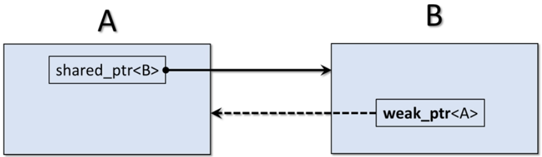

[Home](../../) | [Projects](../../projects) | [Notes](../) > <a href="./">C++ Programming</a> > Smart Pointers

# Smart Pointers


## Overview

* Issues with raw pointers
* What are smart pointers?
* Concept of ownership and RAII
* C++ smart pointers
  * Unique pointers (`unique_ptr`)
  * Shared pointers (`shared_ptr`)
  * Weak pointers (`weak_ptr`)
* Custom deleters


## Issues with Raw Pointers

* C++ provides absolute flexibility with memory management.
  * Allocation
  * Deallocation
  * Lifetime management
* Some potentially serious problems
  * Uninitialized (wile) pointers
  * Memory leaks
  * Dangling pointers
  * Not exception safe
* Ownership
  * Who owns the pointer?
  * When should a pointer be deleted?


## What is Smart Pointer? (Ownership & RAII)

* Objects
* Can only point to heap-allocated memory
* Automatically call delete when no longer needed
* Adhere to RAII principles
* C++ smart pointers
  * Unique pointers (`unique_ptr`)
  * Shared pointers (`shared_ptr`)
  * Weak pointers (`weak_ptr`)
  * Auto pointers (`auto_ptr`) - Deprecated. Will not be discussing this one!
* `#include <memory>`
* Defined by class templates
  * Wrapper around a raw pointer
  * Overloaded operators
    * Dereference (`*`)
    * Member selection (`->`)
    * Pointer arithmetic not supported (`++`, `--`, etc.)
  * Can have custom deleters

### Example

* A simple example of smart pointers

  ```cpp
  {
      std::smart_pointer<Some_Class> ptr = . . .
          
      ptr->method();
      cout << (*ptr) << endl;
  }
  
  // ptr will be destroyed automatically when no longer needed
  ```

### RAII - Resource Acquisition Is Initialization

* Common idiom or pattern used in software design based on container object lifetime
* RAII objects are allocated on the stack
* Resource Acquisition
  * Open a file
  * Allocate memory
  * Acquire a lock
* Is Initialization
  * The resource is acquired in a constructor
* Resource relinquishing
  * Happens in the destructor
    * Close the file
    * Deallocate the memory
    * Release the lock


## C++ Smart Pointers

### Unique Pointers (`unique_ptr`)

* Simple smart pointer - very efficient!
* `unique_ptr<T>`
  * Points to an object of type `T` on the heap
  * It is unique - there can only be one `unique_ptr<T>` pointing to the object on the heap
  * Owns what it points to
  * Cannot be assigned or copied
  * CAN be moved
  * When the pointer is destroyed, what it points to is automatically destroyed

* Creating, initializing and using

  ```cpp
  {
      std::unique_ptr<int> p1{new int{100}};
      std::cout << *p1 << std::endl;		// 100
      *p1 = 200;
      std::cout << *p1 << std::endl;		// 200
  } // p1 gets deleted automatically
  ```

* Some other useful methods

  ```cpp
  {
      std::unique_ptr<int> p1{new int{100}};
      std::cout << p1.get() << std::endl;		// 0x564388
      p1.reset();		// p1 is now nullptr
      
      if (p1)
          std::cout << *p1 << std::endl;		// Won't execute
  } // p1 gets deleted automatically
  ```

* User defined classes

  ```cpp
  {
      std::unique_ptr<Account> p1{new Account{"Jack"}};
      std::cout << *p1 << std::endl;		// Display account
      
      p1->deposit(1000);
      p1->withdraw(500);
  } // p1 gets deleted automatically
  ```

* Vectors and move

  ```cpp
  {
      std::vector<std::unique_ptr<int>> vec;
      std::unique_ptr<int> ptr{new int{100}};
      vec.push_back(ptr);		// Error - copy not allowed
      vec.push_back(std::move(ptr));
  } // p1 gets deleted automatically
  ```

* `make_unique` (C++14)

  ```cpp
  {
      std::unique_ptr<int> p1 = make_unique<int>(100);
      std::unique_ptr<Account> p2 = make_unique<Account>("Jack", 4000);
      auto p3 = make_unique<Player>("Hero", 100, 100);
  } // p1 gets deleted automatically
  ```

### Shared pointers (`shared_ptr`)

* Provides shared ownership of heap objects

* `shared_ptr<T>`

  * Points to an object of type `T` on the heap
  * It is not unique - there can be many `shared_ptr`s pointing to the same object on the heap.
  * Establishes shared ownership relationship
  * CAN be assigned and copied
  * CAN be moved
  * Doesn't support managing arrays by default
  * When the use count is zero, the managed object on the heap is destroyed

* Creating, initializing and using

  ```cpp
  {
  std::shared_ptr<int> p1{new int{100}};
  std::cout << *p1 << std::endl;		// 100
  *p1 = 200;
  std::cout << *p1 << std::endl;		// 200
  } // p1 gets deleted automatically
  ```

* Some other useful methods

  ```cpp
  // use_count - the number of shared_ptr objects managing the heap object
  std::shared_ptr<int> p1 {new int{100}};
  std::cout << p1.use_count() << std::endl;	// 1
  
  std::shared_ptr<int> p2{p1};				// Shared ownership
  std::cout << p1.use_count() << std::endl;	// 2
  
  p1.reset();			// Decrement the use_count; p1 is nulled out
  std::cout << p1.use_count() << std::endl;	// 0
  std::cout << p2.use_count() << std::endl;	// 1
  } // p1, p2 get deleted automatically
  ```

* User defined classes

  ```cpp
  {
      std::shared_ptr<Account> p1{new Account{"Jack"}};
      std::cout << *p1 << std::endl;	// Display account
      
      p1->deposit(1000);
      p1->withdraw(500);
  } // p1 gets deleted automatically
  ```

* Vectors and move

  ```cpp
  {
      std::vector<std::shared_ptr<int>> vec;
      std::shared_ptr<int> ptr{new int{100}};
      vec.push_back(ptr);		// OK - copy IS allowed
      std::cout << ptr.use_count() << std::endl;		// 2
  } // ptr gets deleted automatically
  ```

* `make_shared` (C++11)

  ```cpp
  {
      std::shared_ptr<int> p1 = std::make_shared<int>(100);	// use_count: 1
      std::shared_ptr<int> p2{p1};		// use_count: 2
      std::shared_ptr<int> p3;
      p3 = p1;	// use_count: 3
  } // p1, p2, p3 get deleted automatically
  ```

  > Use `std::make_shared` - It's more efficient!
  >
  > All 3 pointers point to the SAME object on the heap!
  >
  > When the use_count becomes 0 the heap object is deallocated

### Weak Pointers (`weak_ptr`)

* Provides a non-owning "weak" reference

* `weak_ptr<T>`
  * Points to an object of type `T` on the heap
  * Does not participate in owning relationship
  * Always created from a `shared_ptr`
  * Does NOT increment or decrement reference use count
  * Used to prevent strong reference cycles which could prevent objects from being deleted
  
* Circular or cyclic reference
  * A refers to B
  
  * B refers to A
  
  * Shared strong ownership prevents heap deallocation
  
    
  
    
  
    
  
  * Solution - make one of the pointers non-owning or 'weak'
  
  * Now heap storage is deallocated properly
  
    
  
  


## Custom Deleters

* Sometimes when we destroy a smart pointer we need more than to just destroy the object on the heap.
* These are special use-cases
* C++ smart pointers allow you to provide custom deleters
* Lots of way to achieve this
  * Functions
  * Lambdas
  * Others ...

### Example

* Functions

  ```cpp
  void my_deleter(Some_Class *raw_pointer)
  {
      // Your custom deleter code
      delete raw_pointer;
  }
  
  share_ptr<Some_Class> ptr{new Some_class{}, my_deleter};
  ```

  ```cpp
  void my_deleter(Test *ptr)
  {
      cout << "In my custom deleter" << endl;
      delete ptr;
  }
  
  share_ptr<Test> ptr{new Test{}, my_deleter};
  ```

* Lambdas

  ```cpp
  shared_ptr<Test> ptr(new Test{100}, [](Test *ptr) {
      cout << "\tUsing my custom deleter" << endl;
      delete ptr;
  });
  ```
