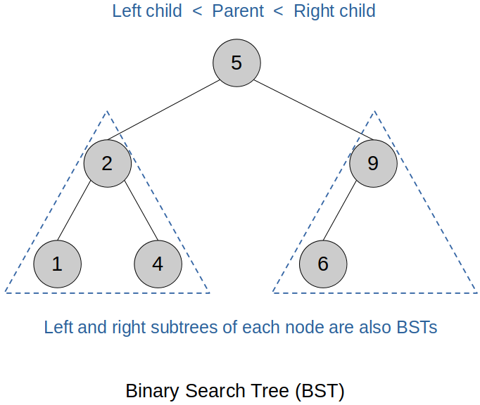

[Home](../../) | [Projects](../../projects) | [Notes](../) > <a href="./">Data Structures & Algorithms</a> > Binary Search Trees (BST)

# Binary Search Trees (BST)


## Introduction

A **Binary Search Tree (BST)** is a type of binary tree where each node follows a specific ordering rule:

- The **left subtree** contains only nodes with values **less than** the parent node.
- The **right subtree** contains only nodes with values **greater than** the parent node.
- This rule applies **recursively** to every subtree in the tree.

BSTs are widely used for **efficient searching, insertion, and deletion**, with average-case time complexity of **O(log n)** for balanced trees.





* All operations have O(log n) time complexity, which is very efficient. (Every time you go down one level, you are excluding the half of the remaining nodes from your search.)

  $\to$ Divide and conquer!

* If a tree never forks, it is essentially a linked list, in which case the search time complexity will be O(n). However, since this is not a general case, a binary search tree is still treated as an O(log n) data structure.


## Implementation (C++): Non-Recursive

### Header (`bstree.hpp`)

```cpp
#ifndef BSTREE_HPP
#define BSTREE_HPP

class node 
{
public:
	node (const int val) : data(val), p_left(nullptr), p_right(nullptr) {}

	int data;
	node *p_left;
	node *p_right;
};

class bstree
{
public:
	bstree() : p_root(nullptr) {}
	~bstree() { clear(); }
	bool insert(const int val);
	bool search(const int val) const;
	void preorder() const;
	void inorder() const;
	void postorder() const;
	bool remove(const int val);
	void clear();

private:
	node *p_root;
};

#endif
```

### Source (`bstree.cpp`)

```cpp
#include "bstree.hpp"
#include <iostream>
#include <stack>

bool bstree::insert(const int val)
{
	node *p_new = new node(val);

	// inserting into an empty BST
	if (p_root == nullptr)
	{
		p_root = p_new;
		return true;
	}

	node *p_curr = p_root;

	while (true)
	{
		if (val < p_curr->data)
		{
			if (p_curr->p_left == nullptr)
			{
				// insert
				p_curr->p_left = p_new;
				return true;
			}
			else
			{
				// keep searching
				p_curr = p_curr->p_left;
			}
		}
		else if (val > p_curr->data)
		{
			if (p_curr->p_right == nullptr)
			{
				// insert
				p_curr->p_right = p_new;
				return true;
			}
			else
			{
				// keep searching
				p_curr = p_curr->p_right;
			}
		}
		else
		{
			// do not allow duplication
			delete p_new;
			return false;
		}
	}
}

bool bstree::search(const int val) const
{
	node *p_curr = p_root;

	while (p_curr)
	{
		if (val < p_curr->data)
		{
			// keep searching
			p_curr = p_curr->p_left;
		}
		else if (val > p_curr->data)
		{
			// keep searching
			p_curr = p_curr->p_left;
		}
		else
		{
			// found
			return true;
		}
	}

	return false;
}

void bstree::preorder() const
{
	if (p_root == nullptr)
	{
		return;
	}
	
	std::stack<node *> s;
	s.push(p_root);

	while (!s.empty())
	{
		node *p_curr = s.top();
		s.pop();
		std::cout << p_curr->data << " ";

		if (p_curr->p_right)
		{
			s.push(p_curr->p_right);
		}

		if (p_curr->p_left)
		{
			s.push(p_curr->p_left);
		}
	}

	std::cout << std::endl;
}

void bstree::inorder() const
{
	if (p_root == nullptr)
	{
		return;
	}

	std::stack<node *> s;
	node *p_curr = p_root;

	while (p_curr || !s.empty())
	{
		while (p_curr)
		{
			s.push(p_curr);
			p_curr = p_curr->p_left;
		}

		p_curr = s.top();
		s.pop();
		std::cout << p_curr->data << " ";
		p_curr = p_curr->p_right;
	}

	std::cout << std::endl;
}

void bstree::postorder() const
{
	if (p_root == nullptr)
	{
		return;
	}

	std::stack<node *> s1, s2;
	s1.push(p_root);

	while (!s1.empty())
	{
		node *p_curr = s1.top();
		s1.pop();
		s2.push(p_curr);

		if (p_curr->p_left)
		{
			s1.push(p_curr->p_left);
		}

		if (p_curr->p_right)
		{
			s1.push(p_curr->p_right);
		}
	}

	while (!s2.empty())
	{
		std::cout << s2.top()->data << " ";
		s2.pop();
	}

	std::cout << std::endl;
}

bool bstree::remove(const int val)
{
	node *p_del = p_root;
	node *p_del_parent = nullptr;

	// find a node to delete
	while (p_del && p_del->data != val)
	{
		p_del_parent = p_del;
		p_del = (val < p_del->data) ? p_del->p_left : p_del->p_right;
	}

	// node not found
	if (p_del == nullptr)
	{
		return false;
	}

	// case 1: del node has 0 or 1 child
	if (p_del->p_left == nullptr || p_del->p_right == nullptr)
	{
		node *p_del_child = p_del->p_left ? p_del->p_left : p_del->p_right;

		if (p_del_parent == nullptr)
		{
			// prepare to delete root
			p_root = p_del_child;
		}
		else if (p_del == p_del_parent->p_left)
		{
			p_del_parent->p_left = p_del_child;
		}
		else
		{
			p_del_parent->p_right = p_del_child;
		}

		delete p_del;
		return true;
	}
	// case 2: del node has 2 children
	else
	{
		// replacement node can be either of the following:
		// - largest (right-most) node in the left subtree
		// - smallest (leftmost) node in the right subtree
		
		node *p_rep_parent = p_del;
		node *p_rep = p_del->p_left; // finding rep node from left subtree

		while (p_rep->p_right)
		{
			p_rep_parent = p_rep;
			p_rep = p_rep->p_right;
		}

		// replace del node's data with rep node's
		p_del->data = p_rep->data;

		// delete the rep node
		node *p_rep_child = p_rep->p_left; // rep node has no right child

		if (p_rep == p_rep_parent->p_right)
		{
			p_rep_parent->p_right = p_rep_child;
		}
		else
		{
			p_rep_parent->p_left = p_rep_child;
		}

		delete p_rep;
		return true;
	}
}

void bstree::clear()
{
	if (p_root == nullptr)
	{
		return;
	}

	std::stack<node *> s;
	s.push(p_root);

	// deleting node -> right -> left
	while (!s.empty())
	{
		node *p_curr = s.top();
		s.pop();

		if (p_curr->p_left)
		{
			s.push(p_curr->p_left);
		}
		
		if (p_curr->p_right)
		{
			s.push(p_curr->p_right);
		}

		delete p_curr;
	}

	p_root = nullptr;
}
```

### Test Driver

```c
#include <iostream>
#include "bstree.hpp"

int main(int argc, char *argv[])
{
	bstree bst;

    // Insert a mix of values
    int values[] = {50, 30, 70, 20, 40, 60, 80, 65, 75, 85};

    for (int val : values) {
        bst.insert(val);
    }

    std::cout << "In-order traversal (should be sorted):\n";
    bst.inorder();  // 20 30 40 50 60 65 70 75 80 85

    std::cout << "Pre-order traversal:\n";
    bst.preorder(); // 50 30 20 40 70 60 65 80 75 85

    std::cout << "Post-order traversal:\n";
    bst.postorder(); // 20 40 30 65 60 75 85 80 70 50

    // Search for a few elements
    std::cout << "Search 65: " << (bst.search(65) ? "Found" : "Not Found")
		<< "\n"; // Found
    std::cout << "Search 100: " << (bst.search(100) ? "Found" : "Not Found")
		<< "\n"; // Not Found

    // Delete a leaf node
    bst.remove(20);
    std::cout << "After deleting 20 (leaf):\n";
    bst.inorder();  // 30 40 50 60 65 70 75 80 85

    // Delete a node with one child
    bst.remove(60);
    std::cout << "After deleting 60 (one child):\n";
    bst.inorder();  // 30 40 50 65 70 75 80 85

    // Delete a node with two children
    bst.remove(70);
    std::cout << "After deleting 70 (two children):\n";
    bst.inorder();  // 30 40 50 65 75 80 85

    // Clear the b
    bst.clear();
    std::cout << "After clear():\n";
    bst.inorder();  // (nothing)

    return 0;
}
```

```plain
In-order traversal (should be sorted):
20 30 40 50 60 65 70 75 80 85
Pre-order traversal:
50 30 20 40 70 60 65 80 75 85
Post-order traversal:
20 40 30 65 60 75 85 80 70 50
Search 65: Not Found
Search 100: Not Found
After deleting 20 (leaf):
30 40 50 60 65 70 75 80 85
After deleting 60 (one child):
30 40 50 65 70 75 80 85
After deleting 70 (two children):
30 40 50 65 75 80 85
After clear():
```
