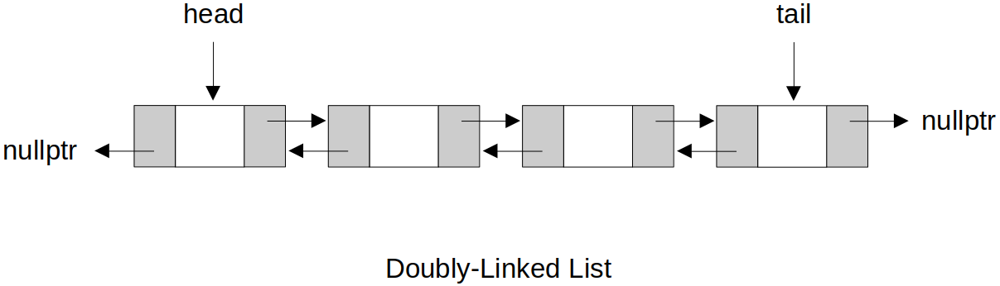

[Home](../../) | [Projects](../../projects) | [Notes](../) > <a href="./">Data Structures & Algorithms</a> > Doubly-Linked Lists

# Doubly-Linked Lists


## Doubly-Linked List (C++)





### Interface

```c
//==============================================================================
// File		: doubly_linked_list.h
// Brief	: Interface for Doubly-Linked List
// Author	: Kyungjae Lee
// Date		: May 17, 2023
//==============================================================================

#ifndef DOUBLY_LINKED_LIST_H
#define DOUBLY_LINKED_LIST_H

// Class for list nodes
class Node
{
public:
    int value;
    Node *next;
    Node *prev;

    Node(int value);                    // Constructor
};

// Class for doubly-linked lists
class DoublyLinkedList
{
public:    
    // Public interface
    DoublyLinkedList(int value);        // Constructor
    void append(int value);             // Add a node at the end
    void prepend(int value);            // Add a node at the front
    bool insert(int index, int value);  // Insert a node into the given index position
    void deleteNode(int index);         // Delete a node with the given index position
    void deleteLast();                  // Delete the last node
    void deleteFirst();                 // Delete the first node
    Node* get(int index);               // Get the node value of the given index position
    bool set(int index, int value);     // Set the node value of the given index position
    void reverse();                     // Reverse the list
    void printList();                   // Print the list
    ~DoublyLinkedList();                // Destructor

private:
    Node *head;
    Node *tail;
    int length;
};

#endif	// DOUBLY_LINKED_LIST_H
```

### Implementation

```c
//==============================================================================
// File		: doubly_linked_list.h
// Brief	: Implementation of Doubly-Linked List
// Author	: Kyungjae Lee
// Date		: May 17, 2023
//==============================================================================

#include <iostream>
#include <cstdlib>		// EXIT_FAILURE
#include "doubly_linked_list.h"

using namespace std;

//------------------------------------------------------------------------------
// Implementation of Node class interface
//------------------------------------------------------------------------------

// Constructor
Node::Node(int value)
{
    this->value = value;
    next = nullptr;
    prev = nullptr;
}

//------------------------------------------------------------------------------
// Implementation of DoublyLinkedList class interface
//------------------------------------------------------------------------------

// Constructor
// T = O(1)
DoublyLinkedList::DoublyLinkedList(int value)
{
    Node *newNode = new Node(value);
    head = newNode;
    tail = newNode;
    length = 1;
}

// Add a node at the end
// T = O(1)
void DoublyLinkedList::append(int value) 
{
    Node *newNode = new Node(value);

    // Insert a node into an empty list
    if (length == 0)    // (head == nullptr) or (tail == nullptr)
    {   
        head = newNode;
        tail = newNode;
    }   
    // Insert a node into a non-empty list
    else
    {   
        tail->next = newNode;
        newNode->prev = tail;
        tail = newNode;
    }   

    length++;
}

// Add a node at the front
// T = O(1)
void DoublyLinkedList::prepend(int value)
{
    Node *newNode = new Node(value);

    // Insert a node into an empty list
    if (length == 0)
    {
        head = newNode;
        tail = newNode;
    }
    // Insert a node into a non-empty list
    else
    {
        newNode->next = head;
        head->prev = newNode;
        head = newNode;
    }

    length++;
}

// Insert a node into the given index position
// T = O(n)
bool DoublyLinkedList::insert(int index, int value)
{
    // Validity check for index
    if (index < 0 || index > length)
        return false;

    // Insert a node at front (prepend)
    if (index == 0)
    {
        prepend(value);
        return true;
    }

    // Insert a node at the end (append)
    if (index == length)
    {
        append(value);
        return true;
    }

    // Insert a node somewhere in the middle
    Node *newNode = new Node(value);
    Node *before = get(index - 1);
    Node *after = before->next;
    newNode->prev = before;
    newNode->next = after;
    before->next = newNode;
    after->prev = newNode;

    length++;

    return true;
}

// Delete a node with the given index position
// T = O(n)
void DoublyLinkedList::deleteNode(int index)
{
    // Validity check for index
    if (index < 0 || index >= length)
        return;

    // Delete the first node
    if (index == 0)
        return deleteFirst();   // Available only when return types are the same

    // Delete the last node
    if (index == length - 1)
        return deleteLast();

    // Delete the node from somewhere in the middle
    Node *delNode = get(index);
    delNode->prev->next = delNode->next;
    delNode->next->prev = delNode->prev;
    delete delNode;

    length--;
}

// Delete the last node
// T = O(1)
void DoublyLinkedList::deleteLast()
{
    // Do not allow delete operation on an empty list
    if (length == 0)
    {
        cout << "ERROR: Cannot delete from an empty list. Terminating!" << endl;
        exit(EXIT_FAILURE);
    }

    Node *delNode = tail;

    // If only 1 node in the list
    if (length == 1)
    {
        head = nullptr;
        tail = nullptr;
    }
    // If 2+ nodes in the list
    else
    {
        tail = tail->prev;
        tail->next = nullptr;
    }

    delete delNode;

    length--;
}

// Delete the first node
// T = O(1)
void DoublyLinkedList::deleteFirst()
{
    // Do not allow delete operation on an empty list
    if (length == 0)
    {
        cout << "ERROR: Cannot delete from an empty list. Terminating!" << endl;
        exit(EXIT_FAILURE);
    }

    Node *delNode = head;

    // If only 1 node in the list
    if (length == 1)
    {
        head = nullptr;
        tail = nullptr;
    }
    // If 2+ nodes in the list
    else
    {
        head = head->next;
        head->prev = nullptr;
    }

    delete delNode;

    length--;
}

// Get the node value of the given index position
// T = O(n)
Node* DoublyLinkedList::get(int index)
{
    // Validity check for index
    if (index < 0 || index >= length)
        return nullptr;

    Node *temp = head;

    // Search for the node

    /* This would still work, but optimization can be done!
    for (int i = 0; i < index; i++)
        temp = temp->next;
    */

    // If the index is within the first half of the list
    if (index < length / 2)
    {
        // Start searching from the head
        for (int i = 0; i < index; i++)
            temp = temp->next;
    }
    // If the index is within the second half of the list
    else
    {
        // Start searching from the tail
        temp = tail;
        for (int i = length - 1; i > index; i--)
            temp = temp->prev;
    }

    return temp;
}

// Set the node value of the given index position
// T = O(n)
bool DoublyLinkedList::set(int index, int value)
{
    // Get the node
    Node *temp = get(index);

    // Set the value
    if (temp)
    {
        temp->value = value;
        return true;
    }

    return false;
}

// Reverse the list
// T = O(n)
void DoublyLinkedList::reverse()
{
    // Swap head and tail
    Node *curr = head;
    head = tail;
    tail = curr;

    Node *temp = nullptr;   // Temporary pointer to be used for swaping prev & next pointers

    // Iteratively swap prev and next pointers
    while (curr)
    {   
        // Swap prev and next
        temp = curr->prev;
        curr->prev = curr->next;
        curr->next = temp;

        // Advance curr
        curr = curr->prev;
    }   
}

// Print the list
// T = O(n)
void DoublyLinkedList::printList()
{
    Node *temp = head;

    while (temp)
    {
        cout << temp->value << " ";
        temp = temp->next;
    }

    cout << endl;
}

// Destructor
// T = O(n)
DoublyLinkedList::~DoublyLinkedList()
{
    // head, tail, length will be destroyed by default, but the nodes will not.
    // So, make sure to delete them manually in the destructor.

    Node *temp = head;

    while (head)
    {
        head = head->next;
        delete temp;
        temp = head;
    }
}
```

### Test Driver

```c
//==============================================================================
// File		: main.cpp
// Brief	: Test driver for Doubly-Linked List
// Author	: Kyungjae Lee
// Date		: May 17, 2023
//==============================================================================

#include <iostream>
#include "doubly_linked_list.h"

using namespace std;

int main(int argc, char *argv[])
{
    // Create a doubly-linked list
    DoublyLinkedList *dll = new DoublyLinkedList(2);
    
    // Prepend
    dll->prepend(1);

    // Append
    dll->append(4);
    dll->append(5);
    dll->append(6);

    // Insert (insert 3 at index 2)
    dll->insert(2, 3);  

    // Print the list
    dll->printList();       // 1 2 3 4 5 6

    // Delete first
    dll->deleteFirst();

    // Delete last
    dll->deleteLast();

    // Delete from the middle (index 1)
    dll->deleteNode(1);

    // Print the list
    dll->printList();       // 2 4 5

    // Set (value of the node at index 1 to 10)
    dll->set(1, 10);

    // Get (value of the node at index 1 to 10)
    cout << dll->get(1)->value << endl; // 10

    // Reverse the list
    dll->reverse();

    // Print the list
    dll->printList();       // 5 10 2

    return 0;
}
```

```plain
1 2 3 4 5 6 
2 4 5 
10
5 10 2 
```
