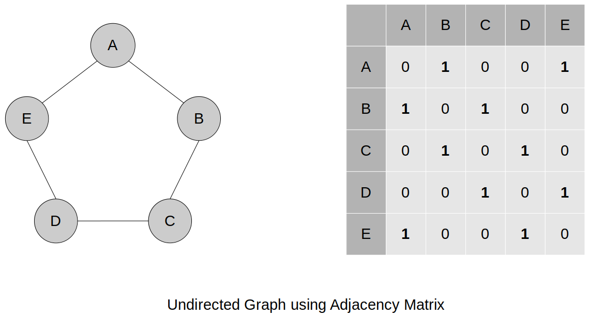
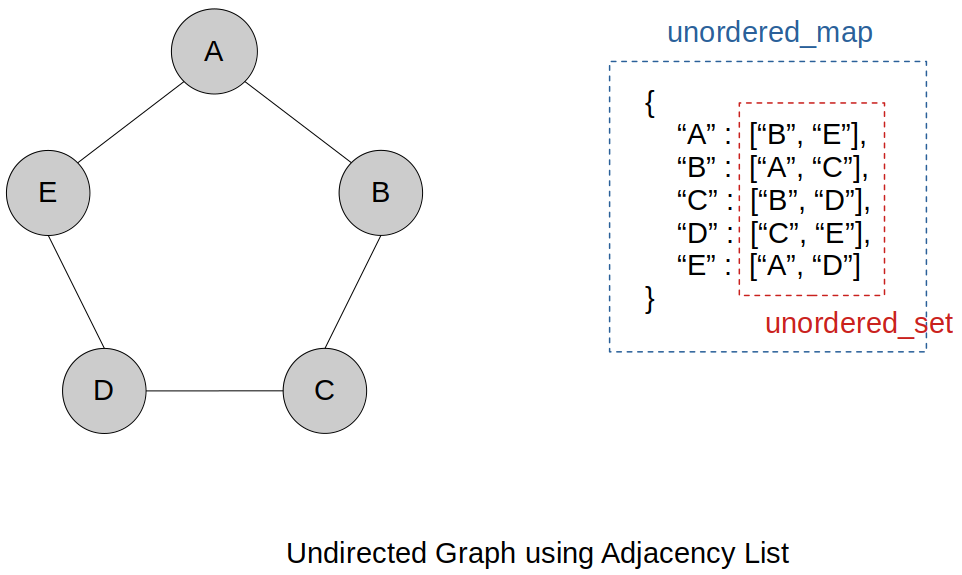

[Home](../../) | [Projects](../../projects) | [Notes](../) > <a href="./">Data Structures & Algorithms</a> > Graphs

# Graphs


## Different Representations of Graphs

### Graphs using Adjacency Matrix





### Graphs using Adjacency List





## Graphs Big-O

### Time Complexity

|               | Adjacency Matrx                                       | Adjacency List                       |
| ------------- | ----------------------------------------------------- | ------------------------------------ |
| Add vertex    | O(\|V\|^2^); Have to completely rebuild the 2D matrix | O(1)                                 |
| Add edge      | O(1)                                                  | O(1)                                 |
| Remove vertex | O(\|V\|^2^); Have to completely rebuild the 2D matrix | O(\|V\|); Have to check every vertex |
| Remove edge   | O(1)                                                  | O(1)                                 |

* Using an **adjacency list** for a graph consistently offers better time complexity compared to using an adjacency matrix.

### Space Complexity

| Adjacency Matrx | Adjacency List   |
| --------------- | ---------------- |
| O(\|V\|^2^)     | O(\|V\| + \|E\|) |

* One significant disadvantage of representing a graph using an adjacency matrix is that it requires storing information for all vertices and  edges, even those that are not connected.


## Graph using Adjacency List (C++)

### Interface

```cpp
//==============================================================================
// File		: graph.h
// Brief	: Interface for Graph using adjacency list
// Author	: Kyungjae Lee
// Date		: Aug 03, 2023
//==============================================================================

#ifndef GRAPH_H
#define GRAPH_H

#include <iostream>
#include <unordered_map>
#include <unordered_set>

using namespace std;

// Class for Graph using adjacency list
class Graph
{
public:
	bool addVertex(string vertex);					// Adds a vertex
	bool removeVertex(string vertex);				// Removes a vertex
	bool addEdge(string vertex1, string vertex2);	// Adds an edge
	bool removeEdge(string vertex1, string vertex2);// Removes an edge
	void printGraph(void);							// Prints graph
private:
	unordered_map<string, unordered_set<string> > adjList;	// Adjacency list
};

#endif // GRAPH_H
```

### Implementation

```cpp
//==============================================================================
// File		: graph.cpp
// Brief	: Implementation of Graph using adjacency list
// Author	: Kyungjae Lee
// Date		: Aug 03, 2023
//==============================================================================

#include "graph.h"

using namespace std;

//------------------------------------------------------------------------------
// Implementation of Graph class interface
//------------------------------------------------------------------------------

// Adds a vertex
// T = O(1)
bool Graph::addVertex(string vertex)
{
	// Make sure that 'vertex' does not exist 
	if (adjList.count(vertex) == 0)
	{
		adjList[vertex];
		return true;
	}

	return false;
} // End of addVertex

// Removes a vertex
// T = O(|V|)
bool Graph::removeVertex(string vertex)
{
	// Make sure that 'vertex' does exist 
	if (adjList.count(vertex) == 0)
		return false;

	// Loop throuh unordered_set and remove all edges associated with 'vertex'
	for (auto otherVertex : adjList.at(vertex))
		adjList.at(otherVertex).erase(vertex);

	// Remove 'vertex'
	adjList.erase(vertex);

	return true;
} // End of removeVertex

// Adds an edge
// T = O(1)
bool Graph::addEdge(string vertex1, string vertex2)
{
	// Make sure that 'vertex1' and 'vertex2' both exist
	if (adjList.count(vertex1) && adjList.count(vertex2))
	{
		adjList.at(vertex1).insert(vertex2);
		adjList.at(vertex2).insert(vertex1);
		return true;
	}

	return false;
} // End of addEdge

// Removes an edge
// T = O(1)
bool Graph::removeEdge(string vertex1, string vertex2)
{
	// Make sure that 'vertex1' and 'vertex2' both exist
	if (adjList.count(vertex1) && adjList.count(vertex2))
	{
		adjList.at(vertex1).erase(vertex2);
		adjList.at(vertex2).erase(vertex1);
		return true;
	}

	return false;
} // End of removeEdge

// Prints graph
// T = O(|V|*|E|)
void Graph::printGraph(void)
{
	for (auto [vertex, edges] : adjList)
	{
		cout << vertex << ": [ ";
		for (auto edge: edges)
			cout << edge << " ";

		cout << "]" << endl;
	}
} // End of printGraph
```

### Test Driver

```cpp
//==============================================================================
// File		: main.cpp
// Brief	: Test driver for Graph using adjacency list
// Author	: Kyungjae Lee
// Date		: Jul 31, 2023
//==============================================================================

#include <iostream>
#include "graph.h"

using namespace std;

int main(int argc, char *argv[])
{
	Graph *g = new Graph();

	g->addVertex("A");
	g->addVertex("B");
	g->addVertex("C");

	g->addEdge("A", "B");
	g->addEdge("B", "C");
	g->addEdge("A", "C");

	g->printGraph();

	cout << endl;

	//g->removeEdge("A", "C");
	g->removeVertex("A");

	g->printGraph();

	return 0;
}
```

```plain
B: [ C A ]
C: [ A B ]
A: [ C B ]

B: [ C ]
C: [ B ]
```
