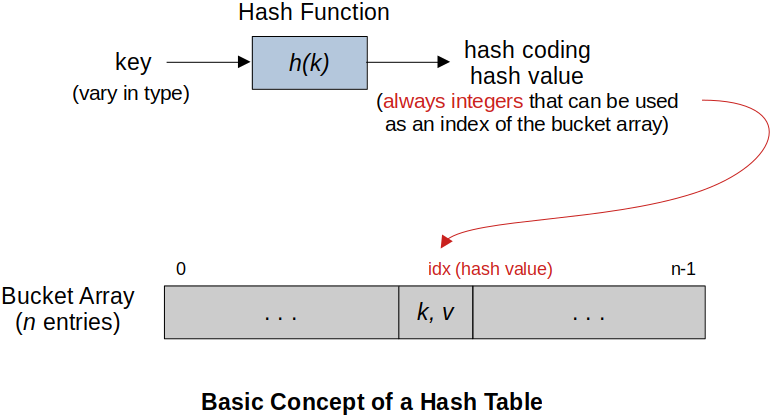
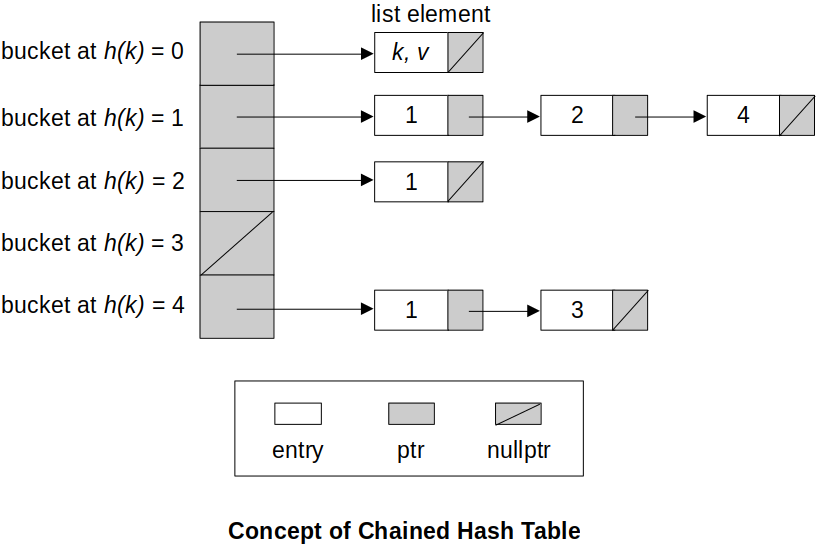

[Home](../../) | [Projects](../../projects) | [Notes](../) > <a href="./">Data Structures & Algorithms</a> > Hash Tables

# Hash Tables


## Why is Map Necessary?

* In storing *key-value* pairs,

  **Arrays** limit the key to integer values which will be used as an index.

  ```c
  a1[1] = 3;
  a2[3] = "three";
  a3[0] = 'a';
  ...
  ```

  **Maps** can store any *pairs* of any types.
  
  ```c
  m1["three"] = 3
  m2[5] = 2
  m3['A'] = 'a'
  ...
  ```


## C++ Built-in Maps

* `std::map` (header: `<map>`)
  * Implemented using **binary search tree (BST)**. Due to the nature of the BST, it is ordered map.
  * Iterator will iterate through the elements based on key order.
  * The time complexity of all the functions is $O(\log n)$.
* `std::unordered_map` (header: `<unordered_map>`)
  * Implemented using **hash table**.
  * *Keys* are unique.
  * It is NOT guaranteed that the iterator will iterate through the elements based on key  order.
  * Time complexity of all the functions is $O(1)$.
  * Functions: `insert()`, `at()`, `size()`, `erase()`, etc.    


## Hash Tables (Hash Maps)





* **Hash tables** support one of the most efficient types of searching: *hashing*.

* A hash table consists of an array (a.k.a. bucket array) in which data is accessed via a special index called *key*.

* The primary idea behind a hash table is to establish a mapping between the set of all possible keys and positions in the array using a *hash function*.

* A **hash function** accepts a key and returns its *hash coding*, or *hash value*.

  * Keys vary in type, but hash codings are always integers.

  * Two components of hash functions:

    * Hash code (converts a key to an integer)

      ```plain
      IF key = 'A', hash code = convert character to ascii
      THEN h('A') = 97
      ```

    * Compression function (scales the converted integer to a valid index of the  bucket array)

      ```plain
      IF bucket array can contain 26 entries
      THEN good compression function can be '% 26' since it scales whatever the hash
      value is to an integer (hash coding, or hash value) ranging 0-25.
      ```

  * A good hash function produces wide-spread hash values as randomly as possible  within the valid range of integers. Some well-known hash functions:

    * Base-26

      ```cpp
      // e.g., A hash function which gets passed a 4-character string and returns a
      // hash index as an int. Assume the table size is defined as 'ts'.
      
      int hashBase26(char *key, int ts)
      {
      	int index;
      	index = ((key[0] - 'A' + 1) * pow(26,3) + 
      			((key[1] - 'A' + 1) * pow(26,2) + 
      			((key[2] - 'A' + 1) * pow(26,1) + 
      			((key[3] - 'A' + 1) * pow(26,0) + 
      
      	return index % ts;
      }
      ```

    * Folding

      ```cpp
      // e.g., A hash function using Folding
      
      int hashFolding(char *key, int ts)
      {
      	int index;
      	index = ((key[0] - 'A' + 1) * (key[1] - 'A' + 1)) + 
      			((key[2] - 'A' + 1) * (key[3] - 'A' + 1));  
      
      	return index % ts;
      }
      ```

    * Middle Squaring

      ```cpp
      // e.g., A hash function using Middle Squaring
      
      int hashMiddleSquaring(char *key, int ts)
      {
      	int index;
      	index = ((key[1] - 'A' + 1) * (key[2] - 'A' + 1));
      
      	return index % ts;
      }
      ```

    * Division Method

      A good general approach:
      - Select a table size that is a prime number
      - Translate the key into an integer
      - Divide Key / M = Q with remainder R
      - Use R as a hash value
      - Use max(1, Q) as the probe in/decrement auxiliary hash function (double hashing)

      

## Collision Handling Techniques

### Closed Addressing (Closed Hashing)

* A key is always stored in the bucket it is hashed to.
* Collisions are handled by using *separate data structure* on a per-bucket basis.
* Arbitrary number of keys per bucket.
* e.g., **Chained Hash Table (Separate Chaining)**
  - Consists of an array of linked lists.
  - Each list forms a *bucket* in which we place all elements hashing to a specific position in the array.
  - Performs as good as *open addressing* techniques.





### Open Addressing (Open Hashing)

* At most one key per bucket

* Collisions are handled by searching for another empty buckets within the hash table array itself. This searching is handled by the hash function $h(k,i) = h(k) + f(i)$ where,

  - $k$ is the key

  - $i$ is the number of attempts starting at 0

  - $h(k)$ is an auxiliary hash function

  - $f(i)$ is an auxiliary function ($f(0) = 0$) that is responsible for distributing the keys upon collision

    Some well-known open addressing techniques (depending on the choice of  $f(i)$) are:

    **linear probing**

    - $h(k, i) = h(k) + i % n$, where $n$ is the table size
    - Although it is simple to implement, it is prone to *primary clustering* (cluster developed due to the local popular index).

    **quadratic probing**

    - $h(k, i) = h(k) + i^2 % n$, where $n$ is the table size
    - This alleviates the primary clustering to some extent.

    **double hashing**

    - $h(k, i) = h_1(k) + h_2(k)$
    - Two auxiliary hash functions should be carefully chosen so that the elements are distributed in a uniform and random manner.


## Chained Hash Table 1 (C++) 

### Interface

```cpp
//==============================================================================
// File		: hash_table.h
// Brief	: Interface for Hash Table
// Author	: Kyungjae Lee
// Date		: Jul 31, 2023
//
// Note		: It is known that when the number of bucket array elements is a 
// 			  prime number, the (key, value) pairs are distributed more 
// 			  randomely (i.e., less collision).
//==============================================================================

#ifndef HASH_TABLE_H
#define HASH_TABLE_H

#include <iostream>
#include <string>
#include <vector>

using namespace std;

// Class for hash table nodes
class Node
{
public:
	string key;
	int value;
	Node *next;

	Node(string key, int value);	// Constructor
};

// Class for hash table 
class HashTable
{
public:
	HashTable(int size);		// Constructor
	~HashTable(void);			// Destructor
	void printHashTable(void);	// Prints all the nodes in the hash table
	void insert(string key, int value);	// Insert a node into the hash table
	int lookup(string key);		// Looks up a value by key from the hash table
	vector<string> keys(void);	// Returns a vector of keys in the hash table
	int hash(string key);		// Hash function

private:
	int bucketArrSize;			// Bucket array size (prime number recommended)
	vector<Node *> bucketArr;	// Bucket array
};

#endif // HASH_TABLE_H
```

### Implementation

```cpp
//==============================================================================
// File		: hash_table.cpp
// Brief	: Implementation of Hash Table
// Author	: Kyungjae Lee
// Date		: Jul 31, 2023
//
// Note		: It is known that when the number of bucket array elements is a 
// 			  prime number, the (key, value) pairs are distributed more 
// 			  randomely (i.e., less collision).
//==============================================================================

#include "hash_table.h"

using namespace std;

//------------------------------------------------------------------------------
// Implementation of Node class interface
//------------------------------------------------------------------------------

// Constructor
// T = O(1)
Node::Node(string key, int value)
{
	this->key = key;
	this->value = value;
	next = nullptr;
} // End of Node class constructor

//------------------------------------------------------------------------------
// Implementation of Hash Table class interface
//------------------------------------------------------------------------------

// Constructor
// T = O(1)
HashTable::HashTable(int size)
{
	bucketArrSize = size;
	bucketArr.reserve(size);	// Size of prime number recommended
} // End of Hash Table class constructor

// Destructor
// T = O(n)
HashTable::~HashTable(void)
{
	// Destroy all the nodes
	Node *delNode, *head;

	for (int i = 0; i < bucketArrSize; i++)
	{
		delNode = bucketArr[i];
		head = bucketArr[i];

		while (head)
		{
			head = head->next;
			delete delNode;
			delNode = head;
		}
	}

	// Destory the bucket array
	bucketArrSize.~vector();
} // End of Desctructor

// Prints all the nodes in the hash table
// T = O(n)
void HashTable::printHashTable(void)
{
	for (int i = 0; i < bucketArrSize; i++)
	{
		cout << i << ": ";
		if (bucketArr[i])
		{
			Node *temp = bucketArr[i];
			while (temp)
			{
				cout << "(" << temp->key << ", " << temp->value << "} ";
				temp = temp->next;
			}
		}
		cout << endl;
	}
} // End of printHashTable

// Inserts a node into the hash table (Closed addressing; chaining)
// T = O(1)
void HashTable::insert(string key, int value)
{
	int index = hash(key);
	Node *newNode = new Node(key, value);
	
	if (bucketArr[index] == nullptr)
	{
		// No collision detected, so simply insert the new node
		bucketArr[index] = newNode;
	}
	else
	{
		// Collision detected
		Node *temp = bucketArr[index];

		// Find the last node of the chain
		while (temp->next != nullptr)
			temp = temp->next;

		// Insert the new node after the last node in the chain
		temp->next = newNode;
	}
} // End of insert

// Looks up a value by key from the hash table
// T = O(1)
int HashTable::lookup(string key)
{
	int index = hash(key);
	Node *temp = bucketArr[index];
	
	// Search the key
	while (temp)
	{
		if (temp->key == key)
			return temp->value;
		
		temp = temp->next;
	}
	
	// Key is not found, return 0
	return 0;
} // End of lookup

// Returns a vector of keys in the hash table
// T = O(n)
vector<string> HashTable::keys()
{
	vector<string> allKeys;
	for (int i = 0; i < bucketArrSize; i++)
	{
		Node *temp = bucketArr[i];

		while (temp)
		{
			allKeys.push_back(temp->key);
			temp = temp->next;
		}
	}

	return allKeys;
} // End of keys

// Hash function
int HashTable::hash(string key)
{
	int hash = 0;
	for (int i = 0; i < key.length(); i++)
	{
		int ascii = key[i];

		// Multiply by 23, a prime number, to make the result more random
		// Divide by bucketArrSize to normalize the result
		hash = (hash + ascii * 23) % bucketArrSize;
	}

	return hash;
} // End of hash
```

### Test Driver

```cpp
//==============================================================================
// File		: main.cpp
// Brief	: Test driver for Hash Table
// Author	: Kyungjae Lee
// Date		: Jul 31, 2023
//==============================================================================

#include <iostream>
#include "hash_table.h"

using namespace std;

int main(int argc, char *argv[])
{
    // Create a hash table
    HashTable *ht = new HashTable(7);
    
	// Insert elements
	ht->insert("nails", 100);
	ht->insert("tile", 50);
	ht->insert("lumber", 80);
	ht->insert("bolts", 200);
	ht->insert("screws", 140);

	// Print hash table
	ht->printHashTable();

	// Create a vector of keys present in the hash table
	vector<string> allKeys = ht->keys();

	cout << endl;

	// Print the keys
	for (auto key : allKeys)
		cout << key << " ";

	cout << endl;

	cout << "tile: " << ht->lookup("tile") << endl;

	// Destroy the hash table
	delete ht;

    return 0;
}
```

```plain
0: 
1: 
2: 
3: (screws, 140} 
4: (bolts, 200} 
5: 
6: (nails, 100} (tile, 50} (lumber, 80} 

screws bolts nails tile lumber 
tile: 50
```


## Chained Hash Table 2 (C++)

For the ease of implementation, **key** will be *string* type, and **value** will be *template*.

### Interface

```c
//==============================================================================
//  File	: chtbl.h
//  Brief	: Interface for chained hash table (in C++)
//  Author	: Kyungjae Lee
//  Date	: Dec 23, 2022
//==============================================================================

#ifndef CHTBL_H
#define CHTBL_H

#define LOAD_FACTOR_THRESHOLD 0.7

using namespace std;

// Forward declaration
template <typename T> class CHTbl;

// Chained Hash Table Node class
template <typename T>
class CHTblNode
{
public:
    CHTblNode(string key, T value);     // parameterized constructor                 
    ~CHTblNode();                       // parameterized constructor                 

    // friend declaration
    template <typename> friend class CHTbl;
    
private:
    string key;
    T value;
    CHTblNode *next;
};

// Chained Hash Table
template <typename T>
class CHTbl
{
public:
    // function
    CHTbl();                        // default constructor
    ~CHTbl();                       // destructor
    int size();                     // retrieve the total number of entries in the CHTbl     
    void insert(string key, T value);   // insert an entry
    T remove(string key);           // remove an entry by key
    T getValue(string key);         // retrieve the value corresponding to the given key
    double getLoadFactor();         // retrieve the current load factor
    
private:
    // variable
    CHTblNode<T> **bucketArr;       // bucket array
    int buckets;                    // max number of elements in the bucket array
    int count;                      // total number of entries in the CHTbl  

    // function
    int hash(string key);           // convert key into the bucketArr index (hash value)
    void rehash();                  // transfer entries to the resized bucket array
};

#endif // CHTBL_H
```

### Implementation

```c
//==============================================================================
//  File	: chtbl.c
//  Brief	: Implementation of chained hash table (in C++)
//  Author	: Kyungjae Lee
//  Date	: Dec 23, 2022
//==============================================================================

#include <iostream>

// CHTblNode -------------------------------------------------------------------

// Parameterized constructor
// T = O(1)
template <typename T>
CHTblNode<T>::CHTblNode(string key, T value)
{
    this->key = key;
    this->value = value;
    next = nullptr;
} // end parameterized constructor

// destructor
// T = O(1)
template <typename T>
CHTblNode<T>::~CHTblNode()
{
    delete next;                // recursively destroy the list
} // end destructor

// CHTbl -----------------------------------------------------------------------

// Default constructor
// T = O(1)
template <typename T>
CHTbl<T>::CHTbl()
{
    count = 0;
    buckets = 5;                // set the initial number of buckets
    bucketArr = new CHTblNode<T>*[buckets];
} // end default constructor

// destructor
// T = O(n)
template <typename T>
CHTbl<T>::~CHTbl()
{
    // traverse each element of the bucketArr and delete lists associated with it
    // (just deleting the bucketArr won't delete these lists)
    for (int i = 0; i < buckets; i++)
        delete bucketArr[i];

    delete[] bucketArr;                 // delete the bucketArr
} // end destructor

// Retrieve the total number of entries in the CHTbl     
// T = O(1)
template <typename T>
int CHTbl<T>::size()                     
{
    return count;
} // end size

// Insert an entry
// T = O(n/b) on average ; // T = O(1)
//  - n: the total number of entries, b: the number of buckets, n/b: load factor
//     - If we could keep n/b < 1, then T = O(1)
//       - If this is the case, getValue and delete function will also run at O(1).
//     - One way is to implement the number of buckets doubles the size every time the 
//       load factor exceeds the properly chosen threshold. (e.g., n/b < 0.7)
//       - When this happens, you need to 'rehash' all the exsisting keys because the hash
//         value is dependent on the number of buckets. 
//  - Hash function runs at O(l) where l is the length of the key, but it is ignored
//    because l << n.
//  - In the worst case, where the hash function is really bad such that it produces only
//    one hash value for all the given keys, insert function will run at T = O(n). (i.e.,
//    inserting and entry at the end of the list that contains all the n entries)
//    But, this is unlikely to happen with good hash functions that are proven to work.
template <typename T>
void CHTbl<T>::insert(string key, T value)
{
    int bucketIndex = hash(key);
    CHTblNode<T> *curr = bucketArr[bucketIndex];        // pointer to traverse the list

    // search the list for the key
    while (curr)
    {
        // if the key was found
        if (curr->key == key)
        {
            curr->value = value;        // just update the value
            return;
        }

        curr = curr->next;
    }

    // if key was not found insert a new node
    CHTblNode<T> *newNode = new CHTblNode(key, value);  // create a node
    newNode->next = bucketArr[bucketIndex];             // insert at the head of the list
    bucketArr[bucketIndex] = newNode;                   // update the head
    count++;                                            // increment count
    double loadFactor = (1.0 * count) / buckets;        // update the load factor

    // if the load factor becomes greater than LOAD_FACTOR_THRESHOLD
    if (loadFactor > LOAD_FACTOR_THRESHOLD)
        rehash();
} // end insert

// Remove an entry by key
// T = O(1)
template <typename T>
T CHTbl<T>::remove(string key)
{
    int bucketIndex = hash(key);
    CHTblNode<T> *curr = bucketArr[bucketIndex];        // pointer to traverse the list
    CHTblNode<T> *prev = nullptr;                       // pointer to traverse the list

    // search the list for the key
    while (curr)
    {
        // if the key was found
        if (curr->key == key)
        {
            // remove the head from the list
            if (prev == nullptr)
                bucketArr[bucketIndex] = curr->next;
            // remove the node other than the head from the list
            else
                prev->next = curr->next;

            // delete the removed node
            T value = curr->value;      // set aside the value to return
            curr->next = nullptr;       // isolate curr to prevent recursive deletion
            delete curr;                // deallocate memory space pointed at by curr
            count--;                    // decrement count
            
            return value;
        }
        
        prev = curr;                    // advance prev
        curr = curr->next;              // advance curr
    }

    return 0;                           // '0' as a cross-type signal for key not found
} // end remove

// Retrieve the value corresponding to the given key
// T = O(1)
template <typename T>
T CHTbl<T>::getValue(string key)
{
    int bucketIndex = hash(key);
    CHTblNode<T> *curr = bucketArr[bucketIndex];        // pointer to traverse the list

    // search the list for the key
    while (curr)
    {
        // if the key was found
        if (curr->key == key)
            return curr->value;

        curr = curr->next;              // advance curr
    }

    return 0;                           // '0' as a cross-type singal for key not found
} // end getValue

// Hash function - Convert key into bucketArr index (hash value)
// T = O(l) where l is the length of the key
template <typename T>
int CHTbl<T>::hash(string key)
{
    int hashCode = 0;
    int base = 37;
    int place = 1;          // b^0 (ones') place, b^1s' place, b^2s' place and so on

    // step1: hash code (convert a key to an integer)

    // base-37
    // "abc" -> ('a' * 37^0) + ('b' * 37^1) + ('c' * 37^2)
    for (int i = 0; i < key.size(); i++)
    {
        hashCode += key[i] * place;
        place *= base;
        
        // Since place and hashCode grow fast, let's apply the property of modulo
        // operation and stay away from int overflow.
        // e.g., (a*b)%m = [(a%m)*(b%m)]%m
        hashCode %= buckets;
        base %= buckets;
    }

    // setp 2: compression (scale the converted integer to a valid bucketArr index)
    return hashCode % buckets;
    
} // end hash

// Transfer entries to the resized bucket array
// T = O(n)
template <typename T>
void CHTbl<T>::rehash()
{
    // create a new bucket array with double the size of the original one
    CHTblNode<T> **oldBucketArr = bucketArr;
    bucketArr = new CHTblNode<T>*[2 * buckets];

    // initialize the new bucket array
    for (int i = 0; i < 2 * buckets; i++)
        bucketArr[i] = nullptr;

    // update the number of buckets
    int oldBuckets = buckets;
    buckets *= 2;

    // reset count
    count = 0;

    // transfer the entries in the old bucket array to the new bucket array
    for (int i = 0; i < oldBuckets; i++)
    {
        CHTblNode<T> *curr = oldBucketArr[i]; // pointer to traverse the old bucket array

        while (curr)
        {
            string key = curr->key;
            T value = curr->value;
            insert(key, value);         // entry gets inserted into the new bucket array

            curr = curr->next;          // advance curr
        }
    }

    // deallocate the memory used for the lists associated the old bucket array
    for (int i = 0; i < oldBuckets; i++)
        delete oldBucketArr[i];         // recursively delete a list

    // deallocate the memory used for the old bucket array 
    delete[] oldBucketArr;
} // end rehash

// Retrieve the current load factor
// T = O(1)
template <typename T>
double CHTbl<T>::getLoadFactor()
{
    return (1.0 * count) / buckets;
} // end getLoadFactor
```

### Test Driver

```c
//==============================================================================
//  File	: chtbl_main.c
//  Brief	: Test driver for chained hash table (in C++)
//  Author	: Kyungjae Lee
//  Date	: Dec 23, 2022
//==============================================================================

#include <iostream>
#include "chtbl.h"

using namespace std;

int main(int argc, char *argv[])
{
    CHTbl<int> map;       

    cout << "Initial map info" << endl;
    cout << "size : " << map.size() << endl;
    cout << endl;


    // insert ("abc0", 1), ("abc1", 2), ("abc2", 3) ... , ("abc9", 10) into the map
    cout << "Insert (\"abc0\", 1), (\"abc1\", 2), ... , (\"abc9\", 10) "
        << "into the map" << endl;
        
    for (int i = 0; i < 10; i++)
    {
        // construct the key
        char c = '0' + i;
        string key = "abc";
        key = key + c;
        
        // construct the value
        int value = i + 1;

        // insert
        map.insert(key, value);

        // print the insertion status
        cout << "(" << key << ", " << value << ") inserted - ";
        cout << "load factor: " << map.getLoadFactor() << endl;
    }

    cout << "size : " << map.size() << endl;
    cout << endl;

    // remove entry
    cout << "Remove (\"abc1\", 2) and (\"abc6\", 7)" << endl;
    map.remove("abc1");
    map.remove("abc6");

    cout << "size : " << map.size() << endl;
    cout << endl;

    // printt the key, value pairs
    cout << "Print the key, value pairs (value of the removed entry : 0)" << endl;
    
    for (int i = 0; i < 10; i++)
    {
        // construct the key
        char c = '0' + i;
        string key = "abc";
        key = key + c;

        // print the key, value pairs
        cout << key << ", " << map.getValue(key) << endl;
    }

    cout << "size : " << map.size() << endl;
    cout << endl;

    return 0;
}
```

```plain
Initial map info
size : 0                                <---- initial buckets: 5

Insert ("abc0", 1), ("abc1", 2), ... , ("abc9", 10) into the map
(abc0, 1) inserted - load factor: 0.2
(abc1, 2) inserted - load factor: 0.4
(abc2, 3) inserted - load factor: 0.6
(abc3, 4) inserted - load factor: 0.4   <---- rehash, buckets: 10
(abc4, 5) inserted - load factor: 0.5
(abc5, 6) inserted - load factor: 0.6
(abc6, 7) inserted - load factor: 0.7
(abc7, 8) inserted - load factor: 0.4   <---- rehash, buckets: 20
(abc8, 9) inserted - load factor: 0.45
(abc9, 10) inserted - load factor: 0.5
size : 10

Remove ("abc1", 2) and ("abc6", 7)
size : 8

Print the key, value pairs (value of the removed entry : 0)
abc0, 1
abc1, 0     <---- removed entry
abc2, 3
abc3, 4
abc4, 5
abc5, 6
abc6, 0     <---- removed entry
abc7, 8
abc8, 9
abc9, 10
size : 8
```
