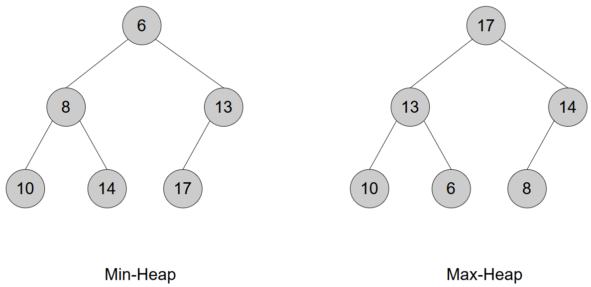

[Home](../../) | [Projects](../../projects) | [Notes](../) > <a href="./">Data Structures & Algorithms</a> > Priority Queues

# Priority Queues


## Introduction

A **priority queue** is an abstract data structure where **each element has a priority**, and elements are **served based on their priority**, not their insertion order.

- By default, the **highest priority** (usually the largest number) is dequeued first.
- Internally, it’s typically implemented using a **binary heap** for efficient performance.





### Pros:

* **Efficient operations**: `push`, `pop`, and `top` all run in **O(log n)** time with a binary heap.
* **Dynamic ordering**: Automatically keeps the highest (or lowest) priority item at the top.
* **Flexible**: Can be implemented as **min-heap** or **max-heap**, or customized using comparators.
* **Widely used**: Great for scheduling, graph algorithms (e.g., Dijkstra’s), load balancing, etc.

### Cons:

* **Limited access**: You can only access or remove the top-priority element — no direct access to arbitrary items.
* **Not suitable for sorted traversal**: Unlike balanced BSTs, you can’t iterate in order.
* **Re-prioritizing an item** (i.e., decreasing key) is not efficient unless custom logic is added.

### Usage

* Task scheduling
* Shortest path algorithms
* Simulations or real-time systems
* Event-driven systems


## Implementation (C++)

### Header (`minpq.hpp`)

```cpp
#ifndef MINPQ_HPP
#define MINPQ_HPP

#include <vector>

class minpq
{
public:
	void push(const int val);
	void pop();
	int top() const;
	bool empty() const;
	int size() const;
	void print() const;

private:
	std::vector<int> heap;	

	int parent(const int i) const;
	int left(const int i) const;
	int right(const int i) const;
	void heapify_up(int idx);
	void heapify_down(int idx);
};

#endif
```

### Source (`minpq.cpp`)

```cpp
#include "minpq.hpp"
#include <iostream>
#include <stdexcept>

void minpq::push(const int val)
{
	heap.push_back(val);
	heapify_up(heap.size() - 1);
}

void minpq::pop()
{
	if (heap.empty())
	{
		throw std::underflow_error("MinHeap is empty");
	}

	heap[0] = heap.back();
	heap.pop_back();

	if (!heap.empty())
	{
		heapify_down(0);
	}
}

int minpq::top() const
{
	if (heap.empty())
	{
		throw std::underflow_error("MinHeap is empty");
	}

	return heap[0];
}

bool minpq::empty() const
{
	return heap.empty();
}

int minpq::size() const
{
	return heap.size();
}

void minpq::print() const
{
	for (int val : heap)
	{
		std::cout << val << " ";
	}

	std::cout << std::endl;
}

// private functions

int minpq::parent(const int i) const
{
	return (i - 1) / 2;
}

int minpq::left(const int i) const
{
	return 2 * i + 1;
}

int minpq::right(const int i) const
{
	return 2 * i + 2;
}

void minpq::heapify_up(int idx)
{
	while (idx > 0 && heap[parent(idx)] > heap[idx])
	{
		std::swap(heap[parent(idx)], heap[idx]);
		idx = parent(idx);
	}
}

void minpq::heapify_down(int idx)
{
	int smallest = idx;
	int l = left(idx);
	int r = right(idx);

	if (l < heap.size() && heap[l] < heap[smallest])
	{
		smallest = l;
	}

	if (r < heap.size() && heap[r] < heap[smallest])
	{
		smallest = r;
	}

	if (smallest != idx)
	{
		std::swap(heap[idx], heap[smallest]);
		heapify_down(smallest);
	}
}
```

### Test Driver

```cpp
#include <iostream>
#include "minpq.hpp"

int main(int argc, char *argv[])
{
	minpq pq;

	pq.push(30);
	pq.push(10);
	pq.push(40);
	pq.push(50);
	pq.push(20);
	pq.push(60);

	std::cout << pq.top() << std::endl;	// 10

	pq.pop();

	std::cout << pq.top() << std::endl; // 20

	pq.print(); // 20 30 40 50 60

	pq.pop();

	pq.print(); // 30 50 40 60

	std::cout << pq.empty() << std::endl;	// 0
	std::cout << pq.size() << std::endl;	// 4

    return 0;
}

```

```plain
10
20
20 30 40 50 60
30 50 40 60
0
4
```

