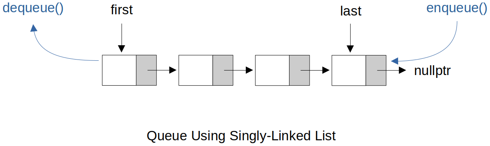

[Home](../../) | [Projects](../../projects) | [Notes](../) > <a href="./">Data Structures & Algorithms</a> > Queues

# Queues


## Queue Using Singly-Linked List (C++)

* The only design that allows both the `enqueue()` and `dequeue()` to be of O(1) time complexity is to enqueue to the last node and dequeue from the first node.





### Interface

```c
//==============================================================================
// File		: queue.h
// Brief	: Interface for Queue using Singly-Linked List
// Author	: Kyungjae Lee
// Date		: Jun 03, 2023
//==============================================================================

#ifndef QUEUE_H
#define QUEUE_H

// Class for queue (using singly-linked list) nodes
class Node
{
public:
    int value;
    Node *next;

    Node(int value);            // Constructor
};

// Class for queues (using singly-linked list)
class Queue
{
public:    
    // Public interface
    Queue(int value);           // Constructor  
    void enqueue(int value);    // Inserts a node into the last node of the queue
    int dequeue();              // Deletes the first node of the queue
    int getFirst(void);         // Returns the value of the first node of queue
    int getLast(void);          // Returns the number of the last node of the queue
    int getLength(void);        // Returns the number of the last node of the queue
    void printQueue(void);      // Prints all nodes in the queue
    ~Queue();                   // Destructor

private:
    Node *first;
    Node *last;
    int length;
};

#endif  // QUEUE_H
```

### Implementation

```c
//==============================================================================
// File		: queue.cpp
// Brief	: Implementation of Queue using Singly-Linked List
// Author	: Kyungjae Lee
// Date		: Jun 03, 2023
//==============================================================================

#include <iostream>
#include <cstdlib>		// EXIT_FAILURE
#include "queue.h"


using namespace std;

//------------------------------------------------------------------------------
// Implementation of Node class interface
//------------------------------------------------------------------------------

// Constructor
// T = O(1)
Node::Node(int value)
{
    this->value = value;
    next = nullptr;
}

//------------------------------------------------------------------------------
// Implementation of Queue (using singly-linked list) class interface
//------------------------------------------------------------------------------

// Constructor
// T = O(1)
Queue::Queue(int value)
{
    Node *newNode = new Node(value);
    first = newNode;
    last = newNode;
    length = 1;
}

// Inserts a node into the last node of the queue
// T = O(1)
void Queue::enqueue(int value)
{
    Node *newNode = new Node(value);

    // Insert a node into an empty queue
    if (length == 0)    // (first == nullptr) or (last == nullptr)
    {
        first = newNode;
        last = newNode;
    }
    // Insert a node into a non-empty queue
    else
    {
        last->next = newNode;
        last = newNode;
    }

    length++;
}

// Deletes the first node of the queue
// T = O(1)
int Queue::dequeue(void)
{
    // Do not allow dequeue operation on an empty queue
    if (length == 0)
    {
        cout << "ERROR: Cannot dequeue from an empty queue. Terminating!" << endl;
        exit(EXIT_FAILURE);
    }

    Node *delNode = first;
    int dequeuedValue = first->value;

    // If only 1 node in the queue
    if (length == 1)
    {
        first == nullptr;
        last == nullptr;
    }
    // If 2+ nodes in the queue
    else
    {   
        first = first->next;
    }

    delete delNode;
    length--;
    
    return dequeuedValue;
}

// Returns the value of the first node of the queue
// T = O(1)
int Queue::getFirst(void)
{
    return first->value;
}

// Returns the value of the last node of the queue
// T = O(1)
int Queue::getLast(void)
{
    return last->value;
}

// Returns the number of nodes in the queue
// T = O(1)
int Queue::getLength(void)
{
    return length;
}

// Prints all nodes in the queue
// T = O(n)
void Queue::printQueue(void)
{
    Node *temp = first;

    while (temp)
    {
        cout << temp->value << " ";
        temp = temp->next;
    }

    cout << endl;
}

// Destructor
// T = O(n)
Queue::~Queue(void)
{
    // first, last, length will be destroyed by default, but the nodes will not.
    // So, make sure to delete them manually in the destructor.

    Node *delNode = first;

    while (first)
    {
        first = first->next;
        delete delNode;
        delNode = first;
    }
}
```

### Test Driver

```c
//==============================================================================
// Filen	: main.cpp
// Brief	: Test driver for Queue using Singly-Linked List
// Author	: Kyungjae Lee
// Date		: Jun 03, 2023
//==============================================================================

#include <iostream>
#include "queue.h"

using namespace std;

int main(int argc, char *argv[])
{
    // Create a queue
    Queue *q = new Queue(4);
    
    // Enqueue nodes into the queue
    q->enqueue(3);
    q->enqueue(2);
    q->enqueue(1);

    // Print queue information
    cout << "First: " << q->getFirst() << endl;     // 4
    cout << "Last: " << q->getLast() << endl;       // 1
    cout << "Length: " << q->getLength() << endl;   // 4
    cout << "Queue elements: "; q->printQueue();    // 4 3 2 1

    cout << endl;
    
    // Dequeue nodes from the queue
    q->dequeue();
    q->dequeue();

    // Print queue information
    cout << "First: " << q->getFirst() << endl;     // 2
    cout << "Last: " << q->getLast() << endl;       // 1
    cout << "Length: " << q->getLength() << endl;   // 2
    cout << "Queue elements: "; q->printQueue();    // 2 1

    return 0;
}
```

```plain
First: 4
Last: 1
Length: 4
Queue elements: 4 3 2 1 

First: 2
Last: 1
Length: 2
Queue elements: 2 1 
```

