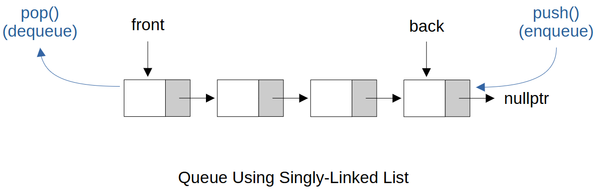

[Home](../../) | [Projects](../../projects) | [Notes](../) > <a href="./">Data Structures & Algorithms</a> > Queues

# Queues


## Queue Using Singly-Linked List (C++)

* The only design that allows both the `enqueue()` and `dequeue()` to be of O(1) time complexity is to enqueue to the last node and dequeue from the first node.





### Interface

```cpp
#ifndef QUEUE_HPP
#define QUEUE_HPP

class node
{
public:
	node(int val) : data(val), p_next(nullptr) {}

	int data;
	node *p_next;
};

class queue
{
public:
	queue();
	~queue();
	void push(const int val);	// enqueue
	void pop();					// dequeue
	int front() const;
	int back() const;
	bool empty() const;
	int size() const;
	void clear();

private:
	node *p_front;
	node *p_back;
	int cnt;
};

#endif
```

### Implementation

```cpp
#include "queue.hpp"
#include <stdexcept>

queue::queue()
	: p_front(nullptr), p_back(nullptr), cnt(0)
{
	// do nothing
}

queue::~queue()
{
	while (!empty())
	{
		pop();
	}
}

void queue::push(const int val)
{
	node *p_new = new node(val);

	if (empty())
	{
		p_front = p_back = p_new;
	}
	else
	{
		p_back->p_next = p_new;
		p_back = p_new;
	}

	++cnt;
}

void queue::pop()
{
	if (empty())
	{
		throw std::runtime_error("Queue underflow");
	}

	node *p_del = p_front;
	p_front = p_front->p_next;
	delete p_del;

	if (nullptr == p_front)
	{
		p_back = nullptr;
	}

	--cnt;
}

int queue::front() const
{
	if (empty())
	{
		throw std::runtime_error("Queue is empty");
	}

	return p_front->data;
}

int queue::back() const
{
	if (empty())
	{
		throw std::runtime_error("Queue is empty");
	}

	return p_back->data;
}

bool queue::empty() const
{
	return 0 == cnt; // return nullptr == p_front;
}

int queue::size() const
{
	return cnt;
}

void queue::clear()
{
	while (p_front)
	{
		node *p_del = p_front;
		p_front = p_front->p_next;
		delete p_del;

		// or simply just call 'pop()' in this while loop
	}

	cnt = 0;
}
```

### Test Driver

```cpp
#include <iostream>
#include "queue.hpp"

int main(int argc, char *argv[])
{
    queue q;

    q.push(1);
    q.push(2);
    q.push(3);
    q.push(4);
    q.push(5);	// 1 -> 2 -> 3 -> 4 -> 5

    std::cout << q.front() << std::endl;	// 1
    std::cout << q.back() << std::endl;		// 5
	
	q.pop();
    std::cout << q.size() << std::endl;		// 4
    std::cout << q.empty() << std::endl;	// 0

    q.clear();
    std::cout << q.size() << std::endl;		// 0

    return 0;
}
```

```plain
1
5
4
0
0
```

