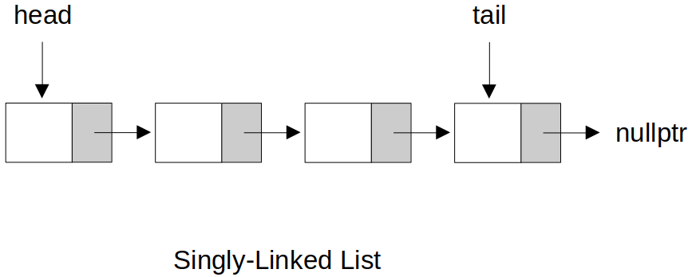

[Home](../../) | [Projects](../../projects) | [Notes](../) > <a href="./">Data Structures & Algorithms</a> > Singly-Linked Lists

# Singly-Linked Lists


## Singly-Linked List (C++)





### Interface

```c
//==============================================================================
// File		: singly_linked_list.h
// Brief	: Interface for Singly-Linked List
// Author	: Kyungjae Lee
// Date		: May 02, 2023
//==============================================================================

#ifndef SINGLY_LINKED_LIST_H
#define SINGLY_LINKED_LIST_H

// Class for singly-linked list nodes
class Node
{
public:
    int value;
    Node *next;

    Node(int value);                    // Constructor
};

// Class for singly-linked lists
class SinglyLinkedList
{
public:    
    // Public interface
    SinglyLinkedList(int value);        // Constructor
    void append(int value);             // Add a node at the end
    void prepend(int value);            // Add a node at the front
    bool insert(int index, int value);  // Insert a node into the given index position
    void deleteNode(int index);         // Delete a node with the given index position
    void deleteLast();                  // Delete the last node
    void deleteFirst();                 // Delete the first node
    Node* get(int index);               // Get the node value of the given index position
    bool set(int index, int value);     // Set the node value of the given index position
    void reverse();                     // Reverse the list
    void printList();                   // Print the list
    ~SinglyLinkedList();                // Destructor

private:
    Node *head;
    Node *tail;
    int length;
};

#endif
```

### Implementation

```c
//==============================================================================
// File		: singly_linked_list.cpp
// Brief	: Implementation of Singly-Linked List
// Author	: Kyungjae Lee
// Date		: May 02, 2023
//==============================================================================

#include <iostream>
#include <cstdlib>		// EXIT_FAILURE
#include "singly_linked_list.h"

using namespace std;

//------------------------------------------------------------------------------
// Implementation of Node class interface
//------------------------------------------------------------------------------

// Constructor
Node::Node(int value)
{
    this->value = value;
    next = nullptr;
}

//------------------------------------------------------------------------------
// Implementation of SinglyLinkedList class interface
//------------------------------------------------------------------------------

// Constructor
// T = O(1)
SinglyLinkedList::SinglyLinkedList(int value)
{
    Node *newNode = new Node(value);
    head = newNode;
    tail = newNode;
    length = 1;
}

// Add a node at the end
// T = O(1)
void SinglyLinkedList::append(int value) 
{
    Node *newNode = new Node(value);

    // Insert a node into an empty list
    if (length == 0)    // (head == nullptr) or (tail == nullptr)
    {
        head = newNode;
        tail = newNode;
    }   
    // Insert a node into a non-empty list
    else
    {
        tail->next = newNode;
        tail = newNode;
    }

    length++;
}

// Add a node at the front
// T = O(1)
void SinglyLinkedList::prepend(int value)
{
    Node *newNode = new Node(value);

    // Insert a node into an empty list
    if (length == 0)
    {
        head = newNode;
        tail = newNode;
    }
    // Insert a node into a non-empty list
    else
    {
        newNode->next = head;
        head = newNode;
    }

    length++;
}

// Insert a node into the given index position
// T = O(n)
bool SinglyLinkedList::insert(int index, int value)
{
    // Validity check for index
    if (index < 0 || index > length)
        return false;

    // Insert a node at front (prepend)
    if (index == 0)
    {
        prepend(value);
        return true;
    }

    // Insert a node at the end (append)
    if (index == length)
    {
        append(value);
        return true;
    }

    // Insert a node somewhere in the middle
    Node *newNode = new Node(value);
    Node *temp = get(index - 1);
    newNode->next = temp->next;
    temp->next = newNode;

    length++;

    return true;
}

// Delete a node with the given index position
// T = O(n)
void SinglyLinkedList::deleteNode(int index)
{
    // Validity check for index
    if (index < 0 || index >= length)
        return;

    // Delete the first node
    if (index == 0)
        return deleteFirst();   // Available only when return types are the same

    // Delete the last node
    if (index == length - 1)
        return deleteLast();

    // Delete the node from somewhere in the middle
    Node *before = get(index - 1);
    Node *delNode = before->next;
    before->next = delNode->next;
    delete delNode;

    length--;
}

// Delete the last node
// T = O(n)
void SinglyLinkedList::deleteLast()
{
    // Do not allow delete operation on an empty list
    if (length == 0)
    {
        cout << "ERROR: Cannot delete from an empty list. Terminating!" << endl;
        exit(EXIT_FAILURE);
    }

    Node *delNode = head;

    // If only 1 node in the list
    if (length == 1)
    {
        head = nullptr;
        tail = nullptr;
    }
    // If 2+ nodes in the list
    else
    {
        Node *before = head;

        while (delNode->next)
        {
            before = delNode;
            delNode = delNode->next;
        }

        tail = before;
        tail->next = nullptr;
    }

    delete delNode;
    length--;
}

// Delete the first node
// T = O(1)
void SinglyLinkedList::deleteFirst()
{
    // Do not allow delete operation on an empty list
    if (length == 0)
    {
        cout << "ERROR: Cannot delete from an empty list. Terminating!" << endl;
        exit(EXIT_FAILURE);
    }

    Node *delNode = head;

    // If only 1 node in the list
    if (length == 1)
    {
        head = nullptr;
        tail = nullptr;
    }
    // If 2+ nodes in the list
    else
        head = head->next;

    delete delNode;
    length--;
}

// Get the node value of the given index position
// T = O(n)
Node* SinglyLinkedList::get(int index)
{
    // Validity check for index
    if (index < 0 || index >= length)
        return nullptr;

    Node *temp = head;

    // Search for the node
    for (int i = 0; i < index; i++)
        temp = temp->next;

    return temp;
}

// Set the node value of the given index position
// T = O(n)
bool SinglyLinkedList::set(int index, int value)
{
    // Get the node
    Node *temp = get(index);

    // Set the value
    if (temp)
    {
        temp->value = value;
        return true;
    }

    return false;
}

// Reverse the list
// T = O(n)
void SinglyLinkedList::reverse()
{
    // Swap head and tail
    Node *temp = head;
    head = tail;
    tail = temp;

    Node *after = temp->next;
    Node *before = nullptr;

    // Iteratively reverse the direction of next pointer
    for (int i = 0; i < length; i++)
    {
        after = temp->next;
        temp->next = before;
        before = temp;
        temp = after;
    }
}

// Print the list
// T = O(n)
void SinglyLinkedList::printList()
{
    Node *temp = head;

    while (temp)
    {
        cout << temp->value << " ";
        temp = temp->next;
    }

    cout << endl;
}

// Destructor
// T = O(n)
SinglyLinkedList::~SinglyLinkedList()
{
    // head, tail, length will be destroyed by default, but the nodes will not.
    // So, make sure to delete them manually in the destructor.

    Node *delNode = head;

    while (head)
    {
        head = head->next;
        delete delNode;
        delNode = head;
    }
}
```

### Test Driver

```c
//==============================================================================
// File		: main.cpp
// Brief	: Test driver for Singly-Linked List
// Author	: Kyungjae Lee
// Date		: May 02, 2023
//==============================================================================

#include <iostream>
#include "singly_linked_list.h"

using namespace std;

int main(int argc, char *argv[])
{
    // Create a list
    SinglyLinkedList *sll = new SinglyLinkedList(2);
    
    // Prepend
    sll->prepend(1);

    // Append
    sll->append(4);
    sll->append(5);
    sll->append(6);

    // Insert (insert 3 at index 2)
    sll->insert(2, 3);  

    // Print the list
    sll->printList();       // 1 2 3 4 5 6

    // Delete first
    sll->deleteFirst();

    // Delete last
    sll->deleteLast();

    // Delete from the middle (index 1)
    sll->deleteNode(1);

    // Print the list
    sll->printList();       // 2 4 5

    // Set (value of the node at index 1 to 10)
    sll->set(1, 10);

    // Get (value of the node at index 1 to 10)
    cout << sll->get(1)->value << endl; // 10

    // Reverse the list
    sll->reverse();

    // Print the list
    sll->printList();       // 5 10 2

    return 0;
}
```

```plain
1 2 3 4 5 6 
2 4 5 
10
5 10 2 
```
