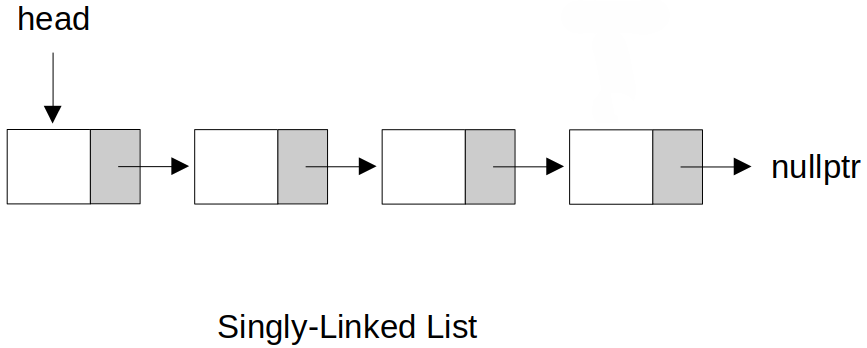

[Home](../../) | [Projects](../../projects) | [Notes](../) > <a href="./">Data Structures & Algorithms</a> > Singly-Linked Lists

# Singly-Linked Lists


## Singly-Linked List (C++)





### Interface

```c
#ifndef SLIST_HPP
#define SLIST_HPP

#include <iostream>

class node
{
public:
	node(int val) : data(val), p_next(nullptr) {}

	int data;
	node *p_next;
};

class slist
{
public:
	slist() : p_head(nullptr), cnt(0) {}
	~slist() { clear(); }
	void push_front(const int val);
	void push_back(const int val);
	void insert_at(const int idx, const int val);
	void pop_front();
	void pop_back();
	void erase_at(const int idx);
	void erase_val(const int val);
	int get_at(const int idx);
	int find(const int val);
	int front();
	int back();
	int size();
	bool empty();
	void clear();
	void print();
	
private:
	node *p_head;
	int cnt;
};

#endif
```

### Implementation

```c
#include "slist.hpp"

void slist::push_front(const int val)
{
	node *p_new_node = new node(val);
	p_new_node->p_next = p_head;
	p_head = p_new_node;
	cnt++;
}

void slist::push_back(const int val)
{
	node *p_new_node = new node(val);

	if (!p_head)
	{
		p_head = p_new_node;
	}
	else
	{
		node *p_temp = p_head;

		while (p_temp->p_next)
		{
			p_temp = p_temp->p_next;
		}

		p_temp->p_next = p_new_node;
	}

	cnt++;
}

void slist::insert_at(const int idx, const int val)
{
	if (idx < 0 || idx > cnt)
	{
		return;
	}

	if (0 == idx)
	{
		return push_front(val);
	}

	node *p_new_node = new node(val);
	node *p_temp = p_head;

	for (int i = 0; i < idx - 1; i++)
	{
		p_temp = p_temp->p_next;
	}

	p_new_node->p_next = p_temp->p_next;
	p_temp->p_next = p_new_node;

	cnt++;
}

void slist::pop_front()
{
	if (!p_head)
	{
		return;
	}

	node *p_temp = p_head;
	p_head = p_head->p_next;
	delete p_temp;
	cnt--;
}

void slist::pop_back()
{
	if (!p_head)
	{
		return;
	}	

	if (!p_head->p_next)
	{
		delete p_head;
		p_head = nullptr;
	}
	else
	{
		node *p_temp = p_head;

		while (p_temp->p_next->p_next)
		{
			p_temp = p_temp->p_next;
		}

		delete p_temp->p_next;
		p_temp->p_next = nullptr;
	}

	cnt--;
}

void slist::erase_at(const int idx)
{
	if (idx < 0 || idx > cnt)
	{
		return;
	}

	if (0 == idx)
	{
		return pop_front();
	}

	node *p_temp = p_head;

	for (int i = 0; i < idx - 1; i++)
	{
		p_temp = p_temp->p_next;
	}

	node *p_del_node = p_temp->p_next;
	p_temp->p_next = p_temp->p_next->p_next;
	delete p_del_node;
	cnt--;
}

void slist::erase_val(const int val)
{
	if (!p_head)
	{
		return;
	}

	if (val == p_head->data)
	{
		pop_front();
	}

	node *p_temp = p_head;

	while (p_temp->p_next && val != p_temp->p_next->data)
	{
		p_temp = p_temp->p_next;
	}

	if (p_temp->p_next)
	{
		node *p_del_node = p_temp->p_next;
		p_temp->p_next = p_temp->p_next->p_next;
		delete p_del_node;
	}

	cnt--;
}

int slist::get_at(const int idx)
{
	if (idx < 0 || idx >= cnt)
	{
		throw std::out_of_range("Index out of range");
	}

	node *p_temp = p_head;

	for (int i = 0; i < idx; i++)
	{
		p_temp = p_temp->p_next;
	}

	return p_temp->data;
}

int slist::find(const int val)
{
	node *p_temp = p_head;
	int idx = 0;

	while (p_temp)
	{
		if (val == p_temp->data)
		{
			return idx;
		}

		p_temp = p_temp->p_next;
		idx++;
	}

	return -1;
}

int slist::front()
{
	if (!p_head)
	{
		throw std::runtime_error("List is empty");
	}

	return p_head->data;
}

int slist::back()
{
	if (!p_head)
	{
		throw std::runtime_error("List is empty");
	}

	node *p_temp = p_head;

	while (p_temp->p_next)
	{
		p_temp = p_temp->p_next;
	}

	return p_temp->data;
}

int slist::size()
{
	return cnt;
}

bool slist::empty()
{
	return 0 == cnt;
}

void slist::clear()
{
	while (p_head)
	{
		node *p_temp = p_head;
		p_head = p_head->p_next;
		delete p_temp;
	}

	cnt = 0;
}

void slist::print()
{
	node *p_temp = p_head;

	while (p_temp)
	{
		std::cout << p_temp->data << " -> ";
		p_temp = p_temp->p_next;
	}

	std::cout << "null" << std::endl;
}
```

### Test Driver

```c
#include <iostream>
#include "slist.hpp"

int main(int argc, char *argv[])
{
	slist sl;

	sl.push_front(1);
	sl.push_back(2);
	sl.push_back(3);
	sl.push_back(4);
	sl.push_back(5);
	sl.push_back(6);
	sl.print(); 		// 1 -> 2 -> 3 -> 4 -> 5 -> 6 -> null

	sl.pop_front();
	sl.print();			// 2 -> 3 -> 4 -> 5 -> 6 -> null
	sl.pop_back();
	sl.print();			// 2 -> 3 -> 4 -> 5 -> null

	sl.insert_at(0, 1); 
	sl.print();			// 1 -> 2 -> 3 -> 4 -> 5 -> null
	sl.erase_at(1);
	sl.print();			// 1 -> 3 -> 4 -> 5 -> null
	sl.erase_val(3);
	sl.print();			// 1 -> 4 -> 5 -> null

	std::cout << sl.find(4) << std::endl;	// 1
	std::cout << sl.empty() << std::endl;	// 0
	std::cout << sl.size() << std::endl;	// 3

	std::cout << sl.front() << std::endl;	// 1
	std::cout << sl.back() << std::endl;	// 5
	std::cout << sl.get_at(1) << std::endl; // 4

	sl.clear();
	sl.print();			// null

	return 0;
}
```

```plain
1 -> 2 -> 3 -> 4 -> 5 -> 6 -> null
2 -> 3 -> 4 -> 5 -> 6 -> null
2 -> 3 -> 4 -> 5 -> null
1 -> 2 -> 3 -> 4 -> 5 -> null
1 -> 3 -> 4 -> 5 -> null
1 -> 4 -> 5 -> null
1
0
3
1
5
4
null
```
