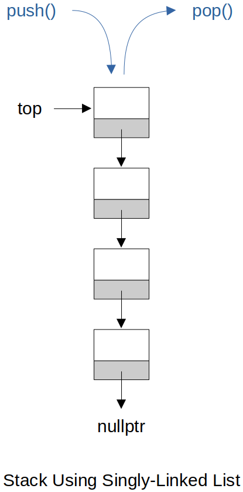

[Home](../../) | [Projects](../../projects) | [Notes](../) > <a href="./">Data Structures & Algorithms</a> > Stacks

# Stacks


## Stack Using Singly-Linked List (C++)

* `push()` and `pop()` operations are designed to be done on the head of the list since both of their time complexity is O(1).





### Interface

```cpp
#ifndef STACK_HPP
#define STACK_HPP

class node
{
public:
	node(int val) : data(val), p_next(nullptr) {}

	int data;
	node *p_next;
};

class stack
{
public:
	stack();
	~stack();
	void push(const int val);
	void pop();
	int top() const;
	bool empty() const;
	int size() const;
	void clear();

private:
	node *p_top;
	int cnt;
};

#endif
```

### Implementation

```cpp
#include "stack.hpp"
#include <stdexcept>

stack::stack()
	: p_top(nullptr), cnt(0)
{
	// Do nothing
}

stack::~stack()
{
	while (!empty())
	{
		pop();
	}
}

void stack::push(const int val)
{
	node *p_new = new node(val);
	p_new->p_next = p_top;
	p_top = p_new;
	++cnt;
}

void stack::pop()
{
	if (empty())
	{
		throw std::runtime_error("Stack underflow");
	}

	node *p_del = p_top;
	p_top = p_top->p_next;
	delete p_del;
	--cnt;
}

int stack::top() const
{
	if (empty())
	{
		throw std::runtime_error("Stack is empty");
	}

	return p_top->data;
}

bool stack::empty() const
{
	return 0 == cnt;
}

int stack::size() const
{
	return cnt;
}

void stack::clear()
{
	while (nullptr != p_top)
	{
		node *p_del = p_top;
		p_top = p_top->p_next;
		delete p_del;
	}

	cnt = 0;
}
```

### Test Driver

```cpp
#include <iostream>
#include "stack.hpp"

int main(int argc, char *argv[])
{
	stack s;

	s.push(1);
	s.push(2);
	s.push(3);
	s.push(4);
	s.push(5);
	
	std::cout << s.top() << std::endl;		// 5
	std::cout << s.size() << std::endl;		// 5
	std::cout << s.empty() << std::endl;	// 0

	s.clear();
	std::cout << s.size() << std::endl;		// 0

	return 0;
}
```

```plain
5
5
0
0
```
