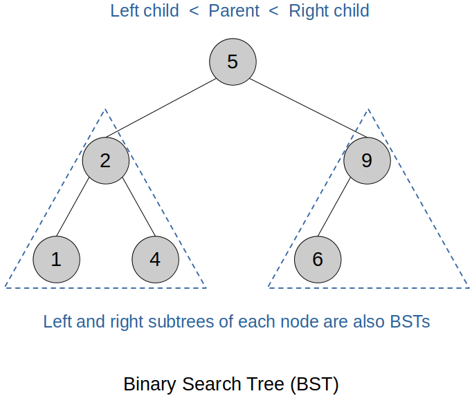

[Home](../../) | [Projects](../../projects) | [Notes](../) > <a href="./">Data Structures & Algorithms</a> > Trees

# Trees


## Binary Trees Terminology

* **Full binary tree**
  * Every node points to either 0 or 2 nodes
* **Complete binary tree**
  * All levels, except possibly the last one, are completely filled, and the last level is filled from left to right with no missing nodes. 
  * Not "perfect" since the bottom level is not filled all the way across
* **Perfect binary tree**
  * Any level of a binary tree that has any nodes is perfectly filled all the way across
  * All perfect binary trees are both "complete" and "full"
* **Siblings**
  * Nodes that share the same parent
  * In a tree, each node (except for the root node) has exactly one parent.
* **Leaf node**
  * Any node in a tree that has no children
* **Internal node (a.k.a. inner node or non-leaf node)**
  * Any node in a tree that is not a leaf node
  * Root node is also an internal node.


## Binary Search Trees (C++)

* A binary search tree (BST) is a binary tree data structure in which each node has a key/value associated with it, and the keys satisfy the following properties:





* All operations have O(log n) time complexity, which is very efficient. (Every time you go down one level, you are excluding the half of the remaining nodes from your search.)

  $\to$ Divide and conquer!

* If a tree never forks, it is essentially a linked list, in which case the search time complexity will be O(n). However, since this is not a general case, a binary search tree is still treated as an O(log n) data structure.

### Interface

```c
//==============================================================================
// File		: binary_search_tree.h
// Brief	: Interface for Binary Search Tree (BST)
// Author	: Kyungjae Lee
// Date		: Jun 29, 2023
//==============================================================================

#ifndef BINARY_SEARCH_TREE_H
#define BINARY_SEARCH_TREE_H

// Class for binary search tree nodes
class Node
{
public:
    int value;
    Node *left;			// Pointer to the left child
    Node *right;		// Pointer to the right child

    Node(int value);	// Constructor
};

// Class for binary search tree
class BinarySearchTree
{
public:    
    // Public interface
    BinarySearchTree(void);		// Constructor	
    ~BinarySearchTree(void);	// Destructor
	bool insert(int value);		// Inserts a node into the BST
	bool contains(int value);	// Checks if the BST contains the passed node

//private:
    Node *root;
};

#endif // BINARY_SEARCH_TREE_H
```

### Implementation

```c
//==============================================================================
// File		: binary_search_tree.cpp
// Brief	: Implementation of Binary Search Tree (BST)
// Author	: Kyungjae Lee
// Date		: Jun 29, 2023
//==============================================================================

#include <iostream>
#include "binary_search_tree.h"

using namespace std;

//------------------------------------------------------------------------------
// Implementation of Node class interface
//------------------------------------------------------------------------------

// Constructor
// T = O(1)
Node::Node(int value)
{
    this->value = value;
    left = nullptr;
    right = nullptr;
} // End of Node constructor

//------------------------------------------------------------------------------
// Implementation of Binary Search Tree class interface
//------------------------------------------------------------------------------

// Constructor
// T = O(1)
BinarySearchTree::BinarySearchTree(void)
{
    root = nullptr;
} // End of BinarySearchTree constructor

// Inserts a node into the BST
// T = O(log n); Technically O(log n) since the Big-O measures the worst case
bool BinarySearchTree::insert(int value)
{
	Node *newNode = new Node(value);

	if (root == nullptr)
	{
		// Handle inserting a node into an empty BST
		root = newNode;
		return true;
	}

	Node *curr = root;
	
	while (true)
	{
		if (newNode->value == curr->value)
		{
			// Do not allow inserting a node whose value is already present in
			// the BST
			return false;
		}
		else if (newNode->value < curr->value)
		{
			// newNode with the smaller value goes to the left
			if (curr->left == nullptr)
			{
				// Spot is empty, so insert the newNode there
				curr->left = newNode;
				return true;
			}
			else
			{
				// Spot is not empty, advance the curr and keep searching
				curr = curr->left;
			}
		}
		else
		{
			// newNode with the greater value goes to the right
			if (curr->right == nullptr)
			{
				// Spot is empty, so insert the newNode there
				curr->right = newNode;
				return true;
			}
			else
			{
				// Spot is not empty, advance the curr and keep searching
				curr = curr->right;
			}

		}
	}
} // End of insert */

// Checks if the BST contains the passed node
// T = O(log n); Technically O(log n) since the Big-O measures the worst case
bool BinarySearchTree::contains(int value)
{
	Node *curr = root;

	while (curr)
	{
		if (value < curr->value)
			curr = curr->left;
		else if (value > curr->value)
			curr = curr->right;
		else
			return true;
	}

	return false;
} // End of contains
```

### Test Driver

```c
//==============================================================================
// File		: main.cpp
// Brief	: Test driver for Binary Search Tree (BST)
// Author	: Kyungjae Lee
// Date		: Jun 29, 2023
//==============================================================================

#include <iostream>
#include "binary_search_tree.h"

using namespace std;

int main(int argc, char *argv[])
{
    // Create a BST
    BinarySearchTree *bst = new BinarySearchTree();
    
	// Insert nodes
	bst->insert(47);
	bst->insert(21);
	bst->insert(76);
	bst->insert(18);
	bst->insert(57);
	bst->insert(82);
	bst->insert(27);

	cout << bst->root->left->right->value << endl;			// 27

	cout << "Contains 27: " << bst->contains(27) << endl;	// 1
	cout << "Contains 17: " << bst->contains(17) << endl;	// 0

    return 0;
}
```

```plain
27
Contains 27: 1
Contains 17: 0
```

