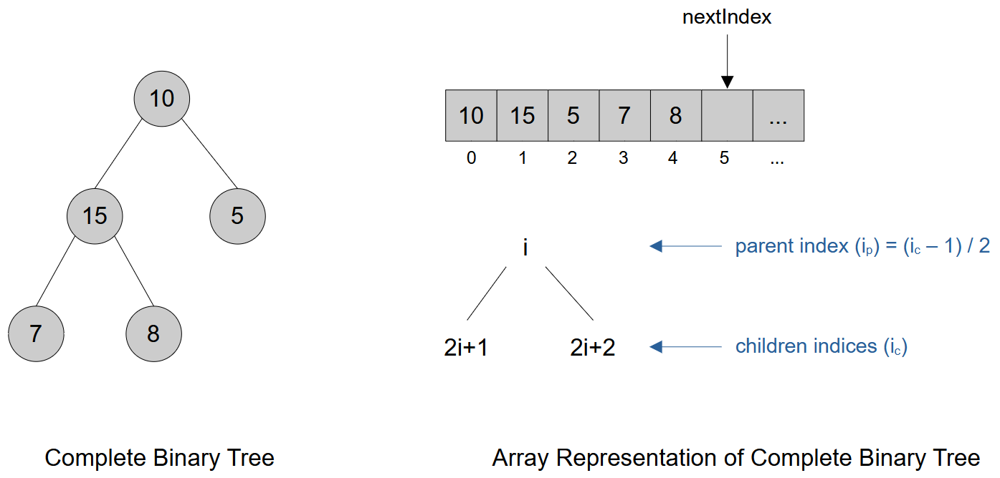

[Home](../../) | [Projects](../../projects) | [Notes](../) > <a href="./">Data Structures & Algorithms</a> > Trees

# Trees

## Terminology

| Term          | Definition                                                   |
| ------------- | ------------------------------------------------------------ |
| Node          | A basic unit containing data and links to child nodes.       |
| Root          | The topmost node of the tree; has no parent.                 |
| Parent        | A node that has one or more child nodes.                     |
| Child         | A node that descends from another node.                      |
| Leaf          | A node with no children.                                     |
| Internal Node | A node with at least one child (i.e. not a leaf). Root is also an internal node. |
| Edge          | A connection between a parent and a child node.              |
| Path          | A sequence of nodes connected by edges.                      |
| Height        | The number of edges on the longest path from a node to a leaf. |
| Depth         | The number of edges from the root to a node.                 |
| Level         | The depth of a node plus one (root is at level 1).           |
| Subtree       | A tree formed from any node and its descendants.             |
| Sibling       | Nodes that share the same parent.                            |
| Degree        | The number of children a node has.                           |
| Balanced Tree | A tree where the height difference between subtrees is minimal. |
| Binary Tree   | A tree where each node has at most two children (left and right). |

## Binary Trees

A **binary tree** is a hierarchical data structure where each node has at most **two children**: a **left child** and a **right child**. It is commonly used to represent structured data like arithmetic expressions, hierarchical relationships, and is the foundation of many search and sorting algorithms.

### Common Types

* **Full binary tree**
  * Every node has 0 or 2 children.
* **Complete binary tree**
  * All levels are filled except possibly the last, which is filled left to right with no missing nodes. 
  * Not "perfect" since the bottom level is not filled all the way across.

* **Perfect binary tree**
  * All internal nodes have 2 children, and all leaves are at the same level.
  * All perfect binary trees are both "complete" and "full"
* **Binary Search Tree (BST)**
  * Left child < parent < right child.

## Binary Search Trees

A **Binary Search Tree (BST)** is a type of binary tree where each node follows a specific ordering rule:

- The **left subtree** contains only nodes with values **less than** the parent node.
- The **right subtree** contains only nodes with values **greater than** the parent node.
- This rule applies **recursively** to every subtree in the tree.

BSTs are widely used for **efficient searching, insertion, and deletion**, with average-case time complexity of **O(log n)** for balanced trees.

* All operations have O(log n) time complexity, which is very efficient. (Every time you go down one level, you are excluding the half of the remaining nodes from your search.)

  $\to$ Divide and conquer!

* If a tree never forks, it is essentially a linked list, in which case the search time complexity will be O(n). However, since this is not a general case, a binary search tree is still treated as an O(log n) data structure.
