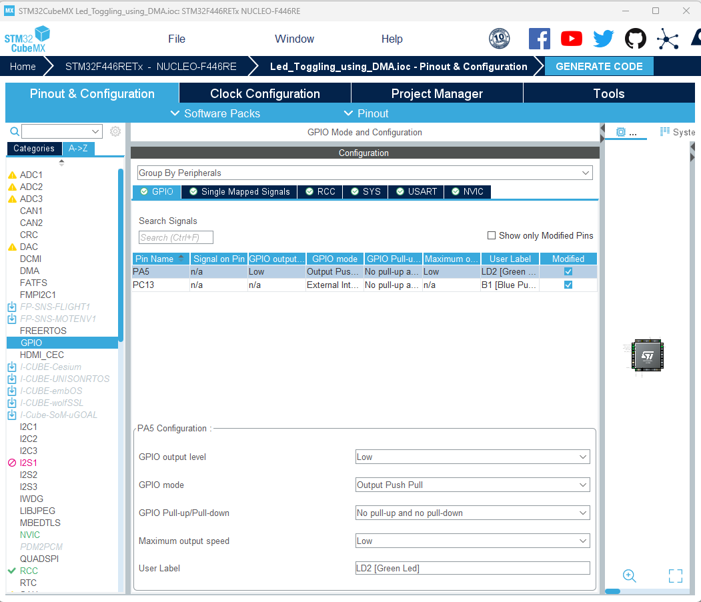

[Home](../../) | [Projects](../../projects) | [Notes](../) > <a href="./">Direct Memory Access (DMA)</a> > Exercise 1: GPIO Polling & Interrupt

# Exercise 1: GPIO Polling & Interrupt

## Create a Project using STM32CubeMX

1. Identify the GPIO port to which LED is connected. (e.g., GPIOA Pin 5)

2. Identify the bus interface to which the GPIOA peripheral is connected. (e.g., AHB1)

   

   

   

3. Identify which bus master can talk to AHB1 peripherals.

   In this example, we want to read data from SRAM and write it to GPIOA peripheral. According to the following diagram, DMA1 can read data from SRAM but is not capable of communicating with the AHB1 bus. So, our choice must be DMA2.

   

   

   

4. Create a project using STM32CubeMX.

   Select "MDK-ARM" for Toolchain/IDE option. (ARM Keil MDK must be installed already!)

   Select "No" to "Initialize all peripherals with their default Mode?" question. We only want the initialization code for the peripherals we want in our project.

5. Check the GPIOA Pin 5 configuration. (Default configuration is good.)

   

   

   

6. Add DMA2 peripheral to the project.

   "Memory to Memory" is just the way STM32CubeMX names it. This can handle data transfer between memory and other peripherals.

   

   

   

7. Check the NVIC configuration.

   For "Code generation", leave on only the SysTick Timer.

   

   

   

## LED Toggling using DMA (Polling)

* DMA performs a byte-by-byte data transfer from SRAM to a GPIO peripheral using polling. This results in the CPU being consistently engaged, akin to a spinlock, throughout the duration of each data byte transfer.
* Poor CPU utilization.

## LED Toggling using DMA (Interrupt)

* When DMA performs a byte-by-byte data transfer from SRAM to a GPIO peripheral using interrupts, the CPU's involvement is much more efficient compared to the polling method. Instead of keeping the CPU consistently engaged, as in polling, the DMA initiates the data transfer and then triggers an interrupt to notify the CPU when each byte transfer is complete.
* In this scenario, the CPU can continue with other tasks while the DMA handles the actual data movement. When the interrupt is triggered after a byte transfer, the CPU temporarily shifts its focus to execute the interrupt handling routine. Once the routine is done, the CPU can resume its regular activities. This method ensures that the CPU is not stuck in a spinlock-like state, providing a more efficient utilization of CPU resources and enabling multitasking without significant performance degradation.
* The DMA event that has occurred will be decoded by reading the status registers of the DMA controller, and the corresponding callbacks will be invoked by the interrupt handling function (e.g., `HAL_DMA_IRQHandler()`).
  * Callback functions will only be called when they are registered (i.e., not `NULL`). Callback function registration can be done using a DMA driver API: `HAL_DMA_RegisterCallback()`.
  * Callback functions run in "handler mode," which means they are part of the interrupt context. Avoid implementing loops that could cause significant delays. Keep callback functions as minimal as possible. (Note: Callback functions don't run in "thread mode," so caution is  advised!)
* Events include errors, half transfer compelete interrupt, full transfer complete interrupt, etc.
