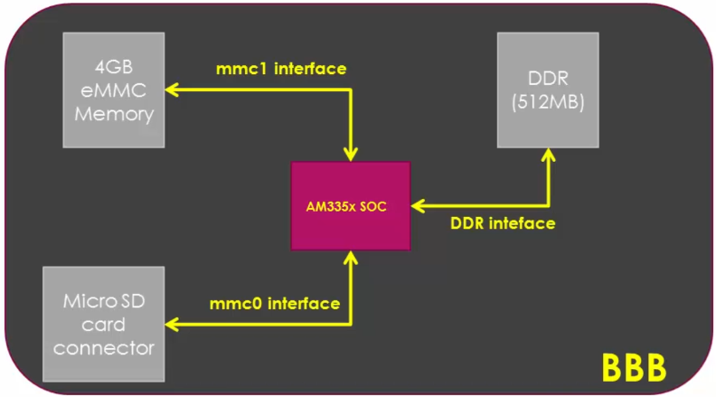
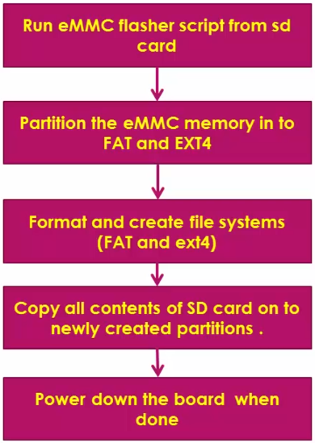

[Home](../../) | [Projects](../../projects) | [Notes](../) > <a href="./">Embedded Linux</a> > BBB eMMC Flashing

# BBB eMMC Flashing

In this section we will explore:

1. Updating (re-flashing) the eMMC memory with the latest Debian OS image in Ubuntu host.
2. BBB networking configurations in Ubuntu host.

To check the Debian OS version your BBB board is running `lsb_release -da`.

```plain
debian@beaglebone:~$ lsb_release -da
No LSB modules are available.
Distributor ID: Debian
Description:    Debian GNU/Linux 10 (buster)
Release:        10
Codename:       buster
```

Latest release of BBB Debian OS: [https://beagleboard.org/latest-images](https://beagleboard.org/latest-images).

Here, to sync with the lecture I used, `bone-debian-8.7-lxqt-4gb-armhf-2017-03-19-4gb.img`.


## Introduction

* BBB Rev C comes with 4 GB of eMMC memory which already contains the the Debian OS.
  




* The BBB board tries to boot from MMC1 interface by default.
* To boot from eMMC first you have to flash a bootable **image** and the **root file system (RFS)** onto eMMC memory.
* We will use the microSD card to help flash the image onto eMMC memory.


## BBB eMMC Update

### Procedure

1. Download the latest Debian OS

2. Write the bootable image to the SD card 

   * Use `dmesg` to identify the SD card on your system.

   * Use `xz -d <filename.xz>` to decompress the file.

   * Use `sudo dd if=<filenae>.img of=/dev/<sdx>` to write the image to the SD card. This may take 10 - 15 mins.

     When writing is done, run `sync` command to force an immediate write of all cached data to disk. 

     (About `sync`: [https://www.computerhope.com/unix/sync.htm](https://www.computerhope.com/unix/sync.htm0))

     > If this doesn't work, right click the image file $\to$ Open With Disk Image Writer $\to$ do the image writing here!

   * `roofs/boot/uEnv.txt` $\to$ Uncomment the last line:

     ```plain
     cmdline=init=/opt/scripts/tools/eMMC/init-eMMC-flasher-v3.sh
     ```
     
     > This will automatically run the eMMC flasher during the boot process.

4. Boot the board from SD card 

5. eMMC flasher script located in the SD card as a part of the image we downloaded will flash all the contents of the SD card onto the eMMC memory automatically (because of the uncommented line of uEnv.txt file from the previous step!

   It partitions the eMMC memory and flashes all the required data (e.g., boot images, applications, root file system, etc.) onto the eMMC. Flashing usually takes 5 - 10 mins. **Wait until everything is done and the board powers off by itself!**

6. Remove the SD card. The board should be able to boot from eMMC.





## References

Nayak, K. (2022). *Embedded Linux Step by Step Using Beaglebone Black* [Video file]. Retrieved from https://www.udemy.com/course/embedded-linux-step-by-step-using-beaglebone/

