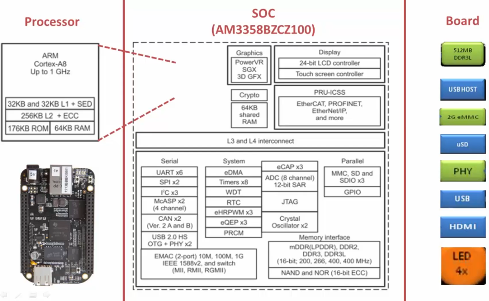
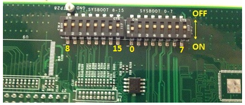
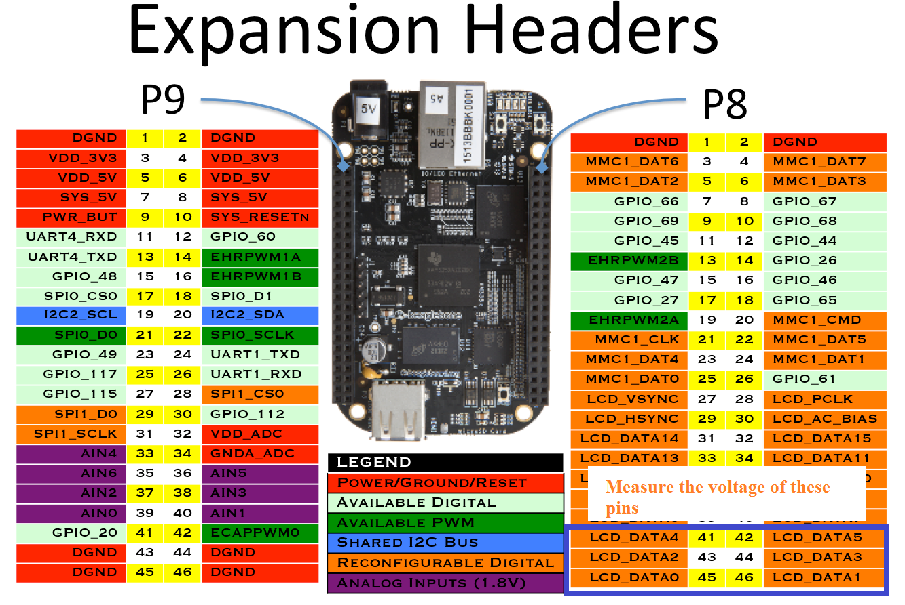
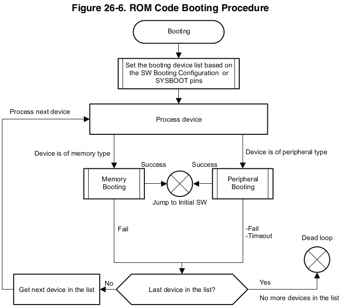

[Home](../../) | [Projects](../../projects) | [Notes](../) > <a href="./">Embedded Linux</a> > BBB Linux Boot Sequence - Introduction

# BBB Linux Boot Sequence - Introduction

## Linux Boot Requirements

### Hardware 

* e.g., AM335x SoC Functional Blocks

### Software

* **ROM Boot Loader (RBL)**
  * The very first piece of code (tiny boot loader) to run on the SoC when the power is supplied to the board.
  * This boot loader is written by the SoC vendor (e.g., Texas Instrument) and stored in ROM of the SoC during the production of this chip. 
  * This code cannot be modified and is not open to public.
  * The main responsibility of the RBL is to load/run the second stage boot loader such as SPL (or MLO) from the internal memory.
* **Secondary Program Loader (SPL)** - a.k.a. **Memory LOader (MLO)**
  * The responsibility of the second stage boot loader is to load/run the third stage boot loader such U-boot from the DDR memory of the board.
* **U-boot**
  * The responsibility of the third stage boot loader is to load/run the Linux kernel from the DDR memory of the board.
* **Linux kernel**
* **Root File System (RFS)**

## BBB Boot Options

* AM335x SoC can boot from the following boot sources:

  * NAND Flash
  * NOR Flash (eXecute In Place; XIP)
  * USB
  * SD card
  * Ethernet
  * UART
  * SPI

  This mean that you can keep the boot images in any of the above memories or peripherals and boot the SoC.

* SYSBOOT Configuration (in TRM documentation)

  Focus on **SYSBOOT[4:0]**. "SYSBOOT" is one of the registers of this SoC and its first 5 bits decide the boot order.

  

  * SYSBOOT [4:0] = 00000b (This is reserved, you cannot use this configuration)   
  * SYSBOOT [4:0] = 00001b   
    1. On reset, SoC will first try to boot from UART0.
    2. If it fails, then it will try to boot from XIP(XIP stands  for eXutable In Place memory like NOR Flash). 
    3. If it fails, then  it will try to boot from MMC0.
    4. If fails, it will try to boot from SPI0. 
    5. If it fails, then SoC outputs the error message and  stops. 

### SoC Boot Order Decision

* On reset, the code stored in ROM (i.e., ROM Boot Loader; RBL) of the SoC will run first! This code is programmed into ROM at production of SoC and cannot be modified.

  RBL sets up the SoC clock, Watch Dog Timer, etc. and loads the second stage boot loader (i.e., MLO or SPL). When RBL loads the MLO/SPL, it reads the register SYSBOOT[15:0], and based on the value of SYSBOOT[4:0] it prepares the list of booting devices. In other words, the SYSBOOT pins configure the boot device order (set by SYSBOOT[4:0]).

  The register SYSBOOT[15:0] value is decided by the voltage level on the SYSBOOT pins.

  For example, if SYSBOOT[4:0] = 00011b, then the boot order will be:

  UART0 $\to$ SPI0 $\to$ XIP $\to$ MMC0 (Double-check with the table above!)

  Some board will provide the dip switches (shown below) through which SYSBOOT[15:0] value can be controlled and the boot order can be managed.

  

  

  

  BBB does not provide such dip switches, but it provides some other circuitry to decide the SYSBOOT pins voltage level instead.

  BBB Boot order configuration circuit (This can be found in SRM, not in TRM)

  

  

  

  Note that SYS_BOOT2 is connected to the button S2 (i.e., boot button) of the BBB.

  When you supply the power to the board, the voltage levels will be as follows:

  SYS_BOOT0 = 0V

  SYS_BOOT1 = 0V

  SYS_BOOT2 = 1V

  SYS_BOOT3 = 1V

  SYS_BOOT4 = 1V

  Use multimeter to confirm these voltage levels. (45, 44, 43, 41, 40 pins of the expansion header P8 of the board) You will find SYSBOOT[4:0] = 11100,

  

  

  

  and when you press the button S2, SYS_BOOT2 will be grounded; SYSBOOT[4:0] = 11000.

  Now, based on S2 (BBB boot button) we've got 2 boot configurations available:

  1. When S2 is released (SYSBOOT[4:0] = 11100), the boot order will be

     MMC1 (eMMC) $\to$ MMC0 (SD card) $\to$ UART0 $\to$ USB0

  2. S2 pressed (SYSBOOT[4:0] = 11000), the boot order will be

     SPI0 $\to$ MMC0 (SD card) $\to$ USB0 $\to$ UART0

  To conclude, there are 5 boot sources supported for this board including SPI.

  1. **eMMC Boot (MMC1)**

     eMMC is connected over MMC1 interface and is the fastest boot mode possible. eMMC is on BBB board, so it is not necessary to purchase any external components or memory chip. This is the default boot mode. Upon reset, the board starts booting by loading the image stored in the eMMC.

     If no proper boot image is found in the eMMC, then the processor will automatically try to boot from the next device on the list.

  2. **SD Boot**

     If the default boot mode (i.e., booting from eMMC) fails, then it will try to boot from the SD card you connected to the SD card connector at the MMC0 interface.

     If you press S2 and supply the power, the board will try to boot from the SPI first. If nothing is connected to SPI, it will try to boot from the MMC0 where the SD card is connected.

     Also, remember that SD card boot can be used to flash boot images on the eMMC. If you want to write a new image on eMMC you can boot through the SD card first and write the new image to eMMC. Upon reset, the board will boot using the new image stored in the eMMC.

  3. **Serial Boot**

     In this mode, the ROM code of the SoC will try to download the boot image from the serial port.

  4. **USB Boot**

     a.k.a. Boot through USB stick!

     Upon reset, you can make your board to boot from the USB stick.

* More details about ROM Code Booting procedure (Following diagram can be found in the TRM)

  

  

  

  The ROM code goes through its boot device list to load the second stage boot loader. It will prepare the list of boot devices based on the value of SYSBOOT pins.

  

  

## References

Nayak, K. (2022). *Embedded Linux Step by Step Using Beaglebone Black* [Video file]. Retrieved from https://www.udemy.com/course/embedded-linux-step-by-step-using-beaglebone/