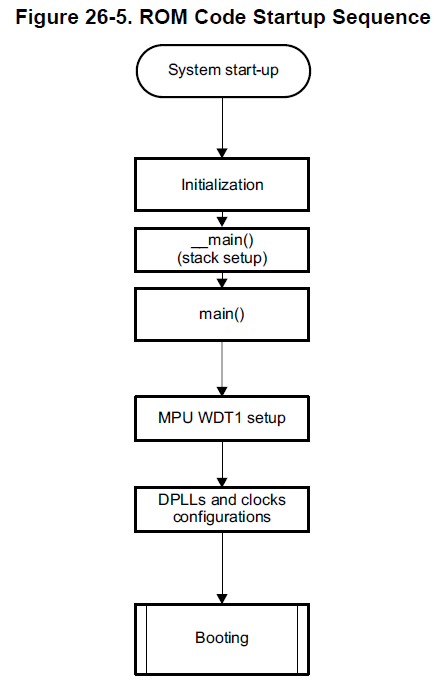
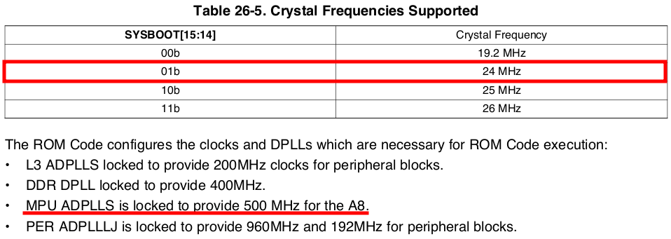
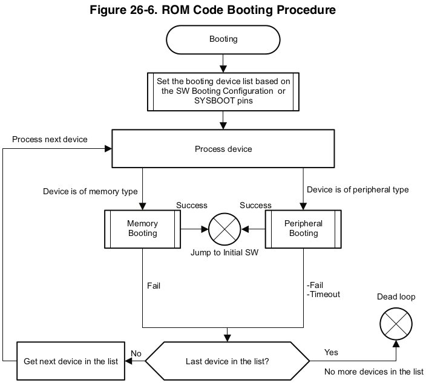
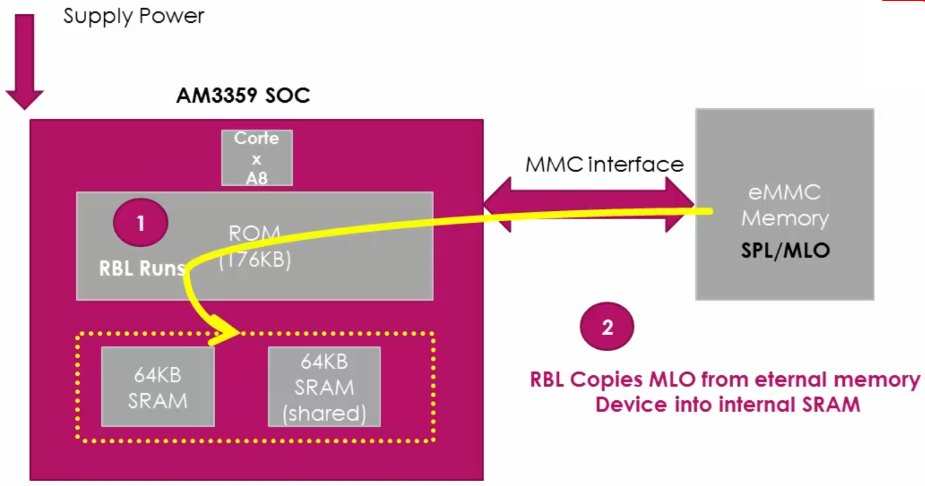
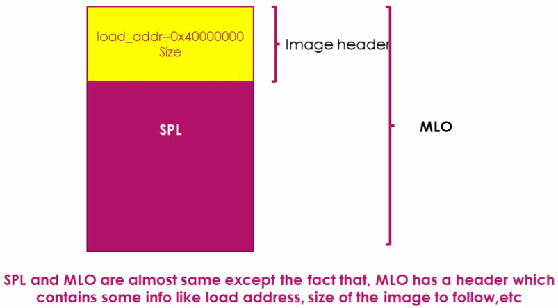
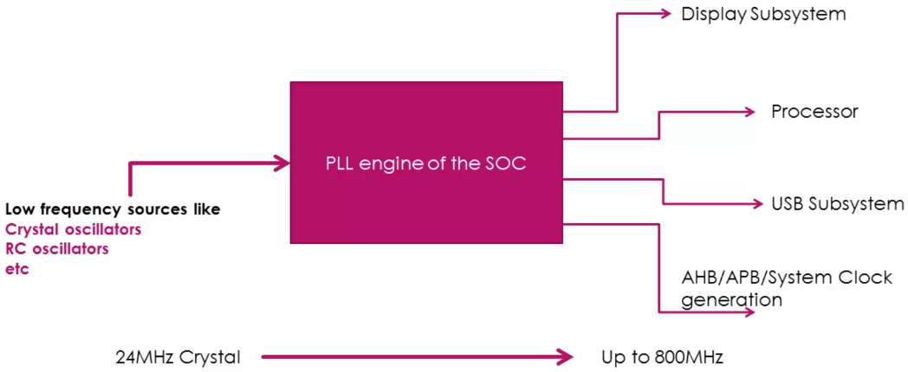

[Home](../../) | [Projects](../../projects) | [Notes](../) > <a href="./">Embedded Linux</a> > BBB Linux Boot Sequence - Step 1: RBL

# BBB Linux Boot Sequence - Step 1: RBL

## BBB Linux Boot Sequence

## ROM Boot Loader (RBL)

* When the SoC is first powered up, it undergoes power-on reset.
* The RBL is the first software component to run on the SoC.
* RBL performs the initialization as per the following flow chart.

* During the clock initialization RBL checks the value of SYSBOOT[15:14]. Through this value, RBL knows the frequency of the external crystal oscillator connected to the SoC. (BBB has the 24 MHz external crystal oscillator.)

  

  

  

  Note that you cannot make the RBL to change these clock frequencies because RBL is burnt onto the SoC at production time. 

  If you want to make your MPU run at 300 MHz instead of 500 MHz, you can only do that via the second stage boot loader. In the second stage boot loader you can adjust the clock frequencies as per your application's requirements.

* RBL tries to fetch the second stage boot loader from the devices list as per the value of SYSBOOT[4:0]. Once the booting devices list is set up, the booting routine examines the devices enumerated in the list.

* RBL must load the second stage boot loader within 3 minutes.

* RBL first reads the image header of MLO which contains two important pieces of information:

  * Load address

  * MLO image size

  And then runs MLO.

### Summary: RBL

* Stack setup

* WatchDogTimer1 configuration (set to 3 minutes timeout)

* System clock configuration using Phase Lock Loop (PLL)

* Search memory devices or other bootable interfaces for MLO or SPL

* Copy MLO or SPL into the internal SRAM of the chip

* Execute MLO or SPL

## Phase Lock Loop (PLL)

* PLL is a clock generating engine which can generate wide range of clock frequencies for different subsystems of SoC.

* Takes the low-frequency source as an input, generates much higher clock frequencies as outputs. (e.g., 24 MHz $\to$ 500 MHz)

  

## References

Nayak, K. (2022). *Embedded Linux Step by Step Using Beaglebone Black* [Video file]. Retrieved from https://www.udemy.com/course/embedded-linux-step-by-step-using-beaglebone/