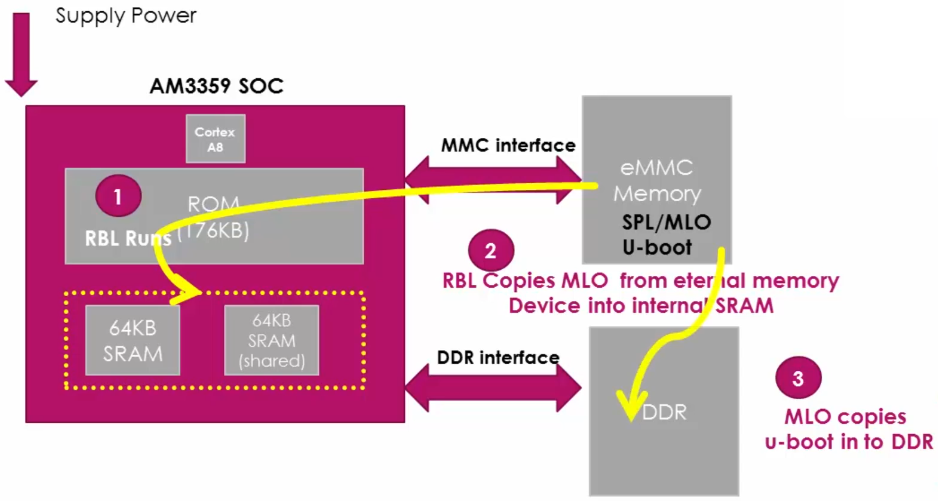
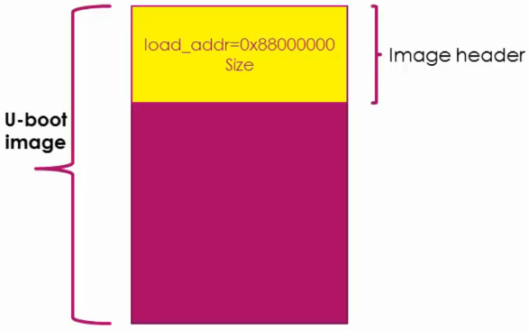

[Home](../../) | [Projects](../../projects) | [Notes](../) > <a href="./">Embedded Linux</a> > BBB Linux Boot Sequence - Step 2: MLO/SPL

# BBB Linux Boot Sequence - Step 2: MLO/SPL

## BBB Linux Boot Sequence

## **Secondary Program Loader (SPL)** / **Memory LOader (MLO)**

* MLO/SPL initializes the SoC to a point where U-boot can be loaded into the external RAM (i.e., DDR memory). 

  * It does the UART console initialization to print out the debug messages.

  * Reconfigures the PLL to desired value if necessary.

  * Initializes the DDR registers to use the DDR memory. (Important because one of the most important job of the MLO/SPL is to load the U-boot in the DDR memory)

  * Does muxing configurations of boot peripherals pin, because its next job is to load the U-boot from the boot peripherals. (Pin muxing is an important technique to keep the number of pins at minimum by making each pin usable for multiple functionalities.)

    e.g., If MLO is going to get the U-boot from the MMC0 or MMC1 interfaces, then it will do the mux configurations to bring out the MMC0 or MMC1 functionalities on the pins.

* When SLP/MLO loads U-boot into DDR, it refers to the load address contained in the U-boot image header.
* U-boot is usually too big to fit in the internal SRAM. That's why MLO/SPL loads U-boot into the external RAM.

* U-boot image header contains:
  * Load address
  * Image size

## FAQ about MLO/SPL

* **Why can't RBL directly load the U-boot into internal SRAM without going through the second stage (SPL/MLO)?**

  Actual free space in SRAM is less than 128 KB and it is too small for a U-boot image. This is why we first load relatively small MLO/SPL to the internal SRAM and make load U-boot image to the larger external RAM.

* **Can we make the RBL load U-boot directly into DDR memory of the board without having to use MLO/SPL?**

  No! Because the ROM code does not know what type of DDR RAM will be used in the product. DDR RAM is purely product/board-specific.

  Every different manufacturer will have different parameters for their  RAM. So, that’s the reason why the RBL never cares about initializing DDR controller of the chip and DDR RAM which is connected to chip.

  RBL just tries to fetch the SPL found in memory devices such as eMMC and SD card or peripherals like UART, EMAC, etc. It is in the SPL/MLO that you need to specify what kind of DDR is connected to your product and based. And therefore, SPL/MLO must be rebuilt to be used as the properly functioning second stage boot  loader.

  For example, if the BBB's DDR3 from Kingston is replaced by the DDR3 from transcend, and if their turning parameters are different, then you have to modify the DDR related header files and the tuning parameter macros of the SPL, rebuild it and regenerate the binary. 

## References

Nayak, K. (2022). *Embedded Linux Step by Step Using Beaglebone Black* [Video file]. Retrieved from https://www.udemy.com/course/embedded-linux-step-by-step-using-beaglebone/