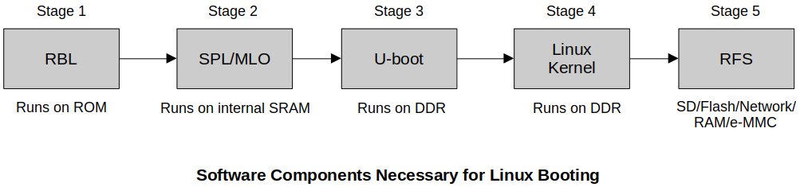

[Home](../../) | [Projects](../../projects) | [Notes](../) > <a href="./">Embedded Linux</a> > BBB Linux Boot Sequence - Step 3: U-boot

# BBB Linux Boot Sequence - Step 3: U-boot


## BBB Linux Boot Sequence





## U-boot

* Initialize some of the peripherals like I2C, NAND Flash, ETHERNET, UART, USB, MMC, etc, because it supports loading kernel from all these peripherals.

* While in U-boot, the target can communicate with the host over UART, USB, etc.

* Load the Linux kernel image from various boot sources to the DDR Memory of the board.

  Boot sources could be USB, eMMC, SD card, Ethernet, serial port, NAND Flash, etc.

* Passing of boot arguments to the kernel.

* The file `uEnv.txt` need to be provided. It contains environment variables that determines the behavior of U-boot.

  * You can overwrite these environment variables to alter the behavior of the U-boot.

  * Use this file to set the environment variables which drives the U-boot according to your needs.

* U-boot always looks for **uImage**, which is nothing but **zImage + U-boot image header**.

  U-boot gets information from the U-boot image header. (Basically, the total size of the structure `image_header` is 64 bytes.)


## Demonstration

* Download the root file system `Angstrom-systemd-image-eglibc-ipk-v2012.12-beagleboard.rootfs` to be used in our demo. (Inside the `boot/` folder, `uImage-3.8.10` is the kernel image we will be using.)

* Copy all the folders in side the root file system into the ROOTFS section of your SD card.

  ```plain
  .../Angstrom-systemd-image-eglibc-ipk-v2012.12-beagleboard.rootfs
  $ sudo cp -r * /media/klee/ROOTFS/
  ```

  And, sync:

  ```plain
  $ sync
  ```

* Now, you need to tell U-boot where to locate the Linux kernel image using `uEnv.txt`. Copy this file into BOOT section. It is in under `boot/` folder. (It does not come filled out of the box. You need to fill it in.)

  ```plain
  console=ttyUSB0,115200n8
  ipaddr=192.168.7.2
  serverip=192.168.7.1
  loadaddr=0x82000000
  fdtaddr=0x88000000
  loadfromsd=load mmc 0:2 ${loadaddr} /boot/uImage;load mmc 0:2 ${fdtaddr} /boot/am335x-boneblack.dtb
  linuxbootargs=setenv bootargs console=${console} root=/dev/mmcblk0p2 rw 
  uenvcmd=setenv autoload no; run loadfromsd; run linuxbootargs; bootm ${loadaddr} - ${fdtaddr}
  ```

  > L4: Load address of DDR memory  (Telling the U-boot to keep the Linux kernel at this address)
  >
  > L5: `.dtb` file address
  >
  > L8: `bootm` is where U-boot hands over the control to the Linux kernel.

* Unmount the SD card from your system:

  ```plain
  umount /media/klee/BOOT
  umount /media/klee/ROOTFS
  ```

* Insert your SD card into BBB and open minicom.

* Boot from SD card, then you'll see all the boot messages followed by the login screen from Angstrom.

  ```plain
  ...
  mmc0 is current device                               
  SD/MMC found on device 0
  ...
  Checking for: /uEnv.txt ...                                                     
  370 bytes read in 4 ms (89.8 KiB/s)                                             
  gpio: pin 55 (gpio 55) value is 1                                               
  Loaded environment from /uEnv.txt                                               
  Importing environment from mmc ...                                              
  Checking if uenvcmd is set ...                                                  
  gpio: pin 56 (gpio 56) value is 1                                               
  Running uenvcmd ...                                                             
  4002080 bytes read in 291 ms (13.1 MiB/s)                                       
  23334 bytes read in 18 ms (1.2 MiB/s)                                           
  ## Booting kernel from Legacy Image at 82000000 ...                             
     Image Name:   Angstrom/3.8.10/beaglebone                                     
     Created:      2013-04-29  19:56:00 UTC                                       
     Image Type:   ARM Linux Kernel Image (uncompressed)                          
     Data Size:    4002016 Bytes = 3.8 MiB                                        
     Load Address: 80008000                                                       
     Entry Point:  80008000                                                       
     Verifying Checksum ... OK                                                    
  ## Flattened Device Tree blob at 88000000                                       
     Booting using the fdt blob at 0x88000000                                     
     Loading Kernel Image ... OK                                                  
     Loading Device Tree to 8fff7000, end 8ffffb25 ... OK                         
                                                                                  
  Starting kernel ...
  
  Uncompressing Linux... done, booting the kernel.                                
  [    0.000000] Booting Linux on physical CPU 0x0                                
  [    0.000000] Initializing cgroup subsys cpu 
  ...
  ```

  > L2: U-boot has detected SD card.
  >
  > L8: Read `uEnv.txt`
  >
  > L13: Read Linux kernel.
  >
  > L14: Read `.dtb` file.
  >
  > L15: U-boot prints information extracted from the U-boot image header.
  >
  > L22: If the image is corrupted, checksum will not match and the boot will fail.
  >
  > L28: The very last message printed by the U-boot. From this point on, control is handed over to the Linux bootstrap loader.
  >
  > L30: Uncompressing of the kernel is handled by `misc.c` which is part of the Linux bootstrap loader.


## Decoding U-boot Header of uImage Manually

* Reading U-boot header information of the uImage manually by using U-boot commands

  1. **Load the uImage from Memory device (SD card / eMMC) into DDR memory of the board.**

     * At power on, keep pressing "spacebar" to enter U-boot prompt. (minicom)

       > If, in your environment, the keyboard doesn't seem to work, check your minicom setting and disable Hardware Flow Control: `Ctrl + A` $\to$ `o` $\to$ `Serial port setup` $\to$ `Hardware Flow Control : No`. If Hardware flow control enabled, then minicom will not be able to send data to BBB via serial cable. Minicom will take log messages from BBB. (This took me 5 hours to figure out!)
  
     * To load a file from FAT based file system into memory, use `fatload`.
  
       To load a file from any file system: `load`
  
       Example:
  
       ```plain
       fatload usb 0:1 0x82000000 uImage
       fatload mmc 0:1 0x88000000 initramfs
       load mmc 0:1 0x88000000 uImage 
       ```
  
       > MMC0 interface $\to$ $\micro$SD card
       >
       > MMC1 interface $\to$ eMMC
  
     * Use `help` to use help functionality. e.g., `help load`
  
     * Use `load` to load uImage from the memory device into DDR memory of the board. First 64 bytes starting from 0x82000000 is the U-boot Image Header.
  
       ```plain
       ==> load mmc 0:2 0x82000000 /boot/uImage
       4002080 bytes read in 291 ms (13.1 MiB/s)
       ```
  
       > * 2 in `0:2` because our uImage is in the `boot/` folder in the 2nd partition of the SD card.
       >
       > * 0x82000000 is DDR address.
  
       This loads uImage from the memory device into DDR memory of the board. First 64 bytes starting from 0x82000000 is the U-boot Image Header.
  
  2. **Use the memory dump command of U-boot to dump header information.**
  
     * Use `md` to display memory: 
  
       ```plain
       ==> md 0x82000000 4
       82000000: 56190527 62153da1 50d07e51 e0103d00    '..V.=.bQ~.P.=..
       ```
  
       > Display 4 objects starting from the specified memory address. 
       >
       > First object is `ih_magic`, the magic number. Since this is in **little-endian**, the actual magic number is 0x27051956.
       >
       > Fourth object is `ih_size`, the image data size. Since this is in **little-endian**, the actual size is 0x3d10e0, which is 4002016 in decimal, together with 64 byte makes 4002080 that we got earlier with `load` command.
  
       And so on...
  
     * Use `imi` command to dump image information:
  
       ```plain
       => imi 0x82000000
       
       ## Checking Image at 82000000 ...
          Legacy image found
          Image Name:   Angstrom/3.8.10/beaglebone
          Created:      2013-04-29  19:56:00 UTC
          Image Type:   ARM Linux Kernel Image (uncompressed)
          Data Size:    4002016 Bytes = 3.8 MiB
          Load Address: 80008000
          Entry Point:  80008000
          Verifying Checksum ... OK
       ```

* There are many more U-boot command you can use. Consult the U-boot documentation!


## References

Nayak, K. (2022). *Embedded Linux Step by Step Using Beaglebone Black* [Video file]. Retrieved from https://www.udemy.com/course/embedded-linux-step-by-step-using-beaglebone/